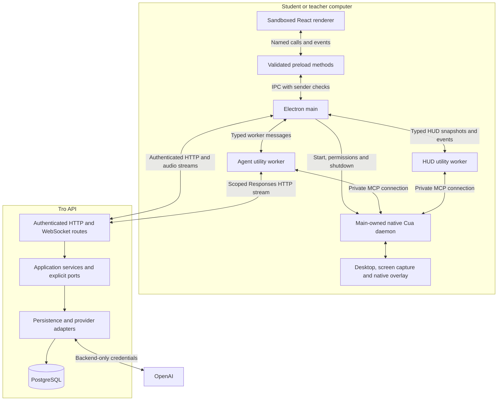
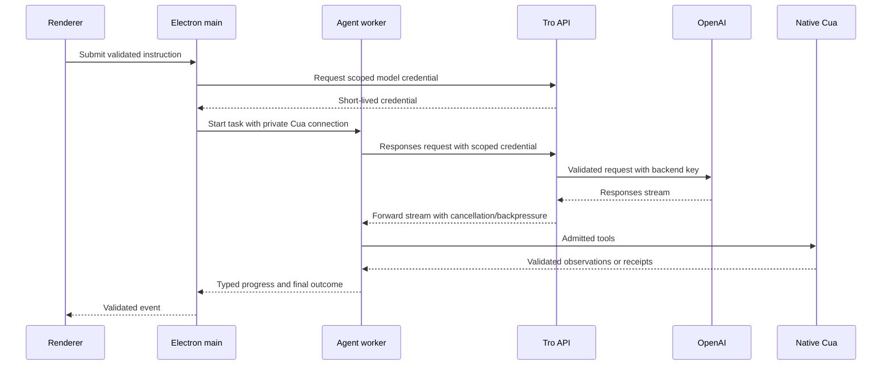
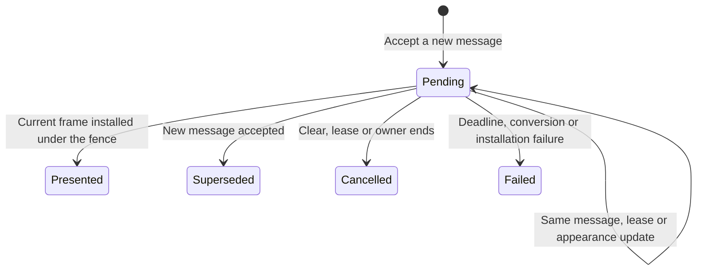
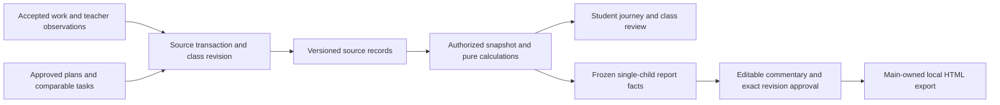
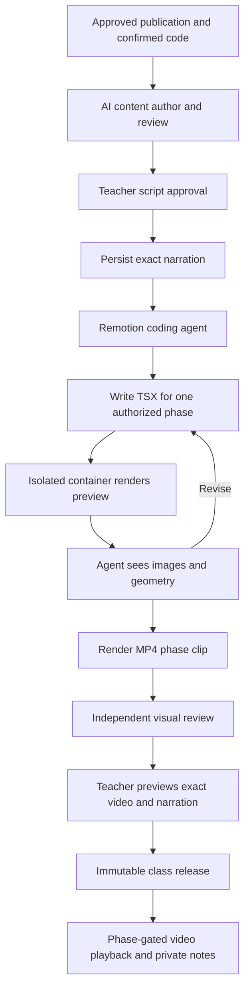

# Tro architecture

This is the single maintained description of Tro's implemented system. Updated
October 10, 2026. Change this document when component ownership, communication or
an architectural invariant changes. Contracts and configuration in the linked code
own exact wire shapes and policy values. Setup and validation commands live in the
[root README](../README.md). Research and UI prototypes are reference material,
not requirements or evidence that a capability exists.

- [System and process boundaries](#system-and-process-boundaries)
- [Authentication and account lifetime](#authentication-and-account-lifetime)
- [Agent requests and model gateway](#agent-requests-and-model-gateway)
- [Teaching](#teaching)
- [Native companion and HUD](#native-companion-and-hud)
- [Voice input and narration](#voice-input-and-narration)
- [Classroom and materials](#classroom-and-materials)
- [Guided lessons beta](#guided-lessons-beta)
- [Local presentation and app updates](#local-presentation-and-app-updates)
- [Code ownership](#code-ownership)
- [Verification and current limits](#verification-and-current-limits)

## System and process boundaries

Tro is one pnpm root and a modular monolith. Application code is strict TypeScript.
The desktop uses Electron and React; the API uses Fastify and Prisma/PostgreSQL.
The bundled Cua dependency uses native Rust and platform adapters. It owns screen
capture, desktop tools, input observation and the macOS compositor. Its native
presentation fence cannot be replaced by asynchronous TypeScript messages.

| Boundary                  | Contract and responsibility                                                                                                                                      |
| ------------------------- | ---------------------------------------------------------------------------------------------------------------------------------------------------------------- |
| Renderer ↔ preload ↔ main | Narrow named methods and validated events. Main checks the sender, frame and document. No generic IPC, shell, filesystem or database capability crosses preload. |
| Main ↔ workers            | Validated task, progress, HUD and shutdown messages. Orchestration runs outside the renderer and main UI event loop.                                             |
| Workers ↔ Cua             | MCP tools over a private connection supplied by main. Host lifecycle, HUD and teaching admission tools are hidden from the model.                                |
| Desktop ↔ API             | Versioned HTTP contracts, authenticated sessions and scoped credentials. Desktop sends no database or shared provider key.                                       |
| API ↔ database/providers  | Services depend on application ports; adapters own Prisma, I/O and provider clients. Domain code imports no frameworks or I/O.                                   |

`EmbeddedDesktopDriver` owns one private native daemon shared by task and HUD
connections. A worker closing its connection must not stop that shared host. Main
stops the host when the application quits. Sign-out, account transitions and window
closure dispose the associated tasks and presentation resources. The renderer
stores task messages in memory; general conversation history is not persisted.

## Authentication and account lifetime

`AuthClient` opens Google sign-in in the system browser through Better Auth.
Google returns to the backend callback; the backend sends a short-lived code through
`app.tro.desktop://auth/callback#token=…`. Electron main exchanges and verifies it.
The same running instance retains the pending proof-key verifier. Before sign-in,
main registers the protocol and verifies that the OS handler points to that app.

The desktop sidebar is mounted only for a signed-in user. Signed-out and initial
session-loading screens reserve no sidebar space; the welcome screen retains
Google sign-in, saved-account selection, sign-in cancellation, settings and updates.

Saved accounts use independent backend sessions. `AccountSessions` owns selection
and generation guards; `EncryptedAccountVault` stores cookies using Electron
`safeStorage` with atomic replacement. It fails closed when native encryption is
unavailable. Cookies remain in main; only validated profile metadata crosses
preload. Adding or switching an account does not change backend roles.

`AccountTransitionGate` excludes account changes from active task, voice,
microphone-test and classroom/material operations. A switch verifies the target
session before selection, detaches the old local classroom binding and clears task,
capture and presentation state. The old account stays signed in and its teacher
session remains stored. Sign-out revokes the selected account's session and removes
its vault entry; other saved accounts remain. Late replies cannot restore an old
identity.

On macOS, main checks Screen Recording and Accessibility before admitting computer
use. The branded development host and installed Tro have different bundle
identities and permission grants. `DesktopPermissions` requests access in main so
the OS attributes it to Tro. Missing grants lead to onboarding; no driver task or
model credential is issued before admission.

[EmbeddedDesktopDriver.ts](../src/desktop/main/EmbeddedDesktopDriver.ts) owns one
unreferenced timer shared by the daemon's subscribers. It checks the SDK's
synchronous `connection()` and generation at a fixed interval; that API refreshes
child exit state before returning. Missing/replaced
connections and read failures invalidate subscribers once. Stop clears the timer
before releasing the host. This avoids the pinned SDK's long-lived asynchronous
exit watcher, whose repeated native callback registrations accumulate memory.

## Agent requests and model gateway

Typed instructions and completed voice transcripts enter `AgentChatController`.
Main checks account, permissions and exclusivity, obtains a scoped model credential,
and sends one task to the utility worker. With the macOS companion, the local
following worker stays connected while the signed-in window is open. The fallback
worker starts on demand and retains a bounded warm lifetime after a task. Every
settled follow-up starts a fresh task; an active teaching lesson retains its own goal.

The gateway is split by responsibility: `RegisterModelGateway` owns routes,
`ModelCredentials` scoped authentication, `ModelRequest` admission,
`FetchModelResponse` bounded fetch recovery, and `ForwardModelResponse` streaming.
`ModelGatewayConfig` owns the model, output ceiling, body limit, credential lifetime,
timeout and retry policy; backend `Env.ts` owns validated secrets.

Assistant requests have no input-token counting preflight and no daily model request
cap. A rejected fetch before headers may retry once, only for the configured socket
codes, under the same cancellation/deadline. HTTP errors, other network errors and
post-header failures are not retried. SDK automatic retries are disabled. Desktop
tools are never replayed by transport recovery. A pre-header retry can still incur
another inference charge because provider execution may be uncertain.

The worker's logged fetch gives each model request a random UUID, sent in the
validated `x-tro-model-request-id` header. The gateway echoes that ID on successful
streams and failures, including pre-admission errors. Worker events retain task,
role and attempt context; teaching segments use their lesson ID as the task ID.
Gateway events share that model ID and the local gateway request ID. Untrusted
trace headers are discarded, and the header is not forwarded to the provider.
Each upstream attempt independently generates a UUID `providerClientRequestId`
and sends it as `X-Client-Request-Id`. Started and settled attempt events share
that ID; retries receive a new one. Final error diagnostics and stream events
retain the relevant attempt ID. It permits provider-side receipt lookup when a
disconnect prevents receipt of the provider's response ID, without exposing input.

`ModelTransportObserver` observes each fetch attempt through Node's Undici
diagnostic channels. Request identity scopes events after dispatch; sockets have
opaque local connection IDs and observed use counts. It records assignment,
local byte-counter changes, body-write completion, response-header arrival,
socket closure and allowlisted public TLS state, with at most 16 stage timestamps.
The connected socket's address family is retained without its address; a proxy
socket's family does not establish the provider's address family.
Snapshots freeze when fetch resolves or
rejects; temporary socket listeners are removed then. It changes no dispatcher,
pooling, retry, TLS or timeout behavior and reads no headers, request bodies,
addresses or secrets. A body-sent event establishes local queuing/writing, not
provider receipt or execution. Missing observations remain explicit.
The observer also retains the first allowlisted socket error independently of
the fetch rejection. A TLS alert can otherwise be replaced by a later
`UND_ERR_SOCKET` or `EPIPE`. Failed attempt events and the final gateway failure
include that bounded `socketFailure` summary, including safe TLS alert numbers.
It remains API-log-only, contains no native error object or message, and does not
change retry eligibility. Listeners and observations stop when the attempt settles.

The route logs `model.gateway.request` before body parsing, then admission or a
rejection. Forwarding logs dispatch, each attempt, provider headers and the first
response chunk. Completion or failure includes aggregate bytes, chunks, first/last
chunk latency and backpressure waits. `model.gateway.aborted` records the first
local cancellation source, client or deadline. `model.gateway.delivered` records
the local HTTP response finish; it does not prove the desktop received all bytes.
These events contain no HTTP bodies, screenshot pixels, credentials or headers.

Bounded `model.gateway.attempt` events include gateway request ID, attempt number,
phase, request byte count, timing, cancellation status, retry decision and the
transport snapshot. Failure summaries and the HTTP error envelope retain the
final attempt snapshot and a conservative failure stage. A recorded second use
establishes reuse; a connection established during this attempt establishes new
use. Otherwise connection use remains unknown. Compare connection IDs across failed
attempts; lifetime
socket totals alone cannot identify the failing request's upload. These diagnostics
do not establish why a remote peer closed. Local loopback checks exercise real
fetch peer-close recovery without credentials, a model call or user screenshots.
The failure lab compares local transport observations with independent peer byte
counts for interrupted uploads, closure before headers, malformed HTTP, provider
rejection, truncated streaming, client cancellation, deadline expiry, TLS setup
failure and successful fresh/reused connections.

`CheckModelConnection` separately probes current DNS/TLS/HTTP reachability with
credentialless GETs to the fixed provider models endpoint. It compares repeated
native fetch and fresh IPv4/IPv6 HTTPS connections under bounded deadlines and
response sizes. The script's validated environment reader records only proxy,
CA and TLS-override flags; macOS system proxy values and DNS addresses are
discarded. Safe socket/TLS failures remain allowlisted. These small requests do
not establish large authenticated upload stability or the earlier disconnect's
cause. Different fetch/HTTPS proxy routes and unavailable IPv6 remain explicit
limitations. Commands and report paths belong in README.md.

| Failure stage                      | Evidence established by the log                                                                                                                        |
| ---------------------------------- | ------------------------------------------------------------------------------------------------------------------------------------------------------ |
| `before_connection`                | No provider socket was assigned; the safe cause may identify TLS or connection setup failure.                                                          |
| `upload`                           | A socket was assigned, but body writing did not complete before the observed socket closure. A later body-sent callback does not change that evidence. |
| `waiting_for_headers`              | Local body writing completed, but no valid HTTP response headers arrived. This does not prove provider receipt.                                        |
| `provider_response`                | Valid provider HTTP headers arrived; status and allowlisted rejection fields identify its response.                                                    |
| `response_stream`                  | Response headers arrived, then reading or forwarding the body failed.                                                                                  |
| `client_disconnected` / `deadline` | The first local abort source identifies desktop disconnection or the gateway deadline.                                                                 |
| `unobserved`                       | Transport observations were unavailable; the log does not invent a stage.                                                                              |

Development-only `companion.hud.transition` events identify the previous and next
phase, event source/cause and available task/capture/lesson IDs. Only phase changes
are logged, and no message or transcript enters the event. A failed diagnostic
callback cannot prevent the HUD from rendering. These logs locate the event that
displayed an error; they do not determine the network peer's reason for closing.

Execution tasks use `TaskHarness`, `MainAgentRunner`, `TaskVerifier` and
`CompletionGate`. The harness owns immutable request/goal state, budgets and final
settlement. The actor explicitly requests a separate read-only verifier. Both agents'
actual observations are retained in bounded task memory. The gate checks criterion
coverage, provenance, age and supersession before accepting the stored verdict.
A bounded continuation can retain the original task history. Desktop tool use
cannot bypass verification through a prose-only response. Public outcomes distinguish
succeeded, partial, blocked and unverified; these checks validate evidence wiring,
not the correctness of every model judgment.

## Teaching

Show me keeps the student's original goal and lets the student control the real
pointer. `TeachingTaskRunner` owns SDK segments, questions, local waiting and
cancellation. `TeachingLessonContext` owns the current goal, checkpoints, proposal,
assessment and localized instruction. `TeachingPresenter` is the only paired
instruction/drawing presentation path.

The model defines or explicitly revises a typed teaching goal, then proposes one
reachable action through `present_teaching_step`, together with an explicit nullable
[drawing](../src/contracts/TeachingDrawing.ts). Spatial actions require bounded
model-supplied stroke points in the same normalized coordinate system as action
target boxes. The native host smooths and animates these paths. Action bounds alone
supply student input matching; decorative stroke bounds never become click targets.
Keyboard, focused typing and loading actions require a null drawing and an explicit
text-only receipt. The final decision references the presentation rather than
introducing another unacknowledged instruction.

The drawing contract owns point limits, closure rules and host presentation policy.
It rejects nonfinite, out-of-range and degenerate paths. Coordinates are normalized
fractions of the bound screenshot, with a top-left origin, X increasing rightward
and Y downward. Capture ownership, screenshot pixel dimensions, logical display
dimensions, scale and capture options remain attached to that observation. The
worker passes the validated points unchanged; the native compiler maps them to
logical display points once, and the platform adapter owns compositor origin,
Y-axis and backing-scale conversion. Attachment previews and guessed window sizes
do not supply drawing geometry.

`LoggedCuaServer` restricts model tools, binds the lesson and pins drawing version 3.
Host-generated epochs and presentation IDs cannot be overridden by the model.
The private native `present_teaching_guidance` tool compiles the bound capture's
stroke geometry once, refreshes the screen locally, compares action target boxes
and stroke-covered regions, then renders that same compiled plan. It refuses
changed targets, input or display geometry without comparing an entire long path's
bounding rectangle. The worker does not make a separate refresh dispatch or model
call. A stale screen returns bounded repair feedback; unknown transport outcomes
are terminal and are not replayed.

A paired receipt requires the current HUD message and actual drawing installation.
An uninterrupted presentation must cover every requested stroke with full reveal
and the required visible hold. An interrupted presentation reports only strokes
that appeared, with their actual progress. The
[receipt validators](../src/contracts/CursorCompanion.ts) bind the epoch,
presentation, lesson and step, and check unique in-range stroke indices. An
interrupted spatial receipt requires an installed nonempty stroke; interruption
before visibility and interrupted text-only presentations cannot report success.
Pointer-only and clear-only frames cannot count as spatial guidance. Teaching uses
one scribble renderer and one supported presentation protocol; incompatible drivers
fail admission.

In the native companion, `ScribbleRenderer` owns curve compilation and bounded
playback timing. A pair of points forms a straight segment; longer open paths and
closed loops use midpoint-based quadratic smoothing. Open endpoints are retained,
loops close continuously, and redundant neighboring points are removed without
moving the target. The compiled path supplies rendering, stroke comparison coverage
and diagnostic bounds. Reveal follows distance along that path; styling, round caps
and joins, reveal and hold timing belong to the host. Reduced motion skips
progressive reveal while retaining drawing installation and visible-hold evidence.
`TeachingGuidanceAdapter` joins capture comparison and paired presentation;
`CompanionSession` retains session ownership and cursor following.
`TeachingPresenter` binds pending narration and input matching to the current
segment. Closing a segment revokes its pending presentation, ends the native epoch
and drains outstanding calls. A late response cannot commit or clear a newer step;
an already committed receipt remains available to the runner.

Both native MCP transport paths admit companion stop, teardown, lease renewal and
bounded HUD controls outside the desktop action queue. A reader-owned FIFO queue
starts one drawing or ordinary executor request at a time. Controls use the same
argument validation, transport session identity, authorization and ownership
checks, so cancellation can invalidate a pending drawing without waiting for its
playback to finish.
Disconnect discards queued calls and retires the connection's transport owner at
core session admission. A delayed first request cannot create a new session after
that owner has closed.

`DesktopObservationClient` and `TeachingObservationPolicy` read the session-owned
native watch and structured input history. Settled clicks, keys and scrolling can
resume the same lesson; passive pointer movement and unrelated animation do not
schedule inference. Loading and target appearance use bounded observation. Failed
comparisons are feedback in the same SDK history within a shared repair budget.
Fresh capture references are required for current goal criteria.

Click/key/scroll during a drawing interrupts that preview and returns to observation.
Esc cancels the entire lesson, releases its watch/epoch and prevents later input from
resuming it. Native presentation or transport failures end the task with a typed
reason. Demonstrated teaching is separate from independently verified desktop
execution and from classroom assessment.

## Native companion and HUD

`DesktopCompanion` composes cursor following and HUD presentation in main.
`CompanionHudController` reduces voice/task events; `CompanionHudClient` owns a
separate persistent presentation worker. Both task and HUD workers use main's
shared native daemon. Private group registration and bounded leases bind only the
associated cursors; host HUD tools are excluded from model discovery and dispatch.

The native presentation owner is `HudState` in the pinned
[CursorCompanion.patch](../driver-patches/CursorCompanion.patch). One immutable job
owns the message, render token, deadline and watch-channel outcome. The token
contains an owner epoch, increasing revision and render ID. The painter projects
accepted messages; it makes no independent message admission decision.

| Operation             | Invariant                                                                                                                                                                                                                                   |
| --------------------- | ------------------------------------------------------------------------------------------------------------------------------------------------------------------------------------------------------------------------------------------- |
| Admission             | Validate live owner, lesson and sequence before changing message or receipt. Exact duplicates reuse token, waiter, deadline and outcome. Older messages and equal-identity content conflicts cannot replace the current job.                |
| Lease / appearance    | `CompanionHudPublisher` serializes explicit `renew_lease` and `update_appearance` commands. They carry no cached teaching message. Only these intents coalesce; message/clear ordering is preserved.                                        |
| Render and install    | An immutable scene/message token travels through painting, conversion and the main-queue mailbox. `install_current_composite` validates it while holding the same HUD fence across synchronous CALayer installation and receipt completion. |
| Clear / failure       | Token-conditioned cleanup cannot clear a newer job. Watermarks survive clear/failure. Watch outcomes become terminal once; late callbacks cannot turn an old terminal job into Presented.                                                   |
| Lesson / owner change | Explicit lesson binding and owner retirement invalidate old scenes. Retired lesson identities and cursor bindings are bounded. Delayed readback cannot replace newer observed tokens.                                                       |

The installation guard also fences empty composites and obsolete drawing frames.
Current Presented jobs may animate without completing their receipt again. The
lock order is HUD → unique guidance fences in pointer order → accessibility text;
the callback does not await or acquire the render-controller lock. Coalesced or
rejected images are released. The original one-second message deadline remains.
Presented means CALayer accepted the current frame, not physical display scan-out.
A message receipt alone does not satisfy a spatial teaching presentation.

Settled HUD messages and stationary following cursors do not continuously publish
or rasterize full-display images. Lightweight maintenance still checks leases,
presentation deadlines and pointer movement; active cursor/HUD animations and
drawing receipts retain their frame updates. Recurring macOS render/follow work
drains scoped autorelease pools so temporary Cocoa objects do not accumulate over
the lifetime of a background thread. These changes reduce idle work; they do not
impose an OS memory limit on the desktop process tree.

Common admission, explicit refresh commands and the installation fence keep HUD
messages and receipts under the same owner. Native build provenance and the required
app/driver pairing are owned by
[CuaCompanionBuild.ts](../src/contracts/CuaCompanionBuild.ts).

A diagnosed gateway HTTP 502 with `provider_network_failed`, SDK connection or
timeout errors, and validated temporary provider 500/502/503/504 responses pause
the teaching lesson for an explicit student retry, as do model-access errors.
The original goal and session stay in memory and the hold shortcut remains
available. The HUD shows input readiness; `agent.teaching.model_retry.paused`
retains safe gateway correlation and the retry reason. No automatic model loop
is added. Cancellation, unclassified HTTP 502, permanent provider rejections
and native failures retain terminal behavior.

## Voice input and narration

During local teaching waits, the worker explicitly advertises `canAcceptAnswer`
with WAITING progress. Main allows the hold-to-speak shortcut and routes the
follow-up into the same lesson, just as for a question; it does not cancel or
replace the original goal. Presentation acknowledgements alone do not advertise
this readiness while the model is still deciding. The lesson accepts one pending
follow-up and closes admission before the next observation/model segment. Voice
returns to RUNNING when input readiness closes and IDLE when it opens, without
requiring Escape.

A failed follow-up voice capture releases its capture identity and returns to
IDLE while the active lesson admits answers; it returns to RUNNING when the
lesson is busy. Canceling that capture does not invalidate the original lesson's
eventual outcome. Account invalidation still fences all pending submissions.
The HUD preserves the active lesson on follow-up voice failure, briefly shows
ERROR, then returns to NEEDS_INPUT. Its timer is canceled by newer input/progress
or Escape so a late reset cannot overwrite the current state. Fatal task errors
still settle the task and release controls.

`agent.teaching.student_input.admission` records lesson identity and acceptance,
without speech content; local waiting events include input readiness.

The held shortcut is Command + Control on macOS and Control + Left Alt on Windows.
The native key listener owns press/release/rearming. `VoiceInputController` owns
capture identity, account checks, cancellation and exactly one final instruction
submission. The sandboxed renderer owns microphone tracks and an AudioWorklet.
Named preload methods carry bounded sequenced PCM frames to main.

Main's authenticated transcription WebSocket relays audio through the API to
OpenAI live transcription. One provider session is created per capture. On release,
the worklet flushes its tail; main/relay enforce sequence order before commit and
correlate the final transcript to the committed item. Partial transcripts do not
start agent tasks. Release stops tracks immediately; bounded buffering allows
already captured speech to finish while the connection opens. Esc, account/window
changes, sleep/lock or failure invalidate late finals. No microphone stays open
between holds.

`Microphones`, `MicrophonePicker` and local preferences own input selection.
Automatic selection follows OS routing; explicit selection uses exact constraints
and fails visibly if missing. Suggestions are name-based hints. Ranking does not
switch the selected route. Local quiet/speech comparisons use a main-owned exclusive
lease, compute scalar measurements and stop every track. Test audio is neither
uploaded nor saved. Transcription usage reservations and active captures are
persisted through the backend allowance adapter.

HUD narration is a separate flow: installed native message readback →
`VoiceoverController` → authenticated backend OpenAI PCM speech stream → bounded renderer
playback → speaking acknowledgments back to main/HUD. The backend owns voices,
model settings, credentials and paid allowance. The speech adapter uses the same
backend-only `OPENAI_API_KEY` as the other OpenAI features;
`VoiceoverConfig` owns the model, voices and locale-specific reading instructions.
Raw 24 kHz mono PCM preserves the existing playback contract. Speech stops before microphone
capture and on context/account/window changes. Failure leaves visual guidance
usable. Playback and speech are not completion evidence. English/Vietnamese locale
is snapshotted for the operation. Live provider pronunciation and signed hardware
acceptance remain separate checks.

## Classroom and materials

Classroom authorization lives in `ClassroomService` and its store port. Teachers
and students are real signed-in accounts with backend-owned roles. Invitation/enrollment,
live session availability, explicit joining, presence, progress and hand-in are
separate facts. Sessions expose Explanation, Practice, Submission and Review;
teacher-paced sessions bind the current activity, while self-paced sessions allow
student selection. Class detail routes remain inside the installed renderer's hash
router; a route does not authorize class access.

`ClassroomSessionController` loads fresh authorized context for each class-bound
Show me request, including pinned course revision, stage, activity, criteria,
working resource and durable student progress. Joined classroom Do it for me
requests are refused. Rejoining restores participation and work; device leases
prevent another device from writing with old authority. Context/version checks
fence late commands. Esc cancels guidance without leaving the class. Switching
accounts or quitting disposes local task authority without leaving the classroom.
The desktop restores the signed-in student's existing live participation from the
backend, renewing its device lease. An explicit Leave ends participation; a teacher
ending the session or revoking enrollment prevents restoration. Device takeover
still fences the previous device, which does not automatically reclaim authority
until its next account lifetime.

Teachers upload originals, prepare suggestions, edit review and explicitly approve.
`MaterialService` owns collection versions and approval; `MaterialPreparationRunner`
and `PrepareMaterialCollection` own durable extraction, document briefs and composition.
Provider/extractor/storage adapters operate behind ports. Class-scoped derivation
claims and cache keys permit reuse of unchanged work. Each uncached preparation
stage counts input tokens and reserves its job allowance before generation; this
is separate from assistant gateway forwarding. Uncertain provider outcomes require
explicit retry. A bounded citation repair validates referenced source ranges.

```mermaid
flowchart LR
  Originals[Teacher uploads and instructions] --> Extract[Extract exact source units]
  Extract --> Briefs[Reusable document briefs]
  Briefs --> Compose[Class overview and suggested sections]
  Compose --> Review[Teacher edits and approves]
  Review --> Revision[Immutable published course revision]
  Revision --> Packet[Authorized bounded student context]
  Packet --> Tutor[Existing Show me teaching worker]
  Tutor --> Sources[Authenticated source search and reads]
  Sources --> Tutor
```

Originals, exact text, document briefs and teacher corrections remain distinct.
Review revisions reuse extraction/briefs where inputs are unchanged; they do not
approve automatically or alter a live session's pinned publication. Student material
packets select dependencies, corrections and relevant passages under a token budget.
`ReadMaterialSources` supplies authorized bounded search/reads; missing required
context is reported rather than silently shortened. Legacy publications use a
compatibility adapter. Preparation limits and provider settings belong in backend
`Env.ts` and the owning preparation modules.

An owning teacher can delete an inactive class through a confirmed command. The
serializable transaction rechecks that no live session exists, tombstones the class,
revokes invitation access and preserves work/history. Removing a material deletes
unused originals but preserves files referenced by immutable approved revisions.
Neither operation resets the database or rewrites applied migrations.

### Practice checks

`PracticeCheckService` owns student authorization, admission budgets, immutable snapshots,
idempotent checks and independently confirmed hand-ins. It delegates assessment through
an application port. `PracticeAssessmentService` prepares evidence and batches criteria
by their teacher-approved verification method. `PracticeCriterionEvaluator` is the extension
point; the Responses adapter, exact supplied-text comparison and connected Scratch block
checker implement it. Missing required class sources, unsupported evidence capabilities
(including verified execution) and teacher-only criteria produce insufficient evidence.
There is no implicit fallback from an approved deterministic rule to an LLM.

`PrismaPracticeCheckStore.readGrounding` resolves the pinned course publication and rubric
source IDs into passages and teacher corrections. Each grounding source retains both its
passage ID and source-unit/page ID so criterion references remain traceable. `ExtractPracticeArtifact` reuses the
bounded material parser worker for PDF text and static sb3 target graphs. Pasted code is
text evidence; it is never executed. PDF layout/scans and Scratch runtime behavior require
additional evidence or teacher review. Extraction is separate from judgment. Saved checks
include extractor/evaluator versions, source IDs, warnings and derived units tied to original
evidence IDs. These private units are scrubbed with the original work on removal/expiry.
The offline quality runner in `test/server/features/classroom/evaluation` measures disagreement,
false passes, missing results and invalid citations. Synthetic test cases verify the runner;
real teacher-reviewed reference labels and live-model calibration remain release work.

`PracticeCaptureController` owns expiring local drafts bound to the joined device and current
activity/attempt/context/progress versions. Its Electron adapter lists opaque window choices,
excludes Tro windows and captures the selected window. Electron enumerates window thumbnails
locally; only the selected image is retained. It does not capture entire displays. The student
reviews the image before explicitly sending it. Command + K on macOS and Alt + K on Windows
capture the remembered selection before focusing Tro; first use opens a window picker.
Manual text, supported images, PDF and sb3 uploads remain available. Capture provenance records
time, dimensions and a digest, not proof of authorship or execution. Preload validates narrow
capture commands/replies; main rejects changed or expired captured evidence.

While idle, the macOS native HUD shows a compact vector Command symbol and K beside
Check work / Kiểm tra bài when the joined Practice activity has an approved checkpoint
and its global shortcut is registered. `CompanionHudController` owns the display-only
practice-ready phase; active voice, teaching and evaluation take priority. The hint returns
after transient status fades and clears on eligibility loss or presentation reset. The
shortcut opens capture/review; it never confirms hand-in. Windows keeps its Alt + K
workflow; native companion rendering remains macOS-only.

The HUD uses the request locale for Checking… / Kiểm tra…, feedback ready,
submission and failure phases. Request IDs, history matching and a bounded presentation timer
fence late replies. Active voice or teaching guidance retains HUD priority; the practice panel
still displays check progress. A successful check is formative feedback, never a grade.
Students can request teacher review tied to an authorized saved check and criterion through
the existing insights help queue. Teacher results retain the original evidence and hand-in
receipts; hand-in remains a separate confirmation of the exact checked version. Both practice
review and the Insights work gallery offer original-file downloads for PDF and sb3 evidence.

### Learning history and parent reports

[ClassroomInsights.ts](../src/contracts/ClassroomInsights.ts) owns strict source,
command, read and report schemas. [ClassroomInsightService](../src/server/features/classroom/application/ClassroomInsightService.ts)
authorizes the versioned insights endpoint. An owning teacher can read retained
class history and approve plans, comparable tasks, observations and parent reports.
Student reads require current enrollment and return that student's progress and
assigned plans. Help requests additionally require main's private joined-device
binding, a current lease and the permitted live Practice activity.

Learning insights are always available for authorized classes. [Backend configuration](../src/server/Env.ts)
provides the collection-policy identifier and a rolling retention duration, with a
default classroom learning policy and 180-day retention. No class allowlist is required.
`PrismaClassroomStore` and `PrismaPracticeCheckStore` append accepted progress,
confirmed snapshot/link hand-ins, check admission and terminal results inside the
source transaction. Rejected or stale writes cannot create a learning event.
New link hand-ins pin the task's accepted course revision; imported links with no
known revision retain that unknown context.
This captures explicit work and requests; it does not measure attention, keyboard
activity, motivation or the delivery of native tutoring assistance.

[AppendClassroomLearningEvent](../src/server/persistence/AppendClassroomLearningEvent.ts)
allocates the class revision and saves an immutable event plus a versioned record.
The additive Prisma tables index class, child, kind and revision; their JSON values
must validate against the discriminated source schemas. Evidence bytes stay in
the existing private snapshot store. Plans, skill standards and task variants are
approved definitions. Historical mapping versions remain available, and an
assessment pins the exact mapping, course and rubric it used.

[PrismaClassroomInsightStore](../src/server/persistence/PrismaClassroomInsightStore.ts)
owns consistent complete metadata reads, scoped pagination, private evidence and
compare-and-set writes. Serializable reads, source writes and retention use bounded
conflict retries, including driver failures reported during commit. Read limits are
declared by `InsightLimits`; exceeding a
budget refuses the query instead of returning truncated totals. Cursor scope binds
the class, student, reporting window, cutoff and current privacy revision.
An exhausted retry emits `transaction-retry-exhausted` with the operation, optional
class ID, conflict reason and attempt count; queries and learning content are excluded.
`SelectLearningEvidence`, `CalculateStudentProgress` and `CalculateClassSummary`
are pure replay functions. Observation order and committed revision are separate:
late results cannot replace newer work, and historical unknown ordering stays
explicit. Corrections supersede assertions while preserving the original work.

Journey counts distinguish assigned activities handed in from criteria met.
Assignments pin the eligible roster, including children who never joined; repeated
session assignments are separate tasks. Unknown historical eligibility remains
unknown. Lesson charts include missing, insufficient and conflicting results.
Independent task counts require an individual, unaided teacher observation of a
fresh or transfer task meeting every required criterion. Comparisons group only
the approved skill standard, task family, scoring revision, support context and
individual/group context.
Delayed checks retain their earlier episode reference and elapsed time even when
the earlier observation lies outside the displayed window. These are task
observations, not a calibrated mastery estimate or a causal teacher rating.

`ClassroomInsightsPage` is available from the Insights navbar entry for teachers
and students, with an authorized class picker. `ClassroomInsightsPanel` composes
real server data there across sessions. Account, class, student and reporting-window changes fence late replies.
The work gallery fetches selected evidence through the private API when opened.
Teachers approve the learning plan, add comparable variants, choose a next task,
record checks and maintain explicit help/intervention records. An unavailable
optional bridge or an older backend with disabled collection produces a useful unavailable state.

`BuildParentReport` freezes sourced facts, chart rows and calculation identity;
facts name recorded learning tasks and targets, explicit support and the approved
next activity title. Teacher commentary is separate. Editing creates a new
unapproved revision.
Approval and export recheck authorization, current source invalidation and exact
version in a serializable transaction. Corrections, changed referenced definitions,
removal and expiry invalidate affected snapshots; new ordinary work does not
rewrite an approved report.
Course and enrollment changes invalidate retained reports even while collection is
disabled. `ParentReportExportController` accepts only the
validated single-child approved revision after the native save dialog. Main
escapes report text and atomically replaces the chosen HTML file under its account
fence. The file has no scripts, remote assets or private evidence links and includes
a printable table. Existing exported local copies remain outside backend control.

Removal works for active and withdrawn class students. It scrubs private learning
content and cached reports/receipts, retaining a minimal removal marker and approved
assignment eligibility references so removed children do not vanish from historical
denominators. The separately authorized enrollment roster remains.
`ClassroomInsightRetentionRunner` applies the
approved policy in bounded startup and periodic batches. The state store retains
the policy identifier and duration, so previously collected sources continue to expire. The always-on runtime
walks all classes in bounded batches, including classes created after startup. Expiry removes old
private source content, marks partial coverage and retains minimal source markers
so backfill cannot restore expired or removed work. [Operator backfill](../scripts/BackfillClassroomInsights.ts)
is read-only by default; explicit apply uses the configured collection
policy. Backfill remains an explicit operator action; enabling insights does not
automatically import historical work.
Backfill is bounded and idempotent; it recovers retained checks and hand-ins without inventing
overwritten progress, assignment eligibility or unrecorded support. Current attempt
writes record their save time for expiry. Legacy standalone workspace values with
no dated source have unknown age and require operator review; the new policy does
not invent their date or prove that every legacy value meets the retention period.

The system remains a modular monolith with provider-free dashboard calculations
and deterministic report wording. Stored projections, a separate analytics worker,
private object storage, cross-center roles, AI wording and PDF generation remain
future scopes that require measured demand and their own validation. A real center still requires its collection decision and a reconciled pilot.

## Guided lessons beta

Guided Lessons is always available as **Guided lessons (Beta)** / **Bài giảng hướng
dẫn (Thử nghiệm)**. No feature flag or class allowlist gates it. Teachers select
approved passages and confirm a restricted Python integer running-total example,
optionally a separate practice input. Students can study released lessons without
a live classroom session. This scope does not support arbitrary lectures or code.

[GuidedLessons.ts](../src/contracts/GuidedLessons.ts) owns strict public schemas.
[GuidedLessonService.ts](../src/server/features/guidedLessons/application/GuidedLessonService.ts)
owns teacher/enrollment authorization, idempotent commands, revisions, approvals,
releases, deterministic checkpoints and private notes. Prisma adapters persist
validated aggregate JSON, immutable releases, artifacts and attempt ledgers with
serializable authorization/state transactions. This remains one modular monolith.

[BuildLessonInput.ts](../src/server/features/guidedLessons/application/BuildLessonInput.ts)
selects immutable approved material. Published page/document corrections remain
separate citable entries with their own UTF-16 ranges and digests; private notes
never enter generation. [CompileAccumulator.ts](../src/server/features/guidedLessons/domain/CompileAccumulator.ts)
calculates canonical trace states without executing Python. Content validation
checks citations, exact code/traces, checkpoints and approved practice variants.

[GuidedLessonRunner.ts](../src/server/features/guidedLessons/application/GuidedLessonRunner.ts)
wakes one durable job stage. [LessonGeneration.ts](../src/server/features/guidedLessons/application/LessonGeneration.ts)
advances content author/review/one repair, teacher script approval, speech, coding
agent rendering, visual review/one repair and exact preview approval. Saving script
edits invalidates dependent approvals and needs an explicit new review run. Speech
is persisted per exact approved beat; decoded sample duration determines cue timing.
[LessonPrompts.ts](../src/server/features/guidedLessons/infrastructure/LessonPrompts.ts)
owns content/review/help/narration prompts. These content stages return structured
data; only the separate coding agent writes rendering source.

[RemotionLessonAgent.ts](../src/server/features/guidedLessons/infrastructure/RemotionLessonAgent.ts)
is the actual tool-using coding agent. Its versioned instructions live in
[RemotionAgentPrompts.ts](../src/server/features/guidedLessons/infrastructure/RemotionAgentPrompts.ts).
For each scene/phase it receives a safe projection, writes a React/Remotion component,
renders previews, receives actual PNGs and geometry, revises and renders a silent
MP4. Tools accept source or bounded frame selections, never arbitrary filesystem
paths, commands, URLs, packages or infrastructure settings. Turn/deadline limits
bound execution. Provider retries are disabled. Changing source invalidates previous
preview/video evidence; a clip belongs to the current source digest.
[RemotionModelFetch.ts](../src/server/features/guidedLessons/infrastructure/RemotionModelFetch.ts)
uses matching Undici fetch/Agent instances with a fresh private pool for each coding
request with certificate verification enabled and runtime address-family selection.
The transport buffers the nonstreaming response before closing that pool, preventing
socket reuse across long render gaps or other provider calls without retrying a
failed dispatch. Manual trials reproduced a TLS bad-record-MAC alert on fresh IPv6
and IPv4 sockets before HTTP; route selection is not a confirmed remedy and the
network/provider cause remains unknown. Test fetch injection remains explicit.

[DockerLessonCodeSandbox.ts](../src/server/features/guidedLessons/infrastructure/DockerLessonCodeSandbox.ts)
launches a fixed [RenderGeneratedLessonWorker.ts](../src/server/features/guidedLessons/infrastructure/RenderGeneratedLessonWorker.ts)
inside a separately built Linux image. Generated code compiles and executes only
there. The container has no network, provider credentials or Docker socket, a
read-only root, non-root user, dropped capabilities, and hard memory/CPU/PID/tmpfs
bounds. Its inputs contain only one phase projection and source. The host reads
bounded fixed output filenames through a descriptor-checked container reader,
confirms container termination, then removes temporary files. A container-side
deadline also ends detached work if the API worker disconnects. Docker access belongs
to the trusted API host; the API image alone is not a generated-code isolation service. The current
Railway runtime requires a Docker-capable generation host before production use.
Before the initial paid content dispatch, renderer readiness checks the provider,
presentation identity and local sandbox image. Setup is owned by README.md. No
generated source is imported into backend application code or the Electron renderer. A failed agent does not fall back to template rendering.

Generated source also passes an AST quality contract: permitted imports and
frame-driven React APIs, with console, DOM, timers and executable HTML rejected.
This reduces measurement spoofing and nondeterministic output; container isolation
remains the execution boundary. Images and teacher review still establish whether
the graphics teach the approved content correctly.

Bad preview layouts return their actual images and measured geometry to the agent
for repair. [LessonGeometryDiagnostics.ts](../src/server/features/guidedLessons/infrastructure/LessonGeometryDiagnostics.ts)
adds bounded numeric diagnostics identifying the failing measurement and exact
font, viewport, overflow, ancestor clipping or overlap constraint. The worker
intersects text ink with every clipping ancestor on its horizontal and vertical
overflow axes, separately from the leaf's scroll/client sizes. Ancestor opacity
filters invisible entrances; conservative transform and zoom scales determine the
effective font size rather than glyph-box height. All visible text is measured;
source annotations do not choose which regions count. Encoding is blocked until every sampled frame for the current source
passes geometry checks and its images have reached a later agent turn.

Each phase stores a source digest, representative PNG, geometry evidence and MP4;
manifest evidence identifies scene and phase. Source artifacts are excluded from
student projections. Independent image review cannot certify continuous motion or
pronunciation. Teachers must inspect pending/worked phases, video and exact audio
before approving the manifest and releasing it. Narration remains a separately
approved artifact synchronized with the silent video. There is no combined lesson
MP4 download; phase clips support interactive checkpoint gates. The old trusted
[RemotionLessonRenderer.ts](../src/server/features/guidedLessons/infrastructure/RemotionLessonRenderer.ts)
remains for legacy tests/evidence, not new production generation. Reflection uses
the trusted static composition without an additional generated clip. Playback still
requires the packaged composition/font identity to match the approved manifest.

[LessonBudget.ts](../src/server/features/guidedLessons/application/LessonBudget.ts)
records durable model/speech attempts. Every coding-agent provider call also has a
prior durable dispatch reservation and settles actual usage even when rendering
fails or its draft is cancelled. Its UUID is also sent as X-Client-Request-Id for
provider-side receipt reconciliation when a response is lost. This is a correlation
header, not an idempotency key or retry permission. Unknown dispatch outcomes
prevent automatic replay.
Explicit render retries are capped by the per-run policy, persisted across day
changes; starting a new review run uses normal daily admission. Replaying the same
command never consumes another retry.
The optional benchmark observer receives bounded failure categories, HTTP status
and validated provider/transport identifiers through
[RemotionProviderFailure.ts](../src/server/features/guidedLessons/infrastructure/RemotionProviderFailure.ts),
never raw errors, response bodies or configuration. The manual benchmark can also
observe validated connection stages and local socket counters through the existing
[ModelTransportObserver.ts](../src/server/auth/ModelTransportObserver.ts). These
measure local transport activity, not proof of provider receipt. Missing optional
cache/reasoning details remain visible through measurement coverage counts.
Cumulative token/day totals are measured without a pricing quota cutoff; daily run
admission and bounded stage/agent execution remain. This lets explicit manual
benchmarks measure real consumption before pricing policy is chosen. The benchmark
uses synthetic sources, real configured providers and the production service, writes
local measurement/artifact reports, and never creates a student release. Automated
checks stay credentialless. Failed runs and repairs count in pricing evidence.

[BuildLessonProjection.ts](../src/server/features/guidedLessons/domain/BuildLessonProjection.ts)
is the only student projection. It withholds worked narration, state and video until
the formative gate is resolved or explicitly revealed. Only the exact scene/phase
clip is allowlisted. Duplicate phase clips fail closed. The desktop verifies media
digests and revokes Blob URLs on account/revision changes; generated TSX never reaches
the player. [LessonComposition.tsx](../src/lessonMedia/LessonComposition.tsx) is a
trusted video/audio wrapper with a static reflection surface. Its legacy template
path remains for compatible fixtures. Teaching gates are not exam security; source
code can reveal answers.

Notes are owner-only and anchored to the exact release, scene, phase and frame.
Revised releases preserve earlier notes; explicit withdrawal blocks all versions.
Notes never enter generation, help or teacher insights. Note retention is 180 days;
unreferenced failed/cancelled media expires after seven days. Explicit student
requests enter the teacher queue and never dispatch generation automatically.
Retention runs when the generation worker starts and at most hourly thereafter,
including after a failed cleanup attempt; one-second job polls still check pending
lessons. Help receipts bind their reply to the resulting learner progress version
and scene, so a lost response can replay the same hint without consuming another
hint or exposing a stale answer after the learner moves.

## Local presentation and app updates

Mantine defaults and semantic styling belong in `Theme.ts` and
`DesktopAppearance.ts`; renderer layout consumes those values. Locale is shared by
typed and voice tasks. The optional pet is composed separately by `PetController`
and `PetWindow`: account-scoped local preferences, bundled raster assets, restricted
preload and a sandboxed transparent window. It hides during agent work and voice
capture, captures no screen and makes no model request. Generated pets and cloud
collections are not implemented. `PetPresentation.ts` selects one shared
`PetRenderer` implementation for the gallery and overlay. The stateless
`PageMascotRenderer` class adapts the pinned, unmodified `page-mascot` dependency
for bundled cat/fox direction and reaction sheets. The legacy slime asset and
renderer have been removed.
`PetMascot` applies app/OS motion preferences through the renderer contract.
Provider rendering belongs to the adapter, so
switching the implementation in `PetPresentation.ts` requires no gallery or
overlay provider branches. The package owns click expressions, while Tro owns drag
suppression, localized accessible names and a static center pose when app or OS
reduced motion is enabled. Cat/fox reactions are local to the clicked surface;
remote Pet/Slap controls and right-click reactions are not exposed. Pointer
tracking is renderer-local, not desktop-wide. Existing pet IDs, names and saved
preferences are upgraded at the persistence boundary. Version-one files retain
cat/fox names, placement and settings when loaded as version two; a removed slime
selection becomes a hidden cat until the user chooses a pet. Reads preserve the
original file, and the next normal save writes version two. Asset provenance and the MIT notice live in
`src/desktop/assets/pets/PageMascotLicense.txt`; packaging includes that notice in
the renderer resources.

`AppUpdateController` owns update lifecycle and admission through an injected port;
`ElectronAppUpdater` adapts the installed app's configured HTTPS feed. Updates are
disabled in development or without a feed. Downloads and installation require user
actions. Restart is blocked during active work and cleans up workers/driver first.
Main validates events before preload exposes progress; the renderer has no arbitrary
installer path or update URL capability. Signing, notarization and live installed-app
update acceptance remain release work.

The backend deployment target is Railway using the repository Dockerfile and
versioned migrations. `/health/live` reports the process, while `/health/ready`
requires database readiness. Deployment is not implied by local tests. AWS and
try-on generation remain future work; there is no implemented try-on job pipeline.

## Code ownership

| Responsibility                   | Start here                                                                                                                                                                                                                                                                                                                                                   |
| -------------------------------- | ------------------------------------------------------------------------------------------------------------------------------------------------------------------------------------------------------------------------------------------------------------------------------------------------------------------------------------------------------------ |
| Renderer and bridge              | [App.tsx](../src/desktop/renderer/App.tsx), [Preload.ts](../src/desktop/preload/Preload.ts), [Main.ts](../src/desktop/main/Main.ts)                                                                                                                                                                                                                          |
| Public boundary schemas          | [contracts](../src/contracts/SystemStatus.ts); domain code consumes framework-free values, never persistence-generated types                                                                                                                                                                                                                                 |
| Auth and saved accounts          | [AuthClient.ts](../src/desktop/main/AuthClient.ts), [AccountSessions.ts](../src/desktop/main/accounts/AccountSessions.ts), [EncryptedAccountVault.ts](../src/desktop/main/accounts/EncryptedAccountVault.ts)                                                                                                                                                 |
| Native host and permissions      | [EmbeddedDesktopDriver.ts](../src/desktop/main/EmbeddedDesktopDriver.ts), [DesktopPermissions.ts](../src/desktop/main/DesktopPermissions.ts), [CursorCompanion.patch](../driver-patches/CursorCompanion.patch)                                                                                                                                               |
| Chat and worker composition      | [AgentChatController.ts](../src/desktop/main/AgentChatController.ts), [ComputerUseTaskRunner.ts](../src/desktop/worker/agent/ComputerUseTaskRunner.ts)                                                                                                                                                                                                       |
| Execution and verification       | [TaskHarness.ts](../src/desktop/worker/execution/TaskHarness.ts), [TaskVerifier.ts](../src/desktop/worker/execution/TaskVerifier.ts), [CompletionGate.ts](../src/desktop/worker/execution/CompletionGate.ts)                                                                                                                                                 |
| Teaching and native tool adapter | [TeachingTaskRunner.ts](../src/desktop/worker/teaching/TeachingTaskRunner.ts), [TeachingPresenter.ts](../src/desktop/worker/teaching/TeachingPresenter.ts), [LoggedCuaServer.ts](../src/desktop/worker/cua/LoggedCuaServer.ts)                                                                                                                               |
| Guided lessons                   | [GuidedLessonService.ts](../src/server/features/guidedLessons/application/GuidedLessonService.ts), [GuidedLessons.ts](../src/contracts/GuidedLessons.ts), [LessonComposition.tsx](../src/lessonMedia/LessonComposition.tsx), [GuidedLessonsPage.tsx](../src/desktop/renderer/guidedLessons/GuidedLessonsPage.tsx)                                            |
| Local observation                | [DesktopObservationClient.ts](../src/desktop/worker/observation/DesktopObservationClient.ts), [TeachingObservationPolicy.ts](../src/desktop/worker/observation/TeachingObservationPolicy.ts)                                                                                                                                                                 |
| Companion presentation           | [DesktopCompanion.ts](../src/desktop/main/companion/DesktopCompanion.ts), [CompanionHudPublisher.ts](../src/desktop/worker/companion/CompanionHudPublisher.ts)                                                                                                                                                                                               |
| Voice and microphones            | [VoiceInputController.ts](../src/desktop/main/voice/VoiceInputController.ts), [VoiceoverController.ts](../src/desktop/main/voiceover/VoiceoverController.ts), [Microphones.ts](../src/desktop/renderer/voice/Microphones.ts)                                                                                                                                 |
| Model gateway                    | [RegisterModelGateway.ts](../src/server/auth/RegisterModelGateway.ts), [ModelGatewayConfig.ts](../src/server/auth/ModelGatewayConfig.ts), [ForwardModelResponse.ts](../src/server/auth/ForwardModelResponse.ts)                                                                                                                                              |
| Classroom and practice           | [ClassroomService.ts](../src/server/features/classroom/application/ClassroomService.ts), [PracticeCheckService.ts](../src/server/features/classroom/application/PracticeCheckService.ts), [ClassroomSessionController.ts](../src/desktop/main/classroom/ClassroomSessionController.ts)                                                                       |
| Learning insights and reports    | [ClassroomInsightService.ts](../src/server/features/classroom/application/ClassroomInsightService.ts), [ClassroomInsights.ts](../src/contracts/ClassroomInsights.ts), [ClassroomInsightsPanel.tsx](../src/desktop/renderer/classroom/ClassroomInsightsPanel.tsx), [PrismaClassroomInsightStore.ts](../src/server/persistence/PrismaClassroomInsightStore.ts) |
| Materials and retrieval          | [MaterialService.ts](../src/server/features/materials/application/MaterialService.ts), [PrepareMaterialCollection.ts](../src/server/features/materials/application/PrepareMaterialCollection.ts), [ReadMaterialSources.ts](../src/server/features/materials/application/ReadMaterialSources.ts)                                                              |
| Persistence                      | [PrismaClassroomStore.ts](../src/server/persistence/PrismaClassroomStore.ts), [schema.prisma](../prisma/schema.prisma), reviewed additive migrations                                                                                                                                                                                                         |
| Updates and pets                 | [AppUpdateController.ts](../src/desktop/main/updates/AppUpdateController.ts), [PetController.ts](../src/desktop/main/pets/PetController.ts)                                                                                                                                                                                                                  |
| Runtime configuration            | [backend Env.ts](../src/server/Env.ts), [main Env.ts](../src/desktop/main/Env.ts), [scripts Env.ts](../scripts/Env.ts)                                                                                                                                                                                                                                       |

Tests mirror `src` under `test`. Production code never imports tests or sibling
repository source. Framework-free domain rules depend on explicit ports; public
contracts use strict runtime schemas. `CheckBoundaries.ts` enforces filenames and
import boundaries. See [AGENTS.md](../AGENTS.md) for coding rules.

## Verification and current limits

Unit and disposable-PostgreSQL integration tests cover contracts, authorization,
state transitions, concurrency guards, cancellation, evidence and privacy. The
teaching flow harness builds the actual renderer/preload/main/worker/SDK/MCP path
with a scripted local model peer. Its native mode also exercises the real macOS
host, capture comparison, HUD installations, paired receipts and teardown. A
validated completion marker prevents a normal app launch from counting as a pass.
These checks require no paid inference.
[BuildCuaCompanion.ts](../scripts/BuildCuaCompanion.ts) selects the native companion,
MCP transport and core-session regressions before building and recording provenance
for the local driver executable.

Signed macOS/Windows hardware checks still cover global shortcuts, mic routing,
background capture, transparent-window interactions, physical click/drag/Esc,
coordinate accuracy and installed updates. Synthetic receipts do not prove physical
display scan-out or model quality. Native guidance currently targets the primary
macOS display; Windows and multiple-display teaching parity are not established.
Real provider quality, hosted deployment and production recovery need separate
acceptance. Validation commands and manual smoke checks are in the root README.

Operational logs record owned stage/reason, correlation IDs and bounded safe fields.
Successful routine polls are quiet. Development exchange tracing is explicitly
content-bearing and excludes image pixels, secrets and hidden reasoning. Ordinary
logs never contain screenshots, typed keys, raw configuration or credentials.
Gateway failures retain safe provider/network/TLS evidence. When cause is uncertain,
instrument the owning boundary before changing behavior.

Teaching coordinate diagnostics emit one `agent.teaching.coordinates.requested`
event and, after a valid paired receipt, one
`agent.teaching.coordinates.converted` event per presentation. Join them by
`presentationId`. The requested event contains normalized target boxes and bounded
stroke points/counts. The native trace distinguishes the requested and refreshed
capture IDs and includes capture pixels, logical screen points, display scale,
planned stroke bounds and the last acknowledged painted bounds for each reached
stroke. The painter records its actual origin, backing scale, raster
size and stroke width. Planned and painted bounds include half the stroke width,
so they describe the visible stroke extent. `trace_progress` below one identifies
a partial cue.
Interrupted presentations keep their reached geometry; an empty painted list
means no drawable frame was recorded. A null trace means geometry diagnostics are
unavailable, including text-only guidance; it is not a conversion measurement.
These events contain no instruction text, target labels, screenshots, pixel colors
or typed content.
Painter geometry and CALayer acknowledgments do not measure physical display
scan-out.

### Teaching target admission

The teaching model selects normalized target bounds from the current captured
screen and supplies a bounded drawing in the same presentation proposal.
`TeachingPresenter` validates the lesson, goal revision, capture and action/drawing
agreement, then sends the drawing and independently derived action targets to the
native host. Native refresh compares targets and stroke coverage with the live
screen and refuses stale input, changed regions or invalid geometry. Drawing
admission requires correlated message and per-stroke presentation evidence.
`cua.guidance.prepared` records capture age and stroke count; the bounded
`cua.guidance.capture_refreshed` event reports comparison regions and native refusal
reasons, together with bounded native compile, refresh, comparison and presentation
timings. Model response time remains a separate gateway/worker measurement. These
events contain no screen pixels or message content.

These checks validate geometry, freshness and presentation; they do not establish
that the model selected the correct control or content. Target selection remains
the model's responsibility. The existing repair budget permits a fresh observation
and corrected action after a refusal. Target checks add no separate model request
or local text recognition step.
