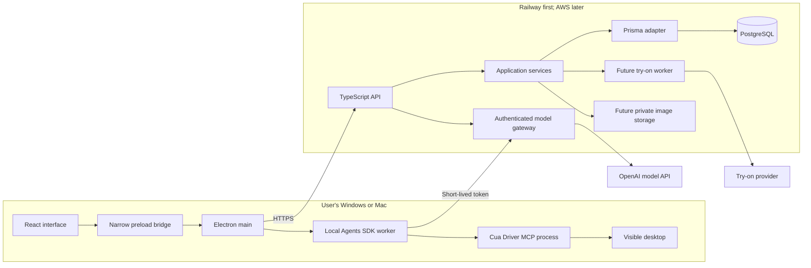

# Tro architecture

Updated September 30, 2026. Current direction: Electron + React on Windows/macOS, TypeScript throughout, Prisma + PostgreSQL on the backend, Railway first, AWS later.

## What runs where

| Component                       | Location                          | Responsibility                                        |
| ------------------------------- | --------------------------------- | ----------------------------------------------------- |
| React interface                 | User's machine, Electron renderer | Screens, input, progress, approval controls           |
| Electron main and preload       | User's machine                    | Narrow OS/IPC bridge and backend access               |
| Agents SDK worker, implemented  | User's machine                    | General computer-use loop and Cua MCP client          |
| Cua Driver MCP process          | User's machine, bundled with Tro  | Publishes desktop tools and executes local actions    |
| Model                           | Remote provider by default        | Inference; a local SDK does not make the model local  |
| TypeScript API                  | Railway initially                 | Accounts, authorization, model gateway, billing, jobs |
| Prisma                          | Backend process only              | Typed persistence adapter and migrations              |
| PostgreSQL                      | Managed backend database          | Product records, job state, entitlements              |
| Images, planned                 | Private object storage            | Photos, garments, generated previews                  |
| Try-on worker/provider, planned | Backend/provider                  | Durable generation and retries                        |

The starter implements a renderer → preload → main bridge and a backend HTTP API with application services and Prisma adapters. Operational readiness remains an API endpoint, with no desktop check panel. It also implements a separate local computer-use worker that connects to Cua Driver through MCP. Google sign-in through the system browser and a scoped backend model gateway are implemented. Task messages are displayed only in the current React window; no conversation history is persisted. Try-on job execution and image storage remain future work.

The desktop and API share the `dev | stage | prod` application environment vocabulary. The backend uses Pino for structured logs: database-readiness failures log an error category at debug level only in `dev`, without exposing Prisma messages through logs or HTTP responses.

## The full system

## Following one request

1. `App.tsx` owns the shared `UseComputerUse.ts` controller, which calls the named `window.tro.signInWithGoogle()` bridge for the sidebar and workspace. Mantine styling is centralized in `Theme.ts`; see [DesktopUi.md](DesktopUi.md).
2. `Preload.ts` validates the IPC response; `Main.ts` verifies the sending frame.
3. Electron main asks Better Auth to open Google sign-in in the system browser.
4. Google returns to the backend OAuth callback. Better Auth creates a short-lived authorization code and the browser hands it to the registered `app.tro.desktop` protocol.
5. Electron main exchanges that code for its encrypted local session cookie. Later chat requests use that session to obtain a scoped model token.

The desktop explicitly enables Better Auth's protocol registration with `scheme: true`, while leaving the SDK's CSP and IPC bridges disabled in favour of Tro's boundaries. The browser callback uses `app.tro.desktop://auth/callback#token=…`: the installed SDK matches the hostname plus path. Changing this to the single-slash form prevents the callback from matching. Regression tests cover registration and execute the return-page script with a synthetic code; they do not complete a real Google login.

After sign-in on macOS, Electron main reads Tro's Accessibility and Screen Recording grants using the native Cua SDK without starting a driver or requesting access. React shows permission onboarding while either grant is missing or unverifiable. The user requests access with a button; the native call runs inside main so macOS identifies the host app. Main opens a fixed System Settings destination. On return to Tro, a read-only recheck enters the workspace once both grants are verified. Main checks again before issuing a task session and before fetching a model gateway credential. After verification, main directly spawns a private embedded Cua daemon under Tro and passes its MCP endpoint to the agent worker. It never launches a separate CuaDriver app. Development builds use Electron’s identity; signed packaged builds use `app.tro.desktop`. See [PermissionsOnboarding.md](PermissionsOnboarding.md).

On macOS, validate browser-to-app return in a packaged app with its protocol registered in `Info.plist`. Plain command-line Electron development is not sufficient for OS deep-link registration. Keep the same app instance open throughout sign-in because the SDK holds the pending proof-key verifier in memory. See [Electron's deep-link guidance](https://www.electronjs.org/docs/latest/tutorial/launch-app-from-url-in-another-app). Full Google login and packaged OS dispatch still require an interactive smoke test.

For operational status, `CreateApi.ts` still routes `/health/ready` to `ReadServiceStatus.ts`. That service depends on a `DatabaseStatus` port, not Prisma or Fastify. `PrismaDatabaseStatus.ts` checks a mapped model and reports availability without exposing database diagnostics.

A future `createTryOnJob` follows the same path: validated contract → authorized route → application service → Prisma repository/provider port. Ownership checks belong on the backend even when the desktop already validated input.

## Code organization

Keep a single pnpm root and one backend modular monolith. `src/contracts` has real desktop and API consumers; it does not need a published workspace package yet. Put new business features under `src/server/features/<feature>`, with domain, application, and infrastructure files as needed. Avoid empty layers for trivial functions.

Domain code owns rules and fixed values, with no framework or I/O imports. Application services own workflows and ports. Adapters own Fastify, Prisma, storage, model providers, and browser integration. Startup composes them. Generated database types never become public HTTP contracts.

Use PascalCase hand-written filenames, specific action names, strict TypeScript, `unknown` for external data, runtime Zod validation, and typed test doubles. Keep each process's environment parsing in `Env.ts` using T3 Env. [AGENTS.md](../AGENTS.md) contains your complete formatting rules.

Use `#contracts/SystemStatus.js` for shared contract imports across desktop and backend; keep feature-local imports relative. The package import resolves to source in the API development process and to compiled files in production Node; Electron and test builds also resolve to source. The `.js` suffix is required by the backend's ESM output.

## Local agent orchestration

The Agents SDK runs in a separate Electron utility process on the user's machine so automation does not block the UI. On macOS, Electron main starts a local companion-only worker after permission setup without a model credential. A task replaces that connection with a credentialed worker; following resumes after the task. Sign-out and window close stop it. Other platforms start on demand and stop after 15 idle minutes. [OpenAI Agents SDK](https://developers.openai.com/api/docs/guides/agents/sdk)

The first implemented agent feature is a general computer-use text chat, specified in [ComputerUseSpec.md](ComputerUseSpec.md). The Agents SDK discovers Cua Driver's MCP tools directly; Tro does not copy each action into an OpenAI `Computer` adapter. [ComputerUseInstructions.ts](../src/desktop/worker/ComputerUseInstructions.ts) is the single place to edit the agent's standing instruction. General GUI actions can change content in any accessible app. Tro has no per-action approval UI; Cua's own runtime permission mode still applies. Voice input submits finalized instructions through the same controller; class context remains a later integration.

The worker owns the loop and tool execution. Model requests normally still go over the network. Screenshots or tool outputs sent to the model leave the machine; local orchestration is not an offline or all-local privacy guarantee.

Tro now signs users in with Google through backend Better Auth/Prisma. Better Auth's Electron client stores the Tro cookie with OS `safeStorage` when available, and main obtains a 15-minute model-only token from the backend. The local worker uses that token to call Tro's Responses gateway; the product OpenAI key and Google client secret remain on the backend. The gateway restricts the model and output tokens; it has no model request count cap and no longer writes per-account request counters. The companion keeps the macOS worker connected while the signed-in window is open; other platforms start on demand and stop after 15 idle minutes. Each message starts a fresh SDK run with no `Session` or previous message history. React displays messages in memory until the window closes; screenshots and tool outputs are not persisted. See [ComputerUseSpec.md](ComputerUseSpec.md) for limits and release work.

The selected product direction remains a local worker. Desktop control needs Windows/macOS validation and permissions; a separate process alone does not make arbitrary model-generated GUI actions harmless.

[CursorCompanion.md](CursorCompanion.md) describes the Cua-owned teaching companion,
requested through MCP by the Agents SDK. Tro's validated task mode gates observation,
previews and existing-window focus separately from ordinary desktop actions. The native
patch and reproducible build support macOS's primary display; other displays and native
platform adapters remain future work. Tro imports only a built driver, never sibling source.

## Persistence and jobs

Prisma is the ORM. PostgreSQL is the database. Zod validates boundaries; application services enforce ownership and product rules. Keep Prisma-generated types in persistence adapters.

The starter schema includes `OutfitDraft` for a future user-owned feature. No draft endpoints exist. Readiness performs a small model query to confirm the database and migration are available.

Implement durable try-on job records and one worker with the feature. Record provider request IDs and retry state. Schedule work durably with the job transaction; use an outbox if a separate queue is introduced. Queue delivery does not guarantee an external paid action occurs exactly once. Reconcile ambiguous provider responses before resubmitting.

Store images privately with short-lived signed access. Avoid binaries and permanent public image URLs in the database. Choose object storage when building uploads; PostgreSQL does not supply an image bucket.

## Railway first, AWS later

Build the backend as a Docker image and supply its database URL at runtime. Railway supports Dockerfile deployments and managed PostgreSQL. [Dockerfiles](https://docs.railway.com/builds/dockerfiles), [PostgreSQL](https://docs.railway.com/databases/postgresql)

For AWS later, a possible target is ECS/Fargate, RDS PostgreSQL, S3, and Secrets Manager. Preserve HTTP contracts and application code; data transfer, IAM, networking, and deployment configuration still require work. Avoid building AWS infrastructure before it is needed.

The Dockerfile and Railway configuration are a deployment starting point, not a completed deployment. Run `prisma migrate deploy` in a controlled release step. Requests never run migrations. Configure the public desktop API URL before making an installer. See [Deployment.md](Deployment.md).

## Next steps

1. Run and package the desktop on both target operating systems.
2. Complete account recovery, verification, production abuse controls, and hosted deployment.
3. Complete upload → durable try-on job → result → history.
4. Smoke-test the agent worker, bundled Cua Driver MCP process, and OS permissions in signed Windows/macOS installers.
5. Validate the signed-in model gateway and Cua actions end to end before public release.

The earlier exploratory options remain in [ArchitecturePrevious.md](ArchitecturePrevious.md). This document is the current source of truth.

## Voice input

### Microphone selection

The app-owned microphone picker persists a local device ID and makes explainable device-name suggestions. Each hold snapshots that choice; exact device constraints prevent silent substitution for a missing explicit input. Inventory access and device changes do not open streams.

`UseMicrophones` owns app-level discovery and storage, `Microphones` owns deterministic suggestion rules, and `MicrophonePicker` renders the choices. `UseVoiceInput` passes one selected ID into `VoiceAudioCapture` per hold. Electron main owns the trusted-frame audio permission policy and the existing capture controller owns admission and relay transport. Device names/IDs stay local; held-key audio follows the existing remote transcription path. Selection, suggestion and the input of an active capture are separate values. Selection needs no backend, database or HTTP API change. Local comparison adds only narrow validated test start/stop operations and cancellation events to preload.

See [MicrophoneSelection.md](MicrophoneSelection.md) for the ownership map, data lifetimes, sequence diagram, failure recovery, recommendation rules and implemented sound-comparison architecture. `MicrophoneTestLease` coordinates main-owned exclusive test admission with voice. A separate renderer worklet emits only scalar measurements, with no relay or agent calls. `MicrophoneRanking` stores an independent device order and never switches the selected route. Signed hardware checks remain a release requirement; see [MicrophoneHardwareChecks.md](MicrophoneHardwareChecks.md).

### Transcription

The desktop captures held-key microphone audio in an AudioWorklet, sends bounded PCM frames through validated preload operations, and uses a scoped authenticated WebSocket relay in the backend. The existing locale hook supplies each capture’s language. Main admits one final instruction and its capture locale into the existing agent controller and reports submission/result events to the in-memory UI. Typed instructions also carry the current locale. The worker builds each task's agent instructions in that reply language while reusing its Cua connection. Prisma owns atomic audio quota reservations and single-use stream claims. See [VoiceInputSpec.md](VoiceInputSpec.md) for module ownership, limits, native packaging, and release evidence.

## Native V2 teaching guidance

Show me uses host-bound V2 cursor guidance. The native companion approaches,
traces, holds and clears one cue at a time, then returns to pointer following.
Passive pointer movement is allowed. Click/key/scroll takeover is terminal for
the task; teaching has no automatic recovery continuation. A typed `teaching`
result carries demonstrated, explained, needs_input, canceled or failed status through the
existing main/preload and voice boundaries. Demonstrated requires native receipt
evidence, independent of desktop-action verification. Host lifecycle tools remain
private and the model cannot omit V2 to select legacy behavior. See
[CursorCompanionEngineering.md](CursorCompanionEngineering.md) for implemented
modules, timings, compositor evidence and primary-display limits.

Teaching accepts structured explanatory replies for general how-to questions
without requiring cursor playback. The worker validates the reply purpose and
preserves a specific question or student action in `needs_input` replies. Native
receipts still determine `demonstrated`; model prose cannot clear pending, failed
or canceled guidance. Show me forces `get_desktop_state` as the first tool choice
and releases that choice after the call. Questions about the interface "here"
prompt a tour of observed controls through the cursor companion, rather than
assumptions about an API chat or generic coding assistant. Follow-up messages
still start fresh tasks.

## Companion presentation

`DesktopCompanion` is the main-process entry point for desktop presentation. It composes `cursor` (the authenticated chat controller’s following port) and `hud` (`CompanionHudController`) through explicit injected ports. It checks presentation access, registers the HUD before cursor binding, and fences pending startup on disposal. The chat controller retains ownership of its shared cursor/task worker; the facade owns presentation cleanup. `CompanionHudController` reduces capture and worker progress events in Electron main. A narrow meter IPC accepts finite, capture-bound levels from the existing PCM stream. `CompanionHudClient` owns a persistent presentation utility worker, separate from task orchestration, and coalesces snapshots through Cua MCP. Both workers receive the same main-owned `DesktopDriverConnection` from `EmbeddedDesktopDriver`; neither starts an independent daemon. The embedded host survives task-worker replacement and stops when main quits, while both sessions clear on sign-out or window close. The native compositor owns the passive 88 × 22 pill, waveform smoothing, crossfades and primary-display placement. Private group registration binds only Tro cursors; bounded leases and native session cleanup prevent orphaned presentation. The model cannot discover or call HUD host tools. VoiceInputController remains the sole final-transcript submitter.

## Task completion

The utility worker creates a TaskHarness for each original request, immutable natural-language goal and task locale. The harness owns lifecycle, explicit verification scheduling, one continuation and final settlement. MainAgentRunner owns actor SDK history; a bounded evidence store retains actual text/images from both agents in memory. When the main agent believes its work is finished, its `verify_task` tool invokes a separate read-only SDK agent sequentially. That agent judges the request against actual observations and can make targeted read-only checks. CompletionGate validates one consistent decision, criterion coverage, evidence provenance, capture age and supersession, then accepts final output only when it references that current stored verdict. Response mode cannot bypass verification after any desktop tool use. One optional continuation retains the original history, goal and locale. Both agents share deadlines and tool limits, with bounded verifier attempts and model turns. Public contracts carry outcome counts and a limitation for typed and voice results. See [AgentHarnessSpec.md](AgentHarnessSpec.md) and [TaskCompletionSpec.md](TaskCompletionSpec.md) for file ownership, model-versus-code responsibilities and validation limits.
