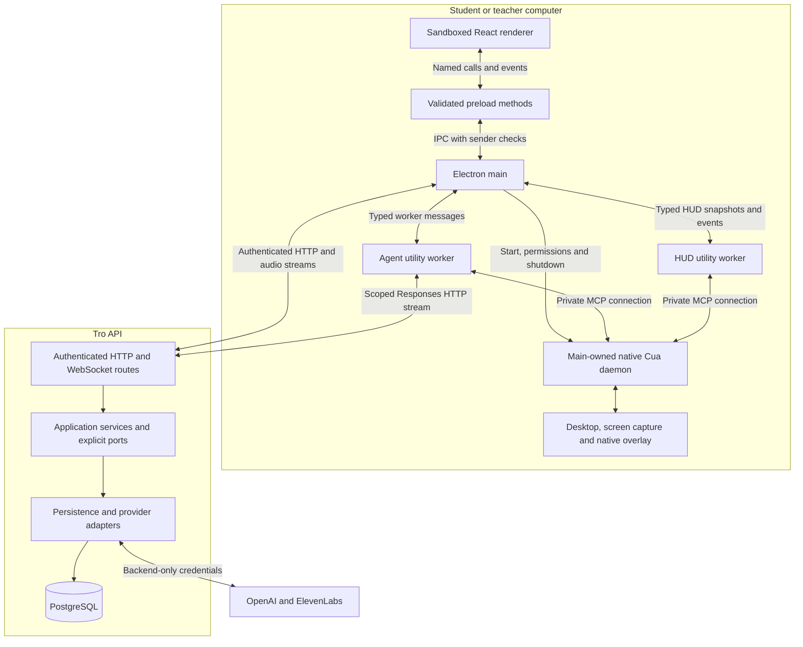
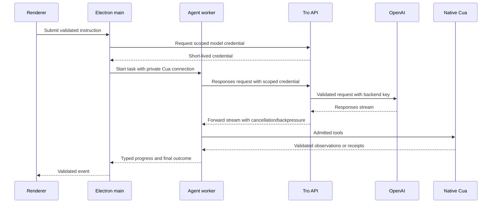
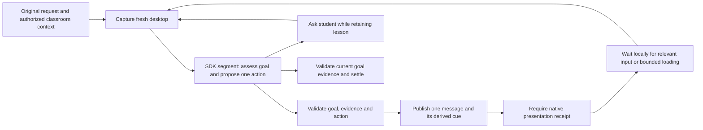
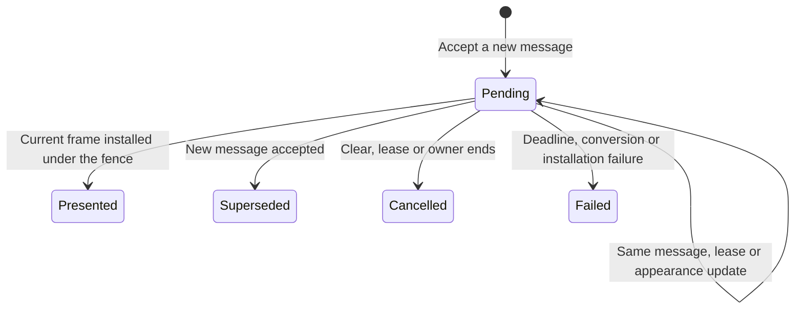

# Tro architecture

This is the single maintained description of Tro's implemented system. Updated
October 8, 2026. Change this document when ownership, component communication or
an architectural invariant changes. Contracts and configuration in the linked code
own exact wire shapes and policy values. Setup and validation commands live in the
[root README](../README.md). Research and UI prototypes are reference material,
not requirements or evidence that a capability exists.

- [System and process boundaries](#system-and-process-boundaries)
- [Authentication and account lifetime](#authentication-and-account-lifetime)
- [Agent requests and model gateway](#agent-requests-and-model-gateway)
- [Teaching](#teaching)
- [Native companion and HUD](#native-companion-and-hud)
- [Voice input and narration](#voice-input-and-narration)
- [Classroom and materials](#classroom-and-materials)
- [Local presentation and app updates](#local-presentation-and-app-updates)
- [Code ownership](#code-ownership)
- [Verification and current limits](#verification-and-current-limits)

## System and process boundaries

Tro is one pnpm root and a modular monolith. Application code is strict TypeScript.
The desktop uses Electron and React; the API uses Fastify and Prisma/PostgreSQL.
The bundled Cua dependency uses native Rust and platform adapters. It owns screen
capture, desktop tools, input observation and the macOS compositor. Its native
presentation fence cannot be replaced by asynchronous TypeScript messages.

| Boundary                  | Contract and responsibility                                                                                                                                      |
| ------------------------- | ---------------------------------------------------------------------------------------------------------------------------------------------------------------- |
| Renderer ↔ preload ↔ main | Narrow named methods and validated events. Main checks the sender, frame and document. No generic IPC, shell, filesystem or database capability crosses preload. |
| Main ↔ workers            | Validated task, progress, HUD and shutdown messages. Orchestration runs outside the renderer and main UI event loop.                                             |
| Workers ↔ Cua             | MCP tools over a private connection supplied by main. Host lifecycle, HUD and teaching admission tools are hidden from the model.                                |
| Desktop ↔ API             | Versioned HTTP contracts, authenticated sessions and scoped credentials. Desktop sends no database or shared provider key.                                       |
| API ↔ database/providers  | Services depend on application ports; adapters own Prisma, I/O and provider clients. Domain code imports no frameworks or I/O.                                   |

`EmbeddedDesktopDriver` owns one private native daemon shared by task and HUD
connections. A worker closing its connection must not stop that shared host. Main
stops the host when the application quits. Sign-out, account transitions and window
closure dispose the associated tasks and presentation resources. The renderer
stores task messages in memory; general conversation history is not persisted.

## Authentication and account lifetime

`AuthClient` opens Google sign-in in the system browser through Better Auth.
Google returns to the backend callback; the backend sends a short-lived code through
`app.tro.desktop://auth/callback#token=…`. Electron main exchanges and verifies it.
The same running instance retains the pending proof-key verifier. Before sign-in,
main registers the protocol and verifies that the OS handler points to that app.

Saved accounts use independent backend sessions. `AccountSessions` owns selection
and generation guards; `EncryptedAccountVault` stores cookies using Electron
`safeStorage` with atomic replacement. It fails closed when native encryption is
unavailable. Cookies remain in main; only validated profile metadata crosses
preload. Adding or switching an account does not change backend roles.

`AccountTransitionGate` excludes account changes from active task, voice,
microphone-test and classroom/material operations. A switch verifies the target
session before selection, releases old desktop participation and clears task,
capture and presentation state. The old account stays signed in and its teacher
session remains stored. Sign-out revokes the selected account's session and removes
its vault entry; other saved accounts remain. Late replies cannot restore an old
identity.

On macOS, main checks Screen Recording and Accessibility before admitting computer
use. The branded development host and installed Tro have different bundle
identities and permission grants. `DesktopPermissions` requests access in main so
the OS attributes it to Tro. Missing grants lead to onboarding; no driver task or
model credential is issued before admission.

## Agent requests and model gateway

Typed instructions and completed voice transcripts enter `AgentChatController`.
Main checks account, permissions and exclusivity, obtains a scoped model credential,
and sends one task to the utility worker. With the macOS companion, the local
following worker stays connected while the signed-in window is open. The fallback
worker starts on demand and retains a bounded warm lifetime after a task. Every
settled follow-up starts a fresh task; an active teaching lesson retains its own goal.

The gateway is split by responsibility: `RegisterModelGateway` owns routes,
`ModelCredentials` scoped authentication, `ModelRequest` admission,
`FetchModelResponse` bounded fetch recovery, and `ForwardModelResponse` streaming.
`ModelGatewayConfig` owns the model, output ceiling, body limit, credential lifetime,
timeout and retry policy; backend `Env.ts` owns validated secrets.

Assistant requests have no input-token counting preflight and no daily model request
cap. A rejected fetch before headers may retry once, only for the configured socket
codes, under the same cancellation/deadline. HTTP errors, other network errors and
post-header failures are not retried. SDK automatic retries are disabled. Desktop
tools are never replayed by transport recovery. A pre-header retry can still incur
another inference charge because provider execution may be uncertain.

Execution tasks use `TaskHarness`, `MainAgentRunner`, `TaskVerifier` and
`CompletionGate`. The harness owns immutable request/goal state, budgets and final
settlement. The actor explicitly requests a separate read-only verifier. Both agents'
actual observations are retained in bounded task memory. The gate checks criterion
coverage, provenance, age and supersession before accepting the stored verdict.
A bounded continuation can retain the original task history. Desktop tool use
cannot bypass verification through a prose-only response. Public outcomes distinguish
succeeded, partial, blocked and unverified; these checks validate evidence wiring,
not the correctness of every model judgment.

## Teaching

Show me keeps the student's original goal and lets the student control the real
pointer. `TeachingTaskRunner` owns SDK segments, questions, local waiting and
cancellation. `TeachingLessonContext` owns the current goal, checkpoints, proposal,
assessment and localized instruction. `TeachingPresenter` is the only paired
instruction/drawing presentation path.

The model defines or explicitly revises a typed teaching goal, then proposes one
reachable action through `present_teaching_step`. Message, cue geometry and expected
input targets derive from that same action. The final decision references the
presentation rather than introducing another unacknowledged instruction. Spatial
actions require a current message and drawing receipt. Keyboard, focused typing and
loading actions require an explicit text-only receipt.

`LoggedCuaServer` restricts model tools, binds the lesson, pins V2, checks capture
freshness and validates native replies. Host-generated epochs and presentation IDs
cannot be overridden by the model. Native `refresh_cursor_guidance_capture` compares
cue regions, rather than requiring a still whole desktop; it returns bounded
measurements without an image. Changed targets/input/geometry refuse playback.
Unknown transport results may mean an operation executed and are not replayed.

`DesktopObservationClient` and `TeachingObservationPolicy` read the session-owned
native watch and structured input history. Settled clicks, keys and scrolling can
resume the same lesson; passive pointer movement and unrelated animation do not
schedule inference. Loading and target appearance use bounded observation. Failed
comparisons are feedback in the same SDK history within a shared repair budget.
Fresh capture references are required for current goal criteria.

Click/key/scroll during a drawing interrupts that preview and returns to observation.
Esc cancels the entire lesson, releases its watch/epoch and prevents later input from
resuming it. Native presentation or transport failures end the task with a typed
reason. Demonstrated teaching is separate from independently verified desktop
execution and from classroom assessment.

## Native companion and HUD

`DesktopCompanion` composes cursor following and HUD presentation in main.
`CompanionHudController` reduces voice/task events; `CompanionHudClient` owns a
separate persistent presentation worker. Both task and HUD workers use main's
shared native daemon. Private group registration and bounded leases bind only the
associated cursors; host HUD tools are excluded from model discovery and dispatch.

The native presentation owner is `HudState` in the pinned
[CursorCompanion.patch](../driver-patches/CursorCompanion.patch). One immutable job
owns the message, render token, deadline and watch-channel outcome. The token
contains an owner epoch, increasing revision and render ID. The painter projects
accepted messages; it makes no independent message admission decision.

| Operation             | Invariant                                                                                                                                                                                                                                   |
| --------------------- | ------------------------------------------------------------------------------------------------------------------------------------------------------------------------------------------------------------------------------------------- |
| Admission             | Validate live owner, lesson and sequence before changing message or receipt. Exact duplicates reuse token, waiter, deadline and outcome. Older messages and equal-identity content conflicts cannot replace the current job.                |
| Lease / appearance    | `CompanionHudPublisher` serializes explicit `renew_lease` and `update_appearance` commands. They carry no cached teaching message. Only these intents coalesce; message/clear ordering is preserved.                                        |
| Render and install    | An immutable scene/message token travels through painting, conversion and the main-queue mailbox. `install_current_composite` validates it while holding the same HUD fence across synchronous CALayer installation and receipt completion. |
| Clear / failure       | Token-conditioned cleanup cannot clear a newer job. Watermarks survive clear/failure. Watch outcomes become terminal once; late callbacks cannot turn an old terminal job into Presented.                                                   |
| Lesson / owner change | Explicit lesson binding and owner retirement invalidate old scenes. Retired lesson identities and cursor bindings are bounded. Delayed readback cannot replace newer observed tokens.                                                       |

The installation guard also fences empty composites and obsolete drawing frames.
Current Presented jobs may animate without completing their receipt again. The
lock order is HUD → unique guidance fences in pointer order → accessibility text;
the callback does not await or acquire the render-controller lock. Coalesced or
rejected images are released. The original one-second message deadline remains.
Presented means CALayer accepted the current frame, not physical display scan-out.
A message receipt alone does not satisfy a spatial teaching presentation.

The stale-refresh regression previously separated message 2 from its receipt when
an old snapshot carried message 1. Common admission, explicit refresh commands and
the installation fence remove that split ownership. Native build provenance is
owned by [CuaCompanionBuild.ts](../src/contracts/CuaCompanionBuild.ts). The cleaned
`0.30.4-tro.19` build passed the permanent regression and real native two-message
and paired-receipt checks. Temporary render stages and socket profiling were removed;
concise genuine failures remain. Earlier TLS errors are a separate transport issue.

## Voice input and narration

The held shortcut is Command + Control on macOS and Control + Left Alt on Windows.
The native key listener owns press/release/rearming. `VoiceInputController` owns
capture identity, account checks, cancellation and exactly one final instruction
submission. The sandboxed renderer owns microphone tracks and an AudioWorklet.
Named preload methods carry bounded sequenced PCM frames to main.

Main's authenticated transcription WebSocket relays audio through the API to
OpenAI live transcription. One provider session is created per capture. On release,
the worklet flushes its tail; main/relay enforce sequence order before commit and
correlate the final transcript to the committed item. Partial transcripts do not
start agent tasks. Release stops tracks immediately; bounded buffering allows
already captured speech to finish while the connection opens. Esc, account/window
changes, sleep/lock or failure invalidate late finals. No microphone stays open
between holds.

`Microphones`, `MicrophonePicker` and local preferences own input selection.
Automatic selection follows OS routing; explicit selection uses exact constraints
and fails visibly if missing. Suggestions are name-based hints. Ranking does not
switch the selected route. Local quiet/speech comparisons use a main-owned exclusive
lease, compute scalar measurements and stop every track. Test audio is neither
uploaded nor saved. Transcription usage reservations and active captures are
persisted through the backend allowance adapter.

HUD narration is a separate flow: installed native message readback →
`VoiceoverController` → authenticated backend ElevenLabs stream → bounded renderer
playback → speaking acknowledgments back to main/HUD. The backend owns voices,
model settings, credentials and paid allowance. Speech stops before microphone
capture and on context/account/window changes. Failure leaves visual guidance
usable. Playback and speech are not completion evidence. English/Vietnamese locale
is snapshotted for the operation. Live provider pronunciation and signed hardware
acceptance remain separate checks.

## Classroom and materials

Classroom authorization lives in `ClassroomService` and its store port. Teachers
and students are real signed-in accounts with backend-owned roles. Invitation/enrollment,
live session availability, explicit joining, presence, progress and hand-in are
separate facts. Sessions expose Explanation, Practice, Submission and Review;
teacher-paced sessions bind the current activity, while self-paced sessions allow
student selection. Class detail routes remain inside the installed renderer's hash
router; a route does not authorize class access.

`ClassroomSessionController` loads fresh authorized context for each class-bound
Show me request, including pinned course revision, stage, activity, criteria,
working resource and durable student progress. Joined classroom Do it for me
requests are refused. Rejoining restores participation and work; device leases
prevent another device from writing with old authority. Context/version checks
fence late commands. Esc cancels guidance without leaving the class. Switching
accounts leaves desktop participation without ending a teacher's live session.

Teachers upload originals, prepare suggestions, edit review and explicitly approve.
`MaterialService` owns collection versions and approval; `MaterialPreparationRunner`
and `PrepareMaterialCollection` own durable extraction, document briefs and composition.
Provider/extractor/storage adapters operate behind ports. Class-scoped derivation
claims and cache keys permit reuse of unchanged work. Each uncached preparation
stage counts input tokens and reserves its job allowance before generation; this
is separate from assistant gateway forwarding. Uncertain provider outcomes require
explicit retry. A bounded citation repair validates referenced source ranges.

```mermaid
flowchart LR
  Originals[Teacher uploads and instructions] --> Extract[Extract exact source units]
  Extract --> Briefs[Reusable document briefs]
  Briefs --> Compose[Class overview and suggested sections]
  Compose --> Review[Teacher edits and approves]
  Review --> Revision[Immutable published course revision]
  Revision --> Packet[Authorized bounded student context]
  Packet --> Tutor[Existing Show me teaching worker]
  Tutor --> Sources[Authenticated source search and reads]
  Sources --> Tutor
```

Originals, exact text, document briefs and teacher corrections remain distinct.
Review revisions reuse extraction/briefs where inputs are unchanged; they do not
approve automatically or alter a live session's pinned publication. Student material
packets select dependencies, corrections and relevant passages under a token budget.
`ReadMaterialSources` supplies authorized bounded search/reads; missing required
context is reported rather than silently shortened. Legacy publications use a
compatibility adapter. Preparation limits and provider settings belong in backend
`Env.ts` and the owning preparation modules.

An owning teacher can delete an inactive class through a confirmed command. The
serializable transaction rechecks that no live session exists, tombstones the class,
revokes invitation access and preserves work/history. Removing a material deletes
unused originals but preserves files referenced by immutable approved revisions.
Neither operation resets the database or rewrites applied migrations.

### Practice checks

`PracticeCheckService` is a separate formative evaluator, not the teaching completion
gate. A teacher reviews and enables a checkpoint before publication. The student
previews bounded text/code/image/file evidence and explicitly requests a check,
then may request a hint or targeted Show me assistance. The checker uses approved
criteria and submitted evidence; it cannot execute student work or change the rubric.
Saved checks are versioned and private. `PrismaPracticeCheckStore` owns transactional
reservations, evidence snapshots and append-only submission revisions.

Hand-in requires independent student confirmation and preserves the exact submitted
version. Teacher views read the saved evidence and receipts. Existing Scratch-link
submission and progress reports remain compatible; a report or saved URL is not a
grade. Cmd/Ctrl + Shift + Enter opens practice review with an in-app fallback.
The shortcut does not capture an open application. Native selected-window evidence,
unlimited storage and automatic final grading are not implemented promises.

## Local presentation and app updates

Mantine defaults and semantic styling belong in `Theme.ts` and
`DesktopAppearance.ts`; renderer layout consumes those values. Locale is shared by
typed and voice tasks. The optional pet is composed separately by `PetController`
and `PetWindow`: account-scoped local preferences, bundled raster assets, restricted
preload and a sandboxed transparent window. It hides during agent work and voice
capture, captures no screen and makes no model request. Generated pets and cloud
collections are not implemented.

`AppUpdateController` owns update lifecycle and admission through an injected port;
`ElectronAppUpdater` adapts the installed app's configured HTTPS feed. Updates are
disabled in development or without a feed. Downloads and installation require user
actions. Restart is blocked during active work and cleans up workers/driver first.
Main validates events before preload exposes progress; the renderer has no arbitrary
installer path or update URL capability. Signing, notarization and live installed-app
update acceptance remain release work.

The backend deployment target is Railway using the repository Dockerfile and
versioned migrations. `/health/live` reports the process, while `/health/ready`
requires database readiness. Deployment is not implied by local tests. AWS and
try-on generation remain future work; there is no implemented try-on job pipeline.

## Code ownership

| Responsibility                   | Start here                                                                                                                                                                                                                                                                                      |
| -------------------------------- | ----------------------------------------------------------------------------------------------------------------------------------------------------------------------------------------------------------------------------------------------------------------------------------------------- |
| Renderer and bridge              | [App.tsx](../src/desktop/renderer/App.tsx), [Preload.ts](../src/desktop/preload/Preload.ts), [Main.ts](../src/desktop/main/Main.ts)                                                                                                                                                             |
| Public boundary schemas          | [contracts](../src/contracts/SystemStatus.ts); domain code consumes framework-free values, never persistence-generated types                                                                                                                                                                    |
| Auth and saved accounts          | [AuthClient.ts](../src/desktop/main/AuthClient.ts), [AccountSessions.ts](../src/desktop/main/accounts/AccountSessions.ts), [EncryptedAccountVault.ts](../src/desktop/main/accounts/EncryptedAccountVault.ts)                                                                                    |
| Native host and permissions      | [EmbeddedDesktopDriver.ts](../src/desktop/main/EmbeddedDesktopDriver.ts), [DesktopPermissions.ts](../src/desktop/main/DesktopPermissions.ts), [CursorCompanion.patch](../driver-patches/CursorCompanion.patch)                                                                                  |
| Chat and worker composition      | [AgentChatController.ts](../src/desktop/main/AgentChatController.ts), [ComputerUseTaskRunner.ts](../src/desktop/worker/agent/ComputerUseTaskRunner.ts)                                                                                                                                          |
| Execution and verification       | [TaskHarness.ts](../src/desktop/worker/execution/TaskHarness.ts), [TaskVerifier.ts](../src/desktop/worker/execution/TaskVerifier.ts), [CompletionGate.ts](../src/desktop/worker/execution/CompletionGate.ts)                                                                                    |
| Teaching and native tool adapter | [TeachingTaskRunner.ts](../src/desktop/worker/teaching/TeachingTaskRunner.ts), [TeachingPresenter.ts](../src/desktop/worker/teaching/TeachingPresenter.ts), [LoggedCuaServer.ts](../src/desktop/worker/cua/LoggedCuaServer.ts)                                                                  |
| Local observation                | [DesktopObservationClient.ts](../src/desktop/worker/observation/DesktopObservationClient.ts), [TeachingObservationPolicy.ts](../src/desktop/worker/observation/TeachingObservationPolicy.ts)                                                                                                    |
| Companion presentation           | [DesktopCompanion.ts](../src/desktop/main/companion/DesktopCompanion.ts), [CompanionHudPublisher.ts](../src/desktop/worker/companion/CompanionHudPublisher.ts)                                                                                                                                  |
| Voice and microphones            | [VoiceInputController.ts](../src/desktop/main/voice/VoiceInputController.ts), [VoiceoverController.ts](../src/desktop/main/voiceover/VoiceoverController.ts), [Microphones.ts](../src/desktop/renderer/voice/Microphones.ts)                                                                    |
| Model gateway                    | [RegisterModelGateway.ts](../src/server/auth/RegisterModelGateway.ts), [ModelGatewayConfig.ts](../src/server/auth/ModelGatewayConfig.ts), [ForwardModelResponse.ts](../src/server/auth/ForwardModelResponse.ts)                                                                                 |
| Classroom and practice           | [ClassroomService.ts](../src/server/features/classroom/application/ClassroomService.ts), [PracticeCheckService.ts](../src/server/features/classroom/application/PracticeCheckService.ts), [ClassroomSessionController.ts](../src/desktop/main/classroom/ClassroomSessionController.ts)          |
| Materials and retrieval          | [MaterialService.ts](../src/server/features/materials/application/MaterialService.ts), [PrepareMaterialCollection.ts](../src/server/features/materials/application/PrepareMaterialCollection.ts), [ReadMaterialSources.ts](../src/server/features/materials/application/ReadMaterialSources.ts) |
| Persistence                      | [PrismaClassroomStore.ts](../src/server/persistence/PrismaClassroomStore.ts), [schema.prisma](../prisma/schema.prisma), reviewed additive migrations                                                                                                                                            |
| Updates and pets                 | [AppUpdateController.ts](../src/desktop/main/updates/AppUpdateController.ts), [PetController.ts](../src/desktop/main/pets/PetController.ts)                                                                                                                                                     |
| Runtime configuration            | [backend Env.ts](../src/server/Env.ts), [main Env.ts](../src/desktop/main/Env.ts), [scripts Env.ts](../scripts/Env.ts)                                                                                                                                                                          |

Tests mirror `src` under `test`. Production code never imports tests or sibling
repository source. Framework-free domain rules depend on explicit ports; public
contracts use strict runtime schemas. `CheckBoundaries.ts` enforces filenames and
import boundaries. See [AGENTS.md](../AGENTS.md) for coding rules.

## Verification and current limits

Unit and disposable-PostgreSQL integration tests cover contracts, authorization,
state transitions, concurrency guards, cancellation, evidence and privacy. The
teaching flow harness builds the actual renderer/preload/main/worker/SDK/MCP path
with a scripted local model peer. Its native mode also exercises the real macOS
host, capture comparison, HUD installations, paired receipts and teardown. A
validated completion marker prevents a normal app launch from counting as a pass.
These checks require no paid inference.

Signed macOS/Windows hardware checks still cover global shortcuts, mic routing,
background capture, transparent-window interactions, physical click/drag/Esc,
coordinate accuracy and installed updates. Synthetic receipts do not prove physical
display scan-out or model quality. Native guidance currently targets the primary
macOS display; Windows and multiple-display teaching parity are not established.
Real provider quality, hosted deployment and production recovery need separate
acceptance. Validation commands and manual smoke checks are in the root README.

Operational logs record owned stage/reason, correlation IDs and bounded safe fields.
Successful routine polls are quiet. Development exchange tracing is explicitly
content-bearing and excludes image pixels, secrets and hidden reasoning. Ordinary
logs never contain screenshots, typed keys, raw configuration or credentials.
Gateway failures retain safe provider/network/TLS evidence; temporary per-stage
render and successful-connection profiling is absent. When cause is uncertain,
instrument the owning boundary before changing behavior.
