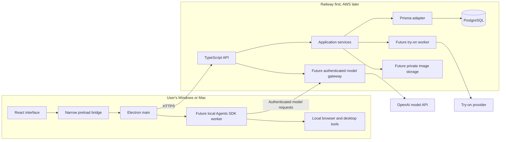

# Tro architecture

Updated September 30, 2026. Current direction: Electron + React on Windows/macOS, TypeScript throughout, Prisma + PostgreSQL on the backend, Railway first, AWS later.

## What runs where

| Component                       | Location                          | Responsibility                                        |
| ------------------------------- | --------------------------------- | ----------------------------------------------------- |
| React interface                 | User's machine, Electron renderer | Screens, input, progress, approval controls           |
| Electron main and preload       | User's machine                    | Narrow OS/IPC bridge and backend access               |
| Agents SDK worker, planned      | User's machine                    | Agent loop and authorized local actions               |
| Model                           | Remote provider by default        | Inference; a local SDK does not make the model local  |
| TypeScript API                  | Railway initially                 | Accounts, authorization, model gateway, billing, jobs |
| Prisma                          | Backend process only              | Typed persistence adapter and migrations              |
| PostgreSQL                      | Managed backend database          | Product records, job state, entitlements              |
| Images, planned                 | Private object storage            | Photos, garments, generated previews                  |
| Try-on worker/provider, planned | Backend/provider                  | Durable generation and retries                        |

The starter implements only the renderer → preload → main → HTTP API → application service → Prisma adapter → PostgreSQL readiness path. Agent orchestration, identity, storage, and job execution are future work.

The desktop and API share the `dev | stage | prod` application environment vocabulary. The backend uses Pino for structured logs: database-readiness failures log an error category at debug level only in `dev`, without exposing Prisma messages through logs or HTTP responses.

## The full system

## Following one request

1. `App.tsx` requests service status through `window.tro.readServiceStatus()`.
2. `Preload.ts` exposes only that named operation and validates its IPC result.
3. `Main.ts` verifies the sending frame and calls `BackendClient.ts`.
4. `BackendClient.ts` fetches a fixed versioned endpoint, retries one transient read failure, and validates the response with the canonical Zod schema. Invalid response data and client errors are not retried.
5. `CreateApi.ts` routes HTTP to `ReadServiceStatus.ts`.
6. The application service depends on a `DatabaseStatus` port, not Prisma or Fastify.
7. `PrismaDatabaseStatus.ts` checks a mapped model and returns a boolean. Failures become unavailable status; database messages and credentials are not exposed.

A future `createTryOnJob` follows the same path: validated contract → authorized route → application service → Prisma repository/provider port. Ownership checks belong on the backend even when the desktop already validated input.

## Code organization

Keep a single pnpm root and one backend modular monolith. `src/contracts` has real desktop and API consumers; it does not need a published workspace package yet. Put new business features under `src/server/features/<feature>`, with domain, application, and infrastructure files as needed. Avoid empty layers for trivial functions.

Domain code owns rules and fixed values, with no framework or I/O imports. Application services own workflows and ports. Adapters own Fastify, Prisma, storage, model providers, and browser integration. Startup composes them. Generated database types never become public HTTP contracts.

Use PascalCase hand-written filenames, specific action names, strict TypeScript, `unknown` for external data, runtime Zod validation, and typed test doubles. Keep each process's environment parsing in `Env.ts` using T3 Env. [AGENTS.md](../AGENTS.md) contains your complete formatting rules.

Use `#contracts/SystemStatus.js` for shared contract imports across desktop and backend; keep feature-local imports relative. The package import resolves to source in the API development process and to compiled files in production Node; Electron and test builds also resolve to source. The `.js` suffix is required by the backend's ESM output.

## Local agent orchestration

The Agents SDK runs in application-owned TypeScript code. The planned location here is a separate local worker so automation does not block the UI. [OpenAI Agents SDK](https://developers.openai.com/api/docs/guides/agents/sdk)

The first planned agent feature is a screen-aware teaching assistant, specified in [TeachingAssistantSpec.md](TeachingAssistantSpec.md). It observes the visible desktop during a student-started session and can navigate by opening or focusing an app or an existing VS Code tab. It does not edit student work or execute general computer tasks. This narrower first release does not require a second model-based guardrail agent or per-action human-review prompts.

The worker owns the loop and tool execution. Model requests normally still go over the network. Screenshots or tool outputs sent to the model leave the machine; local orchestration is not an offline or all-local privacy guarantee.

Choose a credential path before implementing paid calls:

- Product-funded usage: build an authenticated backend model gateway. Allow only supported operations, limit models/tokens/runs, meter spending per user, and return the protocol the SDK expects. Test SDK client configuration, streaming, cancellation, and errors. This gateway is application code to build, not an automatic starter feature.
- User-funded usage: explicitly support a user's API key and OS-protected storage. Never embed the founder's shared key. Review tracing and payload retention before using customer data.

For a prototype, backend-hosted orchestration with specifically authorized local tool requests can be simpler than building a gateway. The selected product direction remains a local worker. Prefer typed application tools before screen automation. Desktop control needs Windows/macOS adapters and permissions; a separate process alone does not safely isolate arbitrary model-generated code.

## Persistence and jobs

Prisma is the ORM. PostgreSQL is the database. Zod validates boundaries; application services enforce ownership and product rules. Keep Prisma-generated types in persistence adapters.

The starter schema includes `OutfitDraft` for a future user-owned feature. No draft endpoints exist. Readiness performs a small model query to confirm the database and migration are available.

Implement durable try-on job records and one worker with the feature. Record provider request IDs and retry state. Schedule work durably with the job transaction; use an outbox if a separate queue is introduced. Queue delivery does not guarantee an external paid action occurs exactly once. Reconcile ambiguous provider responses before resubmitting.

Store images privately with short-lived signed access. Avoid binaries and permanent public image URLs in the database. Choose object storage when building uploads; PostgreSQL does not supply an image bucket.

## Railway first, AWS later

Build the backend as a Docker image and supply its database URL at runtime. Railway supports Dockerfile deployments and managed PostgreSQL. [Dockerfiles](https://docs.railway.com/builds/dockerfiles), [PostgreSQL](https://docs.railway.com/databases/postgresql)

For AWS later, a possible target is ECS/Fargate, RDS PostgreSQL, S3, and Secrets Manager. Preserve HTTP contracts and application code; data transfer, IAM, networking, and deployment configuration still require work. Avoid building AWS infrastructure before it is needed.

The Dockerfile and Railway configuration are a deployment starting point, not a completed deployment. Run `prisma migrate deploy` in a controlled release step. Requests never run migrations. Configure the public desktop API URL before making an installer. See [Deployment.md](Deployment.md).

## Next steps

1. Run and package the desktop on both target operating systems.
2. Select identity and add authenticated user-owned records.
3. Complete upload → durable try-on job → result → history.
4. Add a local worker with one typed agent tool and a tested credential path.
5. Add one browser workflow, then desktop adapters as needed.

The earlier exploratory options remain in [ArchitecturePrevious.md](ArchitecturePrevious.md). This document is the current source of truth.
