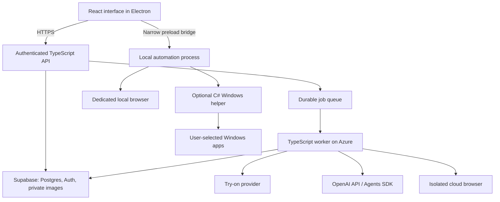

# Tro: architecture draft for a solo founder

Drafted September 30, 2026. Recommendations are engineering judgments based on the official documentation linked below.

## Assumptions to confirm

- Windows and macOS compatibility and founder development speed are the immediate priorities. React Native is under consideration. A Microsoft-native-only framework or an entirely Microsoft-hosted backend has not been confirmed as a requirement.
- Try-on means generating clothing previews from a person photo and garment photo. Live camera AR, body measurement, and accurate sizing require a different technical evaluation.
- Browser automation comes first. Controlling other Windows desktop applications is a later capability.
- No existing implementation was found in this workspace. The supplied navigation guide was not present.

## Recommended stack

| Responsibility                 | Initial choice                                            | Reason                                                                                              |
| ------------------------------ | --------------------------------------------------------- | --------------------------------------------------------------------------------------------------- |
| Desktop application            | Electron                                                  | Share JavaScript/TypeScript skills across desktop, backend, and automation; retain a path to macOS. |
| Interface                      | React + TypeScript + Vite                                 | Keep the UI independent of desktop APIs so components can also support a future web client.         |
| Styling                        | Tailwind CSS + one component library                      | Reuse consistent controls and spend design effort on the central workflow.                          |
| API                            | Node.js LTS + TypeScript + Fastify                        | A small authenticated API with shared request schemas.                                              |
| Persistence                    | Supabase Postgres, Auth, and private Storage              | Managed accounts, relational data, and image storage in one platform.                               |
| Background work                | Supabase Queues + a Node worker                           | Persist work across restarts and avoid holding HTTP requests open for generation or agent runs.     |
| Hosting                        | Azure Container Apps for API and worker                   | Use managed container hosting; start with a continuously polling worker and tune scaling later.     |
| Agent logic                    | OpenAI TypeScript Agents SDK when an agent loop is needed | Keep orchestration in the same language; simple AI calls can use the Responses API directly.        |
| Try-on                         | Hosted specialist API, starting by evaluating FASHN       | Validate image quality before taking on GPU infrastructure.                                         |
| Browser control                | Playwright in a dedicated browser environment             | Use structured browser actions first; add screenshot-based computer use for difficult interfaces.   |
| Windows desktop control, later | Small C# helper using Windows UI Automation               | Add Windows integration without rewriting the interface or backend.                                 |
| Packaging and validation       | Electron Forge; Windows CI; Playwright smoke tests        | Build installers and verify the actual target platform early.                                       |

Electron embeds Chromium and Node.js and supports Windows, macOS, and Linux. Its runtime footprint is a tradeoff to measure on target machines. [Electron introduction](https://www.electronjs.org/docs/latest/)

Supabase provides Postgres, authentication, storage, and a durable Postgres-backed queue. Hosting the API on Azure does not make Supabase an Azure service; this recommendation uses two infrastructure providers. [Supabase](https://supabase.com/docs), [Queues](https://supabase.com/docs/guides/queues)

## Components and boundaries



Keep application code in one repository. Initially deploy an API and one worker from the same codebase; organize business capabilities as modules. Extract more services only when independent scaling or security isolation requires them.

Suggested organization:

```text
apps/desktop/          Electron main, preload, and React renderer
apps/server/           API and worker entry points
packages/contracts/    Validated request, response, and tool schemas
packages/core/         Users, garments, try-on jobs, agent runs
packages/providers/    Try-on and OpenAI adapters
packages/automation/   Browser and desktop capability interfaces
supabase/migrations/   Versioned schema and access policies
```

Keep provider-specific request formats inside adapters. Start with two small contracts: a try-on provider that submits and checks a generation, and an automation target that reports capabilities and executes approved actions. Avoid building a general plugin framework before a second implementation is needed.

## Try-on workflow

1. The signed-in user uploads a person image and garment image to private storage using scoped upload authorization.
2. The API validates ownership, inputs, and usage allowance; records a job; and durably schedules work.
3. The worker submits generation to the provider and stores its request ID immediately.
4. A callback or polling step records completion and copies the result into private application storage when provider terms permit it.
5. The interface shows progress, failure, and retry states; completed previews appear in history.

Use idempotent job creation and provider-supported idempotency where available. Queue delivery does not guarantee that a paid external generation happens exactly once. After an ambiguous provider response, reconcile using the saved provider request ID before resubmitting. Set timeouts, bounded retries, per-user limits, and deletion rules for photos.

Test a representative image set before choosing the provider: garment patterns, identity preservation, poses, body shapes, and difficult backgrounds. Assess cost and latency per accepted result. A convincing generated preview alone does not establish physical fit or sizing accuracy. [FASHN documentation](https://docs.fashn.ai/)

## Agent and computer-use workflow

Begin with one focused agent and a few typed tools such as finding a garment, creating a try-on job, and retrieving its status. Add handoffs only when evaluation shows a benefit. The SDK supports TypeScript and Python and runs inside your application. It supplies orchestration; you still own tool implementations, state, deployment, and approval decisions. [OpenAI Agents SDK](https://developers.openai.com/api/docs/guides/agents/sdk)

Choose the execution target explicitly:

- Cloud websites: a per-user isolated Playwright browser, or evaluate the OpenAI-hosted browser option to reduce infrastructure work.
- Local websites: a dedicated local browser session with explicit account access.
- Windows applications: a local helper running in the user's interactive session. A cloud browser cannot reach a customer's local desktop by itself.

OpenAI's computer-use integration can return actions for your runtime to execute. Its hosted browser option is a separate runtime choice. Keep both behind an automation interface if you evaluate them. [Computer use with your runtime](https://developers.openai.com/api/docs/guides/tools-computer-use), [Hosted browser](https://developers.openai.com/api/docs/guides/agents-api/tools/computer-use)

Prefer APIs, then browser or accessibility controls, then screenshots and coordinates. UI Automation exposes Windows UI elements for inspection and interaction. Verify target-app support rather than promising universal desktop control. [Windows UI Automation](https://learn.microsoft.com/en-us/dotnet/framework/ui-automation/ui-automation-overview)

Expose narrow validated operations through Electron's preload bridge; keep Node access disabled in the renderer and retain context isolation and sandboxing. Run automation outside the UI process. A separate process improves reliability but is not sufficient isolation for arbitrary model-generated code. Such code needs a constrained execution environment. [Electron process model](https://www.electronjs.org/docs/latest/tutorial/process-model), [Sandboxing](https://www.electronjs.org/docs/latest/tutorial/sandbox)

Keep shared provider secrets server-side. Local sessions use user-scoped authentication. Design a visible stop control, target restrictions, and confirmation before purchases, sending messages, or deleting data into computer-use tools. Keep screenshots and personal photos out of routine logs.

## Fastest implementation sequence

1. Produce a Windows installer for a minimal app and test it on a Windows machine or VM. Include Windows CI from the start.
2. Complete one end-to-end user journey: sign in, upload two images, generate a preview, save the result.
3. Make that journey reliable: durable jobs, clear failures, cancellation behavior, usage accounting, and private storage.
4. Add one agent-assisted journey using existing application tools; evaluate it against representative tasks.
5. Add browser automation for one specific website workflow, then Windows desktop automation if customer demand requires it.

Use AI coding assistance on small features with clear acceptance criteria. Reuse templates and managed services. Check the main user journey on each change, and add stronger tests around authorization, paid job retries, and automation approvals. Keep traces of agent steps and record outcome, latency, and cost per run.

Budget hosting separately from variable AI, image-generation, and browser-runtime spending. Set limits on step counts and concurrency before opening access broadly. Revisit architecture based on measured bottlenecks and customer needs.

## React Native option for Windows and macOS

React Native is a viable alternative for the desktop interface. Use React Native for Windows (`react-native-windows`) and React Native for macOS (`react-native-macos`), both maintained by Microsoft. These are separately maintained desktop platforms, so validate a compatible combination of React Native, Windows, macOS, and native library versions before selecting dependencies. [Desktop platforms](https://reactnative.dev/docs/out-of-tree-platforms), [Windows](https://github.com/microsoft/react-native-windows), [macOS](https://github.com/microsoft/react-native-macos)

This option replaces the Electron UI, preload bridge, Vite build setup, and Forge packaging with React Native components, Metro bundling, native modules, and platform-specific build and distribution pipelines. Start styling with React Native's built-in styling APIs; web DOM component libraries and ordinary Tailwind CSS are not direct substitutes for native controls.

Keep the cloud API, database, private images, durable jobs, and hosted try-on provider as described above. Run the OpenAI Agents SDK in the server worker. Run Playwright in a cloud browser environment or a separately packaged local automation runtime; a React Native app does not provide Electron's bundled Node.js runtime.

Suggested desktop structure:

```text
apps/desktop/src/      Shared React Native screens and TypeScript logic
apps/desktop/windows/  Windows native project and modules
apps/desktop/macos/    macOS native project and modules
apps/server/           API and agent/try-on worker
packages/contracts/    Shared API contracts
```

Before adopting a component or native module, verify support for both desktop targets. The Microsoft documentation explicitly points to platform-filtered module listings because some modules lack Windows or macOS implementations. [Community module compatibility](https://microsoft.github.io/react-native-windows/docs/supported-community-modules/)

For local computer control, implement Windows and macOS adapters behind the same TypeScript interface. Windows can use UI Automation; macOS needs its own accessibility and screen-capture integration and permissions. Browser automation in the cloud avoids these local OS integrations for website-only tasks.

Build and test on both operating systems from the beginning. Windows development requires Windows and its native toolchain; plan a Mac/Xcode build environment for macOS. [Windows requirements](https://microsoft.github.io/react-native-windows/docs/rnw-dependencies/)

Recommendation: choose React Native when a native interface and possible future mobile reuse justify additional desktop integration work. Electron remains a candidate when shipping desktop browser automation quickly is the main priority; it also supports both Windows and macOS. Before committing, validate a small React Native prototype on both targets with image selection, image preview, authentication, and a server job. Add an automation bridge proof of concept if local computer control is central to the first release.

## If Microsoft-native development is required

Use C# + WinUI 3 + Windows App SDK for the interface, ASP.NET Core for the API, and Azure managed services for storage and background work. Microsoft recommends WinUI 3 for new native Windows applications. If the OpenAI Agents SDK is desired, retain a TypeScript or Python worker; the official .NET API SDK and Agents SDK are different packages. [Microsoft framework guidance](https://learn.microsoft.com/en-us/windows/apps/get-started/), [OpenAI SDKs](https://developers.openai.com/api/docs/libraries)

Microsoft also documents Electron, WebView2, PWA, and React Native routes. Windows compatibility and Microsoft Store distribution do not require a WinUI interface. Packaging, signing, update behavior, and Store acceptance still require validation for the chosen distribution path. [Windows development options](https://learn.microsoft.com/en-us/windows/apps/whats-new/coming-to-windows), [Distribution paths](https://learn.microsoft.com/en-us/windows/apps/package-and-deploy/choose-distribution-path)

Tauri is another candidate when runtime footprint becomes important. It uses Windows WebView2 and requires a Rust toolchain; evaluate the additional integration work against your existing skills. A PWA is a simpler initial option if all work happens in the cloud and local desktop control is unnecessary. [Tauri prerequisites](https://tauri.app/start/prerequisites/)

## Decisions still open

- Current skills: TypeScript/React, C#/.NET, Python, or starting from scratch.
- Photo try-on versus live camera try-on.
- Browser automation versus control of other Windows applications.
- Consumer accounts versus enterprise Microsoft identity and deployment requirements.
- React Native versus Electron for the Windows/macOS interface; future web and mobile targets.

These answers may change the recommendation. This document is a draft architecture; no application or cloud resources have been created.
