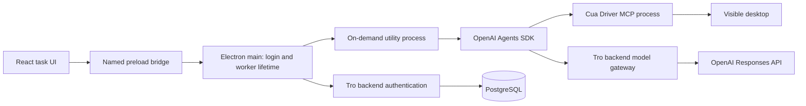

# Local computer-use tasks

Status: text input, Google sign-in in the system browser, the backend model gateway, and an on-demand local agent worker are implemented. Each message is a fresh task. Live Google OAuth requires provider credentials and end-to-end validation; OpenAI/Cua GUI actions, Windows installation, signed macOS behavior, and production operations also need validation.

## Where each part runs



The user signs into Tro with Google in the system browser. Google is the supported sign-in flow; public email/password signup and sign-in are disabled. Better Auth returns a short-lived code to Electron through the registered app protocol; Electron main exchanges it for a session. The backend keeps `OPENAI_API_KEY` and the Google client secret, and issues a 15-minute model-only token to Electron main. Main passes that token to the local utility process, where the Agents SDK calls Tro's model gateway. React receives neither the model token nor the provider keys. The gateway limits the model and output tokens but does not cap or count model requests per account or per day. Historical ModelUsage records remain in the database and no longer affect requests. The model runs remotely; screen observations or tool results sent to it leave the computer.

Cua Driver is included in packaged desktop builds and exposes its current tools over a private MCP connection. During development, Tro downloads the pinned, SHA-256-verified release once. On macOS, Tro requests Accessibility and Screen Recording in its own main process. Once both grants are verified, main directly starts a private embedded Cua daemon and supplies its MCP command, environment, and socket to the worker. The driver inherits the host's permissions and never launches a second app through LaunchServices. The pinned native SDK and executable are shipped outside ASAR. Signed packaged builds use Tro; development Electron has its own identity. The Agents SDK discovers the tool catalog and chooses actions. Tro's standing instruction is [ComputerUseInstructions.ts](../src/desktop/worker/ComputerUseInstructions.ts). Tro does not maintain a wrapper for each Cua action. The agent can take general GUI actions in accessible apps. This prototype has no per-action approval UI, though Cua's runtime permission mode may apply. Push-to-talk is implemented as described in [VoiceInputSpec.md](VoiceInputSpec.md); class context is not implemented.

Some Cua tools declare open-ended JSON arguments. [LoggedCuaServer.ts](../src/desktop/worker/LoggedCuaServer.ts) adjusts their advertised top-level schema before the Agents SDK reads it, avoiding a repeated strict-schema conversion warning. The SDK still sends these tools to the model in non-strict mode with open arguments; Cua remains the owner of tool execution. Tro does not add browser-specific tools or call macOS LaunchServices to carry out user tasks. Cua provides `launch_app`, `list_windows`, `bring_to_front`, `get_window_state`, `browser_prepare`, `get_browser_state`, and `browser_navigate`. The agent first looks for existing windows across all Spaces and displays, reuses a matching tab or window, and focuses that exact window. A current-Space-only or PID-filtered empty list does not establish that an app is absent. `browser_navigate` requires a tab identified by Cua; `browser_prepare` only establishes browser control. Desktop hotkeys are a fallback after the target window is confirmed.

An accepted `launch_app` call does not prove that a requested page is visible. Cua's MCP annotations identify state-changing tools; after one runs, the worker requires a fresh Cua desktop, window, browser, accessibility, or verification observation before accepting the task as complete. The agent is instructed to compare that observation with the user's actual goal. The MCP bridge includes Cua structured metadata as a text content block alongside its screenshots and text summaries. This lets the model read exact window IDs, capture IDs, capture geometry and refusal details through the SDK's content-based tool output. Metadata is not added to debug logs; host lifecycle calls retain the original native result. The worker also tracks MCP errors, refusals, and unsatisfied `verify_state` results across one task. An earlier failed tool no longer forces a retry after a later successful action and fresh state observation; an unsatisfied `verify_state` still needs a satisfied verification. The worker gives the agent one bounded continuation to correct an incomplete task and reports failure if the problem remains. This general check does not interpret arbitrary screenshots or guarantee that the model chose a verification predicate matching the user's goal. Browser navigation and visible-window behavior still need end-to-end validation on macOS and Windows.

## Task and process lifetime

| Event                               | Behavior                                                                                                                                                          |
| ----------------------------------- | ----------------------------------------------------------------------------------------------------------------------------------------------------------------- |
| App opens                           | Better Auth's Electron client restores the Tro login cookie from OS-backed `safeStorage` when available. No agent worker or Cua connection starts.                |
| First message                       | Main creates an IPC session ID, obtains a scoped gateway token, starts the utility process and Cua MCP, then sends the text to `run(agent, message, …)`.          |
| Later message                       | The worker may stay warm, but the next `run` receives only that message. It does not receive the previous messages, screenshots, tool calls, or an SDK `Session`. |
| Completed task                      | React displays the user's text and the answer in memory. Tro does not save a conversation file or send that display history back to the model.                    |
| 15 minutes idle                     | Main closes Cua MCP and stops the worker. An active task is not stopped by the idle timer.                                                                        |
| Expired gateway token               | Before another task, main obtains a fresh token and restarts the worker. No history needs restoring.                                                              |
| New task, sign-out, or window close | New task clears the displayed messages and stops the current worker. Sign-out also clears the login cookie. Closing the app discards the displayed messages.      |

The session ID coordinates IPC and worker shutdown; it is not a persistent conversation ID. Creating an `Agent` configures model, instructions, and Cua tools. Without passing a `Session` to `run`, each call starts with fresh model context. A task can still involve several model/tool steps within its own `run` call. If a task fails or is interrupted, Tro does not replay its computer actions automatically; the user can retry their text manually.

Each typed instruction snapshots `useLocale().locale` when submitted. A voice instruction keeps its capture locale through final transcription and agent submission. Both renderer-to-main and main-to-worker turn contracts require the existing `DesktopLocaleSchema` (`vi` or `en`); no agent language setting or environment variable is added. The worker creates a fresh agent for each task while retaining its Cua connection. `createComputerUseInstructions(locale)` appends the selected reply language to the standing instructions and directs explanations, clarification questions, and summaries to use it, unless the user explicitly requests another output language. A recovery continuation uses that same agent and locale. Changing the app language during a task takes effect on the next instruction, including when the worker remains warm. URLs, code, identifiers and proper names retain their appropriate spelling. Model compliance still requires a live check.

## Code ownership

```text
src/contracts/AgentSession.ts, AuthSession.ts, DesktopBridge.ts
src/desktop/renderer/UseComputerUse.ts    # Shared sign-in and in-memory task state
src/desktop/renderer/ComputerUsePage.tsx  # Workspace input and message display
src/desktop/preload/Preload.ts              # Named validated IPC operations
src/desktop/main/AuthClient.ts              # Google browser sign-in, encrypted cookie in main
src/desktop/main/AgentChatController.ts     # On-demand worker and idle stop
src/desktop/main/AgentWorkerClient.ts       # Utility process and reply correlation
src/desktop/worker/StartAgentWorker.ts      # Agents SDK client configuration
src/desktop/worker/ComputerUseTaskRunner.ts # One-run tasks and Cua MCP lifetime
src/desktop/worker/ComputerUseInstructions.ts
src/server/persistence/AuthDatabase.ts      # Better Auth/Prisma adapter
src/server/auth/RegisterAuthRoutes.ts       # Fastify /api/auth/* adapter
src/server/auth/RegisterModelGateway.ts     # Scoped token and Responses proxy
prisma/schema.prisma                         # Accounts, sessions, usage
```

To try it locally, apply migrations, set a unique `AUTH_SECRET`, backend `OPENAI_API_KEY`, and Google OAuth web client credentials, and start the API and desktop. Register `http://127.0.0.1:3000/api/auth/callback/google` with Google. The development launcher fetches Cua Driver automatically; on macOS, grant Screen Recording and Accessibility to Tro (Electron during development). Sign in with Google and send a text task. The account flow currently has no MFA or hosted deployment. When OS encryption is unavailable in an unsigned development build, the cookie remains in memory and login is not restored after restart.

Before public release, validate actual Cua MCP startup, screenshot/action calls, cancellation during a tool call, gateway streaming, packaged worker startup, and OS permissions on both platforms. Add account recovery and verification or another identity provider, production abuse controls and billing, and installer signing. Automated checks use a fake provider response and do not execute GUI actions.

## References

- [OpenAI Agents SDK sessions](https://openai.github.io/openai-agents-js/guides/sessions/)
- [Better Auth Electron integration](https://better-auth.com/docs/integrations/electron)
- [Cua Driver MCP integration](https://cua.ai/docs/how-to-guides/driver/connect-your-agent)

## Native V2 teaching guidance

Show me uses host-bound V2 cursor guidance. The native companion approaches,
traces, holds and clears one cue at a time, then returns to pointer following.
Passive pointer movement is allowed. Click/key/scroll takeover is terminal for
the task; teaching has no automatic recovery continuation. A typed `teaching`
result carries demonstrated, needs_input, canceled or failed status through the
existing main/preload and voice boundaries. Demonstrated requires native receipt
evidence, independent of desktop-action verification. Host lifecycle tools remain
private and the model cannot omit V2 to select legacy behavior. See
[CursorCompanionEngineering.md](CursorCompanionEngineering.md) for implemented
modules, timings, compositor evidence and primary-display limits.
