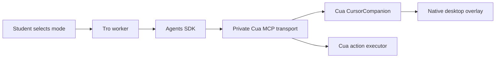

# Cursor companion

Tro's **Show me** mode asks Cua Driver to demonstrate a task while the student
controls the real pointer. The companion follows the pointer while idle and
approaches targets, progressively traces ordered circles, arrows, moves, selections,
click previews and drag previews, holds each cue, then clears it before moving on.
These visuals never synthesize input. **Do it for me** retains ordinary Cua actions.
Focusing an existing app window remains a separate, observed Cua action.

Typed and spoken instructions carry the selected mode and app language to the
worker. Voice capture snapshots both settings when recording is prepared, so
changing them during a capture affects the next instruction.

The teaching companion uses a compact white pointer about 12 × 13 logical points,
with a rounded blue outline and a proportionally scaled soft blue halo based on
the supplied cursor reference. Gesture marks and the Tro badge share its blue palette. The native vector painter scales with the
display's backing scale; the pointer tip remains the geometry hotspot. Click
previews draw a blue halo and drag previews slightly compress the pointer.

The native implementation extends pinned Cua 0.30.4 in
`driver-patches/CursorCompanion.patch`. Tro imports no sibling source and draws
no desktop overlay. `CuaCompanionClient` owns transport lifecycle and renews
Cua's lease; all pointer sampling, geometry, animation and rendering run natively.

## Using the local implementation

Run `pnpm build:cua`, then `pnpm dev:desktop`. The build checks a pinned source
commit, applies the patch in an isolated checkout, runs native companion tests,
and creates an ad-hoc signed app under `~/.cache/tro/cua-companion`. Development
selects it before the standard release cache. It uses a private socket and app
identity so it does not replace an independent Cua installation or its daemon.
macOS requires desktop permissions for this local app. Tro cannot grant them.
Permission checks use the private companion socket and verify its executable;
permission setup launches that same app bundle, including in development.
An independent CuaDriver installation's grants do not unlock the companion.

After sign-in and permission setup, select **Show me**, then ask, for example: “Circle the toolbar,
show an arrow toward the destination, then show me how to drag this item there.”
The agent observes the desktop and sends one ordered preview request.
The companion starts following after sign-in and verified desktop permissions,
even before the first instruction and regardless of the selected task mode.
Idle startup opens only the local Cua connection; it requests no model credential,
captures no screenshot and sends no model request. Main deduplicates startup and
releases that connection before admitting a credentialed task. Following pauses
while an execution task acts, then resumes when the task settles. **Stop** cancels
the task's native playback and returns to idle following. Sign-out and window close
end the worker and native lease.
You can move your real pointer to follow the guide. Clicking, typing or scrolling
stops the entire teaching task; send a new request to start another guide.

Packaging on macOS requires the matching native build. The packaging script
checks the patch and executable hashes before copying the app into resources.
No source checkout or Rust toolchain is needed by the installed app. Public
release signing and notarization remain release work.

## Current limits

The initial adapter supports the **macOS primary display**, including other apps
on that display. Windows, Linux and secondary displays have no teaching adapter
in this version. Normal execution remains available where the existing driver
supports it. Teaching fails clearly when its native tools are missing.

V2 sequences have 1–8 steps, 200–5000ms of tracing per step, and holds of
500–2000ms (default 1100ms). Approach, hold, fade and return all count toward
the 15-second sequence budget. The Tro badge hides during teaching.
They require a session-bound primary-desktop capture no more than five seconds
old at admission. Coordinates are normalized fractions of that capture; Cua
maps them to display points locally. Circle radius uses the shorter display edge.
There is one companion owner and one active sequence per native driver process,
with no pending gesture queue. Idle following uses a renewable 60-second lease.

The driver checks retained capture validity, display dimensions and student input
during playback. The five-second age limit applies at admission. It does not yet track semantic elements through programmatic scrolling
or moving windows; an application can change content without student input.
The agent must observe again before each sequence and after focusing an app.
Native overlay capture exclusion uses Cua's existing capture path.

Teaching mode exposes reviewed observation tools, previews and `bring_to_front`.
It excludes browser evaluation, keyboard/mouse input, launch and navigation.
Tab switching that requires input is left to the student until Cua exposes a
reviewed focus-only tab operation. The model cannot change task mode or native
session identity. V2 completion requires per-step rendered trace, complete cue and hold evidence,
plus a clear/return acknowledgment. Tro shows a typed teaching outcome and never
retries after takeover. Presentation cannot prove that the student performed the
demonstrated action. Old drivers do not silently downgrade Show me to V1.

See [CursorCompanionEngineering.md](CursorCompanionEngineering.md) for ownership,
protocol, cancellation and extension points.
