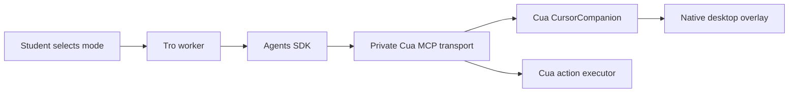

# Cursor companion

Tro's **Show me** mode asks Cua Driver to demonstrate a task while the student
controls the real pointer. The companion follows the pointer while idle and
plays ordered circles, arrows, moves, selections, click previews and drag previews.
These visuals never synthesize input. **Do it for me** retains ordinary Cua actions.
Focusing an existing app window remains a separate, observed Cua action.

Typed and spoken instructions carry the selected mode and app language to the
worker. Voice capture snapshots both settings when recording is prepared, so
changing them during a capture affects the next instruction.

The teaching companion uses a compact white pointer about 9 × 10 logical points,
with a rounded blue outline and a proportionally scaled soft blue halo based on
the supplied cursor reference. Gesture marks and
the Tro badge share its blue palette. The native vector painter scales with the
display's backing scale; the pointer tip remains the geometry hotspot. Click
previews add a blue pulse and drag previews slightly compress the pointer.

The native implementation extends pinned Cua 0.30.4 in
`driver-patches/CursorCompanion.patch`. Tro imports no sibling source and draws
no desktop overlay. `CuaCompanionClient` owns transport lifecycle and renews
Cua's lease; all pointer sampling, geometry, animation and rendering run natively.

## Using the local implementation

Run `pnpm build:cua`, then `pnpm dev:desktop`. The build checks a pinned source
commit, applies the patch in an isolated checkout, runs native companion tests,
and creates an ad-hoc signed app under `~/.cache/tro/cua-companion`. Development
selects it before the standard release cache. It uses a private socket and app
identity so it does not replace an independent Cua installation or its daemon.
macOS requires desktop permissions for this local app. Tro cannot grant them.
Permission checks use the private companion socket and verify its executable;
permission setup launches that same app bundle, including in development.
An independent CuaDriver installation's grants do not unlock the companion.

After sign-in and permission setup, select **Show me**, then ask, for example: “Circle the toolbar,
show an arrow toward the destination, then show me how to drag this item there.”
The agent observes the desktop and sends one ordered preview request.
The companion starts following after sign-in and verified desktop permissions,
even before the first instruction and regardless of the selected task mode.
Idle startup opens only the local Cua connection; it requests no model credential,
captures no screenshot and sends no model request. Main deduplicates startup and
releases that connection before admitting a credentialed task. Following pauses
while an execution task acts, then resumes when the task settles. **Stop** cancels
the task's native playback and returns to idle following. Sign-out and window close
end the worker and native lease.
Moving the real pointer, clicking, typing or scrolling also cancels playback.

Packaging on macOS requires the matching native build. The packaging script
checks the patch and executable hashes before copying the app into resources.
No source checkout or Rust toolchain is needed by the installed app. Public
release signing and notarization remain release work.

## Current limits

The initial adapter supports the **macOS primary display**, including other apps
on that display. Windows, Linux and secondary displays have no teaching adapter
in this version. Normal execution remains available where the existing driver
supports it. Teaching fails clearly when its native tools are missing.

Sequences have 1–8 steps, 200–5000ms per step and at most 15 seconds of animation.
They require a session-bound primary-desktop capture no more than five seconds
old at admission. Coordinates are normalized fractions of that capture; Cua
maps them to display points locally. Circle radius uses the shorter display edge.
There is one companion owner and one active sequence per native driver process,
with no pending gesture queue. Idle following uses a renewable 60-second lease.

The driver checks capture expiry, display dimensions and student input during
playback. It does not yet track semantic elements through programmatic scrolling
or moving windows; an application can change content without student input.
The agent must observe again before each sequence and after focusing an app.
Native overlay capture exclusion uses Cua's existing capture path.

Teaching mode exposes reviewed observation tools, previews and `bring_to_front`.
It excludes browser evaluation, keyboard/mouse input, launch and navigation.
Tab switching that requires input is left to the student until Cua exposes a
reviewed focus-only tab operation. The model cannot change task mode or native
session identity. Preview completion confirms a composited visual frame; it
cannot prove that the student performed the demonstrated action.

See [CursorCompanionEngineering.md](CursorCompanionEngineering.md) for ownership,
protocol, cancellation and extension points.

## Companion voice bar

The approved compact bar is 88 × 22 logical points (98 wide in Vietnamese), beneath the 9 × 10 pointer. Hold the existing voice shortcut or Talk button: it prepares the microphone, displays a live waveform once audio arrives, then transitions through transcription, sending and actual model/tool progress. Release remains the sole submit path; Escape cancels capture and Stop cancels the task. The bar is click-through.

Native presentation uses a separate utility process/connection so agent replacement and long gestures do not block the waveform. A bounded private cursor binding and renewable lease attach it only to Tro cursors. Presentation failures leave voice and workspace controls functional. Model limits are unchanged. macOS reduced motion is read at daemon startup. Rebuild with `pnpm build:cua`, restart the old companion daemon, then restart Tro to load this version. A changed local ad-hoc signature can require macOS to regrant CuaDriver permissions. See [CursorCompanionVoiceBarPlan.md](CursorCompanionVoiceBarPlan.md) for contracts, lifecycle and adapter details.
