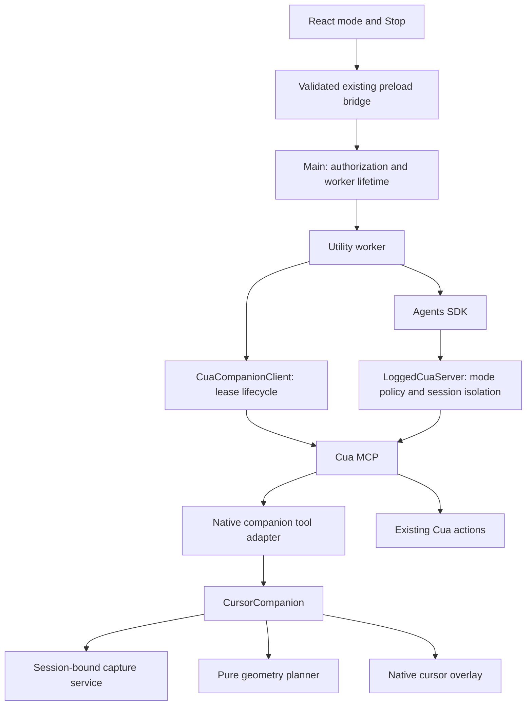

# Cursor companion engineering

## Ownership and dependencies

Cua Driver owns the presentation engine. Tro's worker is a client, and the
Agents SDK requests bounded teaching intent through the native MCP catalog.
The native `CursorCompanion` composes capture lookup and the existing overlay;
it imports no input executor. The pure geometry planner is in `cursor-overlay`.

`cursor-overlay` also owns the teaching appearance: a white vector pointer,
blue outline and radial blue glow. The native adapter selects it for following
and preview playback, then releases it when guidance ends. This host-owned
render flag preserves the installed Cua action theme across mode changes.
Rendering uses logical display points and the existing backing-scale transform.
The native `companion_preview` example renders the same compositor to PNG for
visual review without desktop permissions; it accepts an output path.



| Owner                     | Responsibility                                                                   |
| ------------------------- | -------------------------------------------------------------------------------- |
| Tro contracts             | Validated task mode across renderer, main and worker                             |
| `LoggedCuaServer`         | Filter tools and reject forbidden invocations, host controls and session aliases |
| `CuaCompanionClient`      | Start following, serialize renew/hide, cancel and release transport lease        |
| Cua contract crate        | Canonical bounded sequence DTOs and MCP schema                                   |
| Native `CursorCompanion`  | Capture admission, playback ordering and visible-frame receipt                   |
| Native companion state    | One owner, generation fencing, active sequence and follow lease                  |
| `cursor-overlay`          | Pure path generation, shared marks and compositing                               |
| Existing platform adapter | Primary-display geometry and pointer/input observation                           |

## Desktop composition

`src/desktop/main/companion/DesktopCompanion.ts` provides one application entry
point with `readonly cursor` and `readonly hud`. The cursor is an explicit port
to authenticated following through `AgentChatController`; the HUD is a focused
`CompanionHudController`. Voice and task events update `companion.hud` directly.

The facade checks platform, sign-in and desktop grants through an injected
access port before opening optional presentation. It waits for native HUD
registration before asking its cursor port to follow, so the new cursor can bind
to the existing private group. HUD startup failure does not prevent the cursor
from reporting its own result. A generation fences pending access/connection
work when voice is disabled, the user signs out or the window closes.

Composition does not merge transport lifetimes. `CompanionHudClient` owns the
persistent presentation worker; chat owns the shared cursor/task worker and its
authentication. `CuaCompanionClient` remains the task worker’s native gesture and
following adapter. Cua owns rendering, geometry and native leases. Future desktop
callers use the facade rather than coordinating separate HUD controllers and
clients in startup code. No new model tools or wire contracts are introduced.

## Native protocol

The patch adds `show_cursor_sequence`, `set_cursor_companion_mode`,
`cancel_cursor_sequence` and `get_cursor_companion_state`. Lifecycle mode calls
are host-only in Tro's advertised agent catalog. Session identity comes from
the private MCP transport; the model cannot choose another session or cursor.

Task turns carry both app locale and task mode through preload, main and the
worker. Spoken instructions snapshot these settings in the validated voice
prepare command and retain them until the transcript is submitted to the agent.

For example, after `get_desktop_state` returns a fresh `capture_id`:

```json
{
  "capture_id": "<capture returned by Cua>",
  "steps": [
    { "kind": "circle", "center": { "x": 0.3, "y": 0.4 }, "radius": 0.08, "duration_ms": 1200 },
    {
      "kind": "arrow",
      "from": { "x": 0.3, "y": 0.4 },
      "to": { "x": 0.7, "y": 0.6 },
      "duration_ms": 1000
    },
    {
      "kind": "move",
      "from": { "x": 0.3, "y": 0.4 },
      "to": { "x": 0.7, "y": 0.6 },
      "duration_ms": 800
    }
  ]
}
```

The same protocol supports `drag`, `selection` and `click`. Points are fractions
of the encoded desktop image; display-point geometry is computed natively.
Preview reads neither consume an action capture nor expose an input transform.
Native validation rejects nonfinite/out-of-range geometry, stale or foreign
captures, unsupported targets, excess steps, excess duration and ownership
conflicts before playback. Marks outside the primary display are refused.

Playback interpolates locally and sends bounded overlay commands. A dropped
command fails playback. At each step's endpoint the overlay acknowledges a
visible composite; an acceptance receipt alone is insufficient. Structured
results contain only bounded presentation status, `following` and `active`.
Tro validates successful preview completion separately from action evidence.

## Lifetime and cancellation

After sign-in and verified desktop permissions, React requests following through
a narrow validated preload operation. Main deduplicates requests and starts one
local utility worker. Idle startup opens Cua MCP without a model credential,
screenshot capture or model request. The worker refuses model turns in this state.
Before a task, main releases idle ownership and starts a credentialed task worker.
Stop cancels task playback and restores idle following; sign-out and window close
invalidate pending startup and end ownership.

Cua keeps one owner and one active sequence; overlap is refused rather than
queued. Every preview has a generation. Cancel or session teardown increments
it so stale work cannot clear newer marks. Student pointer movement beyond
12 points, keyboard/button/scroll input, display changes and capture expiry
stop playback. Completion or failure clears marks and pressed visuals, then
returns to pointer following if the lease remains enabled.

Before an execution task, Tro pauses native following and re-enables Cua's
existing action cursor. This prevents the idle pointer sampler from overriding
an executor animation or keeping its arrival wait from completing. Teaching
turns restore following; mode changes are serialized with lease renewals.

Following samples the pointer natively at about 30Hz with a visual offset.
Tro renews its 60-second lease every 15 seconds, with one pending renewal and
serialized mode changes. Disconnect/session cleanup and lease expiry hide the
owned overlay. The sampler used for guidance writes no pointer trace files.

The upstream stdio proxy processes calls serially, so a queued cancel cannot
preempt a blocked preview. Tro's Stop aborts the model run and closes its task MCP
transport immediately. The persistent native control socket then closes and
Cua marks the session as ending. Playback polls that stop signal before
cleanup hooks run; admitted work unwinds, then native cleanup removes its cursor. Model-issued cancel applies
between calls. Normal local cancellation can also happen through student input.

## Teaching authorization and evidence

Task mode comes from the existing sender-verified IPC path. In teaching mode,
Tro uses a reviewed exact-name allowlist for observations, presentation and
existing-window focus. Unknown tools are denied. Discovery annotations alone
are never authorization. Enforcement also runs immediately before invocation;
prompt instructions are only guidance. The native presentation engine itself
cannot synthesize desktop input. Other independent Cua clients remain governed
by their own native authorization and cannot be restricted by Tro's task mode.

A preview result, cursor-state read or configuration read cannot satisfy a
pending desktop-action observation. Focusing a window still requires a fresh
actual state observation. A failed preview remains failed unless playback
subsequently succeeds. No preview fallback injects input.

## Scaling and extension

Keep a modular native feature rather than a second service or event bus. A
bounded sequence amortizes SDK/model calls over a local timeline, and the
single owner prevents concurrent agents from producing competing guidance.
The renderer reuses Cua's existing native window and capture exclusion.

Add new gestures by extending canonical contracts, the pure planner and
shared painting, then platform capability declarations. Add Windows/Linux
adapters by supplying native geometry, pointer observation and lifecycle
admission; the renderer and planner remain shared. Add display-specific
coordinates and one overlay surface per display before advertising secondary
monitors. Do not interpret normalized coordinates against another display.

Semantic window/element anchors, scroll revisions, reduced-motion teaching
paths, speech synchronization and a focus-only tab tool are further work.
These must invalidate or re-resolve a target when its layout changes. Current
V1 cancels on student input and dimensions; it does not promise semantic
tracking through application-driven layout changes.

## Reproducible dependency and verification

`BuildCuaCompanion.ts` clones pinned upstream commit
`bf6c76786d938070f4ecf1e44004752f69f518b8` into a temporary sparse checkout,
applies `driver-patches/CursorCompanion.patch`, runs hermetic native companion
tests and builds a native executable. The local prerelease is `0.30.4-tro.1`.
It stages an ad-hoc signed app and records source commit, patch hash, executable
hash and architecture. It does not edit credentials or an independent install.
The separate Cua checkout used to develop the patch is not a runtime dependency.

Tests cover sequence limits/nonfinite input, path closure and arrow endpoints,
capture ownership/freshness without action consumption, owner cancellation,
visible-frame receipts, worker tool restrictions, preview-vs-action evidence,
renew/hide ordering and UI Stop discarding a late answer. Native GUI permission,
actual on-screen animation and packaged public release signing still need a
manual macOS smoke check. Windows/Linux native guidance is not implemented.
