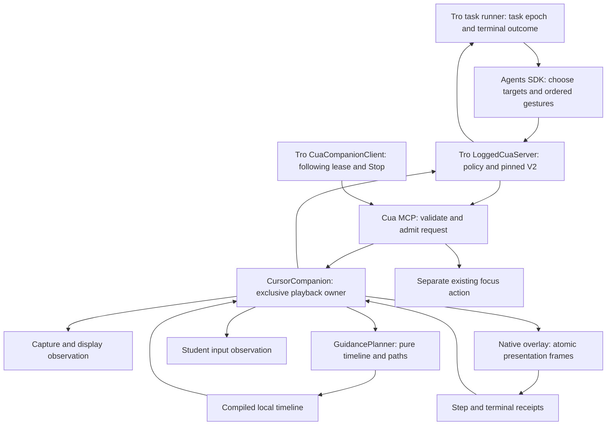
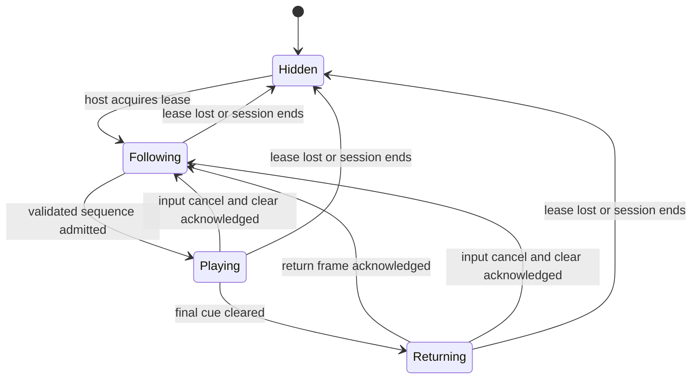

# Cursor companion guidance engineering specification

Status: V2 implementation added on October 1, 2026. The HTML interaction has
been reviewed. [CursorCompanionEngineering.md](CursorCompanionEngineering.md)
records the implemented modules and runtime limits. Native Pause/Resume and an
explicit explanation-only product mode remain deferred.

The desktop wiring uses Tro’s embedded Cua host from Electron main. Both idle
following and model-backed tasks receive its validated private MCP endpoint.
Permission checks and prompts belong to Tro (Electron in development), and the
companion build uses the embedded executable layout rather than a separately
launched native app.

Revision 2 incorporates findings A1–A4 from
[CursorCompanionAudit.md](CursorCompanionAudit.md). The audit is a historical
review of the earlier design; regression coverage now targets those findings.
Compositor receipts acknowledge CALayer image installation rather than physical
display scan-out. Live hardware presentation still requires a desktop smoke check.

## Product behavior and rules

The bright companion leads the student's attention across the desktop. The
student keeps control of the real cursor and can move it to follow the guide.
While idle, the companion follows beside that cursor. While teaching, it leaves
that position, approaches the target, traces a gesture, waits, clears the cue,
then proceeds to the next target. On normal completion it smoothly returns
beside the student's latest cursor position.

The presentation lifecycle is:

```text
approach → trace → hold → fade/clear → next step
                                     ↓ final step
                                  return → follow
```

The controller enforces these rules, independent of model instructions:

- There is one companion owner and one active sequence on the supported desktop.
- There is at most one active gesture mark. Retire it before the next step.
- The pointer tip follows the same path and progress as the visible trace.
- Passive pointer movement does not cancel guidance or pull the companion away
  from its gesture. The follower resumes only after guidance releases ownership.
- Click, drag initiation, key input, scroll, explicit Stop, session loss, invalid
  capture or changed display geometry cancel guidance and clear its marks.
- Click and drag gestures are visual previews. Presentation never posts input.
- App focus is a separate Cua action. Observe again after focus before guiding.
- Completion means that presentation finished, not that the student acted.
- A demonstration-required task needs positive native presentation evidence;
  absence of an error or unrelated desktop verification is insufficient.
- Student takeover is terminal for the current teaching task. Neither the model
  nor a repair continuation may replay it without a new user instruction.
- The host pins new teaching tasks to V2. Model omissions cannot select V1.
- Each gesture needs rendered cue and hold evidence, not just a final clear frame.

The small white/blue pointer and halo retain the current native size. Suppress
the floating Tro badge during teaching so it cannot cover the demonstrated
control; idle following can retain the badge. Keep geometry in logical display
points and scale artwork only in the renderer. Pointer size does not determine
gesture radius or target size.

## Ownership and code organization

Use composition inside Cua, not another Electron cursor class or a subclass of
the input executor. In the native Rust implementation, `CursorCompanion` is a
struct with methods: it is the equivalent of the proposed controller class.
Agent SDK and another authorized Cua caller use the same MCP boundary.



| Component                 | Owns                                                                                  | Does not own                                       |
| ------------------------- | ------------------------------------------------------------------------------------- | -------------------------------------------------- |
| Agents SDK                | Observing targets, requesting an ordered sequence, explaining the next student action | Per-frame motion, mark cleanup, ownership          |
| `ComputerUseTaskRunner`   | Task epoch, positive guidance evidence, typed task outcome and recovery eligibility   | Native motion or treating prose as execution proof |
| `LoggedCuaServer`         | Teaching tool policy, pinned V2, session/task isolation and validated receipts        | Native timing and drawing                          |
| `CuaCompanionClient`      | Local connection, following lease, task/session shutdown                              | Gesture plans or real pointer manipulation         |
| Cua MCP adapter           | Canonical request validation, capture resolution, version selection                   | Animation frames                                   |
| `CursorCompanion`         | Admission, cancellation, follower/playback handoff, terminal result                   | Input execution                                    |
| `GuidancePlanner`         | Pure geometry, phase durations, bounds and budget validation                          | OS calls, model calls, threads                     |
| Native overlay            | Applying a complete frame, compositing and visible-frame receipts                     | Choosing teaching goals                            |
| Existing platform adapter | Reading pointer/input, display geometry, capture validity                             | Gesture policy                                     |

Keep the modules inside the current driver and `cursor-overlay` crates. Do not
introduce a service, event bus, database, shared sibling source import, or an
independent desktop window. Tro continues to ship the pinned, patched driver.

Proposed internal Rust API sketch, not implementation code:

```rust
// Native application controller; presentation dependencies only.
impl CursorCompanion {
    // Trusted lifecycle operation; renewals do not begin a new task.
    fn begin_guidance_task(&self, task: &GuidanceTaskBinding);

    async fn show_sequence(
        &self,
        task: &GuidanceTaskBinding,
        request: ShowCursorSequenceInput,
    ) -> Result<PresentationResult, CompanionError>;

    fn cancel_guidance_task(&self, task: &GuidanceTaskBinding, reason: CancelReason);
    fn retire_session(&self, owner: &SessionBinding);
}

// Pure functions: inputs are already resolved to display points.
fn plan_guidance(
    steps: &[CompanionStep],
    start_tip: DisplayPoint,
    display: DisplayGeometry,
    profile: &GuidanceProfile,
) -> Result<GuidancePlan, PlanError>;

fn sample_guidance_phase(
    phase: &GuidancePhase,
    phase_elapsed: Duration,
    latest_student_tip: DisplayPoint,
) -> CompanionPose;

struct CompanionFrame {
    task_epoch: TaskEpoch,
    sequence_id: SequenceId,
    generation: u64,
    step_index: Option<usize>,
    phase: GuidancePhaseKind,
    frame_revision: u64,
    pose: CompanionPose,
}

struct CompanionPose {
    tip: DisplayPoint,
    mark: Option<VisibleMark>,
    appearance: CompanionAppearance,
    pressed_preview: bool,
    badge_visible: bool,
}
```

`GuidancePlan` holds immutable phases, nominal phase boundaries and bounded
paths. `VisibleMark` identifies the current step, path geometry, reveal progress
and opacity. It is one optional mark, rather than a collection that accumulates
shapes. The controller advances through phases using render evidence, then
stamps the sampled pose with task/sequence identity and a monotonic frame
revision before publication. Frames and per-step receipts are internal contracts;
the agent receives one compact sequence result, not per-frame events.

Use native enums for phases/errors. In Tro TypeScript, use the repository's
named `as const` objects and derive schemas/types from their canonical owners.
Do not copy native sequence schemas into a second TypeScript planner.

## MCP request and compatibility

Keep `show_cursor_sequence` as the request entry point. Add an explicit
`presentation_version: 2` for guided choreography. Tro negotiates capabilities
and pins version 2 in trusted task context before the model runs. Its advertised
teaching schema requires the literal value `2`; `LoggedCuaServer` also rejects
missing, different or unknown versions before dispatch. Do not silently inject
V2 into a request whose arguments were built for another version.

Requests without the field retain V1 semantics only for explicitly legacy Cua
clients. They cannot enter a V2-required Tro task. Capability support and request
version enforcement are separate checks. Native admission checks the request
against the bound task version too; prompts do not enforce protocol selection.
Discovery must describe the selected version and timing fields accurately.

Proposed V2 request after a fresh desktop observation:

```json
{
  "presentation_version": 2,
  "capture_id": "<exact capture ID returned by Cua>",
  "steps": [
    {
      "kind": "circle",
      "center": { "x": 0.72, "y": 0.42 },
      "radius": 0.05,
      "duration_ms": 1800,
      "hold_ms": 1100
    },
    {
      "kind": "arrow",
      "from": { "x": 0.6, "y": 0.4 },
      "to": { "x": 0.73, "y": 0.25 },
      "duration_ms": 1200,
      "hold_ms": 1100
    }
  ]
}
```

In V2, `duration_ms` specifies gesture trace time; `hold_ms` is optional and
defaults to 1100ms. Approach, fade and final return are inserted by Cua. The
model does not send extra move steps to connect each gesture or return home.
An explicit `move` step remains supported when movement itself is the lesson.
It leaves no mark and still respects the step lifecycle. Defaults for other
gesture kinds are defined with the native motion profile, not hidden in prompts.

Preserve existing normalized coordinates and the circle-radius unit: radius is
a fraction of the shorter capture edge. Cua resolves them against the admitted
capture's display mapping. Validate the whole shape, arrowhead and pointer
trajectory before the first visible frame; reject invalid targets rather than
silently changing the lesson by clamping gesture geometry.

Preserve 1–8 requested steps and the 200–5000ms trace range. Proposed holds are
500–2000ms. The existing 15-second presentation budget applies to the **entire
compiled timeline**, including approach, hold, fade and return. Reject plans
that exceed it with a clear budget error; do not silently accelerate or omit
steps. These are local presentation bounds, unrelated to model request counts.

Add a read-only `get_cursor_companion_capabilities` tool reporting supported
presentation versions, gestures, primary-display scope and timing limits.
Tro checks capability support on connection, before admitting a V2 teaching
task. An old driver produces an explicit unsupported-version result, not a
quiet fallback to different choreography. Keep the existing V1 state/completion
schema unchanged. V2 sequence results use a distinct canonical schema with the
existing base fields plus a typed receipt; update Tro's sequence validator rather
than passing expanded V2 results through the old strict state schema.

Proposed successful V2 result:

```json
{
  "status": "completed",
  "following": true,
  "active": false,
  "receipt": {
    "presentation_version": 2,
    "task_epoch": "<host-bound task ID>",
    "sequence_id": "<native-generated sequence ID>",
    "completed_steps": 2
  }
}
```

Native produces this receipt only after every admitted step satisfies the render
rules and the terminal frame is acknowledged. Tro validates the task epoch,
sequence identity, negotiated version, expected step count and inactive terminal
state before recording it as positive guidance evidence. State reads, accepted
requests, metadata and final model prose cannot create receipts. An unrelated
sequence or task cannot satisfy the current request.

Cancellation returns an MCP error with a typed structured result:
`status: canceled`, task/sequence identity, `reason` and the settled base state.
Reasons distinguish student takeover, explicit Stop, session loss, lease expiry
and target invalidation. Failures use `status: failed` with bounded codes such
as unsupported version, invalid geometry, busy or render timeout. Admission
failures have no sequence ID; task identity is still checked. Preserve these
envelopes through the SDK wrapper; never infer retry eligibility from prose.

The model cannot select session identity, task epoch, sequence ID, owner,
appearance, cancellation policy or resource limits. Tro removes these fields
from discovery and rejects caller overrides. Trusted transport metadata binds
the task; it is not inferred from model text or screenshot content. Reserve
task-begin/end and mode changes for host lifecycle calls. Renewing the following
lease never resets a canceled task or assigns a new epoch.

### Trusted task lifecycle

Add host-only `begin_cursor_guidance_task` and `end_cursor_guidance_task`
operations to the native contract. Hide them from the model and reject agent
invocation in `CuaTeachingPolicy`. `CuaCompanionClient` begins the admitted task
with its host-generated epoch and pinned version before the initial SDK run.
Native binds that context to the private session and rejects sequence requests
without the matching live task. Legacy clients continue through their separate
V1 path. Capabilities must declare the V2 task lifecycle as well as V2 playback.

End-task releases task state and visual ownership after its terminal result;
it does not turn normal completion into cancellation or create another task.
Replace the current unconditional teaching `finally` cancel with this explicit
finalization operation. Duplicate begin for the same epoch is idempotent and
never resets its terminal latch. End-task is epoch-scoped and idempotent; a late
end cannot clear a new task. A new epoch is admitted only after the prior task's
cleanup barrier has settled. Following lease renewals remain separate calls.

## Timeline and rendering

Use one monotonic local clock. Compile paths and phase boundaries once, then
sample the active phase using its elapsed time; do not ask the model to provide
animation frames. Within a phase, frame skips advance to the current time rather
than building a backlog. Phase transitions also require the rendered evidence
below: elapsed time alone cannot skip an unacknowledged trace or hold. Keep a
separate whole-sequence watchdog that never resets at phase transitions.

| Phase    | Proposed behavior                                                                       |
| -------- | --------------------------------------------------------------------------------------- |
| Approach | Smooth travel from the actual companion tip to the gesture's start; no mark             |
| Trace    | Advance the tip along the path and reveal only the portion already traced               |
| Hold     | Keep the completed cue and tip still for the requested compositor-observed reading time |
| Fade     | Fade the current mark over 350ms, then remove it before any next gesture                |
| Return   | Travel beside the latest student cursor over 700ms; leave no mark                       |
| Follow   | Restore the existing native offset-following sampler                                    |

Approach duration is distance-based: initially use 900 logical points/second,
bounded to 250–1200ms. Skip approach for an already coincident start. These values
belong in a native `GuidanceProfile` and should be tuned with the desktop smoke
check, not offered as arbitrary agent controls.

The circle ends where it starts. Arrow tracing reveals its shaft, then its
head near completion. Selection traces the rectangle; a drag moves along its
path with visual pressed feedback; a click stays at the target and pulses.
All kinds use the same lifecycle and clear pressed feedback before proceeding.
Sample geometric paths by distance so differently spaced vertices do not
create accidental speed changes. Easing and reduced-motion treatment are
profile decisions shared across gestures.

The planner snapshots the actual tip at admission. Each approach starts from
the previous phase endpoint, preventing teleportation between gestures. During
return, sample the latest student position, bound the destination to the
supported surface, and hand the actual final tip to following. The idle sampler
must not resume from an older cached pose. Smooth that handoff if the student
keeps moving. Reduced motion suppresses travel/trace animation but retains a
readable cue, hold and ordered cleanup.

Publish one atomic frame containing pointer, mark, pressed state and badge
visibility. Replace the current mark through that frame; do not independently
enqueue pointer and mark mutations that can expose mismatched intermediate
states. The overlay scales logical points to backing pixels exactly once.

Use bounded path storage (initially at most 512 vertices per gesture) and one
latest-frame slot per supported surface. Coalesce ordinary updates when the
renderer falls behind. Cue endpoints, phase barriers, clear, hide and receipts are reliable
control operations and cannot be dropped as ordinary frames. A rendering fault
ends the sequence; it never falls back to real mouse or keyboard input.

### Per-step presentation evidence

Receipts identify task epoch, sequence, generation, step, phase, frame revision
and compositor monotonic time. The controller rejects foreign, stale or
out-of-order receipts. This evidence is local and bounded to the current plan;
do not stream it through MCP or persist a pointer trace.
Controller and compositor timestamps use the same native monotonic clock domain,
so hold evidence never depends on wall-clock time or network timestamps.

For every ordinary-motion gesture, require an acknowledged intermediate trace
pose with progress strictly between zero and one, followed by its acknowledged
complete cue at progress one. The renderer tracks acknowledged presentation
gaps during trace. The initial maximum permitted gap is 150ms, including the
time to its first visible trace frame. Exceeding that gap fails and clears the
sequence; a single final pose cannot stand in for a traced gesture. Tune the
threshold with native smoke checks and keep it host-owned in `GuidanceProfile`.

Hold starts at the compositor's timestamp for the complete cue, not at enqueue
time. Keep that step's scene installed for the requested `hold_ms`; a reliable
hold-end barrier confirms the same cue remained active with an available render
surface. If it was replaced, hidden, invalidated or canceled, the hold fails.
A reduced-motion profile may omit intermediate tracing evidence, but still
requires the completed cue and full observed hold. A move has no mark; its
acknowledged pointer trajectory and held endpoint are its presentation evidence.

Only after that hold evidence may fade/clear retire the step and approach the
next one. Coalescing is allowed within a phase, but cannot advance across these
barriers. A stall that loses an entire trace/hold never becomes successful
playback. A delayed cue can be held only within the existing whole-sequence
watchdog; do not shorten its hold, extend the watchdog or replay automatically.

## State, cancellation and completion



Sequence phase is separate from ownership state. `Playing` contains approach,
trace, hold and fade; `Returning` still owns playback. The follower can observe
the student position throughout, but cannot write presentation frames until
playback releases ownership. If following is disabled, completion/cancellation
clears and hides instead of returning to `Following`.

Native admission validates the request, session-bound capture, display mapping,
complete plan and timeline budget before changing visible state. Under the
ownership lock, read the latest published companion tip, finish the bounded
pure plan and commit exclusive playback with a generation. Do not await OS or
renderer work while holding that lock. If plan validation fails, leave following
in control. Retain the last published pose in native state so the admission
snapshot cannot race the follower into an older start position. Busy
requests fail immediately; they are not queued against stale screenshots.

Every published frame and control receipt is tagged with owner/generation.
Cancellation invalidates that generation and the renderer fence before clearing
the scene. The renderer also rejects queued frames from an old generation;
checking only before enqueue is insufficient. A late frame or receipt cannot
restore an old mark, move the pointer or clear a newer sequence.

Normal completion fades the cue and returns smoothly. Student takeover clears
immediately and releases playback; it does not play another long return lesson.
Sign-out, session loss and lease expiry clear and hide. Commit the terminal
outcome exactly once. A canceled or interrupted lesson cannot report completed.

The host assigns one new task epoch for each admitted user instruction. Each
epoch can contain several sequential requests, but native student takeover
latches the **whole task** as canceled, not just its active sequence. Further
presentation calls for that epoch are refused, even if the model retries before
Tro processes the cancellation result. An empty cancel between sequences also
latches the bound task when invoked as takeover/Stop. Only a trusted new-task
operation for a new user instruction can admit another epoch.

Tro mirrors that terminal latch before returning a cancellation result to the
SDK, aborts any remaining model work, and maps it to a typed canceled task
outcome. A model's subsequent call, late answer or generic recovery run cannot
restart guidance or relabel the task as demonstrated. Keep normal following
available after student takeover; terminal teaching state is separate from the
following lease. Do not use task-finalization cleanup to re-admit the old epoch.

Retain the five-second capture freshness requirement at admission and the
current capture/session validity checks during playback. Age at admission and
capture retention are distinct: do not expire a valid 15-second timeline merely
because its capture passes five seconds of age. Any loss of capture validity or
changed display geometry still cancels. After takeover/focus/layout changes,
the next sequence needs a new observation. Coordinate V2 does not promise to
track semantic elements through app-driven scrolling or window movement.

Passive pointer movement is removed from V2's cancellation predicate. Keep
keyboard, button and scroll observation; do not treat moving to inspect a cue
as user takeover. OS observations cannot reliably distinguish every other
app's synthetic input from human input, so conservatively cancel on these
events and never claim that their source is proven.

The current stdio proxy serializes tool calls. A `cancel_cursor_sequence` call
queued behind playback cannot interrupt it. Preserve Tro's existing Stop path:
abort the SDK run and close the task transport, which makes native playback
observe session shutdown and clean up. Do not design pause/Stop around a second
tool call on the blocked channel. Native Pause/Resume is deferred; the HTML
buttons are review controls. Adding native pause later requires an interruptible
host control path, bounded pause lifetime and target revalidation.

Return `completed` only after every step's trace/cue and hold evidence is
satisfied, the final cue is cleared, and the terminal return/hide frame is
acknowledged by the compositor. Keep `active` true until
that boundary. Include acknowledgement time in a bounded overall watchdog:
initially the compiled duration plus two seconds. If acknowledgement fails,
attempt cleanup and report failure. A compositor receipt proves presentation
was processed, not student attention or task completion.

## Agent task outcomes and recovery

Replace the current absence-of-error teaching completion rule with positive
evidence. Teaching task context has a trusted `guidance_requirement` and pinned
version; `required` is the default for Show me. An explanation-only path must
be explicitly admitted by host context, not selected by a model that wants to
avoid demonstration. Do not force a preview for a clarification or pretend
that answering an explanatory question demonstrates a requested action.

Separate evidence records inside `CuaTaskEvidence`:

- Guidance: current task epoch, admitted sequence requests, successful validated
  receipts, pending/failed requests and terminal cancellation.
- Desktop actions: focus/action results, required fresh observations and actual
  verification outcomes.

`verify_state: satisfied` affects desktop verification only. It cannot clear a
guidance failure, supply a missing receipt or reverse cancellation. An unrelated
preview cannot erase a failed obligation; this revision permits no automatic
retry. Finalization also requires no pending presentation. Each recorded native
sequence belongs to the host's task/call identity, not an ID invented by the model.

Define typed teaching outcomes at the worker/main/preload/UI boundary, separate
from existing execution-task completion. Proposed outcomes are `demonstrated`,
`explained`, `needs_input`, `canceled` and `failed`, owned by canonical contract
constants/schemas. The model may propose an answer category; the host determines
the allowed outcome from context, evidence and terminal state.

| Outcome        | Host condition                                                                                                                           | User-visible meaning                                                              |
| -------------- | ---------------------------------------------------------------------------------------------------------------------------------------- | --------------------------------------------------------------------------------- |
| `demonstrated` | Required obligations have valid V2 receipts, at least one sequence completed, no pending/failing obligation and no terminal cancellation | The visual guide finished; the student action is not verified                     |
| `explained`    | Explicit explanation-only host context, no failed/pending guide and no cancellation                                                      | An explanation was supplied; nothing was demonstrated                             |
| `needs_input`  | Clarification, unavailable target or missing demonstration evidence; no terminal cancellation                                            | The requested demonstration did not finish; another student instruction is needed |
| `canceled`     | Takeover, Stop, session loss, lease expiry or target invalidation latched the task                                                       | Guidance ended; no automatic replay                                               |
| `failed`       | Validation, transport or render failure with no admitted recovery or successful resolution                                               | Guidance could not be completed                                                   |

Apply precedence: cancellation first, unresolved failures next, then validated
demonstration; explanation/needs-input are explicit non-demonstration paths.
A no-tool or observation-only model run cannot become `demonstrated`. For a
required task, prose alone yields `needs_input` or `failed`; it cannot silently
downgrade to `explained`. Render the typed outcome in Tro independently of the
model's prose. Never show an unconditional completed label for every answer.
For a required task without evidence, or any canceled/failed task, show a
deterministic truthful status and suppress final model prose rather than trying
to detect success claims in natural language or running a repair model. Explicit
explanation-only context may display its explanatory answer with that label.
A demonstrated task may pass through the final answer after evidence validation;
the receipt still does not prove semantic target correctness or student action.

Do not reuse `askAgentToFinishTask` for teaching. V2 teaching has **no automatic
model continuation or presentation retry in this revision**. All cancellations,
busy, stale capture, unsupported version, invalid geometry and render failures
settle the task without calling the model again. Normal successful sequencing
and observation may continue within the initial SDK run. Failure latches task
presentation admission before returning the tool result, so the same run cannot
quietly retry either. Recovering/replaying needs a new user instruction and
fresh capture. Execution-mode recovery remains a separate policy.

If automatic teaching recovery is introduced later, define typed recoverable
reasons, task/obligation binding, fresh-observation admission, a fixed retry
budget and user-visible retry status first. It must never recover takeover or
Stop. Separate teaching instructions from execution instructions instead of
appending conflicting action/recovery guidance.

## Scaling and implementation plan

Scaling means keeping local work bounded and adding gestures/platforms without
duplicating orchestration. One fresh observation and one sequence request serve
several gestures. Animate locally at up to the existing roughly 60Hz; idle
following stays around 30Hz. Do not send per-frame IPC, MCP, network requests,
telemetry or screenshots. Record only bounded outcomes, reasons and durations;
do not log paths, captures, screen content or student pointer traces.

Multiple requesting agents share the exclusive desktop owner and receive busy
results. They do not get separate competing overlays or a queue. For future
multi-display support, introduce explicit captured display identity and mapping,
then one render surface per display while retaining one sequence coordinator.
Do not reinterpret a primary-display capture on another monitor. Platform
adapters supply surfaces, input observation and geometry; the planner stays pure.

| Change area                                                     | Planned change                                                                                                                         |
| --------------------------------------------------------------- | -------------------------------------------------------------------------------------------------------------------------------------- |
| `src/contracts/AgentSession.ts` and `CursorCompanion.ts`        | Typed teaching outcomes, V2 sequence receipts/errors and capabilities; preserve execution/V1 contracts                                 |
| `CuaTaskEvidence.ts` / `ComputerUseTaskRunner.ts`               | Independent positive guidance evidence, task epoch, terminal latch, deterministic result mapping and no teaching recovery continuation |
| `LoggedCuaServer.ts` / `CuaTeachingPolicy.ts`                   | Literal-V2 schema and dispatch enforcement, override rejection, typed result validation and task-scoped admission fence                |
| Native contract crate in `driver-patches/CursorCompanion.patch` | V2 timing fields, task lifecycle, receipt/error/version/capability schemas and bounded validation                                      |
| Native `cursor-overlay` companion module                        | Pure `GuidancePlan`, phase sampling, path reveal and profile                                                                           |
| Native overlay render state and commands                        | Atomic frame, optional current mark, fade, identity/revision fencing, per-step render/hold evidence and reliable terminal receipts     |
| Native platform companion controller                            | Task-scoped terminal admission, evidence-gated phases, V2 input policy, watchdog, capture checks and smooth follower handoff           |
| `CuaCompanionClient.ts` / `StartAgentWorker.ts`                 | Capability admission, begin/end task binding, cancel/failure propagation and retained lease/Stop lifecycle                             |
| Main, preload, renderer and voice result consumers              | Validate and display typed teaching outcomes; no generic completed label or unsupported final prose on an incomplete guide             |
| `ComputerUseInstructions.ts` / `CreateComputerUseAgent.ts`      | Separate mode instructions; request V2 without redundant connecting move steps or execution-mode recovery text                         |
| Tro tests/build docs                                            | Contract/evidence compatibility, pinned patch build and documented supported behavior                                                  |

Implement in that order, completing the whole change before final validation.
Keep old V1 behavior explicitly isolated; update product docs to describe V2
only when it is actually the shipped teaching mode. No renderer cursor engine
or new arbitrary preload method is needed.

Acceptance tests use a fake clock, fake observation ports and a fake compositor
without model credentials or native permissions:

1. The circle prefix and pointer tip agree at several intermediate times; the
   arrow is not visible before its trace starts.
2. Circle/hold/fade/arrow never show two marks. Safe coalescing within phases
   clears the prior mark; skipping an unobserved trace or hold fails and clears
   rather than completing. Pause is not needed to establish this.
3. A new step approaches from the previous actual endpoint. Return uses the
   latest real cursor position and does not jump on follower handoff.
4. Pointer movement keeps V2 playing; click/key/scroll, Stop, invalid capture,
   changed display and session loss produce the specified terminal state.
5. Cancel during approach, trace, hold, fade and return rejects late frames and
   receipts. Lease loss hides; no old-generation cleanup erases a new sequence.
6. A concurrent/foreign owner cannot start or cancel playback. Busy has no queue.
7. Full compiled duration includes automatic phases; invalid paths and excess
   budgets fail before any scene change. V1 requests retain their old contract.
8. Atomic-frame coalescing preserves reliable clear/hide receipts. A missing
   terminal acknowledgement fails rather than reporting completed.
9. Tro rejects unsupported V2 drivers; teaching cannot invoke input tools or
   spoof session identity; failed preview does not satisfy action evidence.
10. No-tool/observation-only runs cannot produce `demonstrated`; failed guidance
    plus `verify_state: satisfied` remains failed. Positive receipts are bound
    to the current task/call, expected step count and negotiated version.
11. Takeover in every phase prevents further native and SDK presentation calls
    for that task. Assert no recovery `run`, no silent retry in the initial run,
    no late demonstrated answer and no epoch reset through a lease renewal.
12. Missing/wrong/unknown request versions fail in trusted Tro dispatch and
    native task admission. Legacy V1 remains explicit and isolated.
13. Whole-phase loss, missing intermediate trace receipts, gaps over 150ms,
    replaced cues and insufficient compositor-observed holds fail. Reduced
    motion skips only intermediate trace evidence. A terminal-only receipt is
    insufficient; delayed barriers cannot extend the overall watchdog.
14. Typed teaching outcomes round-trip across worker/main/preload and typed or
    spoken UI flows. A canceled/failed/required-but-unshown guide suppresses
    unsupported model prose. Explicit explanation context is labeled explained.
15. Duplicate begin/end, late old-epoch cleanup and ordinary lease renewal do
    not reset terminal tasks, alter newer ownership or cancel normal completion.

Then run the repository lint, format, typecheck, unit, build and integration
checks plus the isolated native tests. Manually verify on the primary macOS
display across Tro and another app: small cursor appearance, progressive trace,
one cue, readable hold, student following, takeover, Stop, sign-out and capture
exclusion. Windows/Linux and secondary-display guidance remain later adapters.

## Decisions for this revision

Keep Cua as the authority; add a pure planner through composition. Make guided
choreography host-pinned to V2, clear cues automatically, and allow passive student
movement. Require independent positive task evidence and per-step render/hold
receipts. Make takeover terminal through every layer; disable automatic teaching
recovery. Keep local presentation limits and exclusive ownership. Defer native
pause, semantic element tracking, speech-synchronized timelines and multi-display
guidance until their control/target contracts exist. These extensions should not
change the basic SDK → MCP → companion controller ownership path.

| Audit finding                          | Design resolution                                                         | Implementation evidence required         |
| -------------------------------------- | ------------------------------------------------------------------------- | ---------------------------------------- |
| A1: Missing positive guidance evidence | Independent task-bound receipts and typed non-demonstration outcomes      | Evidence tracker and outcome tests 10/14 |
| A2: Replay after takeover              | Native/host task-epoch latch, explicit finalization and no teaching retry | Cancellation/finalization tests 11/15    |
| A3: Omitted V2 selects legacy          | Trusted version pin, literal schema and native task admission             | Compatibility test 12                    |
| A4: Skipped cue still completes        | Per-step trace/cue/hold receipts, stall threshold and fixed watchdog      | Fake-clock/compositor test 13            |

The audit remains a historical report of the previous draft. The implementation
and regression coverage address A1–A4; the complete acceptance list above also
includes hardware checks that automated tests alone cannot establish.
