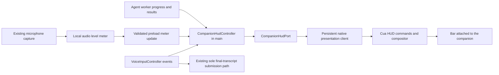

# Companion voice bar plan

Status: implemented in source, October 1, 2026. The approved HTML prototype established an 88 × 22 point bar. See CursorCompanion.md for runtime setup and verification limits.

## Intended experience

A small dark pill sits beneath the desktop companion while a voice instruction is active. It has a thin blue border, rounded ends and a compact microphone or status icon, matching the supplied references. Keep the companion at its requested size; the bar has its own readable dimensions.

Use the existing hold-to-talk shortcut and Talk button. Releasing stops the microphone, finalizes transcription and submits the final instruction once. The bar changes continuously into task progress without disappearing between stages. The existing workspace remains the place for full transcripts, answers and permission recovery.

The first version is a passive, click-through indicator. Release submits; Escape cancels capture, and Stop in the workspace cancels tasks. Submission retains the existing both-modifiers-released admission rule.

| Actual state                           | Bar content                                       | Transition                                               |
| -------------------------------------- | ------------------------------------------------- | -------------------------------------------------------- |
| Idle                                   | Bar hidden; companion follows normally            | No idle animation                                        |
| Preparing microphone                   | Microphone and “Preparing…”                       | Fade and expand from the same anchor                     |
| Capturing speech                       | Microphone and 12–16 live waveform bars           | Audio-driven bars grow from a quiet baseline             |
| Released, waiting for final text       | “Transcribing…” and restrained activity indicator | Waveform settles and crossfades into the label           |
| Final accepted, task admission pending | “Sending…”                                        | Keep the pill visible; update its content                |
| Waiting for model response             | “Thinking…” and soft dots                         | Smooth crossfade within the same pill                    |
| Demonstrating or executing a tool      | “Showing…” or “Working…”                          | Follow real task progress, including returns to thinking |
| Completed                              | Brief checkmark and “Done”                        | Hold about 650 ms, then fade the bar away                |
| Failed                                 | Short, useful error label                         | Stay visible briefly; keep details in the workspace      |
| Capture canceled                       | Brief “Canceled”                                  | Clear waveform immediately, then fade away               |

English and Vietnamese labels use the existing capture/task locale. The waveform represents microphone level, not transcription confidence. Silence stays quiet; a disabled or unopened microphone must never look like active listening.

## Layout and motion

Use the approved 88 × 22 logical-point pill (98 points wide for Vietnamese labels). Place it 6 points below the 10-point companion silhouette and center it beneath the pointer body. The native compositor owns both positions; Electron does not sample the system cursor or reposition a second window every frame.

Clamp the complete cursor-and-bar layout to the primary display with an 8-point margin. Near the bottom, move the bar above the companion; use a small hysteresis margin to avoid repeated flipping. Keep it clear of the real cursor hotspot so underlying controls remain usable. While teaching gestures play, attach to the companion's displayed position; while following, attach to its followed position. During ordinary Cua actions, attach to the bound Tro action cursor.

Use about 180 ms for opacity and content crossfades, with an ease-out curve. Animate the container and its content as one continuing surface. Interpolate waveform height locally with a quick attack and slower decay; meter updates should not reposition the pill. Interrupt a transition from its current visual value when a newer state arrives, rather than queuing animations.

Do not delay transcription or submission to finish an animation. Fast “Sending…” states may merge visually into “Thinking…”, while the actual events still occur in order. Thinking persists until an actual progress or result event arrives. Respect reduced motion: static status icon and text, short opacity changes, and no repeating bounce or pulse.

## Ownership and runtime path

Tro owns capture, submission and task lifecycle. Cua owns the desktop surface, attachment geometry, waveform painting and animation. The Agents SDK does not decide microphone state or animate UI frames.

`DesktopCompanion` composes `this.cursor` and `this.hud` in Electron main. Its cursor port delegates following to `AgentChatController`, which continues to own authentication and the shared cursor/task worker. The facade owns the independent presentation connection, checks native presentation access and starts it before cursor binding. Disposal fences pending startup and clears the HUD without disposing the shared task worker; main still tears down chat separately.

`CompanionHudController` uses an explicit `CompanionHudPort`. It reduces typed capture and task events into presentation snapshots. It receives no model credentials or audio bytes. The presentation port and clock are injected for deterministic lifecycle tests; native transport runs in its own utility process.

`CompanionHudClient` implements the facade’s `CompanionPresentationPort` with a persistent, asynchronous Cua presentation connection for the signed-in window lifetime. This connection is separate from the task worker's serial MCP connection, but both receive the same main-owned embedded endpoint. Task-worker disposal closes its session without stopping the shared host. Main stops the host at quit; sign-out and window close dispose both worker sessions. The current worker is replaced between idle following and credentialed tasks, and its stdio proxy can block during a teaching sequence; neither should erase or stall the bar. Reuse the native compositor and daemon rather than introducing another service or Electron overlay window.

Extend Cua with bounded host presentation commands for setting HUD phase, updating meter levels and clearing the HUD. Keep these commands out of the model's tool catalog and enforce that restriction at invocation. The HUD has its own lease and must be explicitly bound to Tro's cursor sessions through private host registration, so another Cua client's cursor cannot acquire this bar. HUD ownership must not cancel or steal gesture ownership.

Maintain a cached latest snapshot in main. After an allowed transport reconnect or task cursor handoff, restore only that current snapshot and binding. Do not replay old listening states or start microphone capture from a presentation acknowledgment. If the overlay is unavailable, the existing workspace voice controls continue working.

## Audio meter and event contracts

Compute a normalized RMS level from the existing local PCM frames in the renderer before they enter the transcription queue. This provides live feedback even while the relay is connecting. Use a focused meter helper; do not open a second microphone or audio context.

Add one narrow preload method such as `updateVoiceMeter`, validated with capture UUID, monotonic sequence and finite level between 0 and 1. Main verifies the trusted sender and current capture identity. Accept updates only while the physical capture is active; release immediately fences subsequent meter updates, including queued flush frames. Emit at most 20 updates per second and keep only the newest pending value. Native painting interpolates between updates; it does not require one IPC message per screen frame.

The meter is optional presentation data. A slow or failed HUD connection must not block PCM delivery, tail flush or transcript submission. Levels, PCM and transcript text do not enter ordinary logs, and the HUD needs no additional cloud call.

Add named `as const` phase values and canonical Zod schemas in `src/contracts/CompanionHud.ts`. Use capture identity, task identity and a generation/sequence to fence late events. Validate the equivalent native contract at the daemon boundary. Keep the HUD's presentation phase separate from the existing voice state; currently `VoiceState.RUNNING` covers admission and the whole task, so it cannot alone distinguish sending, thinking and working.

Add typed agent progress events at observable boundaries: model request started, tool execution started/finished and task result. These expose coarse progress only, without internal reasoning or tool arguments. Emit task admission progress from the existing chat controller. A final transcript still submits exclusively through `VoiceInputController`; a completion animation must never submit it again.

Classify known failures at their owning boundary. For example, a gateway that reports a daily model allowance should show “Daily limit reached”, rather than suggesting desktop permissions are missing. This plan does not raise limits or reset usage. A checkmark means a completed task result, not merely successful transcription or submission.

## Implementation sequence

1. Build a native visual preview of the pill and all states, including edge placement and reduced motion. Review its size, blue outline and transitions without microphone or model calls.
2. Add HUD contracts, the controller/port, persistent presentation adapter and native lease/session binding. Verify reconnect and cursor handoff continuity.
3. Connect the existing microphone capture to the bounded local meter, and feed real voice lifecycle events into the controller. Verify release, final tail and exactly-once submission.
4. Add admission/model/tool progress and specific known error presentation. Connect both voice task modes without changing their action policy.
5. Run final repository and native checks, then smoke-test on the primary macOS display, including use from another foreground app.

## Acceptance and verification

The bar must remain continuous through release, transcription and worker handoff; its state must reflect current events. Quick holds, silence, empty finals, cancel during setup/finalization, stale callbacks, duplicate finals, permission denial, overlay disconnect, sign-out, sleep and window close cannot leave a listening indicator stuck or submit a second task.

Use fake audio levels, fake clocks and task/provider doubles for controller and bridge tests. Native tests cover layout, bounds, independent ownership, monotonic updates and state rendering at 1×/2× backing scale. Verify that meter backpressure never delays audio flush and that presentation failure leaves voice functional. Then run lint, formatting, typecheck, unit tests, native companion tests, build and disposable database integration checks after the implementation is complete.

Manual checks cover the real waveform, smooth transitions, reduced motion, screen edges, primary-display bounds and background-app use. Paid transcription/model runs require the existing authorized live testing scope; visual previews need no model calls. Windows and secondary-display HUD support remain outside the first native adapter, with the existing workspace voice UI as fallback.

## Implemented adapter details

`CompanionHudClient` keeps a separate utility process and MCP connection, with one update in flight and a single latest snapshot. It renews a native 25-second lease every 5 seconds and bounds reconnect attempts to three. A random group capability is passed privately to the agent worker; native cursor registration requires this group, keeps at most eight bindings, and never changes gesture ownership. Native session/runtime teardown clears the HUD immediately. The compositor paints the pill once at the newest visible bound Tro cursor and uses the same tiny pointer at the followed hardware position during handoff. It does not attach to unrelated cursor sessions. Tro's registered cursors suppress the existing session badge to avoid overlapping pills.

`VoiceLevelMeter` reads existing PCM before relay queuing, sends at most 20 levels per second through validated sender-checked IPC, and stops before tail flush. The main controller fences capture identity, meter sequence and task identity. Preparing becomes listening only after actual PCM arrives. A final accepted event shows Sending; model fetches show Thinking, and MCP execution shows Showing or Working. A success checkmark requires a completed execution result or a demonstrated/explained V2 teaching outcome. Takeover maps to Canceled; an unfulfilled demonstration maps to Needs input. The known gateway daily allowance maps to Daily limit without changing account limits.

The native renderer interpolates audio attack/decay, crossfades phase content and retains edge-placement hysteresis. It reads macOS reduced-motion settings when the daemon starts; restart the daemon after changing that setting. Windows and secondary displays retain the workspace voice controls. No new cloud requests or microphone resources are added by the HUD.
