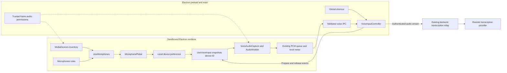
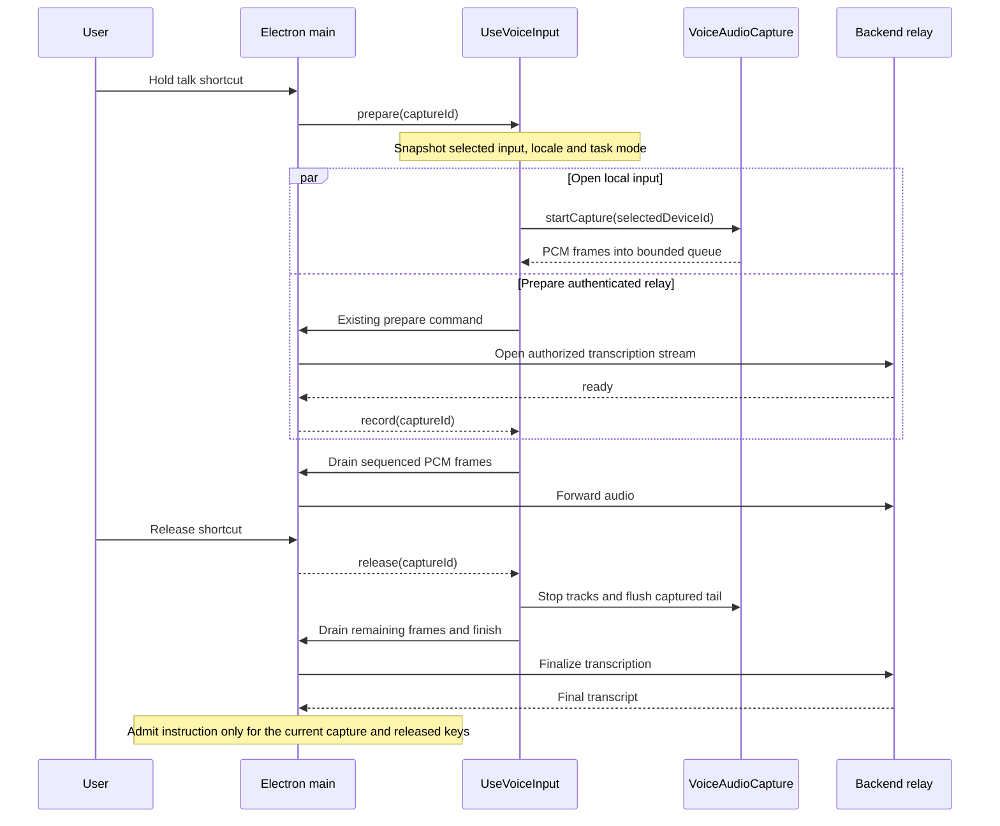

# Microphone selection: engineering and architecture

Implemented October 2, 2026. Tro lists audio inputs in a microphone dialog available from the workspace header and Settings. Device selection uses the existing hold-to-talk capture pipeline. Packaged hardware behavior still needs the interactive checks below.

## Product behavior

- Auto-detect is the initial choice and follows the computer's default input. It is not Tro's recommendation algorithm.
- A specific device is selected explicitly and saved on this installation. This preference survives navigation, sign-out and restart; it is not an account setting.
- Physical input rows omit Chromium's default and communications aliases. When available, the system-default label appears under Auto-detect.
- Tro suggests a recognized wired/USB input, then a recognized built-in input. Device-name classification checks virtual and wireless names first, so “USB Virtual Surround” does not become a physical USB recommendation. Unfamiliar names receive no quality ranking claim.
- Initial suggestions explain their device-name basis. A custom ranking replaces that hint with a clearly labeled preferred input. Bluetooth and virtual inputs remain selectable. Actual quality depends on placement, noise, hardware and drivers; a headset can outperform a laptop microphone in a noisy room.
- Opening, refreshing or selecting in the dialog never requests an audio stream. There is no decorative level meter, background microphone scan or provider call.
- Selection applies to the next hold. An active capture retains its device; no mid-sentence stream switch occurs.
- A missing selected device stays selected and is reported as unavailable. Tro never substitutes another physical microphone for an explicit choice. Reconnect it, choose another input or choose Auto-detect. Hot-plug and window-focus events refresh the inventory.
- If OS/browser permission hides device labels, the dialog explains how to grant access with the existing hold shortcut and refresh. Microphone permissions remain controlled by the OS. English and Vietnamese use the existing locale catalog.

## Architecture decision

Keep microphone selection in the desktop voice feature. The renderer already owns microphone capture through browser media APIs, so it also owns inventory and the local preference. Electron main remains responsible for trusted-window permission decisions, capture admission and authenticated transcription transport. The server continues to receive the existing audio protocol.

Three values have different responsibilities:

- **Selected input:** the user's saved route, either Auto-detect or a specific device ID.
- **Suggested input:** a derived suggestion from the current inventory. It never overwrites the user's selection.
- **Capture input:** the selected ID passed into one capture at the start of a hold. Later selection changes do not change that capture.

For example, a USB microphone can be suggested while Auto-detect remains selected and the OS default is AirPods. The suggestion does not reroute audio. If the user selects USB, the next hold requests USB exactly. Unplugging it makes the explicit choice unavailable; reconnecting the same ID restores availability.

## Engineering flow

Selection and recommendation remain local. Only held-key audio enters the existing remote transcription path. Explicit sound tests use a separate local statistics worklet. This feature adds no recommendation model requests or server endpoints.

## Module ownership

| Module                                                                                                                  | Owns                                                                                  | Must not own                                       |
| ----------------------------------------------------------------------------------------------------------------------- | ------------------------------------------------------------------------------------- | -------------------------------------------------- |
| [App.tsx](../src/desktop/renderer/App.tsx)                                                                              | One app-level inventory and voice subscription; header/Settings entry points          | A second capture instance for each page            |
| [Microphones.ts](../src/desktop/renderer/voice/Microphones.ts)                                                          | Classification, ordering, suggestion, bounded preference parsing, capture constraints | Permission grants, stream creation or cloud calls  |
| [UseMicrophones.ts](../src/desktop/renderer/voice/UseMicrophones.ts)                                                    | Enumeration, refresh generations, listeners, selection and local storage              | Audio resources or agent task admission            |
| [MicrophonePicker.tsx](../src/desktop/renderer/voice/MicrophonePicker.tsx)                                              | Accessible radio controls, explanations, errors and refresh action                    | Its own inventory subscription or recording loop   |
| [UseVoiceInput.ts](../src/desktop/renderer/voice/UseVoiceInput.ts)                                                      | Per-hold input snapshot, existing queue, cancellation and cleanup coordination        | Changing inputs during a capture                   |
| [VoiceAudioCapture.ts](../src/desktop/renderer/voice/VoiceAudioCapture.ts)                                              | One stream, AudioContext and worklet; track cleanup and hardware-ended callback       | Credentials, network URLs or transcript submission |
| [Main.ts](../src/desktop/main/Main.ts) and [MicrophonePermission.ts](../src/desktop/main/voice/MicrophonePermission.ts) | Trusted frame checks and audio permission policy                                      | Renderer preference storage or name-based ranking  |
| [VoiceInputController.ts](../src/desktop/main/voice/VoiceInputController.ts)                                            | Existing capture admission, relay lifecycle and final instruction submission          | Microphone hardware enumeration                    |

Keep the helpers inside the desktop voice feature: no other process consumes microphone selection semantics, so there is no shared package or public HTTP microphone endpoint. The local test lease uses a separate validated IPC contract in `src/contracts/MicrophoneTest.ts`. The existing locale catalogs own explanatory text; `Theme.ts` and `App.css` own appearance and layout. A private `MicrophoneOption` component renders the shared row structure with a short radio name and a separately referenced description. The dialog reports the input count and explains Bluetooth/virtual routing under Auto-detect when the default label provides that hint.

## State and persistence

`Microphone` contains a device ID, display label and inferred kind. The ID is the selection key; the label is display data. Equal labels do not imply equal devices. `MicrophoneKind` is the canonical constant object for wired, built-in, Bluetooth, virtual and unknown values.

`MicrophoneView` exposes the current inventory, selected ID, suggested ID, system-default label, load/error/save flags and two actions: refresh and select. Availability is derived from a successful inventory: an explicit ID absent from that list is unavailable. Enumeration failure is shown separately and does not prove that a device was disconnected. The last successful inventory can remain visible while refresh fails.

| Data                               | Lifetime                                            | Owner                                        |
| ---------------------------------- | --------------------------------------------------- | -------------------------------------------- |
| Selected device ID                 | Across app restarts on the same origin/profile      | `tro.desktop.microphone` in local storage    |
| Inventory, labels and suggested ID | Current signed-in app instance; cleared on sign-out | `UseMicrophones` React state                 |
| Input chosen for a hold            | One capture; unaffected by later picker changes     | Argument to `VoiceAudioCapture.startCapture` |
| PCM queue and meter                | One existing voice capture                          | `UseVoiceInput` and `VoiceLevelMeter`        |

A saved ID must be a non-empty string of at most 512 characters. Zod validates the stored value before use. This check validates the representation, not device existence; successful enumeration and the eventual exact media request determine availability. Selection accepts only Auto-detect or an ID in the current inventory.

Storage read failure uses Auto-detect. Storage write failure keeps the session selection and reports that it was not saved. Device names are not persisted as a fallback identity: names may repeat or change and matching one could route speech to a different device.

## Inventory lifecycle and asynchronous work

Refresh occurs on sign-in, voice returning to idle, successful capture setup, device change, window focus and explicit refresh. Refreshing after setup allows newly exposed labels to appear. Enumeration never calls `getUserMedia`.

Each refresh increments a generation counter. An asynchronous result may update state only if its generation is still current. Effect cleanup marks inventory inactive, increments the counter and removes listeners. Saved refresh or selection callbacks also check that active lifetime before doing work, so calling an old callback after sign-out or unmount cannot revive discovery or write a preference. This prevents an older refresh from replacing a newer list, and prevents pending enumeration from repopulating the UI after sign-out or unmount.

This is event-driven discovery, with no periodic polling. A microphone becoming available does not automatically select it. A missing explicit choice remains stored, allowing the same ID to become usable when reconnected.

## Capture sequence

The local microphone and relay start independently. Relay readiness is not proof that the microphone has opened. The existing five-second renderer queue bounds audio captured while the connection starts. The AudioWorklet emits the existing mono PCM16 format at 24 kHz; this feature does not change that contract.

On release, physical tracks stop before waiting for final transcription. The existing worklet flush has a 1.5-second timeout and cleans up in `finally`. Cancellation disposes local resources and invalidates capture identity. Audio setup errors clean up inside `VoiceAudioCapture` before rejecting, so cleanup does not depend on caller behavior. A capture instance permits one start; disposed instances cannot reopen hardware. If an input finishes opening after cancellation, its tracks are stopped immediately. A track ending unexpectedly invokes the same failure path; Tro does not create a replacement stream automatically.

The global shortcut and main controller already serialize voice admission against running agent tasks. There is one app-level subscription, so opening Settings or the dialog does not introduce a second recorder.

## Failure and recovery behavior

| Situation                                 | Current behavior                                                   | User recovery                                                 |
| ----------------------------------------- | ------------------------------------------------------------------ | ------------------------------------------------------------- |
| No exposed names or device IDs            | Show the available list and permission guidance                    | Grant OS access through the existing voice flow, then refresh |
| Enumeration rejects or API is unavailable | Show inventory error; preserve selection                           | Check OS access and refresh                                   |
| Explicit device disappears while idle     | Keep its ID; show unavailable after successful refresh             | Reconnect, choose another input or choose Auto-detect         |
| Explicit input cannot open                | Exact request rejects; voice capture fails without fallback        | Check the device and choose again                             |
| Input ends while recording                | Cancel the current capture through its failure callback            | Reconnect and start a new hold                                |
| Selection changes during a hold           | Current capture keeps its original input                           | New input applies on the next hold                            |
| Storage save fails                        | Keep the session selection and show a warning                      | Reselect after restart if necessary                           |
| Sign-out or window close                  | Existing voice cleanup stops capture; inventory replies are fenced | Sign in again before using voice                              |

The UI currently uses a general voice failure message rather than distinguishing every browser media error. More specific device-busy or permission-denied messages would require typed error mapping and recovery tests; they are not implemented here.

## Permissions and data boundaries

Device names and IDs stay local and are never logged or sent through transcription IPC. The [inventory API](https://developer.mozilla.org/en-US/docs/Web/API/MediaDevices/enumerateDevices) exposes only permitted devices and can hide labels before access is granted. [Device changes](https://developer.mozilla.org/en-US/docs/Web/API/MediaDevices/devicechange_event) refresh inventory without opening a stream.

[Exact device constraints](https://developer.mozilla.org/en-US/docs/Web/API/MediaDevices/getUserMedia) make a missing explicit device fail rather than selecting another input. Auto-detect sends no exact ID constraint. Device IDs are browser-origin/profile identifiers rather than hardware serial numbers: an origin/profile reset or changed device ID can leave a saved choice unavailable. The current design asks the user to reselect rather than matching possibly ambiguous names.

Electron main permits audio permission checks only in Tro's trusted main frame while voice is enabled, making idle inventory access possible. New audio permission requests require an active capture. The permission helper accepts audio-only media requests from the trusted main frame. New requests with camera, mixed media or unknown media are rejected; checks require audio media type. Unrelated contents and subframes are denied, and existing trusted URL matching is retained. Chromium can reuse an audio grant for streams, so this is not an OS guarantee against renderer-initiated recording. The trusted capture implementation enforces held-key resource lifetime. Sign-out disables voice and fences inventory replies. See [Electron session permissions](https://www.electronjs.org/docs/latest/api/session).

## Recommendation algorithm

`listMicrophones` filters to audio inputs, removes blank IDs and Chromium's `default`/`communications` aliases, deduplicates exact IDs and classifies each remaining label. It sorts by kind, then display label, then device ID. `recommendMicrophone` chooses a wired entry first, then a built-in entry; that priority also holds when its caller provides an unordered inventory. If neither exists, there is no suggested device.

| Display priority | Inferred kind     | Recommendation behavior                           |
| ---------------- | ----------------- | ------------------------------------------------- |
| 1                | Wired/USB         | First suggestion candidate                        |
| 2                | Built-in/internal | Candidate when there is no recognized wired input |
| 3                | Unknown           | Selectable; no quality claim                      |
| 4                | Bluetooth         | Selectable with startup/quality qualification     |
| 5                | Virtual           | Selectable with a routing explanation             |

Classification tests virtual terms first, then wireless terms, then built-in terms, then wired/USB terms. This prevents a label containing both “virtual” and “USB” from receiving the USB suggestion. Within a kind, alphabetical ordering makes the choice predictable; it does not imply one brand sounds better.

This is a product starting heuristic, not a benchmark. In particular, “microphone array” is treated as a built-in hint even though some external devices may use that wording. Localized or ambiguous labels can remain unknown. A Bluetooth headset close to the user's mouth may outperform USB hardware farther away. The user remains the authority on which microphone to use.

## Why recommendations start with hints

Chromium does not supply reliable Bluetooth/USB transport or a universal microphone quality score through this inventory. Device labels are provider/OS strings and can be localized or misleading. A model cannot infer the best microphone from these names either. This version makes an explainable suggestion without automatically changing the user's route.

## Local comparison and editable ranking — implemented

**Compare microphones** reveals the local-test disclosure and an explicit test button for each physical device ID. Revealing the controls does not open audio. There is no automatic test of every connected input or Auto-detect alias.

`MicrophoneTestLease` in Electron main reserves one test before async session/OS permission checks. Reservation prevents hold-to-talk admission; authorization enables audio permission only after the checks pass. It refuses admission while voice or a task is busy, rejects concurrent tests and unrelated stop IDs, and expires after 20 seconds. Generation fencing prevents a stale authorization from granting a replacement reservation. Main cancels on voice reinitialization, sign-out, sleep, lock, renderer navigation/crash, window close and quit. The preload accepts only validated start/stop UUID commands and cancellation events from the trusted main frame. It exposes no PCM or results channel for tests.

`UseMicrophoneTests` owns one transient capture and measurements at app level. It refuses unknown IDs and concurrent starts, acquires the lease before opening audio, and disposes late/canceled setup. Dialog close, visibility loss, device changes, sign-out and unmount stop the test. Device changes invalidate all prior results so reconnecting does not reuse old measurements. Startup/measurement failures are recoverable and retain no partial result. A 15-second renderer timeout bounds setup plus sampling, below the main lease ceiling. A pending OS prompt or media request cannot be forcibly dismissed, but a late stream is immediately stopped and never measured.

`MicrophoneTestCapture` opens one exact device using the same mono, echo-cancellation and noise-suppression constraints as voice capture. It owns the stream, context, source and worklet and disposes each on every exit. The worklet emits silence to the output, so there is no speaker playback or feedback. `MicrophoneTestProcessor` computes scalar statistics locally; it never posts PCM to the renderer, preload, transcription queue or agent.

`MicrophoneMeasurementCollector` follows actual sample counts: two seconds quiet, then four seconds speaking the same displayed phrase. It handles arbitrary block lengths and splits a block exactly at the phase boundary. Results have schema version 1:

| Value        | Calculation and limitation                                                                                                                     |
| ------------ | ---------------------------------------------------------------------------------------------------------------------------------------------- |
| Quiet noise  | RMS over the quiet interval in dBFS, floored at −120 dBFS for silence                                                                          |
| Speech level | RMS over the speaking interval, including pauses                                                                                               |
| Clipping     | Fraction of speech samples with absolute amplitude at least 0.99; a near-full-scale indicator, not proof of analog distortion                  |
| Startup      | Renderer request-to-first-worklet-event milliseconds; includes device opening, context/worklet setup and resume, excludes OS permission prompt |

These are processed input measurements, not calibrated acoustics, transcription accuracy, a speech detector or a universal quality score. Automatic gain control, placement and changing noise affect comparison. Silence on both intervals is displayed as silence, never declared a winning microphone. The table lets the user compare evidence, then explicitly choose an input or edit its ranking; there are no unvalidated numerical thresholds or automatic measured-quality recommendations. Keep the same phrase, position and surroundings when comparing.

`MicrophoneRanking` owns a separate bounded/unique device-ID list in `tro.desktop.microphoneRanking`. Accessible move-up/down buttons reorder connected inputs. Missing IDs remain saved for reconnect; new unranked inputs follow in their deterministic name-hint order. The first available ranked device receives **Preferred**. Ranking never changes the selected ID, an active capture, or the OS default. Reset restores name-hint ordering and suggestions. Storage failures are visible; ordering still works for the current session. Ranking persists on this installation, including across account changes, like the selected-input preference.

Results remain in app memory across dialog/page navigation but clear on device change or sign-out and are never persisted. Raw audio is neither saved nor sent. A separate provider-based accuracy evaluation would require its own authorized remote-audio/cost/privacy design.

The implementation follows the [AudioWorklet processing contract](https://developer.mozilla.org/en-US/docs/Web/API/AudioWorkletProcessor/process), including variable block lengths and silent output, and the [Electron permission handlers](https://www.electronjs.org/docs/latest/api/session#sessetpermissionrequesthandlerhandler). Hardware results are still needed before choosing numerical recommendation rules.

## Implementation and release plan

| Step                                                     | Status            | Completion evidence                                                 |
| -------------------------------------------------------- | ----------------- | ------------------------------------------------------------------- |
| Define inventory rules, preference and exact constraints | Implemented       | Pure rule and storage tests                                         |
| Own one app-level inventory and picker                   | Implemented       | Hook lifecycle and React interaction tests                          |
| Snapshot selection into the existing capture pipeline    | Implemented       | Capture-selection and resource-cleanup tests                        |
| Allow trusted idle inventory checks in Electron main     | Implemented       | Permission helper tests; packaged behavior still needs verification |
| Preserve localization and document recovery              | Implemented       | Both catalogs and the settings/header UI                            |
| Check packaged microphone assets and permission metadata | Implemented       | `pnpm check:microphone-package` plus the hardware runbook           |
| Exercise signed Mac/Windows microphones and permissions  | Hardware required | [MicrophoneHardwareChecks.md](MicrophoneHardwareChecks.md)          |
| Add local comparative sound testing and editable ranking | Implemented       | Lease, sample statistics, capture lifecycle, ranking and UI tests   |

The engineering work includes the picker, local comparison, manual ranking and a packaged artifact check. Release readiness depends on the hardware checks, especially first permission grant, Bluetooth reconnects and device removal during setup. Keep Auto-detect available as the explicit recovery route; do not work around hardware failures by adding silent fallback.

## Verification and release

Automated coverage includes alias removal, cautious classification, recommendation selection, exact constraints, storage failure, hot-plug, stale inventory fencing, selection across navigation, capture selection snapshots, delayed opening after cancellation, track disconnection, setup failures, tail-flush acknowledgment/timeout, stale callbacks after sign-out and permission restrictions. Test doubles use synthetic devices and no microphone or paid provider access.

Before distributing installers, check both signed macOS and Windows builds:

1. Built-in, USB, Bluetooth and virtual inputs; multiple matching names; system-default and communications aliases.
2. First permission grant, denial/recovery, labels before/after capture and restart persistence.
3. Unplug/reconnect while idle, while opening and while recording. Confirm an explicit choice never silently falls back and a canceled capture never submits a task.
4. OS default changes under Auto-detect, sleep/wake and a device ID change after profile/origin reset.
5. Keyboard navigation, dialog focus restoration, small windows, screen-reader labels and both UI languages.
6. Verify no microphone indicator between holds or while the picker is open without an explicitly started test, and confirm the real selected device supplies the held-key audio.

The initial implementation's October 2 verification passed `pnpm lint`, `pnpm format:check`, `pnpm typecheck`, `pnpm test` (323 tests), `pnpm build` and `pnpm test:integration` (7 tests). These numbers describe that run, not a permanent coverage requirement. An isolated Electron preview exercised the built dialog with synthetic devices and confirmed selection persistence; it did not exercise physical microphones or the production permission flow.

See [MicrophoneHardwareChecks.md](MicrophoneHardwareChecks.md) for reproducible packaging commands and the release evidence matrix. No physical-device validation, installer distribution or deployment is implied by automated checks.
