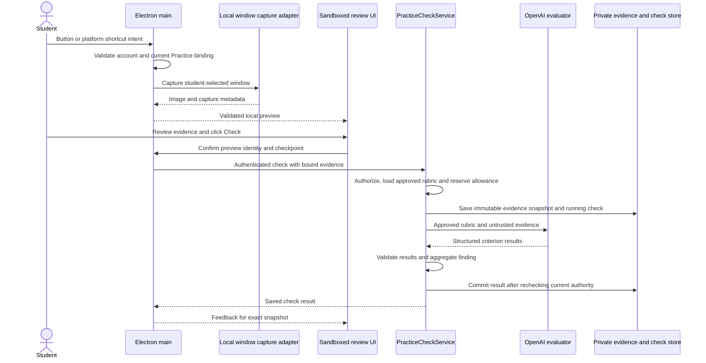

# Student work capture and practice checking

Status: Core capture and assessment implementation added; device acceptance and judge calibration pending.

Requested by: Duc.

Date: October 9, 2026.

This specification records the intended design and implementation plan. The current
implemented scope is described below; later sections retain design targets. [Architecture.md](Architecture.md) remains
the source of truth for the implemented system; [README.md](../README.md) owns
setup and validation commands. This standalone specification was explicitly
requested by Duc.

## Implemented scope and remaining work

Implemented: an expiring selected-window capture draft with explicit preview; global
and in-app shortcuts; immutable checked snapshots; PDF text and static sb3 extraction;
class-publication grounding; extensible criterion evaluator ports; batched LLM,
exact-text and connected-block evaluators; capability guards; saved assessment traces;
check-linked teacher-review requests; and existing localized HUD progress integration.

The concrete implementation uses `PreparePracticeEvidence` and `PracticeAssessmentService`
with injected `PracticeCriterionEvaluator` implementations. Exact-text checks compare
supplied evidence, not executed output. Each criterion selects one approved method in
this version. Nested Scratch control-flow verification, sandboxed code execution, PDF
visual/OCR extraction, multiple-verifier conflict resolution and a real teacher-labeled
judge release gate remain future work. The offline quality runner is available with
synthetic metric tests; it does not establish model accuracy. Windows/macOS physical
capture acceptance and live model calibration must be completed before release.

The table below describes the baseline that motivated this change. For current behavior,
see [Architecture.md](Architecture.md); it also documents HUD ownership priority and
Electron's local thumbnail enumeration limitation.

## Problem and intended outcome

Students should be able to request feedback on their current assignment through
**Check my work**, **Command + K** on macOS, or **Alt + K** on Windows. They should
not need to speak a command or manually take and upload a screenshot.

The proposed workflow captures a student-selected work window, previews the
evidence, and checks it against teacher-approved criteria. Feedback identifies
what meets the requirements, what needs changes, and what cannot be verified.
Checking remains separate from confirmed hand-in.

## Existing behavior and scope

| Area       | Current implementation                                            | Proposed extension                                         |
| ---------- | ----------------------------------------------------------------- | ---------------------------------------------------------- |
| Shortcut   | Opens practice review during an eligible joined Practice activity | Starts selected-window capture before opening review       |
| Evidence   | Pasted text/code and uploaded supported images/text files         | Locally captured work-window image with capture provenance |
| Evaluation | Backend OpenAI Responses adapter with structured output           | Reuse the evaluator and approved rubric                    |
| Results    | Saved checks, criterion feedback, help and teacher history        | Show captured evidence and its version alongside feedback  |
| Hand-in    | Separate confirmation of an exact saved check snapshot            | Preserve this behavior                                     |

The first version supports one selected work window per capture. Students can
supplement the image with existing supported evidence. It does not add continuous
monitoring, automatic stuck detection, class-wide remote control, arbitrary code
execution, automatic hand-in, or final grading. These are separate capabilities.

## Student workflow

1. The student signs in, joins a live class and enters an eligible Practice
   activity with at least one approved checkpoint.
2. The student clicks **Check my work** or uses the platform shortcut.
3. On first use, the student selects the work window. A selection may be reused
   during the current joined account/session lifetime, with a visible option to
   change it. Window identities are not persisted across app restarts.
4. Main captures the selected window before activating Tro's review interface.
   Opening a picker on first use must not cause the picker or Tro itself to become
   the captured assignment. The capture targets the selected window identity,
   rather than whichever window happens to be foreground afterward.
5. Tro displays the image, class, activity, checkpoint and capture time locally.
   The student may retake, change window, add evidence, cancel, or click **Check**.
   A single approved checkpoint is selected automatically; multiple checkpoints
   require an explicit choice.
6. **Check** sends only the previewed evidence through the authenticated backend.
   The preview explains that checking sends evidence to AI and saves it privately
   for the student and authorized teacher. Capture alone does not upload anything.
7. Tro displays criterion feedback and the overall finding for that saved version.
   The student may request targeted **Show me** help or capture updated work.
8. **Hand in this version → Confirm hand-in** submits the exact saved snapshot and
   its feedback. Later application edits are not included.

The button remains available when global shortcut registration fails. In-app
shortcut fallback must enter the same capture workflow. Unavailable capture shows
an actionable error and retains manual evidence entry.

## Architecture and ownership



### Desktop contracts and capture

Add strict schemas in a focused contract module, provisionally
`src/contracts/PracticeCapture.ts`. Capture requests identify the classroom context
and selected checkpoint; main resolves the authoritative joined-device binding.
The renderer cannot provide arbitrary filesystem paths or native capture commands.

Add a main-owned controller, provisionally
`src/desktop/main/classroom/PracticeCaptureController.ts`, depending on an explicit
local capture port. The adapter should use an existing supported capture capability
where it provides reliable window targeting. Verify capability before choosing a
native implementation; existing teaching capture does not establish selected-window
support or Windows parity.

Expose narrow preload methods for selecting/capturing work, confirming previewed
evidence, and discarding a draft. Main verifies the IPC sender and owns window
selection, OS permissions, capture identity and draft lifetime. Renderer code owns
presentation and student choices, not native capture authority.

Main retains an immutable draft identified by an opaque capture ID. The preview and
subsequent check must refer to those same bytes. The renderer cannot replace a
confirmed capture with an arbitrary image under the old capture ID. Existing manual
uploads remain a separate validated evidence path.

Capture metadata should include an opaque capture ID and source-window identity,
capture timestamp, pixel dimensions, image format/size and evidence digest. Attach
the account generation, participation, activity, attempt, checkpoint and context
version to local draft authority. Never expose native handles as general renderer
capabilities. Window identity is provenance, not proof that the correct assignment
is visible.

Clear drafts on cancel, replacement, expiry, class/account change, leave, session
end or application shutdown. Revalidate context before upload and discard stale
responses. Block overlapping captures/checks; key repeat and double-click must not
create duplicate operations. Define draft expiry in the owning configuration when
implementing, rather than embedding an undocumented timeout in UI code.

### Backend and persistence

Reuse [PracticeCheckService](../src/server/features/classroom/application/PracticeCheckService.ts)
and the existing `/api/v1/classroom/practice` route. The server loads the approved
checkpoint from the authorized activity; a client-supplied rubric is not authoritative.

Retain current access checks, device leases, course/context/progress version fences,
input/storage limits, usage reservations and request deduplication. Image conversion
must fit the owning [PracticeCheck contracts](../src/contracts/PracticeCheck.ts).
If a readable image cannot fit, request a smaller target or additional evidence;
do not silently degrade it and claim the work was checked successfully.

Captured images enter the existing private snapshot store. Add provenance through
validated contracts and, only where necessary, an additive reviewed Prisma migration.
Preserve legacy uploaded evidence, existing check history and append-only submissions.
Apply the owning evidence retention/removal policy; do not assume that learning-event
retention alone deletes snapshot bytes.

## Evaluation contract

Use the existing [OpenAiPracticeCheckEvaluator](../src/server/features/classroom/infrastructure/OpenAiPracticeCheckEvaluator.ts),
which calls the Responses API with structured output. No separate Decisions API
migration is required for this proposal. Provider credentials remain backend-only.

Each request supplies the teacher-approved task and criterion IDs, criterion
requirements, selected evidence with stable IDs, and the student's feedback locale.
The stored check pins the rubric revision and evaluator version.

The evaluator treats all student text and images as untrusted evidence, never as
instructions. It cannot change the rubric, operate the student's device, submit
work, invent criteria or assign a final grade.

| Criterion finding    | Required interpretation                                               |
| -------------------- | --------------------------------------------------------------------- |
| Meets requirements   | Observable evidence supports the approved requirement                 |
| Needs changes        | Observable evidence contradicts the approved requirement              |
| More evidence needed | Evidence is missing, ambiguous or unable to establish the requirement |

Return exactly one result per approved criterion, with concise feedback and
supporting evidence IDs where applicable. Existing server validation rejects
missing/duplicate/foreign criterion IDs and foreign evidence references. A result
other than insufficient evidence must cite supplied evidence.

The server, rather than the model, derives the overall finding:

1. Any required criterion needing changes yields **Needs changes**.
2. Otherwise, any required criterion lacking evidence yields **More evidence needed**.
3. Otherwise, all required criteria meet the requirements.

Optional criteria do not block the overall finding. Structural validation establishes
contract validity, not that the model's interpretation is correct.

A screenshot cannot prove hidden program state, execution, interactivity, authorship
or independent understanding. For example, a visible Scratch movement block may
support a structural criterion but cannot prove that clicking the sprite produces
the expected movement. Ask for output or additional evidence when necessary.

## States and failure behavior

The proposed local flow is:

`Idle → Selecting window (if needed) → Capturing → Preview → Checking → Feedback`.

Cancel returns to idle and discards the local capture. Retake creates a fresh draft
and replaces the preview; it never changes evidence in a previously saved check.
The persisted check lifecycle remains owned by the existing practice contracts.

| Condition                                                               | Required behavior                                                                    |
| ----------------------------------------------------------------------- | ------------------------------------------------------------------------------------ |
| No approved checkpoint or class not in Practice                         | Explain why checking is unavailable; do not capture                                  |
| Capture permission denied or unsupported platform                       | Explain how to proceed and retain manual evidence entry                              |
| Selected window closes, cannot be captured, or returns unusable content | Ask for reselection/retake; never substitute a different window                      |
| Assignment, account or participation changes                            | Discard draft authority; prevent upload under stale context                          |
| Student cancels preview                                                 | No upload or model request                                                           |
| Repeated shortcut/button action                                         | Keep one in-flight operation                                                         |
| Network/provider failure or invalid structured result                   | Show check failure, never a passing or failing academic finding                      |
| Uncertain network outcome                                               | Refresh/reconcile the existing request before retrying; retain request deduplication |
| Student edits work after checking                                       | Keep feedback labeled as applying to the saved snapshot; offer a fresh capture       |
| Session/account changes during evaluation                               | Fence late output through the existing server/main checks                            |

Cancellation before submission prevents inference. Once the provider request has
started, cancellation or a lost connection must not promise that execution or
charges were prevented. Do not add automatic repeated inference.

## Teacher experience and diagnostics

Authorized teacher history displays the exact evidence snapshot, capture time,
checkpoint/rubric revision, criterion findings and separate hand-in status.
Capturing locally without checking creates no teacher-visible evidence. A completed
AI check is not a teacher-approved grade or proof of independent mastery.

Emit bounded structured events for capture admission, capture outcome, check
admission and terminal result. Include stage, correlation ID, duration, dimensions,
byte count and safe rejection reason where useful. Do not log screenshots, image
bytes, window titles, URLs, student work, credentials or raw configuration. Routine
status polls remain quiet.

## Acceptance criteria and verification

### Capture and interaction

- Command + K on macOS and Alt + K on Windows enter the same flow as the button.
- The work window is captured before Tro takes focus; Tro/picker overlays are not
  mistaken for assignment evidence.
- The preview and uploaded image have the same digest.
- Retake, window replacement, denied permission, closed windows and unavailable
  capture each have an explicit tested outcome.
- Cancel creates no upload or provider call; account/class transitions invalidate
  pending capture drafts.
- Repeated keys and double-clicks produce one operation. Manual upload remains
  usable when shortcut registration or capture is unavailable.

### Backend and end-to-end behavior

- Scripted evaluator fixtures exercise met, needs changes, insufficient evidence,
  malformed results, timeout and stale-classroom outcomes.
- Authorization tests reject another student's capture/check and stale device
  authority. Evidence and feedback stay tied to the approved rubric and saved bytes.
- Request replay does not create another check or model request; confirmed hand-in
  references the exact checked version.
- Existing manually uploaded evidence and historical checks remain readable.
- Run the required checks from README after implementation. Exercise the real
  renderer/preload/main/backend flow with a disposable database and scripted
  evaluator without paid inference.
- Perform physical capture/shortcut acceptance separately on macOS and Windows,
  including focus changes, scaling and unavailable windows. Do not infer Windows
  support from a macOS build or synthetic capture fixtures.

### Evaluation quality and classroom value

Prepare a teacher-reviewed set of correct, incorrect, incomplete, ambiguous and
instruction-injection examples across intended assignment types. Compare model
findings with the teacher labels and review false passes, false changes and useful
abstentions. Agree release thresholds with the teaching team before live acceptance;
none are claimed by this specification.

A separately authorized real-provider evaluation must establish visual/model
quality; scripted tests establish wiring and contract behavior only. A classroom
pilot should measure time to first check, evidence-entry effort, teacher checks
avoided, false feedback and student recovery after feedback.

## Code implementation plan: grounded judgment across material types

This plan extends the capture proposal in phases. All new filenames below are
proposed, not existing components. Phase 1 retains the current text/image evidence
contract; later phases add document/project evidence explicitly. Static checking
ships before any student-code execution. Each phase must be usable and validated
without claiming support for every material type.

### Evaluator interfaces and extension boundaries

Use a small application interface with separate evaluator implementations. Avoid a
generic `Evals` class, provider-specific inheritance hierarchy or plugin framework.
Keep these three responsibilities distinct:

| Proposed component           | Responsibility                                                                      | Location                    |
| ---------------------------- | ----------------------------------------------------------------------------------- | --------------------------- |
| `PracticeAssessmentService`  | Coordinate prepared evidence, approved evaluator selection and resolved findings    | Classroom application layer |
| `PracticeCriterionEvaluator` | Evaluate an approved criterion using supported evidence                             | Classroom application port  |
| `PracticeEvaluationSuite`    | Compare evaluator results with teacher-labeled cases; never grade live student work | Evaluation test harness     |

`PracticeCheckService` remains the authorization, reservation, persistence and
hand-in owner. It delegates assessment to `PracticeAssessmentService` after
admission, then commits the returned findings under existing authority checks.
The assessment service does not duplicate authorization or write directly to Prisma.

Define the proposed port in
`src/server/features/classroom/application/PracticeCriterionEvaluator.ts`:

```ts
import type {
  CriterionEvaluationInput,
  CriterionEvaluationResult,
} from '#contracts/PracticeAssessment.js';

export interface PracticeCriterionEvaluator {
  readonly id: string;
  readonly version: string;

  supports(input: CriterionEvaluationInput): boolean;

  evaluate(
    input: CriterionEvaluationInput,
    signal: AbortSignal,
  ): Promise<CriterionEvaluationResult>;
}
```

The input and result types are derived from strict schemas, not duplicated
interfaces. Input contains one approved criterion and its verification
configuration, authorized class context, validated evidence units and relevant
prior observations. Result contains the criterion ID, finding, evidence locations,
evaluator identity/version and bounded explanation or abstention reason.
`supports` checks a configured method and required capabilities; it does not prove
correctness or replace runtime validation. All implementations obey cancellation
and the assessment deadline.

Proposed implementations are:

- `LlmCriterionEvaluator.ts` in infrastructure: provider-backed interpretation of
  approved criteria, adapting the existing `OpenAiPracticeCheckEvaluator` logic.
- `ScratchStructureEvaluator.ts` in application: an adapter over pure Scratch
  structure rules in the domain layer.
- `ExactOutputEvaluator.ts` in application: an adapter over approved pure output
  comparison rules. Student-supplied output retains its unverified provenance.
- `CodeTestEvaluator.ts` in infrastructure, later: uses only the separately reviewed
  `PracticeExecutionRunner` and its verified receipts.

Extractors prepare PDF pages, Scratch structures, source lines and image evidence;
they do not implement the evaluator interface or decide whether requirements pass.
Format does not select judgment by itself: a PDF may contain code, and a Scratch
assignment may ask for written reasoning.

Backend composition injects a fixed collection of evaluator implementations into
`PracticeAssessmentService`. Approved criterion configuration chooses evaluator
methods explicitly. Unknown methods, unavailable implementations or unsupported
evidence produce an explicit unavailable/insufficient-evidence outcome, never a
silent fallback to LLM approval. Provider/system failure remains check failure,
separate from an academic finding.

For a criterion requiring more than one method, the service runs the approved
checks and delegates combination to the pure `ResolvePracticeFindings` rules.
Keep routing deterministic; the LLM cannot select its own marking method or discard
another evaluator's contradictory evidence. `supports` is a compatibility guard,
not a first-match strategy that changes with registration order.

The criterion interface does not require one provider request per criterion.
Start with the existing bounded whole-rubric LLM call behind an assessment adapter
when all relevant criteria use the same provider context. Introduce a typed batch
operation only if needed; it must return uniquely identified criterion results and
preserve per-criterion validation, provenance and model request accounting. Do not
multiply paid calls merely to fit the interface.

Evolve the existing `PracticeCheckEvaluator` port through this adapter rather than
maintaining two independent LLM checking pipelines. Update constructors, service
composition, typed mocks and tests together. Preserve the existing HTTP commands,
findings and saved historical records through the compatibility rules below.

Implement the LLM path and only the deterministic evaluator required by the first
pilot. Add other evaluators when an approved assignment needs them. Keep extension
local to the classroom feature; new packages/services require demonstrated need.

`PracticeEvaluationSuite` belongs in the evaluation harness described in Phase 7.
It consumes the same assessment application port with frozen teacher-labeled
fixtures, reports quality by evaluator and material type, and has no authority to
modify live checks, rubrics or submissions. This separates **checking student work**
from **checking whether the checker is reliable**.

### Phase 1: Define approved evaluation criteria and source authority

Extend `src/contracts/PracticeCheck.ts` with versioned criterion evaluation
requirements. Use strict Zod schemas and named `as const` groups for verification
methods and evidence capabilities. Derive TypeScript types from those schemas.

Each approved criterion should specify:

- What the student must demonstrate and whether it is required.
- Relevant source references in the pinned course publication.
- Accepted evidence capabilities, such as visible output, source text, project
  structure or verified execution output.
- Verification method: observable model judgment, approved deterministic rule,
  or teacher review.
- Approved rule configuration where applicable, and any expressly required method
  or accepted alternatives.

Introduce `src/contracts/PracticeAssessment.ts` for versioned evaluation packets,
evidence locations, deterministic observations and criterion provenance. Keep the
existing `met`, `needs_changes` and `insufficient_evidence` wire values. Teacher
review is a routing decision; until recorded, an unverifiable criterion remains
insufficient evidence rather than receiving an invented grade.

Update `PrepareMaterialCollection.ts`, `MaterialCompositionFormat.ts` and the
preparation adapter so AI may suggest criteria and source references. Update
`PracticeCheckpointEditor.tsx` and material approval validation so teachers review
the requirements, evidence and verification rules before publication. A source
example is not a mandatory solution unless the approved criterion says so.

Legacy approved checkpoints receive an explicit compatibility interpretation:
retain their exact wording and treat them as observable formative checks. Do not
infer executable tests, new mandatory criteria or stronger evidence guarantees.
Preserve old check snapshots under their original schema/version adapter.

Completion: a teacher can approve a criterion with traceable source context;
legacy publications and checks remain readable.

### Phase 2: Build bounded class context for each check

Add `application/BuildPracticeEvaluationContext.ts` under the classroom feature,
with a `PracticeMaterialReader` application port for authorized pinned-publication
reads. Wire a backend adapter to existing material source selection/read functions;
do not import infrastructure directly into application/domain code or perform an
unscoped search across classes.

After `PracticeCheckService` authorizes the student and resolves the approved
checkpoint, the builder loads explicitly referenced passages, effective teacher
corrections and needed neighboring context from the accepted course revision.
The approved task/rubric defines obligations; class content provides explanation.
Conflicting or missing required context becomes a visible review/insufficient
context outcome, not a silent change to the assignment.

Build a typed packet containing the course and rubric revisions, criterion IDs,
source references and bounded excerpts, student evidence, deterministic
observations and evaluator configuration version. Keep teacher sources and student
artifacts in separate fields with explicit roles. Count the complete packet against
the owning limits, including derived units and visual evidence. Reject an oversized
packet or ask for focused evidence rather than silently dropping required context.

Teacher reference answers and private tests remain server-only and must not be
copied into ordinary student feedback. Cite only authorized references in the
student view. Store enough packet provenance to review the decision without
putting student evidence or private answer keys in logs.

Completion: every check uses the pinned approved sources; foreign source IDs,
missing required context and budget overflow have explicit tested outcomes.

### Phase 3: Implement capture and the existing image/text path

Implement the desktop capture/controller/preload flow defined earlier in this
specification. Update `Main.ts`, `GlobalPracticeShortcut.ts`,
`UsePracticeShortcut.ts` and `PracticeCheckPanel.tsx` so both shortcuts and the
button select/capture work and open a local preview before upload. Keep the existing
manual text/image input and confirmed hand-in.

Introduce `PracticeAssessmentService` and adapt the existing `PracticeCheckEvaluator`
port to the versioned assessment packet and criterion evaluator boundaries above.
Update `OpenAiPracticeCheckEvaluator.ts` through the `LlmCriterionEvaluator` adapter
to pass grounded context and validated observations into structured Responses
evaluation. Retain a bounded batch call where appropriate. Keep provider setup in
backend composition and validated settings in server `Env.ts`/owning configuration.

Completion: a captured screenshot is checked using approved classroom context;
unsupported behavioral requirements request additional evidence.

### Phase 4: Add immutable artifacts and format-specific extraction

Introduce `application/PracticeArtifactExtractor.ts` as an application port and
`application/PreparePracticeEvidence.ts` as the orchestration owner. Adapter output
is a versioned, validated collection of evidence units, warnings and capabilities.
Units link back to an original artifact ID/digest and a precise location: page,
line range, Scratch target/block, image or verified test case.

For PDF and `.sb3` uploads, add a bounded authenticated artifact upload endpoint
under the practice routes, a main-owned file selection/upload flow, and private
artifact storage. A check references an uploaded artifact ID; the server rechecks
student ownership, attempt binding, size, type and expiry. The client cannot supply
an arbitrary URL/path or refer to another student's artifact. Preserve originals;
derived text is not a replacement for the submitted bytes.

Extend `PracticeCommand` and reply schemas compatibly for artifact references and
capability/coverage warnings. Coordinate route body limits, upload/storage budgets,
request hashing and private removal/retention. Unchecked drafts expire under an
explicit policy; accepted check artifacts inherit the snapshot lifecycle. Include
the ordered manifest of evidence digests, rubric and pipeline versions in
provenance; a changed payload cannot reuse an old request identity.

The existing teacher-material `ExtractMaterial.ts` already has PDF text extraction
and Scratch `project.json` extraction. It does not establish student-artifact
support. Reuse a focused parsing adapter through explicit ports where semantics
match. Keep role-specific authorization and provenance separate. Extract a shared
parser only when teacher and student consumers actually need the same behavior.

| Proposed adapter under classroom infrastructure | Implementation responsibility                                                                    | Evidence limits                                                      |
| ----------------------------------------------- | ------------------------------------------------------------------------------------------------ | -------------------------------------------------------------------- |
| `ExtractPracticeImage.ts`                       | Validate actual decoded format/dimensions, retain image and provenance                           | Supports visible content only                                        |
| `ExtractPracticePdf.ts`                         | Extract page-located text with the existing PDF library; retain original and extraction warnings | Reading order, scanned pages, charts and layout may need page images |
| `ExtractPracticeScratch.ts`                     | Read bounded `.sb3` archive, validate `project.json`, retain target/block/asset references       | Static structure does not establish execution                        |
| `ExtractPracticeCode.ts`                        | Decode allowed text sources, preserve filenames/line locations and language metadata             | Static code is not proof of behavior                                 |

Do not claim visual PDF support from text extraction. Add page rendering behind an
explicit bounded port if the chosen runtime supports it; otherwise request a page
image. Scanned documents require a separately implemented OCR/vision path, with
coverage warnings. Empty extraction never becomes evidence of a blank assignment.

Keep parsers off the API event loop with bounded workers, following the existing
`MaterialExtractorWorker` pattern. Workers isolate resource use, not arbitrary
code execution. Bound archive entries, decompressed bytes, pages, image dimensions,
source size and processing time. Parse JSON as `unknown`, validate before access,
and never execute project content or follow embedded external links.

Completion: PDF text, Scratch structure and code text checks preserve originals,
precise references and explicit unsupported/missing evidence outcomes.

### Phase 5: Add approved deterministic checks and combine findings

Add `domain/CheckPracticeEvidence.ts` for pure rules over validated extracted
structures. Define a bounded discriminated union of supported rule configurations;
never evaluate a string as code. Rules are teacher-approved and selected by
capability, not invented by the evaluator during a check.

Initial examples: exact normalized text/output matching with an explicitly approved
comparison policy, required document sections, and connected Scratch event/block
structure for approved task patterns. Presence of a detached Scratch block cannot
satisfy a criterion about an event-connected behavior. Add syntax parsing only for
explicitly supported languages; unsupported syntax requires another evidence path.

Each observation records the rule ID/version, criterion ID, result, evidence-unit
references and limits of the conclusion. A student-pasted test log is student
assertion, not verified execution output. Deterministic success only establishes
the approved rule's scoped claim; do not generalize it to program correctness.

Add `domain/ResolvePracticeFindings.ts` to combine observations and model findings.
Deterministic-only criteria use the approved rule outcome. Model criteria use
validated model output with capability checks. Criteria requiring both must satisfy
both. Contradictory evidence triggers review/insufficient evidence and preserves the
conflict instead of accepting whichever result arrived last. The LLM cannot
silently override a decisive approved rule failure.

Extend `PracticeFindings.ts` validation to check referenced evidence locations,
capability sufficiency and completeness, in addition to existing criterion/evidence
ID validation. Keep overall aggregation under server control and preserve the
existing required-versus-optional criterion rules.

Completion: deterministic and model judgments have explicit precedence, and no
criterion passes with evidence incapable of supporting its requirement.

### Phase 6: Persist provenance and display reviewable feedback

Extend `PracticeCheckStore` and `PrismaPracticeCheckStore` with immutable artifact,
extraction, packet and verifier provenance. Add reviewed additive Prisma migrations
for metadata not supported by the current snapshot/evidence/result tables. Do not
rewrite old migrations or reinterpret historical results as newly verified checks.

Pin original digests, extractor versions, course/rubric revisions, verification rule
versions, evaluation prompt/configuration version and actual evaluator model identity
when available. Store criterion references and review-routing reasons. Retention
and removal must cover originals, derived units, packet content and cached reports.
A digest/version manifest permits auditing inputs; it does not guarantee identical
future model output.

Update `PracticeCheckPanel.tsx`, `PracticeTeacherResults.tsx` and the work gallery to
show the saved snapshot, criterion findings, evidence locations, extraction warnings
and requested next evidence. Display whether a result comes from an approved rule,
AI interpretation or teacher review. Explain uncertainty in plain language; do not
use an uncalibrated model confidence score as proof of correctness.

Add an authorized **Ask teacher to review this feedback** command, scoped to the
saved check/criterion, through `ClassroomInsightService` or a dedicated classroom
review port. Reuse help/intervention records only if their lifecycle matches.
Teacher review appends a linked correction/observation without overwriting the
original AI result. A rubric change creates a new approved revision for future
checks; it does not rewrite old hand-ins.

Completion: students and teachers can inspect why a finding was made and flag an
incorrect judgment without losing the original evidence or assessment history.

### Phase 7: Calibrate and release support per assignment type

Add `test/server/features/classroom/evaluation/PracticeEvaluationSuite.ts`, typed
frozen fixtures under
`test/server/features/classroom/evaluation/PracticeJudgmentFixtures.ts` and a local
report generator, provisionally `scripts/EvaluatePracticeJudge.ts`. Each case pins
assignment/rubric/source versions, evidence, expected findings per criterion and
teacher rationale. Use anonymized/synthetic artifacts suitable for the repository.

Include valid alternative solutions, contradictory evidence, scanned/empty PDFs,
Scratch disconnected blocks, code that looks correct but produces wrong output,
unsupported languages, missing runtime evidence and artifact instruction injection.
Teacher labels should distinguish actual correctness from what the supplied
evidence can establish; a correct answer with insufficient proof may warrant
insufficient evidence.

The default test suite uses scripted evaluator fixtures and deterministic adapters.
Real-model evaluation is an explicit separately authorized mode with bounded costs;
do not call paid models in unit/integration tests. Report per-material/per-criterion
false passes, false changes, insufficient-evidence rates, teacher disagreement and
latency/cost. Compare candidate configurations on the same frozen cases and keep a
held-out set. Do not automatically tune against every held-out example.

Release screenshot/text, PDF, Scratch and code capabilities separately after their
teacher-agreed quality gates pass. Feedback remains formative with teacher review.
Update Architecture.md when implemented ownership/runtime behavior changes, and
README.md when setup, supported formats or validation commands change.

### Later phase: Verified execution where a task requires it

A future `PracticeExecutionRunner` application port may supply authenticated,
versioned execution receipts for approved language/task configurations. Implement
its adapter in a disposable sandbox with explicit CPU/memory/time/output limits,
no backend credentials or host filesystem access, network disabled by default, and
teacher-owned tests. Record test version, input/output and runner provenance.
A worker thread, parsing adapter or Electron renderer is not an execution sandbox.

Scratch behavioral simulation and code/SQL execution need separate reviewed
implementations and acceptance suites. Until then, behavior criteria use provided
observable evidence or return insufficient evidence; they cannot claim verified
execution. Adding the runner does not grant the judge permission to modify student
work or execute arbitrary model-generated commands.

### Service orchestration after these phases

The intended application flow is:

1. `PracticeCheckService` authorizes and resolves the pinned approved checkpoint.
2. In a short transaction, reserve the request/allowance and pin immutable original
   evidence and pipeline identity. Replays return the existing record.
3. Outside the transaction, `PreparePracticeEvidence` validates/extracts artifacts;
   `BuildPracticeEvaluationContext` resolves bounded approved sources.
4. `PracticeAssessmentService` selects the explicitly approved criterion evaluators.
   Deterministic evaluators call pure `CheckPracticeEvidence` rules; the LLM adapter
   evaluates model-capable criteria in a bounded batch where appropriate. Keep
   usage accounting explicit when no model call is required.
5. The assessment service uses `ResolvePracticeFindings` to validate and combine
   results. Unknown capabilities, missing context or conflicts cannot become an
   unsupported pass.
6. In a short transaction, recheck authority/context and persist terminal findings,
   provenance and existing learning events atomically. Account/class invalidation
   cannot attach results to new work.
7. Return the saved version; upload/check retry reconciles the same request, while
   new evidence creates a new check. Hand-in remains a separate confirmed command.

Parsing and provider calls never hold a database transaction open. Preserve bounded
failure recovery and existing usage guards; add stages without introducing an
unbounded asynchronous job system or cross-service infrastructure.

### Final implementation verification

Finish related contracts, adapters, UI, persistence, compatibility fixtures and
documentation before running validation. Follow README's full lint, formatting,
typecheck, unit, build and disposable-database integration commands for runtime
changes; run the teaching harness when shortcut/preload/worker wiring changes.

Required focused coverage includes source authorization/pinning, legacy rubric
compatibility, parser bounds, evidence location validity, capability abstention,
deterministic/model conflicts, request replay, stale results, private artifact
removal, exact-version hand-in and teacher correction history. Physical capture
acceptance and paid-model quality evaluation remain separate explicit checks.

## Implementation decisions still to resolve

- Which supported capture adapter provides reliable selected-window capture on
  each target OS, including minimized/occluded windows and scaling behavior?
- Which assignment types need extra evidence beyond a static image for the first
  pilot, and what evidence will teachers require?
- What draft expiry and explicit image-quality policy fit the existing limits?
- What teacher-approved quality thresholds and classroom pilot measures gate
  release of the capture workflow?

These decisions do not alter the proposed boundary: explicit student capture and
preview, backend-owned rubric and evaluation, immutable evidence, and separate
confirmed hand-in.
