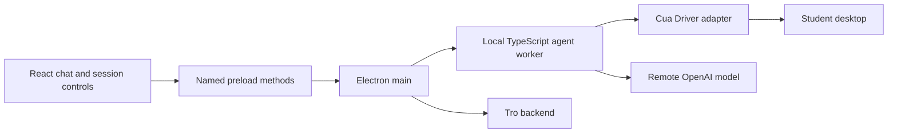

# Screen-aware teaching assistant

Status: proposed engineering spec, September 30, 2026. None of the agent or desktop-observation behavior described here is implemented yet. The current application only checks backend and database readiness.

## Product goal

A student starts a Tro session, asks a question about what is on their computer, and gets guidance grounded in the current screen. Tro can bring a relevant app forward or open an existing file as a tab in VS Code to show where to look. The assistant teaches the student what to do next; it does not edit the student's work or complete the task for them.

The student should not face an approval prompt for each observation or navigation step. A visible session state and Stop control define when Tro is active. Operating-system screen and accessibility permissions are requested only as required by the platform.

## First-release scope

| Capability | First-release behavior                                                                                                                                                                                               |
| ---------- | -------------------------------------------------------------------------------------------------------------------------------------------------------------------------------------------------------------------- |
| Observe    | Read the current visible desktop, app/window state, and useful on-screen text while a student-started session is active. Do not restrict observation to a single app by default.                                     |
| Explain    | Answer questions, describe the current screen, and give the student the next steps. Keep the student responsible for the actual work.                                                                                |
| Navigate   | Launch or focus an app and open an existing file/tab in VS Code when that helps demonstrate an explanation. Navigation may require a click or operating-system open action; those actions are limited to navigation. |
| Stop       | Stop the local run and further capture when the student ends the session. Show whether screen observation is active.                                                                                                 |

Editing files, typing into the student's work, running terminal commands, submitting assignments, sending messages, purchases, deletion, and general autonomous computer operation are outside this first release. Do not expose a general shell, arbitrary file-write API, or unrestricted IPC to the renderer. A future feature that needs one of these actions must define it explicitly.

“Give the agent everything” means broad **observation of the visible desktop during an active session** and enough navigation to show the student where to go. It does not mean exposing every Cua Driver action. The distinction matters because opening an app or tab is itself a computer action, even though Tro is not doing the student's work.

## Runtime and ownership

- **React renderer** owns the chat, active-session indicator, progress, and Stop control. It receives observations and answers through named preload methods; it does not receive raw desktop authority or secrets.
- **Electron main** starts and stops the local worker, verifies the IPC sender, and forwards only the named session operations. It remains responsive while an agent run is in progress.
- **Local worker** owns one Agents SDK run at a time for a session, the teaching instructions, conversation state, cancellation, and the desktop tool adapter. The SDK manages model/tool turns; the remote model chooses the next step.
- **Cua Driver adapter** translates the agent's observation and navigation requests to Cua's typed TypeScript SDK or another supported local integration. Cua's native core performs desktop operations and returns results. Tro does not call the private native core directly. Validate the chosen packaging and operating-system permission model on Windows and macOS before committing to one Cua integration mode.
- **Tro backend** handles account/session records and a credential path when those product features exist. It does not receive every desktop action as a prerequisite for local observation. If Tro funds model calls from a local worker, an authenticated backend model gateway must be implemented and tested before release; do not ship a shared OpenAI key in Electron.

The model is remote unless a separate local-model feature is explicitly built. Screenshots and extracted screen text sent to the model leave the student's machine. Screen content and screenshots must not enter ordinary application logs.

## One session and one turn

1. The student starts a session. Tro shows that screen observation is active and verifies the operating-system permissions needed for the chosen Cua integration.
2. The student asks a question. React sends a typed `AskTeachingAssistant` request through preload and Electron main to the worker.
3. The worker captures relevant desktop state, sends the question and observation to the model through the Agents SDK, and streams progress to the UI.
4. The model can answer immediately, request a fresh observation, or request a navigation action. The worker maps that request to a Cua operation and returns the result to the SDK. The SDK continues the model/tool loop until it produces an answer or the student stops the run.
5. The UI displays the explanation and any navigation performed. On Stop, the worker cancels the run and ends further screen capture for that session.

The observation → request → action/result → observation loop uses the Agents SDK and Cua public interfaces. Tro does not duplicate OpenAI's computer-call protocol or Cua's internal SDK-to-core contract.

## Contracts Tro owns

Keep contracts small and validate data crossing process boundaries. Use Zod schemas in `src/contracts` only when both sides need the same semantics; do not mirror entire vendor SDK types.

| Boundary                 | Initial contract                                                                                                          |
| ------------------------ | ------------------------------------------------------------------------------------------------------------------------- |
| Renderer → main/worker   | Start session, ask question, stop session.                                                                                |
| Worker → renderer        | Session state, answer text, progress, recoverable error.                                                                  |
| Worker → desktop adapter | Observe desktop; launch or focus a named app; open an existing file in VS Code.                                           |
| Desktop adapter → worker | Observation or navigation result, including a structured failure when the OS denies access or the target cannot be found. |

The worker should hold screenshot bytes only as long as needed for the run. UI progress can describe what was observed or opened without copying sensitive screen content into logs or backend analytics.

## Teaching behavior and guardrails

Use one teaching agent with detailed instructions: explain the current situation, give actionable learning steps, and avoid doing the student's work. The first release does **not** add a second model-based guardrail agent, SDK input/output tripwires, or a human-review prompt on each action. Those mechanisms can be considered later if a concrete product behavior needs them.

The tool surface is the product boundary: broad observation, limited navigation, no editing or general execution. This is not a model judgment about whether an action is sensitive; it is the list of behaviors the first product actually supports. Operating-system grants and Cua's own runtime behavior still apply. A student-started session and Stop control remain visible and usable throughout a run.

## Build order and acceptance

1. Add a local worker with an in-memory teaching-agent run and typed start/ask/stop events. Verify cancellation and renderer/main isolation.
2. Integrate one Cua observation path on macOS and Windows. A student can start a session, ask what is visible, receive a grounded explanation, and stop capture.
3. Add navigation to launch/focus an app and open an existing VS Code file/tab. Verify the UI reports what happened and that the student's file remains unchanged.
4. Exercise failure cases: missing OS permission, closed target app, unavailable model, worker crash, and Stop during a pending model/tool call. No further capture occurs after Stop.
5. Choose and test the model credential path, packaging, and installer behavior before a public release. Verify on both target operating systems rather than inferring support from TypeScript types.

Keep the first end-to-end demonstration small: the student opens a project in VS Code, asks where a particular concept appears, Tro reads the visible context, opens the relevant existing tab if needed, and explains what to inspect next without editing code.

## References

- [OpenAI Agents SDK tools and computer interface](https://openai.github.io/openai-agents-js/guides/tools/)
- [Cua Driver integration choices](https://cua.ai/docs/concepts/choose-a-cua-driver-integration)
- [Cua Driver in-process SDK](https://cua.ai/docs/how-to-guides/driver/use-sdk-in-process)
