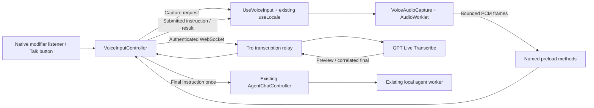

# Push-to-talk instructions

Status: implementation added October 1, 2026. This describes the code and its release requirements. Live microphone accuracy, real provider latency, and packaged OS shortcut behavior still require interactive verification. No deployment or paid provider test is implied.

## User behavior

Voice input starts automatically after signing in, with no enable/disable setting. The workspace shows the platform shortcut and explains that held-key audio goes to OpenAI and releasing sends the recognized instruction automatically. macOS requests microphone and Tro Accessibility permissions at startup; missing shortcut permission leaves the Talk button available. After granting access, use **Check voice permissions again** in the workspace. Signing out or closing the window stops the listener and cancels capture; signing in starts it again. Stale startup replies cannot reactivate voice after an account change. Voice uses the current `useLocale().locale`, with no separate speech-language preference.

- Mac default: hold Command + Control.
- Windows default: hold Control + **Left** Alt. Right Alt is excluded because Windows uses it for AltGr.
- Pressing the second modifier starts preparation and microphone capture. Releasing either stops recording. Both modifiers must be released before final instruction admission or another hold.
- A Talk button supports pointer holds and Space/Enter holds, including when the native hook is unavailable.
- Partial text is a preview. Only the complete final transcript starts an agent task. The accepted instruction appears immediately; typed drafts remain untouched.
- Escape, Cancel, sleep, screen lock, account change, window close, or an error cancel capture. Late results from canceled captures cannot start tasks.
- A running agent blocks voice activation and concurrent text admission. This also prevents agent keyboard actions from activating voice. Voice retains the existing independent-task behavior and does not add conversation memory.

No microphone tracks remain open between holds. Wait for the listening indicator before speaking on a cold microphone start; hardware activation cannot be instantaneous. A five-second bounded audio queue preserves captured speech while the relay connects. Releasing before the relay is ready stops the microphone immediately and waits for the connection to finalize already captured speech; it does not discard the command. Escape or an error cancels it.

## Transcription choice and latency

The backend uses `gpt-live-transcribe`, 24 kHz mono PCM16, `turn_detection: null`, and `delay: low` by default. It sends `languages: [locale]`: `en` for English or `vi` for Vietnamese. The language is snapshotted when the hold starts. Changing the app language during a capture applies to the next capture. Each capture has a fresh provider session, so there is no stale warm-session language to reconcile. [OpenAI live transcription](https://developers.openai.com/api/docs/guides/realtime-transcription).

OpenAI lists GPT Live Transcribe at $0.017 per audio minute, approximately **$1.02 per audio hour**, before the separate agent cost. The previously discussed $0.18/hour corresponds to a different mini transcription model, not this live model. [Model pricing](https://developers.openai.com/api/docs/models/gpt-live-transcribe).

Sub-millisecond cloud transcription is not achievable. Initial release-to-final targets are p50 300 ms and p95 800 ms, pending measurement. Frame buffering, microphone activation, network travel, provider recognition delay, and agent-worker startup contribute separately. The provider's `delay` setting trades recognition context for latency; it is not a PCM frame size or a guaranteed number of milliseconds.

The AudioWorklet emits up to 20 ms of real samples per frame, without silence padding. On release, it emits the short tail and acknowledges flushing. React waits for every frame's main-process acknowledgment before sending `finish(lastSequence)`. Main and the relay independently reject sequence gaps. The relay sends `input_audio_buffer.commit` only after this tail. The adapter correlates the final transcript with `input_audio_buffer.committed.item_id`; a foreign item's final cannot start the agent.

The implementation opens one WebSocket per capture and closes it after completion/cancellation. Warm transport reuse and worker preparation during recording are later optimizations, justified only after measurements.

## Runtime path and ownership



Main owns capture identity, account rechecks, deadlines, cancellation, and final submission. React never submits the final transcript again. It receives validated task events and displays them in memory. The existing agent controller still checks sign-in and desktop control permissions and owns the worker. Text submission accepts an explicit instruction rather than depending on a preceding React state update.

The native listener owns physical key state, auto-repeat suppression, first-release stop, and both-release rearming. It is loaded during authenticated voice startup after OS permission checks. Mac requires Tro's own Accessibility permission; CuaDriver's grant is separate. Missing hook access leaves the Talk button available. Packaged permissions, Input Monitoring requirements, background recording and Windows AltGr behavior must be tested on each supported OS.

The sandboxed renderer owns microphone resources. Electron's permission check and request handlers allow audio only for the trusted main frame during an active capture. Cameras, other permissions, and unrelated frames are denied. macOS packaging includes `NSMicrophoneUsageDescription` and the audio-input entitlement. Microphone tracks stop on release/cancel even if device setup completes late.

Closing the window detaches it before canceling voice. Voice event delivery checks both the window and web contents for destruction, so cleanup and late callbacks can finish without sending IPC to a destroyed renderer.

The native addon is external to the JavaScript bundle. Desktop preparation copies `uiohook-napi` and its `node-gyp-build` loader, with native prebuilds unpacked from ASAR. Backend dependencies remain out of the desktop package.

## Public contracts and authentication

`src/contracts/DesktopLocale.ts` owns the existing locale vocabulary and its validator. Renderer `localization/Locale.ts` re-exports it and retains the language registry, Vietnamese default, catalog selection and local storage. The voice hook reads the existing locale context directly through a current-value ref, avoiding locale-driven subscription churn.

Main retains that capture locale and passes it alongside the final instruction through `AgentChatController` and the validated worker turn contract. The Agents SDK instructions use the same locale for its reply and any recovery continuation. Typed tasks read the same hook at submission. A language change applies to the next task without restarting the app or adding a separate setting; see [ComputerUseSpec.md](ComputerUseSpec.md).

`VoiceInput.ts` defines named desktop commands, status/events, capture identity, bounded PCM bytes and sequence numbers. `Transcription.ts` defines relay credentials, commands, normalized provider-independent results, and audio limits. Unknown IPC, HTTP, socket and provider data is validated at the owning boundary. Raw OpenAI events do not cross preload.

Preload exposes `controlVoiceInput`, `appendVoiceAudio` and `subscribeVoiceInput`; it exposes no general IPC or arbitrary network destination. Main verifies sender web contents, main frame, and exact trusted document. Audio uses a narrow acknowledged IPC invocation with one invocation in flight, rather than a private MessagePort. This simpler initial transport preserves ordering and bounded queues; benchmark it before introducing a port.

- `POST /api/v1/transcription/credential` requires the signed-in Tro cookie, capture UUID and supported locale. It reserves a capture allowance and returns a token with `Cache-Control: no-store`.
- `POST /api/v1/transcription/cancel` releases only the signed-in account’s unclaimed reservation; it cannot refund an active provider connection.
- `GET /api/v1/transcription/stream` upgrades to WebSocket only with the Tro cookie and a matching transcription bearer token in the authorization header.
- Tokens have a two-minute expiration, separate derived signing key, `transcription` scope, `tro-transcription` audience, and capture UUID as `jti`. A model credential cannot authorize this endpoint.
- A database-backed claim allows each credential to open a provider connection once. Signing out before connecting fails the session check; main also rechecks account identity before submitting the instruction.

No token is placed in a URL or exposed to React. The product OpenAI key remains on the backend. Audio, transcripts, provider payloads and credentials are excluded from ordinary logs and persisted task data.

## Usage limits and persistence

Captures are capped at 60 seconds of audio. A single account may have one active reservation across API replicas. PostgreSQL transactions reserve the entire 60-second cap before opening the paid upstream; daily usage defaults to 3,600 audio seconds per account, with UTC day boundaries. Sample counts come from validated PCM byte length, not client-reported duration.

Normal close settles once and refunds unused samples. Canceling setup releases an unclaimed reservation through an authenticated cancellation endpoint, including when the credential arrives after key release. Claimed connections cannot be refunded by that endpoint; their socket lifecycle settles actual samples. A crash or failed refund conservatively retains the full reservation; an expired lease becomes available after two minutes. A capture must have the entire cap available to reserve, so the last less-than-60-second allowance cannot start a capture. Old settled/expired capture metadata is cleaned for the account during subsequent reservations after token expiry plus one day. Usage rows contain counts, not audio or transcripts.

The existing `OPENAI_API_KEY` remains backend-only in `Env.ts`; leaving it absent disables credentials. Voice defaults belong in `src/server/features/transcription/TranscriptionConfig.ts` as typed constants: `DAILY_AUDIO_SECONDS: 3600` and `RECOGNITION_DELAY: TranscriptionDelay.LOW`. The shared `TranscriptionDelay` values, derived type and validation schema live in `src/contracts/Transcription.ts`; consumers import that contract instead of repeating delay strings or unions. The same contract owns `TranscriptionEventKind` for ready, preview, final and failed events; its values drive event validation, server emission and desktop consumption. Startup passes these values to the relay and provider adapters. Change that feature configuration when tuning the daily allowance or recognition delay; neither needs a new environment variable.

Development startup (`pnpm dev` or an environment-configured `pnpm dev:api`) applies the additive `20261001150000_transcription` Prisma migration automatically before starting the API. Hosted releases apply it through the normal reviewed migration/deployment workflow. Runtime API requests and the desktop never run migrations or reset existing databases.

Main has a ten-second preparation timeout, a sixty-second hold timeout that cancels, and a twenty-second finalization timeout. The server independently enforces setup, capture and finalization deadlines. Both socket directions bound outbound buffering, reject oversized messages and close on protocol errors. Captures shorter than 100 ms return empty without committing; blank finals never execute. No automatic retry can cause a second agent task.

## Code structure

```text
src/contracts/
  DesktopLocale.ts          Existing shared locale values and schema
  VoiceInput.ts             Desktop commands, events and PCM validation
  Transcription.ts          Relay contracts, event kinds, delay values/type/schema and audio bounds
  DesktopBridge.ts          Named preload capabilities
src/desktop/main/voice/
  GlobalVoiceShortcut.ts    Native listener and physical chord state
  TranscriptionClient.ts    Authenticated Tro socket and backpressure
  VoiceInputController.ts   Capture lifecycle and sole final admission
src/desktop/renderer/voice/
  UseVoiceInput.ts           Existing locale hook, audio queue and lifecycle
  VoiceAudioCapture.ts      Microphone, AudioContext and worklet cleanup
  VoiceAudioProcessor.ts    Audio-thread PCM16 conversion and tail flushing
  VoiceInputPanel.tsx        Hold controls, preview and capture status
src/server/features/transcription/
  TranscriptionConfig.ts             Typed daily allowance and recognition delay defaults
  ports/LiveTranscriber.ts            Provider-independent live capture
  ports/TranscriptionAllowance.ts     Atomic reservation/claim/settlement
  application/TranscriptionSession.ts Sequence, sample limits and deadlines
  infrastructure/OpenAiLiveTranscriber.ts       Provider protocol and correlation
  infrastructure/RegisterTranscriptionRoutes.ts Authenticated HTTP/WS adapters
src/server/persistence/
  PrismaTranscriptionAllowance.ts     Prisma-only quota and lease implementation
```

`Main.ts`, `Preload.ts`, `AuthClient.ts` and `StartApi.ts` compose these feature modules. App owns the voice hook across navigation. `VoiceInputPanel.tsx` and both localization catalogs own disclosure and permission recovery copy; Settings has no voice activation controls. No general event bus, sibling imports or new service is needed.

## Verification and release evidence

Automated tests cover both chord orders, repeat suppression, first/both-key release, AltGr exclusion, Escape/reset, ordered frame/tail admission, duplicate/stale finals, busy activation, canceled setup, early release during connection setup, account changes, locale snapshots without resubscription, startup buffering, draft preservation, schema limits, scoped authentication, adapter item correlation and sample settlement. Local fake sockets/providers require no keys or paid calls. PostgreSQL integration tests exercise concurrent admission, single-use claims and idempotent refunds using the disposable integration database.

Final repository checks are lint, formatting, typecheck, unit tests, backend/desktop builds and disposable PostgreSQL integration. Build checks establish compilation and packaging inputs; they do not establish OS behavior or live accuracy.

Before shipping installers, perform packaged Mac/Windows smoke tests for microphone permission denial/recovery, Tro Accessibility/Input Monitoring, both key orders, AltGr, quick holds, last-word flush, sleep/lock, reconnects and background capture. Then measure authorized real provider runs in English and Vietnamese, including regional accents, code-switching, negation, app names, amounts and URLs. No live provider evaluation is part of default tests.

Measure microphone-ready, first frame, release, final tail acknowledgment, provider commit/final, task admission and worker startup separately. Report p50/p95/p99, sample count, warm/cold conditions and command correctness. Do not log command text for latency telemetry. Provider data retention must be verified for the deployment account separately from Tro's local no-storage behavior.
