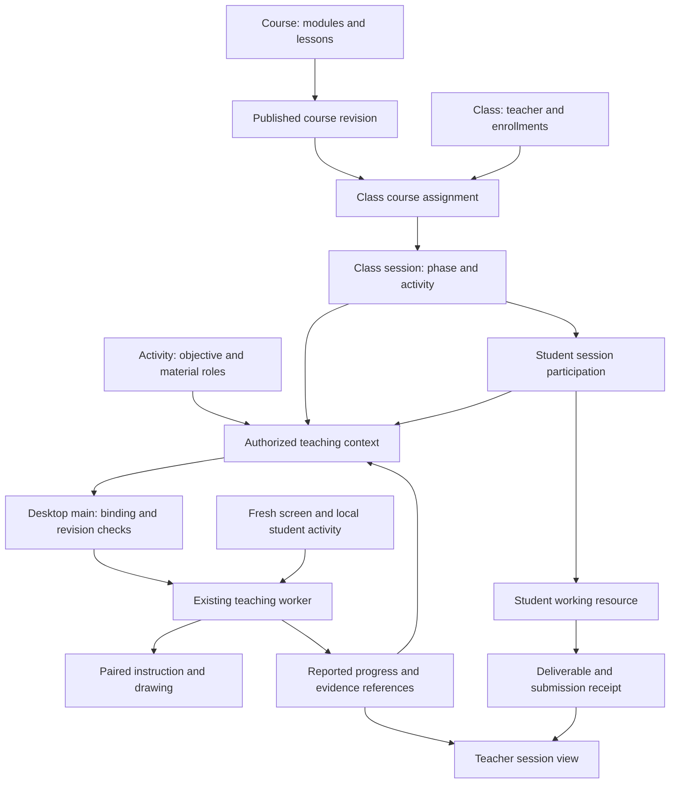

# Classroom context engineering spec

Status: initial implementation added October 3, 2026. The design below retains the
full target scope; [ClassroomImplementation.md](ClassroomImplementation.md) records
what is implemented, its pilot defaults, and the deferred capabilities. The user
authorized implementation after the planning review. This is not release approval.

## Decision

Keep teaching in the teacher's hands. Tro supplies individual help grounded in
today's activity, prepared materials and the student's actual work. The whiteboard
remains the shared explanation surface. Student devices do not automatically replay
the teacher's demonstration or perform the assignment.

Use the existing backend modular monolith for curriculum, class authorization,
participation and durable progress. Extend the existing desktop teaching worker
with a validated context snapshot. Preserve its local input scheduling, fresh screen
observations and paired instruction/drawing presenter.

Recovery and submission are business capabilities exposed through narrow tools.
Dedicated “Back to my task” and “Submit my work” buttons are optional interface
decisions, not architectural requirements. Typed and voice requests can invoke the
same capabilities; quiet classroom interaction must remain possible.

## Basis and current implementation

Customer evidence comes from the August 24 interview and Duc's August 25 notes,
supplied in this conversation. They describe repeated walk-around checking, input
mistakes, students losing their place, finished work not submitted, repeated resource
setup, course assignment to classes, and prepared slides, Scratch projects and
YouTube resources. The latest clarification describes teachers explaining prepared
files before students work. These support the workflows below; the entity structure
and contracts are engineering proposals, not requirements quoted from the customer.

The private interview notes remain outside this repository. This spec records only
the relevant product requirements. It does not import source from the notes vault.

| Boundary               | Current evidence                                                                                                                     | Planned extension                                                                                              |
| ---------------------- | ------------------------------------------------------------------------------------------------------------------------------------ | -------------------------------------------------------------------------------------------------------------- |
| Identity               | [Prisma schema](../../prisma/schema.prisma) has users, accounts and login sessions                                                   | Class enrollment and authorized session participation                                                          |
| Desktop commands       | [AgentSession.ts](../../src/contracts/AgentSession.ts) carries message, mode, locale and worker-session identity                     | A scoped classroom context reference and validated worker snapshot                                             |
| Teaching memory        | [TeachingTaskRunner.ts](../../src/desktop/worker/teaching/TeachingTaskRunner.ts) creates a new lesson context for a new task         | Seed a run with durable activity context and progress, without restoring stale screen geometry                 |
| Input and presentation | [Teaching loop spec](../teaching/TeachingLoopEngineeringSpec.md) documents local input waits, fresh captures and paired presentation | Preserve these mechanisms; add classroom authorization and revision fences                                     |
| Model transport        | [RegisterModelGateway.ts](../../src/server/auth/RegisterModelGateway.ts) authenticates model access                                  | Classroom APIs separately authorize content and actions; a model credential does not grant teacher permissions |

The current implementation now includes classroom records, explicit participation,
working resource references and Scratch-link submissions. This design does not claim
universal browser-tab recovery, file parsing,
automatic grading, offline model operation or automatic submission.

## Target classroom workflow

1. A teacher prepares a course activity with materials, an objective, prerequisites,
   completion criteria and a submission requirement, if any.
2. They assign a published course revision to a class and start today's session.
3. Students authenticate and explicitly join that live session. Enrollment authorizes
   joining; it does not establish attendance by itself.
4. During explanation, the teacher demonstrates on the whiteboard. Tro remains
   quiet unless a student asks for help. Opening an approved resource is a separate,
   explicit action from demonstrating or changing a student's project.
5. During practice, Tro combines activity context with the student's working resource,
   question, recent activity and fresh screen. It guides the next reachable step.
6. A lost student asks to find their work. Tro tries to resume their existing working
   resource, rather than opening another starter copy.
7. A student asks to submit. Tro prepares the required artifact or link, checks what
   it can support, and reports submission only after a backend receipt.
8. The teacher sees participation, reported progress, help requests and submissions.
   Missing or uncertain evidence remains visible as uncertainty.

The first pilot must complete this path for one agreed activity and deliverable
format. Generic file support and every proposed teacher control are not prerequisites.

## Data ownership and entities



| Entity                   | Owner and purpose                                           | Important relationships or constraints                                                                                                          |
| ------------------------ | ----------------------------------------------------------- | ----------------------------------------------------------------------------------------------------------------------------------------------- |
| `Course`                 | Courses feature; reusable curriculum                        | Ordered modules and lessons; each lesson contains activities                                                                                    |
| `CourseRevision`         | Courses feature; immutable published content                | Includes versioned activities and material references; drafts are editable, publishing produces a new revision                                  |
| `Activity`               | Courses feature; one meaningful learning task               | Objective, materials, conditional prerequisites, criteria, assistance guidance and optional submission requirement; scoped to a course revision |
| `Class`                  | Classroom feature; a teacher's student group                | Authorized teacher ownership; no self-selected teacher role from a client                                                                       |
| `ClassEnrollment`        | Classroom feature; membership                               | Unique class/student pair with active or revoked membership                                                                                     |
| `ClassCourseAssignment`  | Classroom feature; assigned content                         | References an immutable course revision                                                                                                         |
| `ClassSession`           | Classroom feature; today's meeting                          | Assignment, current activity, phase, assistance policy, lifecycle and context version                                                           |
| `SessionParticipation`   | Classroom feature; a student who joined                     | Unique session/student pair; reconnect resumes the same record; connection presence is separate                                                 |
| `StudentActivityAttempt` | Learning feature; one student's run at an assigned activity | Participation and immutable activity revision; explicit restart creates another attempt, reconnect does not                                     |
| `StudentTaskWorkspace`   | Learning feature; the student's actual work                 | Participation/activity attempt and a working resource reference, distinct from a starter or demonstration                                       |
| `StudentTaskProgress`    | Learning feature; durable progress summary                  | Activity attempt, progress version, attempts, criteria evidence, blockers and review status                                                     |
| `TaskSubmission`         | Learning feature; an accepted hand-in                       | Participation, activity attempt, artifact reference, idempotency key, immutable receipt and server timestamp                                    |

Modules and lessons are curriculum structure, not separate services. Create database
tables only when their relationships and queries require them. Center-wide roles,
CMS rosters and multi-teacher administration are later extensions; the first version
must enforce class ownership and enrollment without assuming those features exist.

Keep identifiers distinct: the existing authentication `Session`, desktop agent
`sessionId`, `ClassSession`, worker `lessonId`, curriculum lesson and activity attempt
represent different lifecycles. Use `classSessionId`, `curriculumLessonId`,
`participationId` and `activityAttemptId` at new boundaries. Do not silently reinterpret
the existing wire fields.

## Identity, joining and presence

The backend derives student identity from authentication. Clients submit session
references, not an authoritative student ID. Joining verifies that the session is
live and the student has an active enrollment. Reads and writes repeat authorization
checks, including teacher ownership and student-specific artifact access.

In the implemented flow, a teacher-issued shared or email-bound invitation code
allows a verified signed-in account to enroll. It does not grant Teacher permissions
or automatically join a live session. Expiry and revocation apply to enrollment codes.
Session listing returns only sessions the caller can join. Rejoining is idempotent.
One desktop binds to one classroom participation at a time in the first version;
switching explicitly releases the previous binding before starting new guidance.

Students on shared computers need their own authenticated identity. A device ID,
shared teacher account, matching IP address or time of day cannot identify the
student. The existing Google login can support initial testing, but the pilot's
student identity method requires review before implementation.

Keep these facts separate:

| Fact                           | Source                                                                  |
| ------------------------------ | ----------------------------------------------------------------------- |
| Enrolled                       | Backend enrollment                                                      |
| Joined the meeting             | Participation record                                                    |
| Device connected               | Expiring connection presence                                            |
| Recently active                | Bounded student input/task events                                       |
| Progress supported by evidence | Reported criterion observations with provenance                         |
| Submitted                      | Backend submission receipt                                              |
| Reviewed or graded             | Explicit teacher decision or a separately supported assessment workflow |

Presence uses a lightweight heartbeat, initially proposed at 20 seconds with a
60-second connection expiry. These are configurable pilot defaults, not attendance
rules. Expiry means disconnected or unknown; it does not mean the student failed
or left class. Use one active controlling device lease per participation for the
first version. A second-device takeover invalidates the prior binding, avoiding
competing workers and duplicate submissions.

## Teacher phases and authority

Teacher-paced sessions expose the current activity; self-paced sessions expose all
assigned activities so students can choose separately. Prepared content availability
and the bounded content supplied to each model run are different concerns. The
teacher can start without a minimum student count; late joiners receive the current
phase and activity.

Session lifecycle is `draft → live → ended`. Phase while live is explanation,
practice, submission or review. The teacher can move between phases; phase changes
do not reset student progress or imply task completion.

| Phase       | Default Tro behavior                                                                                              |
| ----------- | ----------------------------------------------------------------------------------------------------------------- |
| Explanation | No unsolicited demonstration; answer requests about the current topic and help recover the intended resource      |
| Practice    | On-demand step guidance continues toward the activity outcome, with student actions and fresh result observations |
| Submission  | Help check and collect the specified deliverable; do not claim grading                                            |
| Review      | Explain teacher feedback when requested; do not alter submitted artifacts                                         |

The teacher chooses whether students may advance to later activities and which
recovery actions are allowed. Classroom capabilities must be enforced by code and
tool exposure, not only by model instructions. Signing in does not authorize arbitrary
desktop execution. The existing Show me / Do it for me choice remains explicit;
teacher materials must not silently switch the student's action mode.

An optional later teacher command can open an approved material or present a shared
instruction on selected devices. It carries a command ID, session/context version,
target participation, expiry and per-device acknowledgments. Received, opened,
presented and student-completed are separate outcomes. Commands must not overwrite
student work or replay automatically after expiry on reconnect. Broad remote control,
continuous teacher screen broadcasting and running assignment steps for students
are outside the first version.

## Prepared materials and application adapters

Each material has a stable reference, version, display name and explicit role:

| Role            | Meaning                                                             |
| --------------- | ------------------------------------------------------------------- |
| Demonstration   | What the teacher explains; may be a completed project               |
| Starter         | What a student begins from; create or identify their working copy   |
| Reference       | Slides, video or instructions supporting the task                   |
| Expected result | An example or criteria used to explain the intended outcome         |
| Student work    | The student's editable result, owned through their workspace record |

A material can have multiple roles, but they must be explicit. A demonstration is
not automatically an assignment. A starter URL is not the identity of an unsaved
working project. A file location on the teacher's machine is not accessible from
student machines: shared files need an authorized material upload and delivery path.
File storage is planned infrastructure and requires a bounded upload/download port;
Prisma stores metadata and access relationships, not desktop paths or file bytes.

The shared activity contract describes intent and deliverables. Focused adapters
can inspect a format, open a resource, identify the student's work or collect a
deliverable. Start with one supported format. Unknown formats use teacher-authored
summaries and visible screen evidence, with their limitations stated.

For the first version, teachers approve objectives, material roles, prerequisites
and criteria. Automatic extraction is optional later assistance, and its output
requires teacher review. Material text is source content, not authority to change
permissions or execute instructions. Full files, transcripts and videos are not
automatically sent to every model request.

## Teaching context and goal continuity

`TeachingContextBuilder` is a backend application service. It loads only authorized
content for the selected activity and student. It returns a bounded, schema-validated
snapshot with:

- Class session, participation, activity attempt and course revision references.
- Session context version, student progress version and current phase.
- Objective, relevant prerequisites, criterion IDs and submission requirements.
- Teacher-approved material summaries and scoped references.
- Assistance policy and a compact student progress/workspace summary.

Desktop main loads this snapshot through authenticated classroom APIs. The renderer
selects references; it cannot supply authoritative teacher policy or another student's
progress. Main sends the validated snapshot over its private worker channel. Model
gateway credentials remain model-scoped and separate from classroom authorization.

The worker combines the snapshot with the student's question, current setting locale,
recent interaction attempts and a fresh desktop capture. Teacher context anchors the
activity outcome; the student's request identifies the help needed now. Assistance
checkpoint completion, the student's current request and the whole activity's
completion are evaluated separately. A new short follow-up must not replace the
assignment with a narrower goal such as “click the flag.” The model may revise its
checkpoint interpretation, but cannot rewrite teacher criteria or permission rules.

Example: for a task requiring green-flag execution, a connected move/say stack alone
does not satisfy the required trigger. Scratch can also run a stack by clicking it
directly, so a flag event is a conditional prerequisite for that outcome, not a rule
that every Scratch tutorial must start with an event. Distinguish tutorial pictures,
the block palette and the student's actual project workspace.

Durable task progress seeds later runs after worker settlement or reconnect. Raw SDK
conversation history, screenshots, capture IDs and cue coordinates remain ephemeral.
Reloading a task always obtains fresh screen evidence before proposing a spatial
action. Persisted observations are historical reports, not proof of current state.
Context improves intent and continuity; semantic interpretation still requires
real-model evaluation.

Progress reports reference canonical activity criterion IDs and their observed source.
The server validates ownership, revision, provenance shape and ordering; it does not
independently prove a model's visual interpretation. Keep model-supported completion,
student-declared completion and teacher review distinguishable. An activity with no
submission requirement can finish without a hand-in; a required hand-in remains
outstanding until a receipt exists.

## Recovery and submission tools

The names below describe proposed responsibilities, not existing tools or public APIs.

### Resume the student's work

`resume_activity_workspace(activityAttemptId)` resolves the student's registered
working resource through the authorized desktop binding:

1. Try to identify and focus the existing application/tab through supported adapters.
2. If the reference is unavailable, inspect the current interface and guide recovery.
3. Reopen a saved working resource when appropriate; do not clone the starter again.
4. If the project is unsaved, preserve it and help save or identify it before switching.
5. Ask a focused question when several candidates remain or recovery could lose work.

The backend stores stable resource identity and supported project references.
Device-local handles stay in the desktop adapter and are revalidated on reuse.
Do not persist arbitrary local paths as cross-device resources or assume browser
tab enumeration is available on every platform. A narrow bridge resolves material
and workspace IDs; it does not expose arbitrary URLs or filesystem access.

### Prepare and submit a deliverable

`prepare_task_submission(activityAttemptId)` checks the activity's requirement,
identifies the student's deliverable and prepares a versioned summary. “I'm finished”
starts this check; it does not automatically authorize upload or establish completion.
An explicit “Submit this” request can authorize submission. Additional clarification
is needed only for ambiguous artifacts or a consequential change of destination.

`submit_task_work(preparedSubmissionId, idempotencyKey)` sends the prepared artifact
or link through the authorized backend port. Required guarantees:

- Bind the prepared submission to the student, activity attempt and artifact version.
- Detect changed artifacts when the adapter can; otherwise disclose that the version
  cannot be independently checked and let the teacher review.
- Validate file bounds or link requirements and access independently of model claims.
- Keep upload preparation distinct from committing the submission record.
- Issue a receipt only after the required artifact is durably accepted. A link receipt
  establishes hand-in, not that every external link is readable or correct.
- Reuse the idempotency key after a timeout and query status before retrying an
  ambiguous outcome. Retain preparation on failure instead of claiming success.
- Preserve submitted versions; a correction is another attempt, not a silent overwrite.

An unmet requirement gets a specific explanation and, where spatial guidance is
needed, a paired drawing. If verification is unavailable, mark the check unverified
and follow the teacher's submit/review policy. Never disguise uncertainty as a
failed student action or a completed assignment. Automatic submission and grading
are deferred; submission and teacher assessment remain separate.

## Context changes, reconnect and cancellation

Use separate session context and student progress versions. Each operation carries
the relevant session, participation, activity attempt and binding generation. The
backend rejects unauthorized or stale mutations. Main and the worker fence late
model output, presentation callbacks and tool calls from previous bindings.

| Event                                     | Required behavior                                                                                                                          |
| ----------------------------------------- | ------------------------------------------------------------------------------------------------------------------------------------------ |
| Teacher changes phase, activity or policy | Increment context version; invalidate affected pending work, clear obsolete cues, load the new snapshot, retain prior activity progress    |
| Teacher publishes a course revision       | Existing sessions remain pinned; adopting another revision is an explicit change with criterion mapping or a new attempt                   |
| Student progress changes                  | Increment progress version; record an idempotent event and refresh the compact summary                                                     |
| Student changes class/task                | Release old binding and presentation before admitting the next one; never migrate progress by guessing                                     |
| Network disconnect                        | Show unknown connection state; retain local work and stop remote mutations; do not silently continue class automation with stale authority |
| Reconnect                                 | Reauthorize, resume participation, fetch latest versions and pending receipts, then capture current screen                                 |
| Enrollment revoked or session ended       | Release classroom binding, stop class-scoped guidance and commands; keep the student's local files intact                                  |
| Student presses Esc                       | Cancel current guidance; retain enrollment, participation and durable progress                                                             |
| Ordinary click, typing, drag or scroll    | Existing observation loop records an attempt and evaluates fresh results; it does not cancel the class or prove completion                 |

Backend and desktop need a freshness limit for live class authority. On loss of the
classroom connection, pause class-scoped automation rather than trusting an indefinite
cached policy. A separately authorized general chat can remain available, clearly
outside the classroom binding.

Use one authenticated session-update stream with bounded reconnect/backoff and a
snapshot read on reconnect. It carries small version/status events, not screenshots.
Choose SSE or the existing WebSocket infrastructure during implementation; do not
introduce both, a generic event bus or another observer agent for this feature.

## Implementation ownership and API responsibilities

```text
src/contracts/
  ClassroomSession.ts
  TeachingContext.ts
  StudentTaskWorkspace.ts
  StudentTaskProgress.ts
  TaskSubmission.ts

src/server/features/
  courses/       # Revisions, activities and material metadata
  classroom/     # Enrollment, session lifecycle, participation and context builder
  learning/      # Workspaces, progress and submission workflows

src/desktop/main/classroom/
  ClassroomSessionController.ts
  ClassroomApiClient.ts

src/desktop/worker/teaching/
  TeachingLessonContext.ts     # Extend its input/context packet
  TeachingTaskRunner.ts        # Bind run lifecycle to the context generation
  TeachingPresenter.ts         # Preserve paired presentation

test/
  contracts/
  server/features/{courses,classroom,learning}/
  desktop/main/classroom/
  desktop/worker/teaching/
```

These are proposed files, not a mandate to create empty layers. Framework-free domain
rules and focused validation functions own invariants. Application services depend
on repository/storage ports. Fastify, Prisma, browser and storage adapters own I/O.
Use stateful classes for the desktop connection lifecycle and bounded teaching memory;
do not turn every validator into a class or add a second agent harness.

Versioned HTTP responsibilities are publish/assign curriculum, enroll students,
start/update/end sessions, list eligible sessions, join/resume participation, read
context, report presence/progress, register a working resource and prepare/commit/read
submissions. Define canonical Zod contracts before implementing routes. Derive fixed
value types from owned `as const` sets. Teacher writes and student writes have distinct
authorization rules. Reported progress uses a unique event ID and conditional version
update; persistence adapters commit related state and audit records atomically.

No renderer imports backend code, no Prisma in Electron, no raw SQL application
queries, and no sibling-repository source. File content arrives only through bounded,
authorized adapters. Existing environment validation owns any new configuration.

## Performance, diagnostics and privacy

Build context once per admitted run and refresh on relevant version changes. Include
only the current activity, required prerequisites and bounded progress; do not attach
the entire course or all materials. Record context size and source references to tune
limits. Reuse immutable material summaries; do not repeat extraction per student turn.

Preserve local input coalescing and on-demand captures. Presence and teacher status
updates require no inference and no continuous screen capture. Do not infer “stuck”
from inactivity alone; show help requests, repeated unsuccessful attempts or explicit
uncertainty. A teacher dashboard initially shows compact states and timestamps rather
than screen streams or rankings of children.

At uncertain failures, log the owning stage, correlation IDs, safe request references,
validated status/rejection, context versions and duration. Examples include
`classroom.join.refused`, `classroom.context.loaded`, `learning.workspace.resume.failed`
and `learning.submission.settled`. Distinguish model-proposed progress, native
presentation acknowledgment and server submission receipt. Do not log screenshots,
file contents, raw typed input, private resource URLs, credentials or hidden reasoning.

Teacher context cannot disclose other students' work to a student. Material and
submission delivery is access-controlled. Storage retention, deletion and hosted
model usage limits require explicit review before a classroom release; this plan
does not imply those controls already exist.

## Implementation sequence and removals

| Milestone             | Deliverable                                                                                                                    | Exit evidence                                                                                            |
| --------------------- | ------------------------------------------------------------------------------------------------------------------------------ | -------------------------------------------------------------------------------------------------------- |
| 1. Context foundation | Teacher-authored activity/material roles, published revision, class ownership/enrollment, live session and explicit joining    | Authorized student receives only their activity and progress; wrong class is rejected                    |
| 2. Desktop assistance | Session binding, phase/policy updates, durable task summary, one supported workspace adapter and context-seeded teaching       | Student recovers an existing project and receives useful paired guidance across follow-ups and reconnect |
| 3. Hand-in workflow   | One agreed deliverable format, bounded storage/link port, idempotent submission, receipt and minimal teacher status view       | End-to-end pilot task can be completed, submitted, retried and reviewed without losing work              |
| Later extensions      | Teacher resource dispatch, material extraction, CMS/roster imports, richer insight and explicitly enabled automatic submission | Separate scope, authorization and live validation                                                        |

Replace message-only context construction only for class-bound runs; general chat
keeps its existing behavior. Replace disposable activity summaries with persisted
task progress where this workflow requires it. Do not delete the presenter, action
schemas, native receipt checks, local input watcher, execution verifier, authentication,
gateway or locale behavior. No current tests are removed by this planning change.

During implementation, update tests that assume every classroom follow-up loses its
context. Retire duplicate prompt-string assertions only when meaningful behavior tests
replace them. Do not rebuild a large scripted harness or add tests that simply mirror
implementation details.

## Acceptance and final review

Keep tests concentrated on boundaries and representative workflows:

1. Authorization: enrollment differs from participation; wrong-class reads/writes,
   revoked students and unauthorized teacher commands are rejected.
2. Context: published revision is pinned; only relevant student/material data is
   included; phase changes and late callbacks cannot use an obsolete binding.
3. Continuity: follow-up and reconnect retain the activity outcome and durable progress,
   but reobserve the screen before drawing. Esc does not erase participation.
4. Recovery: focus the student's working project where supported; ambiguous or unsaved
   work is preserved, without creating another starter by default.
5. Submission: changed/incorrect artifacts, retry, timeout-after-commit, duplicate calls,
   inaccessible links and permission failures cannot produce a false success receipt.
6. Presentation: spatial instructions still require the paired native acknowledgment;
   text-only steps remain explicit. Classroom context cannot bypass this contract.

Use focused unit/contract tests, Prisma integration checks for isolation and atomic
submission, and a small production-flow fixture spanning join → context → guidance
→ recovery → receipt. Preserve existing teaching-flow checks. Real-model/native
acceptance must separately test the Scratch illustration/workspace distinction,
green-flag prerequisite, many-tab recovery and meaningful completion checks. Scripted
models can establish wiring, not understanding of a real lesson.

The following decisions are ready to carry into implementation after review: teacher-led
phases, explicit student participation, published content revisions, material roles,
per-student workspaces, bounded context, paired presentation, evidence-qualified
progress and receipt-backed submission. Optional buttons are not a launch requirement.

Resolve these items at final review before implementation depends on them:

| Decision                               | Proposed starting point                                                                   | Why it remains open                                                                                                   |
| -------------------------------------- | ----------------------------------------------------------------------------------------- | --------------------------------------------------------------------------------------------------------------------- |
| Student identity                       | Existing individual accounts for technical testing                                        | Customer must confirm own-account versus shared-device classroom workflow; do not assume children use Google accounts |
| First working resource and deliverable | One prepared Scratch activity with a student working copy and agreed file or link hand-in | Recovery adapter, storage and meaningful checks depend on the selected format                                         |
| Submission destination                 | Tro receives the hand-in; teacher reviews it                                              | Confirm whether the pilot requires an existing CMS; avoid building both paths speculatively                           |
| Assistance limits                      | Current activity, student performs learning actions, explicit recovery permissions        | Teacher must confirm advancing ahead, recovery execution and submission rules                                         |
| Distribution and retention             | Authenticated material delivery and private submission storage with documented limits     | File size, classroom device support, retention/deletion and model usage limits need concrete release values           |

Final review should use one teacher-prepared file, an explanation/practice transition,
two student identities, a lost-project scenario and a submission retry. Approve the
workflow and these outstanding choices before expanding to other formats or connectors.
