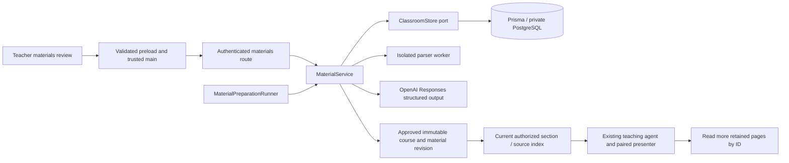

# Materials preparation implementation

This records the original materials preparation pilot and its storage, extraction,
review and approval boundaries. The implemented
[compact material context pipeline](MaterialContextImplementation.md) replaces the
whole-collection note generation and character-based runtime packing described below.
Read that implementation record for current generation stages, caching and student
context budgets.

Teachers create a class with only its name, upload their existing files, optionally add
HTTPS references and instructions, then click **Prepare materials**. File transfers
happen separately. One durable preparation job performs bounded extraction and one
structured OpenAI synthesis for this pilot's size-limited collection. The teacher
reviews Summary, Sections and Material notes, edits them, acknowledges source limitations
and unresolved questions, then chooses **Use reviewed materials**. These labels follow
the app's English/Vietnamese setting. Processing uses the selected language.

## Boundaries

`ClassroomMaterials.ts` owns the wire schemas and limits. `MaterialService` authorizes
teacher ownership, collection versions, batching, review and publication. Extractor
and preparation interfaces are application ports. Worker, OpenAI, Fastify and Prisma
remain adapters. No source code is executed. No provider key or database connection
enters Electron. Class/session/student/teacher authority remains in the existing
classroom service. A default class activity allows teacher-led sessions without
prepared context; it explicitly says that no reviewed material is available.

## Retention and processing

Original bytes are private PostgreSQL `bytea` records in this bounded pilot, not public
URLs. Supported inputs are PDF, PPTX, SB3, Python, Markdown and UTF-8 text. PDF text is
retained per page; original PDFs are also supplied to the vision-capable model to
prepare notes about diagrams. PPTX retains slide text and speaker notes. PPTX media
and layout require teacher review; upload a PDF export for visual interpretation.
Scratch stores each target's block graph, variables and asset references; costumes
and audio remain in the original SB3. Python/text preserve lines in ordered chunks.
Links are references only: the backend does not fetch remote sites or watch videos.
Unsupported files, protected PDFs, malformed archives, excessive pages and invalid
UTF-8 fail preparation visibly rather than produce a silently truncated lesson.

Extraction runs in a worker with a 30-second deadline and 256 MB V8 heap limit.
ZIP inflation is asynchronous with entry/count/expanded-byte bounds. These are
resource limits, not a promise that all native memory fits 256 MB. XML external
entity declarations are rejected. Parsers retain source text separately from model
notes and teacher corrections. Unchanged source pages reuse retained extraction on
re-preparation. PDF/model interpretation is fallible; a returned text page does not
prove all diagrams were understood. The review exposes originals and limitations.

Limits: 12 sources, 8 MB per original, 24 MB total stored originals per class (including
removed originals retained for prior revisions), 120 pages/chunks and 200,000 extracted
characters per batch. Large collections must be split; automatic chunked synthesis
is not implemented. PostgreSQL is the pilot storage adapter; migrate to private
object storage through an explicit port before larger hosted uploads. Records are
retained; automatic garbage collection is not implemented.

A job transitions collecting → queued → preparing → review → approved, or failed.
Queued jobs resume after process restart. Preparation leases expire after eleven
minutes; an expired in-flight job fails for explicit teacher retry, avoiding automatic
duplicate paid requests after an uncertain provider outcome. One runner call executes
at a time; database compare-and-swap versions prevent competing workers publishing
results. The provider has a four-minute deadline and no implicit retry. Backend budgets
allow 10 queued preparations per teacher/day and 100 globally/day; failure still
consumes the reservation. Logs contain identifiers, stage and safe error categories,
never originals, extracted notes or credentials.

Preparation failures also report elapsed milliseconds, source/page counts and a
specific reason: provider HTTP failure/timeout, incomplete output, missing page
notes, invalid source references, invalid draft, or changed source extraction.
HTTP failures retain the provider request ID and status; incomplete output retains
its status and stop reason. Validation logs contain issue counts, never source
values, raw provider error bodies or model output. Unknown exceptions remain
explicitly unknown. Diagnostics themselves do not schedule provider calls. The bounded citation repair
described below applies only after a completed composition fails reference validation.

## Approval and student context

Review changes never rewrite source extraction. Restoring a prepared note clears
only the teacher override. Saving or uploading does not update an approved lesson.
Approval atomically publishes an immutable course plus a material publication and
points the class at it. A live session blocks approval (including concurrent starts
through serializable transactions), so ongoing participants keep their revision.
The teacher can prepare and edit the next draft while a session is live. The former
course-JSON editor is removed from the UI; existing publish-course/create-class wire
commands remain compatible, including explicit course IDs.

Student requests receive the current section, summary, teacher instructions, source
index and a bounded selection of relevant detailed pages (24,000 characters). The
restricted `read_class_material_note` tool retrieves any additional approved page by
ID. This avoids throwing away source content to fit initial context. Only an active,
owned, authorized participation can call it. Sources remain reference data and cannot
replace system instructions or authorize desktop actions. Existing screen observation
and `present_teaching_step` still produce localized instructions and drawings together.

Downloads check class ownership or current enrollment plus inclusion in the approved
publication. Students cannot download unpublished drafts, other classes' files or
continue after enrollment revocation. Main fetches bytes with its session cookie,
opens a save dialog, and writes only the user-selected destination; renderer sees
file IDs, never arbitrary filesystem access. Originals do not auto-run after download.
The current hand-in workflow remains Scratch links for courses configured to require
that format; generated sections default to no hand-in requirement.

## Setup and verification

The new versioned Prisma migration adds private originals, collection/job state,
material publications and daily budgets. `pnpm dev` applies it through the existing
startup migration path. No live database is reset. The existing backend-only
`OPENAI_API_KEY` enables preparation; without it, teachers can create classes/upload
but preparation reports unavailable. Selected source text and PDFs are sent to OpenAI
only after **Prepare materials**. This does not constitute hosted launch approval.

Local checks cover preparation and review with a fake provider, actual parser inputs,
authorized downloads, source preservation, stale versions, failure/retry, student
context, and disposable PostgreSQL transactions/HTTP. Live OpenAI quality, signed
Electron upload/save dialogs and visual coverage still need manual acceptance with
a real teacher's documents.

## Desktop presentation

The production material workspace follows `MaterialContextDemo.html`: a three-step
header above a responsive two-column layout. `MaterialFiles.tsx` owns file selection,
dropping and reference links; both selection and dropping use the same upload port.
Link titles come from the validated URL hostname. `MaterialReview.tsx` displays the
summary and sections as readable text, with collapsed edit forms and source citations.
Original extraction and teacher overrides remain separate. The right review panel is
visible before preparation, during preparation and after review. Narrow windows stack
the two panels. Preparation limits and provider disclosure remain available.

`MaterialEditor.tsx` retains request ordering, version checks, polling, unsaved-edit
guards and save-before-approval. Reviewed materials expose the existing section picker
and start-session command through `TeacherClassroomPanel.tsx`; classroom management
and invitations remain in My classes. Teacher enrollment into another class is a
collapsed secondary action, while students retain the normal join form.

The classroom page explicitly fills the content width of `.panel-content`; it does
not use horizontal auto margins or a maximum page width. This matters because its
material workspace uses inline-size containment, so intrinsic child sizing cannot
be relied on to stretch a flex child. The shell still provides 40px side padding
(24px in smaller windows), and the material grid stacks at 670px of available
content width. Verify layout inside the AppShell and panel hierarchy rather than
only rendering an isolated editor.

### Processing visibility

The teacher file panel places **Process materials** / **Xử lý tài liệu** above the
file list; an existing draft changes it to **Process materials again**. It uses the
same batch preparation command and does not approve or replace a live lesson.
Each original shows **Not processed**, **Queued**, **Processing** (or **Processing
again**) and **Processed**. Saved draft page bindings identify previously processed
files even when new uploads invalidate the collection review. A failed new batch
does not erase that earlier processing status; the batch failure appears in the
review panel. Processing status does not imply teacher approval. Links always show
**Reference only**, with an explicit notice that their contents are not read.

## Preparation request diagnostics

The API emits `classroom.materials.provider.request` at the start and completion or
failure of each SDK call. `operation` distinguishes `count_input` from `generate`;
`generationStage` distinguishes a document `brief` from the final `composition`.
Use `jobId`, `classId`, `collectionVersion` and `stageKey` to follow a preparation,
and `localRequestId` to pair the two events for an individual call. Existing
`classroom.materials.stage.completed` events include those job/stage bindings and
`cacheHit`; a cache hit makes no provider request. The final
`classroom.materials.preparation.failed` warning also includes the job/version
and translated provider diagnostics.

Success records include counted or used input tokens, generated output tokens
when available, and a safe provider request ID for generation. Incomplete responses
also retain `usedInputTokens`, `usedOutputTokens`, `reasoningTokens` and request ID
when supplied, so output exhaustion can be measured without saving partial text. Request metadata
includes model, timeout, retry setting, output limit for generation, original file
byte count and passage/summary/document/source-unit counts. `durationMs` measures
that SDK operation, not the entire job. A completed provider event means the
adapter returned validated output; the later stage-completed event additionally
means citation checks and cache persistence succeeded.

Failure records retain the existing `reason`, plus `providerErrorKind`
(`connection`, `timeout`, `abort`, `http`, `validation`, `json`, `preparation` or
`unknown`). Known transport codes such as `ECONNRESET`, `ENOTFOUND` and
`UND_ERR_HEADERS_TIMEOUT` are extracted from at most four nested causes.
Unknown codes are omitted. HTTP status and safe request IDs are included when
available. `signalAborted` and bounded `abortKind` (`timeout`, `abort`, `other`)
distinguish the job's deadline signal from a provider timeout. The final warning's
`providerDurationMs` is the operation duration; its `durationMs` remains the job
elapsed time. Missing HTTP status/request ID alone does not establish a particular
network failure; use the error category and cause code as evidence.

For example, filter the API terminal output for
`classroom.materials.provider.request`, then find the `state: failed` event. A
`generationStage: composition`, `operation: generate`, `providerErrorKind: connection`,
`networkCauseCode: ECONNRESET` record identifies a connection reset during final
lesson generation. A `providerErrorKind: abort`, `signalAborted: true`,
`abortKind: timeout` record instead indicates the supplied deadline signal expired.
A started event without a terminal event can indicate a still-pending operation or
process termination; it is not proof of provider failure.

If the provider logs `state: completed` followed by
`classroom.materials.preparation.failed` with `invalid_source_references`, generation
finished but Tro rejected the draft's source bindings. Increasing time/output
limits does not resolve this rejection. The warning now includes a plain-language
`failureSummary`, the `generationStage`/`stageKey` for a fresh stage, and at most ten
`referenceIssues`. Each issue has an exact structural `path`, `expectedKind`,
`allowedReferenceCount`, and one of:

- `wrong_reference_kind`: an ID belongs to the other known namespace; `actualKind`
  identifies it. Section bindings and exercise criteria require page IDs; setup
  notes and document briefs require passage IDs retained in that stage's input.
- `reference_not_in_allowed_set`: the ID was not supplied as an allowed reference
  for that field. This alone does not prove that it was hallucinated rather than
  copied from stale material or the wrong namespace.
- `missing_required_reference`: source-backed content omitted the required
  citation. Uncited inferred suggestions remain allowed where they were before.

For example, `composition.sections[0].sourcePageIds[0]`, `expectedKind: page`,
`actualKind: passage` identifies the first section's page binding as a passage-ID
mix-up. `failureSummary` explains that requirement in a sentence. `sourceId` is
included only for a valid UUID; generated prose, section titles and filenames are
excluded. `referenceIssueCount` counts all rejected bindings,
`referenceIssuesTruncated` flags the ten-example cap, and `allowedPageCount` /
`allowedPassageCount` show the available reference-set sizes. Brief failures also
include `materialId` when rejected inside their generation stage.

The October 7 18:55 attempt in the supplied log reused four document briefs,
counted 8,780 composition input tokens, and completed generation in 43,791 ms with
5,273 output tokens against a 60,000-token limit. It then failed source-reference
validation. That older log did not retain the exact offending field or ID, so the
new diagnostic cannot reconstruct it retrospectively. A future explicit retry
will identify the binding if the same rejection recurs. Those diagnostics initially preserved the existing explicit-retry behavior. The
composition-only citation repair below is a subsequent change; the older log still
cannot establish the exact rejected citation.

These are bounded backend operational records, not content traces: source text,
file names, URLs, PDF/base64 bytes, teacher requests, outputs, credentials, headers,
raw error messages/stacks and arbitrary cause fields are never emitted by these
new events. Diagnostic events themselves do not change job behavior. Stage-specific output budgets and composition request timeouts are documented in
[compact material context implementation](MaterialContextImplementation.md). SDK retries remain disabled. Failed requests
are not automatically replayed, and adding logs does not retry an existing job.
Tests exercise the real SDK with mocked fetch responses; no live model calls are
needed to verify these diagnostics. Start events and successful terminal events
use info level; failures use warn level. Restart the API if it is not already using
Node's development watch mode before a future user-triggered preparation.

## Constrained citations and one repair attempt

Final composition receives `sourceMap`, an authoritative mapping of every passage
retained by the current document briefs to its original page and material. Normal
composition still sends compact briefs and page metadata, without all original
passage text. Brief generator version/cache keys stay unchanged; the added composition
input invalidates only the composition cache.

`MaterialCompositionFormat.ts` builds a source-specific wire schema. Section bindings
and exercise criteria can select only supplied page IDs; setup notes can select only
mapped passage IDs. Source-backed setup/criteria require nonempty citations. Inferred
suggestions may remain uncited. With no retained passages, setup can contain only
uncited suggestions; with no pages, composition stops before a provider request.
Shared enum definitions prevent repeating the ID lists across fields. UUID lists are
split into chunks of at most 250 entries, keeping a maximum-sized 120-page/600-passage
collection inside the documented enum limits. See [OpenAI Structured Outputs](https://developers.openai.com/api/docs/guides/structured-outputs)
for supported references/unions and total/per-enum limits. Token counting and generation
use identical instructions, wire schema and reference input.

The SDK parses the completed response with the canonical structural contract, then
`MaterialReferenceValidation.ts` checks the permitted IDs independently. This keeps
wrong-kind, unknown and missing references diagnosable even if a provider violates
the constrained wire schema. A structurally valid, completed composition with invalid
references is recorded as `rejected`, with actual usage and `result: null`; invalid
output is not admitted to the completed cache. A transient `MaterialCitationRejection`
carries the rejected draft to the repair builder, never to ordinary logs.

`MaterialCitationRepair.ts` includes the rejected draft, the total issue count, at
most ten exact field diagnostics, the same allowed source map, and at most eight
original passages (up to 64,000 source-text characters), prioritizing implicated
sources. Model instructions allow changes to citation arrays only. Backend comparison
rejects changes to summary, questions, section wording/order, setup origins and every
exercise requirement. All references are validated again, including fields beyond
the ten-example diagnostic cap. Tro never guesses an ID replacement or removes a
source requirement to make validation pass.

The repair runs as a separate durable stage key/claim in the same class/job/version.
It uses the same call/input/output admission and abort signal/deadline. Both generation
attempts reserve their full configured output allowance and retain their actual usage;
repair is skipped when the remaining budget, lease or deadline disallows it. It is
scheduled only after persisting the confirmed rejection. There is exactly one repair
attempt; a failed repair ends the job. Document brief failures, unfinished responses,
schema/JSON errors, unknown transport outcomes and provider timeouts do not start this
repair path. SDK network retries remain zero. Process termination still leaves a
pending/uncertain stage requiring an explicit teacher retry, never an automatic replay.
An explicit retry starts a new job and reuses completed document briefs.

The existing PostgreSQL JSON documents store the additive `rejected` derivation state
and optional preparation phase; no Prisma model/migration or data reset is needed.
Existing documents without a phase remain readable. Deploy the updated backend and
desktop together; older processes do not understand the new rejected state. Legacy
material clients continue to receive the old failure category and omit progress.

Teacher progress reports Preparing, Checking source references, Correcting source
references and Ready for review. The optional `preparationProgress.phase` crosses the
validated API/main/preload boundary. Checking can be too brief to appear in a two-second
poll; correction remains visible while the repair request is pending. Persistent
citation rejection has a specific localized explanation and the existing explicit
Process materials again button. Original files, teacher corrections, the previous
review and approved student content are preserved on failure. Approval is still a
separate teacher action.

Provider events include `citationRepair`; `classroom.materials.stage.rejected`
warnings include `rejected`,
bounded `referenceIssues`/`referenceIssueCount`, usage and normal job/stage correlation.
A rejected original composition followed by a completed repair explains recovery;
a final `citationRepair: true` preparation failure explains exhausted repair. Source
text, rejected drafts and repair evidence never enter ordinary logs.

These checks establish citation membership and preserve lesson content during repair.
They do not establish that a claim is supported by its cited passage or eliminate
hallucinations. Semantic evidence verification remains separate future work. Tests use
mocked provider responses and disposable PostgreSQL; live model quality and signed
Electron visual acceptance require a teacher-triggered preparation.
