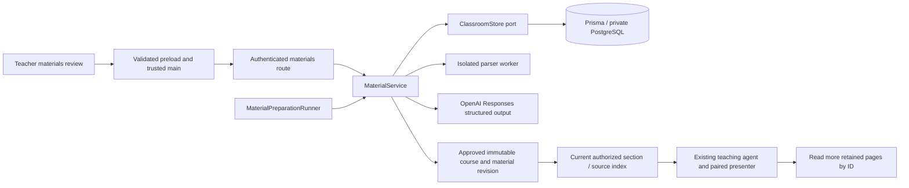

# Materials preparation implementation

This records the original materials preparation pilot and its storage, extraction,
review and approval boundaries. The implemented
[compact material context pipeline](MaterialContextImplementation.md) replaces the
whole-collection note generation and character-based runtime packing described below.
Read that implementation record for current generation stages, caching and student
context budgets.

Teachers create a class with only its name, upload their existing files, optionally add
HTTPS references and instructions, then click **Prepare materials**. File transfers
happen separately. One durable preparation job performs bounded extraction and one
structured OpenAI synthesis for this pilot's size-limited collection. The teacher
reviews Summary, Sections and Material notes, edits them, acknowledges source limitations
and unresolved questions, then chooses **Use reviewed materials**. These labels follow
the app's English/Vietnamese setting. Processing uses the selected language.

## Boundaries

`ClassroomMaterials.ts` owns the wire schemas and limits. `MaterialService` authorizes
teacher ownership, collection versions, batching, review and publication. Extractor
and preparation interfaces are application ports. Worker, OpenAI, Fastify and Prisma
remain adapters. No source code is executed. No provider key or database connection
enters Electron. Class/session/student/teacher authority remains in the existing
classroom service. A default class activity allows teacher-led sessions without
prepared context; it explicitly says that no reviewed material is available.

## Retention and processing

Original bytes are private PostgreSQL `bytea` records in this bounded pilot, not public
URLs. Supported inputs are PDF, PPTX, SB3, Python, Markdown and UTF-8 text. PDF text is
retained per page; original PDFs are also supplied to the vision-capable model to
prepare notes about diagrams. PPTX retains slide text and speaker notes. PPTX media
and layout require teacher review; upload a PDF export for visual interpretation.
Scratch stores each target's block graph, variables and asset references; costumes
and audio remain in the original SB3. Python/text preserve lines in ordered chunks.
Links are references only: the backend does not fetch remote sites or watch videos.
Unsupported files, protected PDFs, malformed archives, excessive pages and invalid
UTF-8 fail preparation visibly rather than produce a silently truncated lesson.

Extraction runs in a worker with a 30-second deadline and 256 MB V8 heap limit.
ZIP inflation is asynchronous with entry/count/expanded-byte bounds. These are
resource limits, not a promise that all native memory fits 256 MB. XML external
entity declarations are rejected. Parsers retain source text separately from model
notes and teacher corrections. Unchanged source pages reuse retained extraction on
re-preparation. PDF/model interpretation is fallible; a returned text page does not
prove all diagrams were understood. The review exposes originals and limitations.

Limits: 12 sources, 8 MB per original, 24 MB total stored originals per class (including
removed originals retained for prior revisions), 120 pages/chunks and 200,000 extracted
characters per batch. Large collections must be split; automatic chunked synthesis
is not implemented. PostgreSQL is the pilot storage adapter; migrate to private
object storage through an explicit port before larger hosted uploads. Records are
retained; automatic garbage collection is not implemented.

A job transitions collecting → queued → preparing → review → approved, or failed.
Queued jobs resume after process restart. Preparation leases expire after eleven
minutes; an expired in-flight job fails for explicit teacher retry, avoiding automatic
duplicate paid requests after an uncertain provider outcome. One runner call executes
at a time; database compare-and-swap versions prevent competing workers publishing
results. The provider has a four-minute deadline and no implicit retry. Backend budgets
allow 10 queued preparations per teacher/day and 100 globally/day; failure still
consumes the reservation. Logs contain identifiers, stage and safe error categories,
never originals, extracted notes or credentials.

Preparation failures also report elapsed milliseconds, source/page counts and a
specific reason: provider HTTP failure/timeout, incomplete output, missing page
notes, invalid source references, invalid draft, or changed source extraction.
HTTP failures retain the provider request ID and status; incomplete output retains
its status and stop reason. Validation logs contain issue counts, never source
values, raw provider error bodies or model output. Unknown exceptions remain
explicitly unknown. These diagnostics do not change the teacher-facing failure
message or automatically retry a paid call.

## Approval and student context

Review changes never rewrite source extraction. Restoring a prepared note clears
only the teacher override. Saving or uploading does not update an approved lesson.
Approval atomically publishes an immutable course plus a material publication and
points the class at it. A live session blocks approval (including concurrent starts
through serializable transactions), so ongoing participants keep their revision.
The teacher can prepare and edit the next draft while a session is live. The former
course-JSON editor is removed from the UI; existing publish-course/create-class wire
commands remain compatible, including explicit course IDs.

Student requests receive the current section, summary, teacher instructions, source
index and a bounded selection of relevant detailed pages (24,000 characters). The
restricted `read_class_material_note` tool retrieves any additional approved page by
ID. This avoids throwing away source content to fit initial context. Only an active,
owned, authorized participation can call it. Sources remain reference data and cannot
replace system instructions or authorize desktop actions. Existing screen observation
and `present_teaching_step` still produce localized instructions and drawings together.

Downloads check class ownership or current enrollment plus inclusion in the approved
publication. Students cannot download unpublished drafts, other classes' files or
continue after enrollment revocation. Main fetches bytes with its session cookie,
opens a save dialog, and writes only the user-selected destination; renderer sees
file IDs, never arbitrary filesystem access. Originals do not auto-run after download.
The current hand-in workflow remains Scratch links for courses configured to require
that format; generated sections default to no hand-in requirement.

## Setup and verification

The new versioned Prisma migration adds private originals, collection/job state,
material publications and daily budgets. `pnpm dev` applies it through the existing
startup migration path. No live database is reset. The existing backend-only
`OPENAI_API_KEY` enables preparation; without it, teachers can create classes/upload
but preparation reports unavailable. Selected source text and PDFs are sent to OpenAI
only after **Prepare materials**. This does not constitute hosted launch approval.

Local checks cover preparation and review with a fake provider, actual parser inputs,
authorized downloads, source preservation, stale versions, failure/retry, student
context, and disposable PostgreSQL transactions/HTTP. Live OpenAI quality, signed
Electron upload/save dialogs and visual coverage still need manual acceptance with
a real teacher's documents.

## Desktop presentation

The production material workspace follows `MaterialContextDemo.html`: a three-step
header above a responsive two-column layout. `MaterialFiles.tsx` owns file selection,
dropping and reference links; both selection and dropping use the same upload port.
Link titles come from the validated URL hostname. `MaterialReview.tsx` displays the
summary and sections as readable text, with collapsed edit forms and source citations.
Original extraction and teacher overrides remain separate. The right review panel is
visible before preparation, during preparation and after review. Narrow windows stack
the two panels. Preparation limits and provider disclosure remain available.

`MaterialEditor.tsx` retains request ordering, version checks, polling, unsaved-edit
guards and save-before-approval. Reviewed materials expose the existing section picker
and start-session command through `TeacherClassroomPanel.tsx`; classroom management
and invitations remain in My classes. Teacher enrollment into another class is a
collapsed secondary action, while students retain the normal join form.

The classroom page explicitly fills the content width of `.panel-content`; it does
not use horizontal auto margins or a maximum page width. This matters because its
material workspace uses inline-size containment, so intrinsic child sizing cannot
be relied on to stretch a flex child. The shell still provides 40px side padding
(24px in smaller windows), and the material grid stacks at 670px of available
content width. Verify layout inside the AppShell and panel hierarchy rather than
only rendering an isolated editor.

### Processing visibility

The teacher file panel places **Process materials** / **Xử lý tài liệu** above the
file list; an existing draft changes it to **Process materials again**. It uses the
same batch preparation command and does not approve or replace a live lesson.
Each original shows **Not processed**, **Queued**, **Processing** (or **Processing
again**) and **Processed**. Saved draft page bindings identify previously processed
files even when new uploads invalidate the collection review. A failed new batch
does not erase that earlier processing status; the batch failure appears in the
review panel. Processing status does not imply teacher approval. Links always show
**Reference only**, with an explicit notice that their contents are not read.
