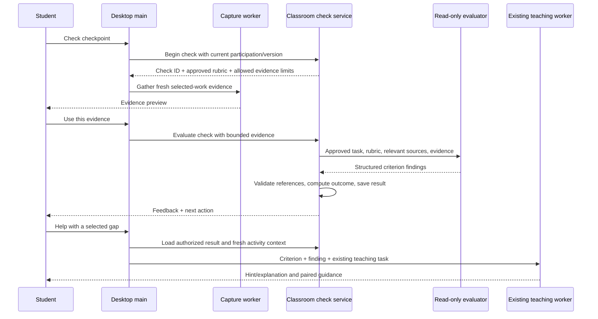
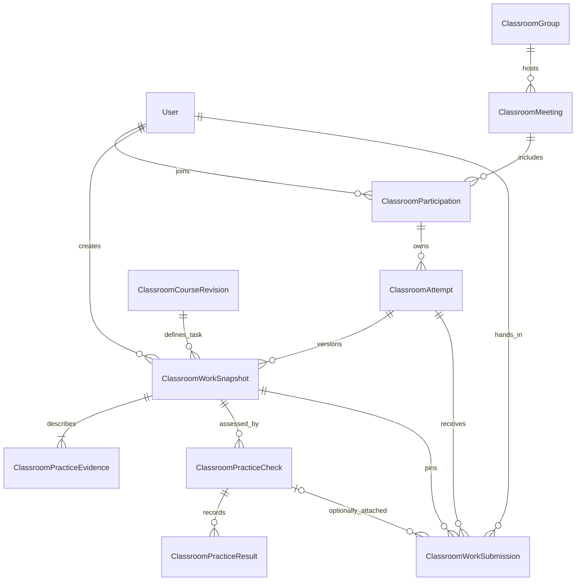

# Practice checks and targeted tutoring

Status: first implementation milestone, October 5, 2026. The section below describes shipped local code; subsequent design sections retain the target architecture and planned milestones.

## Implemented pilot

- Material composition drafts exercise checkpoints. Teachers can add/edit requirements, specify observable evidence, mark optional criteria and explicitly enable a checkpoint in **Sections → Practice checks**. Publication freezes rubric revisions. Existing classes without a checkpoint retain their existing behavior; reprepare materials or add a checkpoint manually and publish.
- Teacher stage controls are Explanation, Practice and Review. The legacy `submission` wire value remains readable. During Practice, students paste text/code or select PNG/JPEG/text files, preview them, then explicitly request a check. There is no automatic desktop capture, code execution, arbitrary URL fetching or project parsing.
- The authenticated `/api/v1/classroom/practice` endpoint supports check, history, targeted help, exact-snapshot hand-in, authorized evidence reads and teacher history. Main supplies the current device and fences account changes. Preload validates both directions.
- The read-only `OpenAiPracticeCheckEvaluator` uses structured Responses, `store: false`, no tools, no automatic SDK retries and a 60-second timeout. `OPENAI_API_KEY` is backend-only. Decisions remains an adapter opportunity pending a verified accessible API contract; no invented endpoint or confidence probability is used.
- Required findings aggregate on the server. Foreign/missing/duplicate criterion IDs and unsupported evidence references fail validation. Optional gaps do not block. Teacher/activity/progress/lease changes fence completion. Running checks expire after 90 seconds when history is read; an expired request is never automatically redispatched.
- `ClassroomWorkSnapshot`, `ClassroomPracticeEvidence`, `ClassroomPracticeCheck`, `ClassroomPracticeResult` and `ClassroomWorkSubmission` persist ownership, evidence, rubric, feedback and append-only hand-ins. An explicit hand-in pins a completed check's exact snapshot, including Needs changes findings. Unchecked hand-in and attributable teacher override records remain future work. Legacy Scratch-link tables are untouched.
- This pilot deliberately stores bounded private evidence as PostgreSQL `Bytes`, accessed only through authorized reads. No extra bucket/configuration is required. Images are limited to 1 MB each, three evidence items and 2 MB combined per check; text to 12,000 characters per item and 6,000 estimated input tokens including a prompt allowance (image tokens are separate). Total private evidence is capped at 64 MB per student. Evidence is retained until an explicit future retention/erasure workflow; soft deletion hides access and does not purge history. Object-storage migration, retention automation and downloads/exports remain future infrastructure milestones.
- Defaults: `PRACTICE_CHECK_MODEL=gpt-5.4`, `PRACTICE_CHECK_DAILY_LIMIT=30`, `PRACTICE_CHECK_MINUTE_LIMIT=5`. Validated settings bound reservation before inference, including concurrent requests. Each request ID is scoped to the signed-in student and payload digest. A response-loss retry returns the existing running/completed/failed check; a deliberate new check gets a new snapshot. Hand-in retries return the original receipt; resubmissions append sequences under serializable transactions.
- Teachers load **Practice feedback and hand-ins** in the student-status area and inspect saved evidence. **Help me with this** fetches a server-authorized criterion/feedback request, opens Show me with it prefilled and lets the student send it. The request tells Tro to observe current work; it never changes a previous finding or submits work.

### Try locally

Run `pnpm db:deploy` against your configured development database, then restart the API and desktop (or use `pnpm dev`). Sign in as a teacher, open class materials, add an exercise checkpoint in Sections, fill its task/criteria/evidence fields, enable it and approve/publish materials. Start the class and choose Practice. Switch to an enrolled student, join, provide evidence and choose Check my work. Inspect feedback, request a hint, edit the work and recheck. Confirm Hand in this version. Switch back to the teacher and refresh practice results to open the exact saved evidence and see revision receipts.

No credentials are needed for unit/build checks. `pnpm test:integration` creates and removes its own disposable PostgreSQL container and uses fake evaluator responses. Real assessment accuracy and native selected-window capture remain separate pilot acceptance work; passing repository tests establishes wiring and invariants, not grading accuracy.

Diagnostics: `classroom.practice.lifecycle` includes check ID, stage and safe rejection code. `classroom.practice.refused` includes operation, request ID and safe code. Neither contains raw work, screenshots, prompts, credentials or hidden reasoning.

## Product decision

Tro provides a small evaluation for each practice activity, across code, design, drawing, writing and other student work. Students choose **Check my work / Kiểm tra bài**, receive feedback, ask Tro for help with a gap, improve their work and check again. Teachers remain in Practice throughout this loop.

The checker answers: which approved requirements does this version of the work meet, and what evidence supports that conclusion? The tutor answers: what explanation, question or next step would help this student improve? Neither a saved link nor a student's declaration of completion establishes correctness.

The initial product provides formative feedback, not automatic final grades. Creative work can satisfy requirements in different ways; resemblance to a reference is required only when the teacher explicitly makes it a criterion. Rubrics support feedback across subjects by making criteria and performance expectations explicit. See [Carnegie Mellon's rubric guidance](https://www.cmu.edu/teaching/designteach/teach/rubrics.html) and [formative assessment guidance](https://www.cmu.edu/teaching/assessment/basics/formative-summative.html).

Success means students obtain actionable feedback without waiting for a teacher stage change, and teachers spend less time on repeated explanations. Measure checks completed, time to first feedback, improvements after a recheck, requests needing teacher attention, teacher correction of checker findings and model cost per completed check. A high pass rate alone is not a quality measure.

## Current repository behavior

- `StudentActivityPanel.tsx` records **I have finished** as `declaredComplete`; it does not invoke an evaluator.
- Formal hand-in supports a registered Scratch project link, prepared and then explicitly confirmed by the student. `ClassroomService.ts` verifies ownership, project URL format and mutation versions; it does not inspect or grade the project.
- `MaterialService.ts` currently publishes each generated section with `submission: NONE` and one criterion copied from its instruction. This does not establish a useful assessment rubric.
- `report_activity_progress` stores model observations against criterion IDs. These are reports, not independently verified grades.
- The existing teaching worker can observe the desktop and pair explanations with native guidance. Its goal-completion contract concerns its teaching task; it must not become a practice-check pass merely because a cue was presented or a model declared the teaching goal reached.

Reuse authentication, participation/device leases, immutable course revisions, material retrieval, the separate desktop worker and the current spatial teaching presenter. Add a distinct practice-check contract and durable result; do not reinterpret existing progress or submission records as check results.

## User experience

### Teacher preparation

Material preparation drafts practice checkpoints only where there is an actual exercise. A section can have no checkpoint or a small number of checkpoints; a lecture slide is not automatically an assignment.

Each checkpoint contains the task, a few observable success criteria, relevant reference/source citations and the evidence needed for checking. The teacher can edit these beside the lesson section and approve them with the materials. Extracted requirements and inferred suggestions are visibly distinguished. Missing learning objectives or expected behavior produce a focused clarification, not an invented test or an arbitrary aesthetic standard.

If a checkpoint is incomplete, preparation can still publish teaching notes, but that checkpoint stays unavailable for automatic checking. Show **Teacher review needed / Cần giáo viên duyệt**. Do not silently invent a rubric at student check time. Legacy courses without an approved checkpoint retain their existing help/completion UI and do not display a functional Check action.

During live teaching, controls become Explanation, Practice and Review. Remove Submission from the teacher's stage buttons in the implementation milestone. Preserve the serialized legacy `submission` phase and old data; do not rewrite migrations or existing meeting rows. If an old meeting is in that phase, show a legacy label and let the teacher choose Practice. Student checking is available during Practice without another teacher action. Final hand-in remains an independent student action.

### Student practice

1. Choose **Check my work / Kiểm tra bài** for an approved checkpoint.
2. See what evidence Tro will inspect. For visible work, use a fresh capture of the selected workspace; for a demonstration, gather the specifically requested outcome. The student can cancel or retake a capture before it is sent. File/text evidence arrives in a later milestone.
3. Tro evaluates the submitted evidence and shows criterion-level feedback plus one useful next step. Show a loading state and prevent duplicate clicks.
4. Choose **Help me with this / Giúp tôi phần này** on a gap. Tro starts existing Show me teaching with that criterion and the check result as context.
5. After changing the work, choose Check again. It gathers fresh evidence and creates a new check. It never merely reruns the old snapshot as if it were new work.

Do not automatically capture the desktop, assess every edit or start tutoring after a failed check. A gap and a request for help are separate facts. The initial result UI avoids percentages and letter grades.

| Finding                                   | Student message                                          | Next action                                          |
| ----------------------------------------- | -------------------------------------------------------- | ---------------------------------------------------- |
| All required criteria supported           | Meets the checked requirements / Đạt yêu cầu đã kiểm tra | Continue or explicitly hand in                       |
| A required criterion demonstrably missing | Needs changes / Cần chỉnh sửa                            | Read the specific gap; request a hint; recheck       |
| A required criterion cannot be observed   | More evidence needed / Cần thêm bằng chứng               | Show output, another view or a requested explanation |
| Provider/transport failure                | Could not check / Chưa kiểm tra được                     | Keep work intact; retrieve status or retry           |

The teacher sees per-student activity, last check status, repeated gaps and explicit help requests in the roster. Optional criteria produce suggestions without blocking completion. Model feedback and teacher feedback are labeled separately. Teacher review creates an attributable review record rather than overwriting the original model finding. A check status is about the submitted evidence, not a claim that the teacher is online or the student has mastered the entire subject.

## General assessment model

Share the evaluation structure, not a universal evidence reader. A criterion describes the requirement, what observable evidence could establish it, whether it is required and its source. An evidence adapter gathers that evidence; a checker evaluates it. Do not infer a student's app or artifact format solely from a course title.

| Work        | Evidence that can support a check                            | Limit                                                                   |
| ----------- | ------------------------------------------------------------ | ----------------------------------------------------------------------- |
| Python/code | Source excerpt, input/output, later sandbox test report      | Source appearance alone cannot establish runtime behavior               |
| Scratch     | Script view and observed demonstration; later parsed project | A project URL alone does not establish behavior or accessibility        |
| Design      | Canvas/export views, layout and required content             | A rendered image cannot establish hidden layer structure or interaction |
| Drawing     | Work image, relevant details, requested explanation          | Style similarity is not correctness unless required                     |
| Writing     | Submitted text and required structure/content                | Missing text cannot be inferred from a screenshot excerpt               |

V1 checks visible, observable requirements through image evidence. For a behavioral requirement it requests a targeted demonstration and associated evidence, or returns Insufficient evidence. It does not claim broad format support merely because it accepts an image. Code execution, design-file introspection, multi-page document parsing and physical-work photography are separate adapter milestones.

## Contracts and initialization

Proposed owner: `src/contracts/PracticeCheck.ts`. All contracts below are additions, not declarations that these APIs exist. Use Zod runtime validation, canonical constants and schema-derived types. Representative core schemas:

```ts
import { z } from 'zod';

export const PracticeFinding = {
  MET: 'met',
  NEEDS_CHANGES: 'needs_changes',
  INSUFFICIENT_EVIDENCE: 'insufficient_evidence',
} as const;

export type PracticeFinding = (typeof PracticeFinding)[keyof typeof PracticeFinding];

export const PracticeCheckStatus = {
  AWAITING_EVIDENCE: 'awaiting_evidence',
  RUNNING: 'running',
  COMPLETED: 'completed',
  FAILED: 'failed',
  CANCELED: 'canceled',
} as const;

export const PracticeCriterionSchema = z.strictObject({
  id: z.uuid(),
  description: z.string().trim().min(1).max(500),
  required: z.boolean(),
  evidenceNeeded: z.string().trim().min(1).max(500),
  sourceIds: z.array(z.uuid()).max(8),
});

export const PracticeCheckpointSchema = z.strictObject({
  id: z.uuid(),
  rubricRevisionId: z.uuid(),
  title: z.string().trim().min(1).max(200),
  task: z.string().trim().min(1).max(2000),
  criteria: z.array(PracticeCriterionSchema).min(1).max(8),
});

export const PracticeCriterionResultSchema = z.strictObject({
  criterionId: z.uuid(),
  finding: z.enum(PracticeFinding),
  evidenceIds: z.array(z.uuid()).max(8),
  observation: z.string().trim().min(1).max(600),
  nextStep: z.string().trim().max(600),
});

export type PracticeCheckpoint = z.infer<typeof PracticeCheckpointSchema>;
export type PracticeCriterionResult = z.infer<typeof PracticeCriterionResultSchema>;
```

The full boundary adds checkpoint approval state, requirement provenance (`source`, `teacher`, `suggested`), criterion/checkpoint ID uniqueness and referenced-source validation. Require at least one required criterion before approval. The backend owns stable IDs and rubric revision IDs; generation does not choose authoritative identity. Uncited model suggestions require explicit teacher adoption. Material generation supplies a bounded draft, reviewed by the teacher; approval assigns canonical identities and freezes the checkpoint in the course revision.

Add optional `practiceCheckpoints` to the canonical activity and material-section schemas, bounded to four per section. Absence means legacy/no checkpoints; it does not trigger automatic assessment. Material publication maps approved checkpoints into the immutable course revision. Material brief/retrieval projections include their IDs and short task references, not every full rubric in every agent request. Version the material draft addition and preserve the existing legacy/V2 read paths; no blanket republishing or database reset.

A completed check contains server-owned `id`, `studentId`, `participationId`, `attemptId`, `activityId`, `checkpointId`, `courseRevisionId`, `rubricRevisionId`, captured `contextVersion`, `workSnapshotId`, evaluator/prompt version, timestamp, locale and criterion results. Overall finding is computed by domain code, not accepted from the model. Never use a raw model confidence number as proof of correctness.

Work evidence descriptors contain server-owned ID, kind, content digest, capture time, selected-workspace provenance, scope and byte count. Digests are computed from accepted bytes; neither client digests nor client screenshot metadata prove authenticity. Image metadata comes from the existing capture path but persisted findings remain labeled model observations. Where authenticity matters for final grading, require a separate reviewed assessment process.

## Request and evaluation sequence



Add a bounded JSON check-command endpoint under `/api/v1/classroom/practice-check/command` for begin, read, cancel and read history. Keep `/api/v1/classroom/command` working for older clients. Add `/api/v1/classroom/practice-check/:checkId/evaluate` for bounded evidence submission; use an explicit request schema and body limit rather than expanding the existing 150 KB command endpoint. V1 accepts up to three PNG/JPEG evidence images, 4 MB total decoded bytes and a maximum of 4 million pixels per image. Validate base64, media signature, dimensions and decompression bounds; strip unsupported metadata. Proposed text/file adapters need their own parsers and limits rather than a generic upload bypass.

Begin validates signed-in student, enrollment, active device lease, live participation, approved checkpoint and allowed activity according to pacing. V1 allows new checks only during Practice. No student-controlled IDs can select another student's attempt. Main attaches the device binding; renderer/model values do not establish authorization.

Begin includes `requestId`, `checkpointId`, `activityId`, `contextVersion` and `progressVersion`. The server resolves all other identities. A unique `(studentId, requestId)` returns the same check on transport retries; reused keys with different input return conflict. One check may be awaiting evidence or running per participation. Capture/preview cancellation ends that check without spending inference. Students never need to see those request mechanics.

Evaluate freezes the accepted evidence descriptors and digest. It revalidates the lease, participation/activity and context/progress versions, and atomically reserves allowance and transitions awaiting evidence to running. A duplicate evaluation with identical evidence returns the same running/completed record; different evidence is rejected. Run inference outside the database transaction. Final persistence uses a compare-and-set on the running check and its execution token, so late output cannot complete a canceled or superseded execution.

V1 awaits the model in the evaluate request with a 60-second bound; read retrieves durable status after a lost response. Persist a 90-second execution lease. On process failure/lease expiry, mark the run failed and require an explicit fresh check; do not automatically repeat an ambiguous paid request. The server owns abort and shutdown behavior. Client disconnection alone does not start a second call. No broker or new deployed service is required. Introduce a durable background runner only if measured workloads require it.

At completion, preserve the check's original activity/rubric/work binding. If the teacher changed section or the student switched accounts/devices while inference ran, never attach the result as the current activity's result or automatically start tutoring. Retain it as authorized historical feedback when appropriate. Revoked enrollment/deleted classes prevent reads; late completion cannot restore access. Main's account generation fence drops late UI delivery.

## Evidence and inference boundaries

The renderer requests a specific check and displays states; it never exposes arbitrary file paths, native capture, shell execution or database access. Add narrow validated preload methods for begin/capture-preview/confirm/read/cancel and verify the IPC sender. Main owns the capture ID, account/session fence and scope. Evidence collection runs in the existing separate worker. Do not add screen-capture work to React or the UI thread.

The existing capture implementation has desktop/primary-display limits; a verified crop or selected-window adapter must be implemented and accepted before advertising capture of only one canvas. Until then, preview the actual captured scope and let students cancel. Do not silently send unrelated windows, old teaching screenshots or cached material images as student work.

The backend evaluator is a read-only provider adapter behind an application port. It receives an approved checkpoint, bounded source excerpts and accepted work evidence. It has no desktop-control tools, shell, unrestricted URL fetching, classroom mutations or tutoring tool. Provider credentials remain on the backend. Reference files and student work are untrusted data, never instructions to alter the rubric or reveal hidden answers. The same model may power tutoring, but the evaluation call has separate context, output schema and tool permissions.

The application validates exactly one result for every rubric criterion, canonical IDs, bounded text and evidence references belonging to this check. `MET` and `NEEDS_CHANGES` require an observation and at least one matching evidence reference; absent evidence maps to insufficient evidence. An image ID alone is not proof that a visual judgment is true. Invalid/missing/duplicate findings fail the evaluation rather than being silently counted as passes. Operational failure is separate from an insufficient-evidence learning result.

Domain aggregation:

```ts
export function aggregatePracticeFindings(
  criteria: PracticeCheckpoint['criteria'],
  results: PracticeCriterionResult[],
): PracticeFinding {
  const required = criteria.filter((criterion) => criterion.required);
  const findings = required.map(
    (criterion) => results.find((result) => result.criterionId === criterion.id)?.finding,
  );

  if (findings.some((finding) => finding === PracticeFinding.NEEDS_CHANGES)) {
    return PracticeFinding.NEEDS_CHANGES;
  }

  if (required.length === 0 || findings.some((finding) => finding !== PracticeFinding.MET)) {
    return PracticeFinding.INSUFFICIENT_EVIDENCE;
  }

  return PracticeFinding.MET;
}
```

This function assumes the result boundary already rejects foreign/duplicate criterion IDs. A missing criterion still cannot pass. When a result contains both a known gap and unknown requirements, the overall finding is Needs changes and the UI must also show the unresolved requirements.

## Tutor handoff

**Help with this** sends only `checkId` and `criterionId`; the backend/main resolve the approved rubric, result, attempt and student. Never accept a client-supplied assessment summary as authority. Load fresh classroom context before starting the existing class-bound TEACH task. Preserve its current mode restrictions, locale handling, cancellation, screen observation and paired presenter.

The tutor receives the original task, selected criterion, evidence-qualified finding, student-visible feedback, relevant material references and limited recent help history. It does not receive every classroom document, raw provider response or hidden reasoning. It must observe the current workspace again: the earlier check describes a snapshot, not today's current screen.

For Needs changes, give a useful hint/question or teach the missing concept, while the student performs edits. For Insufficient evidence, first help gather or demonstrate the missing evidence. The tutor cannot alter the rubric, mark a check passed, submit work, override a teacher review or run an evaluation silently. Teaching success can be recorded separately; passing requires an explicit new check against fresh evidence.

## Storage, work versions and submission

Add reviewed Prisma models through an additive migration: `ClassroomWorkSnapshot`, bounded `ClassroomPracticeEvidence` metadata, `ClassroomPracticeCheck`, `ClassroomPracticeResult`, attributable `ClassroomPracticeReview` and `ClassroomWorkSubmission`. Keep these inside `PrismaClassroomStore` or focused `PrismaPracticeCheckStore`/`PrismaWorkSubmissionStore` adapters. Ports/domain types remain Prisma-free.

Check rows reference the existing participation, attempt and immutable course revision. Store checkpoint/rubric identities, lifecycle/timestamps, execution lease, request/evidence digests and evaluator version. Results contain validated criterion findings and feedback. Teacher reviews record actor, timestamp, reason and revised finding without mutating model history. Activity/checkpoint IDs in course JSON require service-level membership checks, since they are not independent relational foreign keys.

V1 screen evidence is transient in memory for the evaluation lifetime; retain only safe provenance metadata and concise student-visible findings, never screenshot bytes in PostgreSQL or ordinary logs. Clearly mark history as a snapshot assessment whose image is no longer retained. Durable artifacts and teacher viewing of exact submitted evidence require private object storage with access checks, retention and deletion jobs in the submission milestone. Do not promise regrading an image after it has been discarded.

An OS capture timestamp is not an artifact version. Use a server-owned work snapshot ID plus a digest of accepted evidence; if the student changes work, a fresh check gets a new snapshot. Results say **Checked at…** and remain historical; they do not show a persistent claim that the current mutable project is correct.

Check and hand-in are separate. Preserve the existing Scratch-link hand-in as a link-only receipt. A future final submission pins the chosen artifact snapshot and its check ID; it cannot attach a prior check to a new file or pretend a mutable URL is an immutable artifact. Checking alone does not set `declaredComplete`, advance the teacher's section, or automatically submit.

### Ownership and relational links

The existing `ClassroomSubmission` already reaches a student through `submission.attempt.participation.studentId`. It is a link-only table, not a general artifact/check table. Preserve that model and its required URL so existing receipts and clients continue to work. Add `ClassroomWorkSubmission` for generalized hand-in instead of putting images, Python code and link receipts into an ambiguous overloaded row.

Use the authenticated `User.id` for direct `studentId` foreign keys on snapshots, checks and generalized submissions. This is the existing auth string ID, not necessarily a UUID. The server derives it; the student never supplies the owner identity in a mutation. Link every record to the existing `ClassroomAttempt`, which already binds one student participation and one activity.



Class and session identity remain relational: `attempt → participation → meeting → class`. Activity identity remains `attempt.activityId`; checkpoint and rubric identity belong to the pinned course revision. Do not duplicate class/session/activity columns on every table merely for UI convenience. Add indexes based on actual roster/history queries. If later measurements justify denormalization, write and validate all duplicated ownership fields in the same transaction.

Foreign keys establish that referenced rows exist; they do not establish that a snapshot's student matches its attempt owner or that an attached check belongs to that snapshot. The application enforces those cross-record invariants inside the transaction, with typed Prisma access. The adapter cannot accept a renderer-provided `studentId` as a substitute for authorization.

### Proposed Prisma additions

These are migration-design sketches, not changes to `prisma/schema.prisma`. They reference the proposed check model above and require the reciprocal relation fields listed below. Public statuses/kinds stay canonical `as const` values in contracts and are validated before database writes.

```prisma
model ClassroomWorkSnapshot {
  id               String @id @default(uuid()) @db.Uuid
  studentId        String
  student          User @relation("WorkSnapshotStudent", fields: [studentId], references: [id], onDelete: Restrict)
  attemptId        String @db.Uuid
  attempt          ClassroomAttempt @relation(fields: [attemptId], references: [id], onDelete: Restrict)
  courseRevisionId String @db.Uuid
  courseRevision   ClassroomCourseRevision @relation(fields: [courseRevisionId], references: [id], onDelete: Restrict)
  checkpointId     String @db.Uuid
  rubricRevisionId String @db.Uuid
  manifestDigest   String @db.VarChar(64)
  evidenceScope    String
  createdAt        DateTime @default(now())
  evidence         ClassroomPracticeEvidence[]
  checks           ClassroomPracticeCheck[]
  submissions      ClassroomWorkSubmission[]

  @@index([studentId, createdAt])
  @@index([attemptId, checkpointId, createdAt])
}

model ClassroomPracticeEvidence {
  id             String @id @default(uuid()) @db.Uuid
  workSnapshotId String @db.Uuid
  workSnapshot   ClassroomWorkSnapshot @relation(fields: [workSnapshotId], references: [id], onDelete: Restrict)
  kind           String
  mediaType      String
  displayName    String?
  byteCount      Int
  digest         String @db.VarChar(64)
  capturedAt     DateTime
  provenance     Json
  storageKey     String? @unique
  retentionUntil DateTime?
  contentDeletedAt DateTime?

  @@index([workSnapshotId])
  @@index([retentionUntil])
}

model ClassroomWorkSubmission {
  id             String @id @default(uuid()) @db.Uuid
  studentId      String
  student        User @relation("WorkSubmissionStudent", fields: [studentId], references: [id], onDelete: Restrict)
  attemptId      String @db.Uuid
  attempt        ClassroomAttempt @relation(fields: [attemptId], references: [id], onDelete: Restrict)
  checkpointId   String @db.Uuid
  workSnapshotId String @db.Uuid
  workSnapshot   ClassroomWorkSnapshot @relation(fields: [workSnapshotId], references: [id], onDelete: Restrict)
  checkId        String? @db.Uuid
  check          ClassroomPracticeCheck? @relation(fields: [checkId], references: [id], onDelete: Restrict)
  sequence       Int
  requestId      String @db.Uuid
  payloadDigest  String @db.VarChar(64)
  submittedAt    DateTime @default(now())

  @@unique([studentId, requestId])
  @@unique([attemptId, checkpointId, sequence])
  @@index([attemptId, checkpointId, submittedAt])
  @@index([studentId, submittedAt])
  @@index([workSnapshotId])
  @@index([checkId])
}
```

Extend `User` with the named snapshot/submission back-relations, `ClassroomAttempt` with snapshots/general submissions, and `ClassroomCourseRevision` with work snapshots. The proposed `ClassroomPracticeCheck` has an optional `workSnapshotId` until evidence is accepted, a snapshot relation and `submissions` back-relation. Completed checks must have a snapshot. Each `ClassroomPracticeResult` belongs to a check and has a unique `(checkId, criterionId)`; evidence references resolve through that check's snapshot. Teacher reviews reference the check/result and authenticated reviewer. Results store findings, student-visible feedback and evaluator identity/version; they do not store hidden reasoning or provider credentials.

`manifestDigest` hashes a canonical server-generated manifest of ordered evidence IDs, accepted content digests, media types and scopes. Snapshot rubric/task bindings remain explicit. It does not imply that the entire mutable project has been captured or that a screenshot proves authorship. Snapshots are immutable after acceptance; a retake/new capture creates a new snapshot. A canceled capture need not create an empty snapshot row. A finalized snapshot must have at least one accepted evidence item, enforced by the service transaction.

### Draft, check and final-hand-in lifecycle

1. **Draft work:** the student edits in their app. Existing `ClassroomAttempt.workspaceUrl` and progress remain pointers/reports. Tro does not create a database row for every keystroke or autosave screenshots.
2. **Check:** freeze the evidence for that action into a work snapshot. A check references that snapshot, checkpoint and rubric revision; all criterion results belong to the check. A student changing work and rechecking creates another snapshot and check. A transport retry reads/reuses the same check rather than creating history duplicates.
3. **Get help:** the tutor reads the selected check and criterion, then observes current work. Hints never mutate a previous result or mark a submission correct.
4. **Final hand-in:** after explicit confirmation, append `ClassroomWorkSubmission` pointing at the selected durable snapshot. Attach a completed check only if it assessed exactly that snapshot/checkpoint/rubric for that student. A check is optional; students may hand in work that needs changes. The receipt must not imply passing.
5. **Resubmit:** append sequence 2, 3, etc., leaving earlier records intact. The teacher's default view selects the greatest sequence per attempt/checkpoint and exposes revision history. Do not overwrite or delete the prior hand-in, evidence or feedback.

In V1, image evidence is transient, so the new generalized final-hand-in action is unavailable until private artifact storage is implemented. Existing Scratch-link submission still works and is clearly labeled link-only. A missing binary cannot be presented as a stored drawing, code file or design. In the durable milestone, a screen check can pin the same bytes into private storage while its evidence is still available and the student explicitly chooses to retain them; after discard, request fresh evidence and run a new check if assessed submission is desired.

### Storage, access and retention

PostgreSQL stores relationships, states, manifests, criterion findings and small metadata. Private object storage holds durable images, code/text files, design exports and other artifacts. Snapshot rows store opaque `storageKey` references, never public URLs, credential-bearing links or arbitrary desktop paths. An external project link remains a reference to mutable work and is labeled accordingly; storing the link is not snapshotting the project.

Uploads use server-created slots bound to student, attempt and snapshot, plus size/media limits. Verify accepted bytes/digests before finalizing the snapshot. A finalized object is immutable; later uploads use different keys. Do not authorize an arbitrary existing object key supplied by the student. Parsing occurs in adapters with format/resource limits, not in the renderer or database transaction.

Downloads resolve an evidence ID on the backend. Allow its owning student or the class's owning teacher with current access; verify class deletion/enrollment and the submission relationship. Mint a short-lived download URL only after these checks, or stream through an authorized route. Provider access to evidence is separately scoped to the authorized evaluation. Raw bucket keys are not returned as general filesystem/URL capabilities.

Choose retention policy before the durable pilot: transient checks keep metadata/feedback only; final submission objects remain available for the configured class retention period. Class soft deletion hides access immediately but does not cascade-purge historical work. Object deletion/account-erasure jobs are explicit, idempotent and documented. Preserve tombstone metadata so the UI says **Evidence no longer available** rather than showing a broken download or promising reproducible regrading. Apply actual policy requirements before configuring destructive jobs.

### Submission transaction and read paths

Add separate validated commands for `submit-snapshot` and `read-submissions`; keep legacy `submit-work` unchanged. `submit-snapshot` carries bound participation/device, `workSnapshotId`, optional `checkId`, current context/progress versions and `requestId`. Main resolves the account/device; the server resolves owner, attempt and checkpoint. The initial live-class policy requires active participation and an activity permitted by current pacing. It does not require a teacher-controlled Submission phase or a passing check. Homework after a session ends is a separate policy, not silently enabled here.

The persistence port executes in one serializable transaction:

1. Recheck authorization and the snapshot's student/attempt/course/checkpoint membership, durable-object finalization and current class policy.
2. Compare the supplied versions and reject a stale new mutation. For an exact retry of a committed `requestId`, reauthorize the user and return the existing receipt even if the teacher later advanced the session; do not create another row. A reused request ID with different `payloadDigest` conflicts.
3. If `checkId` is present, require a completed check for the same student, attempt, snapshot and rubric revision. Keep its finding as feedback, not a condition for hand-in.
4. Allocate the next positive sequence under the existing attempt/checkpoint serialization boundary, insert the submission and any audit record using the transaction client, then commit. The unique sequence index and bounded serialization-conflict retries cover simultaneous devices; do not allocate with an unprotected `max + 1` outside the transaction.

Object upload cannot share a PostgreSQL transaction. Upload privately before submission, finalize metadata only after validation and run an orphan-object cleanup after a grace period. Never return a receipt before its database transaction commits. A rolled-back hand-in can leave a private orphan object, but must not leave a false submission record.

Student history filters by authenticated `studentId` and authorized class/attempt. Teacher roster queries join through participation and meeting to the owned class, returning latest submission and check summaries with bounded pagination. Opening a hand-in fetches its pinned manifest, findings and permitted download handles. Do not infer enrollment, presence, completion, hand-in and correctness from one shared status field.

## Limits, diagnostics and reliability

Initial pilot limits are proposed configuration, to be validated with measured usage: eight criteria, four checkpoints per section, three images/4 MB per check, 6,000 text input tokens excluding image tokens, 2,000 output tokens, five check starts per minute and 30 model evaluations per student per day. Reserve inference allowance atomically before provider dispatch; duplicate requests consume one reservation. Image-token accounting is separate from text accounting. Validate settings in server `Env.ts`; never hardcode provider keys or reuse a promised existing quota that is not implemented.

Every evaluation is student-triggered. No idle polling invokes inference. Bound source retrieval to the current task; inability to fit required evidence returns a request for a narrower check rather than discarding necessary evidence invisibly. Do not cache outcomes by screenshot alone: any cache identity must include student authorization scope, artifact digest, rubric/course revision and evaluator version. V1 uses request idempotency, not cross-student result caching.

Emit structured events at admission, capture acceptance/refusal, provider completion/failure, result validation and persistence. Fields: check/correlation IDs, stage, elapsed time, evidence kinds/count/byte sizes, criterion count, version IDs, safe rejection code and token/cost measurements when available. Never log raw work, project URLs, screenshots, credentials, prompts or hidden reasoning. Document event names and test rejected-reference/version diagnostics during implementation. Model response/schema validity is not evidence of assessment accuracy.

## Code ownership and implementation milestones

| Owner                                                                          | Proposed changes                                                                    |
| ------------------------------------------------------------------------------ | ----------------------------------------------------------------------------------- |
| `src/contracts/PracticeCheck.ts`                                               | Canonical checkpoint, evidence, commands, result and status schemas                 |
| `ClassroomMaterials.ts`, `Classroom.ts`, material preparation/publication      | Draft/review/approve checkpoint initialization; optional compatible activity fields |
| `src/server/features/classroom/domain/PracticeFindings.ts`                     | Pure result validation/aggregation rules                                            |
| `src/server/features/classroom/application/PracticeCheckService.ts`            | Authorized lifecycle, immutable bindings, idempotency and budget admission          |
| `PracticeCheckStore.ts`, `PracticeCheckEvaluator.ts`                           | Explicit persistence and evaluator ports                                            |
| `src/server/features/classroom/application/WorkSubmissionService.ts`           | Authorized snapshot hand-in, append-only revisions and receipt idempotency          |
| `src/server/features/classroom/infrastructure/RegisterPracticeCheckRoutes.ts`  | Validated authenticated JSON/evidence routes and diagnostics                        |
| `src/server/features/classroom/infrastructure/OpenAiPracticeCheckEvaluator.ts` | Read-only structured evaluation, bounded inputs and provider cancellation           |
| `src/server/persistence/PrismaPracticeCheckStore.ts`, `prisma/schema.prisma`   | Durable lifecycle/results/reviews and additive migrations                           |
| `src/server/persistence/PrismaWorkSubmissionStore.ts`                          | Snapshot ownership, artifact manifests and transactional hand-in sequences          |
| `src/desktop/main/classroom/PracticeCheckController.ts`                        | Account/participation fencing, capture admission, status and tutor handoff          |
| `src/desktop/worker/teaching/PracticeEvidenceCapture.ts`                       | Fresh evidence collection using existing native observation boundary                |
| `DesktopBridge.ts`, preload, `Main.ts`                                         | Narrow validated methods and composition                                            |
| `StudentActivityPanel.tsx`, new `PracticeCheckPanel.tsx`                       | Localized preview, checking, findings, missing evidence, help and recheck           |
| `TeacherLiveLesson.tsx`, teacher materials/roster views                        | Three teaching stages, checkpoint review and concise support needs                  |
| `TeachingLessonContext.ts`, classroom context projection                       | Authorized gap context for existing tutoring; no alternate teaching harness         |

1. **Foundation:** checkpoint generation/review/approval, compatible publication schemas, pure aggregation, durable lifecycle, fake evaluator and authorized student UI. One image evidence path; no automatic claim of code execution. Remove teacher Submission control without removing legacy wire values.
2. **Visible-work pilot:** verified capture preview, backend evaluator, model allowance, interruption/status recovery, teacher support view and authorized tutor handoff. Accept design/drawing/Scratch/code only for criteria the submitted evidence can establish. Run accuracy evaluation before enabling this pilot for real classes.
3. **Artifact adapters:** typed text/code/file upload, controlled project parsing, private storage and work snapshots. Add bounded sandboxed code tests only with explicit isolation/resource/network limits; never execute student code in the API or desktop main process. No automatic fetching of arbitrary project URLs.
4. **Durable hand-in/review:** pin artifacts/checks, teacher evidence viewing and review history, retention/deletion workflows and exports. These are distinct from the initial mini-evaluation and must not delay the visible-work pilot.

## Acceptance and evaluation

Keep unit tests deterministic with injected evaluator/capture/store ports; no provider credentials, private code or live database. Integration tests use disposable PostgreSQL and fake provider responses. Tests mirror production filenames and ownership.

- Legacy courses/publications deserialize and keep existing submission semantics. Missing/unapproved checkpoint disables checking; theory sections do not acquire invented tests.
- Required missing/unknown findings cannot pass; optional gaps do not block; multiple valid creative solutions can meet the rubric; visible success does not imply hidden/runtime success.
- Check belongs to the authenticated student and device; stale section/progress, revoked enrollment, ended sessions, deleted classes and account switching reject new work. Historical reads remain scoped; old activity results cannot replace current results.
- Duplicate begin/evaluate consumes one provider dispatch and returns one result; changed payload with the same key conflicts. Expired/ambiguous execution never auto-dispatches again. Budget exhaustion happens before model spend.
- Generalized submissions derive student ownership server-side, pin finalized durable snapshots and accept only matching check IDs. Cross-student/cross-checkpoint attachment fails. Double-click/response-loss retries return one receipt; resubmission appends a new sequence without destroying history. A recorded Needs changes check does not prevent explicit hand-in.
- Teacher/student downloads are authorized through the owning class and artifact relationship. Expired/tombstoned objects produce an explicit unavailable state. Metadata-only V1 checks cannot be presented as durable artifact hand-ins. Legacy Scratch-link records remain readable without fake snapshots or an automatic data rewrite.
- Cancel during capture and evaluation fences late results. Lost response recovers by reading the same check. A provider error is not a student failure or pass.
- Malformed/oversized evidence, foreign criterion/evidence IDs, duplicate or missing criteria and prompt injection in artifacts are rejected or produce bounded uncertainty. Test model attempts to invoke tools or change the rubric.
- Tutor handoff reauthorizes IDs, uses a fresh observation, preserves approved criteria and existing TEACH/presenter restrictions. Tutoring cannot commit a check or submission.
- Localized one-button entry, preview/cancel, spinner, retry/status recovery, criterion feedback and Help/Recheck work with keyboard navigation and narrow windows. Feedback is not conveyed by color alone.

Maintain a frozen, de-identified assessment fixture set reviewed by educators: correct and incorrect code, multiple valid designs/drawings, unreadable/missing views, ambiguous criteria and adversarial artifacts. Evaluate per-criterion agreement with reviewers, false-pass rate on known missing required criteria, appropriate uncertainty, feedback usefulness and agreement across repeat runs. Keep tutor helpfulness separate from checker accuracy. Record evaluator/prompt version. Before the pilot, set acceptance thresholds with the reviewed dataset and document disagreements; schema tests alone cannot establish accuracy.

For code changes, finish the full milestone before running the repository's required lint, format, type, unit, build and integration checks. Signed native/manual acceptance additionally verifies actual evidence scope, account switching during a check, teacher section changes during inference and the student check → hint → improvement → recheck loop on one machine with two saved accounts.

## Practice review shortcut and HUD

During an active joined Practice activity with an approved checkpoint, Cmd/Ctrl + Shift + Enter brings Tro forward and opens the current student practice review. Main registers the global shortcut only for an eligible participation, rechecks the cached lease at keypress, and sends a validated navigation intent containing class, participation, activity, attempt and context version. The renderer rejects mismatched intents. If global registration is unavailable, the same chord works inside Tro. A visible Review work button provides the same flow.

The review shows the selected draft text/files/images, or the saved evidence metadata for a completed check. It never discovers or captures an open project. Check my work sends the previewed evidence through the existing validated API. Hand-in still requires its own confirmation, displaying the class, activity, checkpoint, check time and saved evidence names. The shortcut itself sends no evidence and does not submit.

Main derives native HUD state from check/submit-snapshot commands and validated replies: Checking work → Feedback ready; Submitting → Hand-in saved; failures → Try again. English and Vietnamese labels are supported. Feedback ready means the check completed, including needs-changes findings. Running records keep Checking until their matching history record is terminal; a bounded 100-second presentation timeout never fabricates a finding. Request identities, context invalidation and account teardown fence late results. Voice/teaching owns priority: practice does not replace an active teaching or microphone HUD, and a new voice/task invalidates practice presentation. Existing panel progress and receipts remain available without native permissions.

The native contract is 0.30.4-tro.16. Rebuild with `pnpm build:cua` before packaging or restarting a desktop using the verified native cache. This change requires no database migration beyond the existing practice-check migration.

Manual acceptance: join as a student, select Practice with an approved checkpoint, press the shortcut from another app, review the current task/evidence, check it, and observe HUD feedback. Confirm hand-in separately and observe its saved receipt. Repeat with no evidence, a failed request, a teacher/context change during a check, account switching, and unavailable global registration. No shortcut may automatically upload or hand in work.
