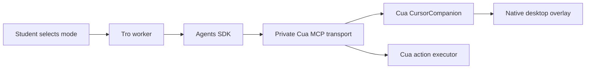

# Cursor companion

Tro's **Show me** mode asks Cua Driver to demonstrate a task while the student
controls the real pointer. The companion follows the pointer while idle and
approaches targets, progressively traces ordered circles, arrows, moves, selections,
click previews and drag previews, holds each cue, then clears it before moving on.
These visuals never synthesize input. **Do it for me** retains ordinary Cua actions.
Focusing an existing app window remains a separate, observed Cua action.

Typed and spoken instructions carry the selected mode and app language to the
worker. Voice capture snapshots both settings when recording is prepared, so
changing them during a capture affects the next instruction.

The teaching companion uses a compact white pointer about 9 × 10 logical points,
with a rounded blue outline and a proportionally scaled soft blue halo based on
the supplied cursor reference. Gesture marks and the Tro badge share its blue palette. The native vector painter scales with the
display's backing scale; the pointer tip remains the geometry hotspot. Click
previews draw a blue halo and drag previews slightly compress the pointer.

The native implementation extends pinned Cua 0.30.4 in
`driver-patches/CursorCompanion.patch`. Tro imports no sibling source and draws
no desktop overlay. `CuaCompanionClient` owns transport lifecycle and renews
Cua's lease; all pointer sampling, geometry, animation and rendering run natively.
Host debug logs retain mode transitions, failed renewals and invalid acknowledgements;
unchanged successful following renewals stay quiet.

## Using the local implementation

Run `pnpm build:cua`, then `pnpm dev:desktop`. The build checks a pinned source
commit, applies the patch in an isolated checkout, runs native companion tests,
and creates an ad-hoc signed executable under `~/.cache/tro/cua-companion`. Development
selects it before the standard release cache. Electron main starts it through
Tro's embedded Cua host and gives the worker that host's private MCP endpoint.
Permission checks and prompts run inside Tro; the standard development launcher uses a separate Tro
identity. Enable Tro in macOS Accessibility and Screen
Recording settings. Tro cannot grant these permissions itself. An independent
CuaDriver installation's grants do not unlock Tro. No separate CuaDriver app
is launched, and an independent installation or daemon is not replaced.

After sign-in and permission setup, select **Show me**, then ask, for example: “Circle the toolbar,
show an arrow toward the destination, then show me how to drag this item there.”
The agent observes the desktop and shows the next visible step of the lesson.
The companion starts following after sign-in and verified desktop permissions,
even before the first instruction and regardless of the selected task mode.
Idle startup opens only the local Cua connection; it requests no model credential,
captures no screenshot and sends no model request. Main deduplicates startup and
releases that connection before admitting a credentialed task. Following pauses
while an execution task acts, then resumes when the task settles. **Esc** cancels
the lesson's native playback and returns to idle following. Sign-out and window close
end the worker and native lease.
You can move your real pointer to follow the guide. Clicking, typing or scrolling
clears the current cue. Tro observes the resulting screen and continues the same
request. The chat displays the current instruction while waiting. After sixty
seconds without input, Tro asks whether you finished the step. Press Esc or click the workspace Esc control to cancel the lesson.

Packaging on macOS requires the matching native build. The packaging script
checks the patch and executable hashes before copying the driver and runtime
libraries into resources outside ASAR.
No source checkout or Rust toolchain is needed by the installed app. Public
release signing and notarization remain release work.

## Current limits

The initial adapter supports the **macOS primary display**, including other apps
on that display. Windows, Linux and secondary displays have no teaching adapter
in this version. Normal execution remains available where the existing driver
supports it. Teaching fails clearly when its native tools are missing.

V2 sequences have 1–8 steps, 200–5000ms of tracing per step, and holds of
500–2000ms (default 1100ms). Approach, hold, fade and return all count toward
the 15-second sequence budget. The Tro badge hides during teaching.
They require a session-bound primary-desktop capture no more than five seconds
old at admission. Coordinates are normalized fractions of that capture; Cua
maps them to display points locally. Circle radius uses the shorter display edge.
If model latency ages the observed capture past three seconds, Tro takes one
fresh screenshot before native dispatch. It substitutes the fresh capture ID only
when the encoded image and display geometry are identical. Changes prevent
playback and prompt the student to keep the target visible and request that step
again. This conservative comparison can also reject animations or clock changes;
it does not track semantic controls or loosen the native five-second limit.
There is one companion owner and one active sequence per native driver process,
with no pending gesture queue. Idle following uses a renewable 60-second lease.

The driver checks retained capture validity, display dimensions and student input
during playback. The five-second age limit applies at admission. It does not yet track semantic elements through programmatic scrolling
or moving windows; an application can change content without student input.
The agent must observe again before each sequence and after focusing an app.
Native overlay capture exclusion uses Cua's existing capture path.

Teaching mode exposes reviewed observation tools, previews and `bring_to_front`.
It excludes browser evaluation, keyboard/mouse input, launch and navigation.
Tab switching that requires input is left to the student until Cua exposes a
reviewed focus-only tab operation. The model cannot change task mode or native
session identity. V2 completion requires per-step rendered trace, complete cue and hold evidence,
plus a clear/return acknowledgment. Tro shows a typed teaching outcome. Student input starts a fresh observed
segment; canceled epochs and old coordinates are never replayed. Presentation cannot prove that the student performed the
demonstrated action. Old drivers do not silently downgrade Show me to V1.

See [CursorCompanionEngineering.md](CursorCompanionEngineering.md) for ownership,
protocol, cancellation and extension points.

## Voice HUD

`DesktopCompanion` composes `cursor` and `hud` in main. The passive voice bar uses
the approved 88 × 22 point English pill (98 points wide for Vietnamese) and the
9 × 10 point cursor. Existing PCM supplies the live waveform; voice release,
transcription, admission and actual model/tool progress drive smooth native
transitions. A V2 demonstrated result shows Done; Esc cancellation shows
Canceled, missing demonstration or idle input shows Needs input, and failures show
Error. The final transcript still submits only through VoiceInputController.

Presentation has its own persistent utility worker, connected to the same
Tro-owned embedded endpoint as the task worker. A bounded private group binding
attaches the pill to Tro cursors. Task-worker replacement does not stop the
shared host or reset the HUD. Sign-out/window close end both worker sessions;
main stops the embedded host when the app quits. HUD errors leave voice and
workspace controls usable. The model cannot discover or invoke HUD host tools.

macOS grants belong to Tro. Rebuild with
`pnpm build:cua` and restart Tro to load a changed native patch. macOS reduced
motion is read at native host startup. See [CursorCompanionVoiceBarPlan.md](CursorCompanionVoiceBarPlan.md)
for state contracts, layout and validation limits.
