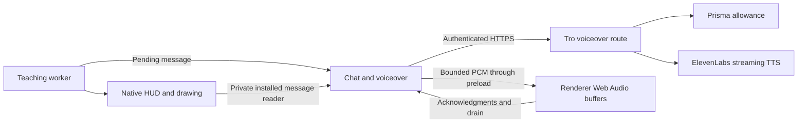

# HUD voiceover engineering

Implemented October 3, 2026; live provider and signed installed acceptance remain
unverified. See the [specification](HudVoiceoverSpec.md) and [delivery record](HudVoiceoverPlan.md).

## Ownership and flow

`AgentChatController` composes `VoiceoverController` through an injected instance.
Chat supplies task scope, accepted progress and cancellation. The controller owns
identity checks, deduplication, one active utterance, timeouts and interruption;
its injected transport/playback ports contain I/O. It does not import Electron or
browser APIs. The server remains one modular monolith.

| Owner                                                   | Responsibility                                                                                        |
| ------------------------------------------------------- | ----------------------------------------------------------------------------------------------------- |
| `contracts/Voiceover.ts`                                | Canonical request, playback/acknowledgment/status schemas and limits.                                 |
| `main/voiceover/VoiceoverController.ts`                 | Current task/message admission, exactly one local generation attempt, stream chunks and cancellation. |
| `main/Main.ts`                                          | Authenticated fetch, trusted IPC, acknowledged playback transport and microphone start coordination.  |
| `renderer/voiceover/VoiceoverPlayback.ts`               | PCM decoding, browser sample-rate conversion, bounded scheduling and confirmed stop/drain.            |
| `renderer/voiceover/UseVoiceover.ts`                    | One app-level subscriber, local preference and localized settings status.                             |
| `server/features/voiceover/VoiceoverConfig.ts`          | Public voice IDs keyed by canonical locale constants; backend product configuration.                  |
| `server/features/voiceover/VoiceoverPorts.ts`           | Provider and allowance ports.                                                                         |
| `server/features/voiceover/RegisterVoiceoverRoutes.ts`  | HTTP authentication, input/admission, one provider attempt, streaming and disconnect cleanup.         |
| `server/features/voiceover/ElevenLabsSpeechProvider.ts` | Fixed-origin provider adapter; only this adapter uses the key.                                        |
| `server/persistence/PrismaVoiceoverAllowance.ts`        | Serializable quota, concurrency and durable duplicate protection.                                     |

Short messages use Web Audio buffers rather than a separate playback worklet or
new streaming service. Tests mirror the owners and concentrate on observable
admission, cancellation, audio drain and paid-request protection.

## Native timing

The final teaching receipt arrives after drawing playback. `TeachingPresenter`
therefore publishes a pending candidate before the native call. Pending progress
is not yet rendered in the workspace or reduced into a HUD snapshot. Interrupted,
refused or failed presentations revoke that candidate through scoped worker progress,
abort active speech and release its HUD hold. The revoked identity remains consumed,
so a late native poll or repeated progress cannot restart it; a stale revocation cannot
stop a newer message.

The persistent HUD worker reads `read_companion_hud_message` every 150 ms with one
read in flight. It reports only changes to main. The private reader verifies the
HUD session/group lease and returns a message only when the compositor installed
its matching frame. It is hidden from model discovery and invocation through the
existing host-tool policy. This small bounded read replaces the proposed native
notification subscription; it carries no screenshots or observer logs.

Voiceover requires a matching candidate and installed message. Task scope, lesson,
step, sequence, text and locale checks reject stale/conflicting messages and avoid
replay on renewals/reconnects. Native final receipts still govern teaching admission;
voiceover is never completion evidence. The native dependency is `0.30.4-tro.16`.

Snapshot messages also receive installation tracking for questions/completion.
A nullable `speakingSequence` keeps a matching completion bubble visible while
speech is pending/playing, with a native 60-second maximum and host deadlines.
A valid final utterance may finish after task settlement; new work/teardown stops it.
Once a completion message has been verified as visible and narration starts, a
missing native frame or an older message poll cannot cancel that utterance. Main
retains its completion bubble until the renderer acknowledges that the final
queued audio sample has played. Explicit stop, new messages, microphone capture,
revocation, mute and teardown still interrupt immediately; deadlines remain bounded.
Diagnostics `voiceover.completion_retained`, `voiceover.playback_finished` and
`voiceover.stopped` include the utterance ID, message kind/sequence and stop reason,
without message text or audio. A normal finish logs `playback_finished` before
`stopped` with reason `completed`; a cutoff logs its interruption or failure instead.

## Provider and backend configuration

The backend calls the ElevenLabs HTTP streaming TTS endpoint once per complete
message. Default model is `eleven_flash_v2_5`; configured `eleven_v3` is also
accepted. Both support the required English/Vietnamese languages; Flash is the
initial latency-oriented choice. Model availability and voice pronunciation still
need account-specific acceptance. No provider WebSocket or conversational agent
is introduced, and no deprecated latency parameter is used.
[Provider models](https://elevenlabs.io/docs/overview/models#flash-v25),
[streaming API](https://elevenlabs.io/docs/api-reference/text-to-speech/stream).

Validate these backend-only settings in `server/Env.ts` using T3 Env:

- `ELEVENLABS_API_KEY`
- `ELEVENLABS_MODEL_ID` (default `eleven_flash_v2_5`)
- `VOICEOVER_DAILY_CHARACTERS` (default 30,000)
- `VOICEOVER_GLOBAL_DAILY_CHARACTERS` (default 1,000,000)
- `VOICEOVER_GLOBAL_STREAMS` (default 20)

Public voice IDs are product choices in
`server/features/voiceover/VoiceoverConfig.ts`. `VOICE_IDS` maps the canonical
`DesktopLocale.VIETNAMESE` and `DesktopLocale.ENGLISH` constants to their respective
voices. A `Record<DesktopLocale, string>` check requires every supported locale.
Both entries initially use George (`JBFqnCBsd6RMkjVDRZzb`) from the
[ElevenLabs quickstart](https://elevenlabs.io/docs/eleven-api/quickstart).
Change each entry independently to select its voice; no voice-ID environment variables are
needed. Account access and pronunciation remain live acceptance work.

A missing API key leaves speech unavailable without blocking API startup; setting
that key alone enables the provider with the configured voice and default model.
No key, voice URL, auth cookie or provider configuration enters the renderer. Each
request selects its voice by the validated locale and sends the displayed text
and explicit `en`/`vi` language, using raw mono S16LE at 24 kHz (`pcm_24000`).
[Audio formats](https://elevenlabs.io/docs/speech-synthesis/voice-settings).

## HTTP admission and persistence

`POST /api/v1/voiceover/stream` uses Tro's existing signed-in session reader and
cookie supplied by Electron main. A model-only bearer token is insufficient.
The strict body contains utterance ID, canonical teaching message and locale;
its maximum is 8 KiB and message text retains the existing 600-character bound.
IDs correlate desktop messages, not backend-certified model output or account
ownership. The backend authorizes bounded speech for the signed-in user.

The additive `20261003120000_voiceover` Prisma migration creates account/day usage,
a global daily budget and utterance metadata. A serializable transaction claims
one active stream per account, global stream capacity, daily character allowances
and a unique utterance before paid dispatch. Concurrent serialization conflicts
have a bounded database retry; provider requests have no automatic retry.

Charges are retained conservatively after admission even on generation failure or
cancel. Finishing releases the active lease, not the character charge. Expired
active leases recover from crashes; utterance IDs remain durable to prevent replay.
No text/audio is stored. User deletion cascades owned usage/utterance records;
the global aggregate retains its account-independent daily charge.

The route uses no-store binary responses with a fixed audio-format header, bounded
bytes/time and stream backpressure. Invalid/unauthenticated/unavailable/exhausted
requests fail before audio. Provider errors are sanitized; errors after headers
terminate audio instead of inserting JSON. Client disconnect aborts upstream and
settles its active lease. Cancellation does not guarantee a refund from ElevenLabs.

## Playback and interruption

Main validates audio headers, preserves odd trailing PCM bytes, splits aligned
chunks and checks the total limit. One acknowledged command is in flight; renderer
credits apply backpressure to reading. Maximum chunk size is 12,000 bytes and
maximum response is 3 MiB. Renderer schedules at most two seconds of audio, slowing
credits once its queue exceeds one second. Browser AudioBuffers retain the provider
sample rate so Web Audio resamples for the actual output device.

Start acknowledgment confirms an active AudioContext. Playback begins with a small
40 ms scheduling margin. End acknowledgment waits for all scheduled sources to
drain; HTTP EOF alone is not speech completion. Stop discards sources, resolves
pending credits and closes the context before acknowledging. Sequence and startup
generation checks reject late commands. Initial playable audio has a five-second
deadline; whole utterances have a 60-second deadline; stop acknowledgment has 1.5
seconds. The app allows automatic playback only within its trusted renderer.

Main suppresses new narration while microphone input is preparing, recording or
finalizing, or a microphone test owns its lease. It waits for confirmed playback
stop before emitting a voice capture prepare
or admitting a microphone test. If stop fails, it blocks capture rather than
opening input over narration. Native message changes/removal, new tasks, locale
updates, mute, Esc, sign-out, lock/suspend and renderer/window/application teardown
stop narration. `GlobalTaskCancelShortcut` retains Esc while either the lesson or
narration is active, including completion speech after task settlement. Both the
global shortcut and renderer fallback use one main-owned cancellation path; it
cancels the task and narration and clears the speaking HUD. Releasing the lesson
shortcut does not release Esc while audio is still pending/playing. Manual
**Stop speaking** remains a speech-only control. Passive pointer motion, focus
changes and minimization do not stop narration.

## Diagnostics and verification

Safe `voiceover.failed` events identify desktop playback or backend generation/
stream stages. Backend events include utterance ID and elapsed time, without text,
audio, keys, cookies or raw provider errors. HUD metadata reads do not log polls.

Focused tests cover installed-message admission, duplicate/stale tasks, split PCM,
provider failure without retry, mute, cancellation, audio drain/stop, HTTP auth and
allowance, provider text/locale forwarding, configuration and concurrent Prisma
admission/replay/retained charges. Unit tests use typed fakes; database integration
uses disposable PostgreSQL. None require live ElevenLabs credentials.

Verification on October 3, 2026 passed: `pnpm lint`, `pnpm format:check`,
`pnpm typecheck`, `pnpm test` (496 tests), `pnpm build`, `pnpm test:integration`
(eight tests), `pnpm build:cua` and `pnpm test:teaching:native`. Native contract
checks verify transport/ownership; physical input hooks and visible rendering
remain outside that automated acceptance.

Live release acceptance still requires configured voices and
signed macOS/Windows playback, pronunciation, real startup delay, microphone
interruption, minimized/background behavior and shutdown. This implementation
adds no Windows native HUD adapter; the existing HUD remains primary-display macOS.
Do not describe untested hardware/provider behavior as verified or promise zero
provider retention; account retention follows ElevenLabs configuration.
