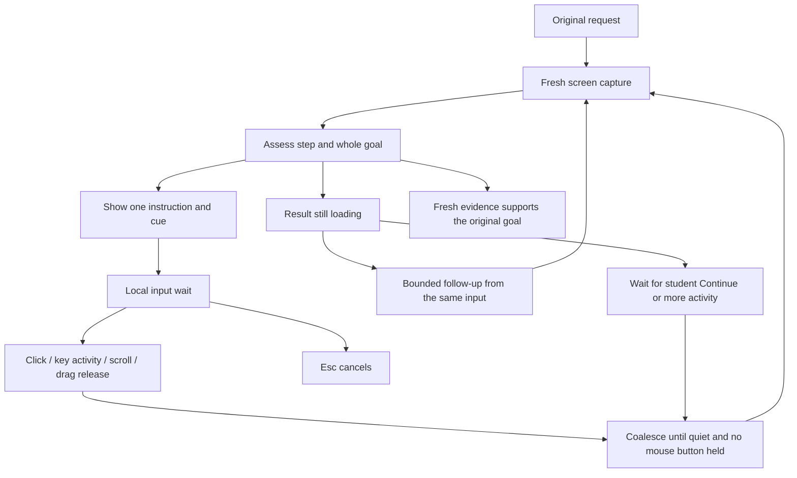

# Input-driven teaching observation

Designed October 3, 2026. The initial input-driven implementation is now present;
see implementation status below for delivered scope and remaining work. It replaces passive screen-change scheduling for teaching while
preserving fresh screenshots, target validation and whole-goal assessment.

The proposed [teaching loop refactor](TeachingLoopEngineeringSpec.md) builds on
this input-only foundation. It replaces frozen first-proposal goals, string-based
progress gates and exact-pixel path validation while retaining local waits and
paired instruction/drawing presentation. Those changes are planned, not current
runtime behavior.

## Behavior

The student requests a goal. Tro captures the screen, shows one reachable step,
and waits locally. A click, key activity, scroll or completed drag starts a quiet
window. Once activity settles, Tro captures the screen again and asks the same
agent to assess the previous step and the original goal. It then shows the next
step, waits, asks one necessary question, or confirms evidenced completion.

Disable automatic wakes caused by `screen_revision` and `relevant_revision`.
Do not require the entire screen to stop animating before proceeding. Disable
the continuous ScreenCaptureKit comparison stream in input-only watch mode,
rather than merely ignoring its revisions in TypeScript. Keep on-demand model
captures and the native target comparison immediately before cue playback.

No observer model, per-key model calls, recorded keystrokes, or continuous image
uploads are needed. Input metadata remains local. A single fresh screen capture
enters the next admitted model segment.

## Scheduling



Start with the existing 500 ms input quiet interval and 250 ms metadata polling.
Measure these before tuning by event type. Mouse movement alone does not resume
teaching. Dragging waits until release; scrolling and typing are grouped into a
single activity burst. A long typing session stays local until it settles.
These initial timings are implementation defaults, not measured latency claims.

Input during a model run remains pending. Treat its proposed cue as stale,
retain the original goal, wait for quiet input, and capture again. Preserve the
host-owned interruption through SDK wrappers as implemented in the recent fix.
Existing model admission limits and bounded stale retries still apply.

Each segment consumes only the input revision represented by its capture.
Do not advance the consumed revision to whatever happens to be current when
inference finishes: that could lose activity during inference. If a newer
revision exists, coalesce it for the next observation. Native counter resets,
overflow and watch ownership changes must be detected rather than mistaken for
student progress.

## Delayed results and hidden Dock

A single click or Enter can start loading. If the agent assesses the result as
pending, allow at most two follow-up observations tied to that consumed input
burst, initially after 1 and 3 seconds from the pending assessment. There is no
unlimited timer loop. These checks use the same goal, deadline and admission
budget. New student activity supersedes the pending rechecks. If loading remains
unresolved, keep the instruction visible and wait for input or an explicit
Continue action. Completion still requires a fresh observation.

Expose Continue through the existing workspace/voice interaction, routed to the
active lesson through a narrow validated command. It must not start a replacement
lesson. Keep the compact HUD message passive; no additional HUD button is required.
Continue does not bypass a question that requires a scoped answer or an access
failure. It requests another assessment only when that lesson can resume.

A hidden Dock depends on real-pointer hover, which is not a click or keystroke.
For this first input-only version, prefer a keyboard launch route: show a localized
instruction to press Command–Space, then assess the visible launcher after that
input. Guide typing Chrome and opening it, then its address bar. Add an explicit
keyboard-instruction continuation to the teaching contract rather than falsely
calling a launcher shortcut an already-focused text field. A shortcut is an
instruction for the student; Tro does not execute it.

If the launcher shortcut is unavailable or changed, assess the actual result and
choose another observed route or a focused question. If a hover route is used,
require Continue after the Dock is visible; ordinary pointer motion must not
silently enable passive visual watching. A future scoped hover-dwell signal can
be considered separately after this baseline is measured.

## Ownership and implementation order

1. **Native input-only watch contract.** Add a named watch mode to the private
   begin/read contract. Input-only watches report readiness, input revision,
   quiet duration, held-button state and geometry without starting the comparison
   stream. Reuse the existing native physical-input counters after checking that
   click, keyboard and scroll activity are covered. Do not add a second global
   hook service. Keep ownership, lease renewal, teardown and capture bracketing.
2. **Observation adapter.** `DesktopObservationClient` selects input-only mode for
   teaching. Readiness in this mode means an owned input watch and valid display
   geometry, not receipt of a continuous stream frame. A fresh `get_desktop_state`
   snapshot still binds input metadata to model evidence.
3. **Scheduling policy.** `TeachingObservationPolicy` admits settled input,
   explicit Continue, or a remaining input-linked follow-up. Passive visual
   revisions never admit a model run. The policy owns the follow-up budget and
   consumed revision. Geometry changes invalidate coordinates and pause/rebase
   captures; they do not create an unbounded automatic model loop.
4. **Lesson runner.** `TeachingTaskRunner` waits for input quietness, not global
   visual stability. Remove global screen revision as a generic completion
   rejection while retaining fresh capture provenance, input revision checks,
   geometry checks and target-local cue validation. The agent must ground goal
   evidence in the latest actual capture. Keep Esc and technical failure separate.
5. **Commands and instructions.** Add the scoped Continue command and keyboard
   instruction continuation in canonical contracts and update preload/main/worker
   callers together. Update the agent prompt to explain input-driven resumption,
   bounded pending-result checks and launch prerequisites. A wrong app remains
   a deviation within the same original goal.
6. **Diagnostics and contracts.** Update the scripted teaching journey and native
   boundary tests, then documentation. Log why a segment woke and which activity
   revision it assessed. Validate the complete flow before handoff.

Use one native watch adapter, one scheduler policy and the existing lesson
runner. Introduce focused types for input activity and wake decisions when their
responsibilities need them; do not add a second agent or duplicate orchestration
class. Preserve the existing public task outcomes and worker bundle entry points.

## Concrete implementation shape

This section specifies intended edits, not APIs already available in runtime.
The mode applies to Show me lessons; ordinary execution and its verification
agent keep their existing behavior.

### Enabled, disabled and retained

| Component / behavior                                             | Input-only teaching      | Reason                                                           |
| ---------------------------------------------------------------- | ------------------------ | ---------------------------------------------------------------- |
| Native click, keyboard and scroll counters                       | Enabled                  | Detect activity without recording input contents                 |
| Held-button tracking and input quiet duration                    | Enabled                  | Coalesce typing/scrolling; finish a drag before assessment       |
| Metadata reads and owned-watch renewal                           | Enabled                  | Cheap local scheduling and lifecycle checks                      |
| Continuous `begin_stream` ScreenCaptureKit watch                 | Disabled                 | Stop background capture and comparison work while waiting        |
| Low-resolution frame fingerprints / changed-fraction calculation | Unused                   | No passive visual change detector is scheduled                   |
| `screen_revision` and `relevant_revision` wake branches          | Disabled                 | Animation must not start model segments                          |
| Expected-result region subscription through `setRegions`         | Unused                   | Region-change wakes require the disabled comparison stream       |
| `waitForStableScreen` global pixel-stability loop                | Replaced                 | Wait for settled input, not a globally still desktop             |
| Global screen-revision mismatch in `changedDuringRun`            | Unused as a generic gate | Unrelated animation must not reject every result                 |
| On-demand `get_desktop_state`                                    | Enabled                  | The agent still needs visible evidence after activity            |
| Native `refresh_cursor_guidance_capture` target check            | Enabled                  | A target may move without input; old coordinates must be refused |
| Fresh capture IDs, input revision and display geometry checks    | Enabled                  | Fence input during inference and invalid coordinate spaces       |
| Frozen goal criteria and fresh whole-goal evidence               | Enabled                  | An event is not proof of a completed task                        |
| Input-linked delayed-result checks                               | Enabled, bounded         | A page can finish loading without another click                  |
| Unsolicited periodic model checks while idle                     | Disabled                 | No active inference or image upload during idle waiting          |
| Passive pointer motion / arbitrary hover detection               | Unused                   | Pointer movement alone must not start model work                 |
| Explicit Continue, scoped answers and locale updates             | Enabled                  | Resume or update the active lesson through owned commands        |
| Esc and presentation cleanup                                     | Enabled                  | Student cancellation releases the lesson and pending work        |

The unused visual code remains isolated for a later deliberate re-enable. Do not
start its stream, populate its fingerprints, subscribe its regions, or evaluate
its wake branches in input-only mode. This is a runtime switch with corresponding
resource shutdown, not commented-out code or a second observer implementation.

### Files and intended edits

| Owner                                                                                       | Concrete implementation change                                                                                                                                                                                                                                                                               |
| ------------------------------------------------------------------------------------------- | ------------------------------------------------------------------------------------------------------------------------------------------------------------------------------------------------------------------------------------------------------------------------------------------------------------ |
| `src/contracts/DesktopObservation.ts`                                                       | Add `DesktopWatchMode` with `INPUT_ONLY` and `SCREEN_AND_INPUT`; derive its schema/type from the named constants. Add mode to the private watch request and acknowledgement. Specify mode-specific readiness and visual-field semantics.                                                                     |
| `driver-patches/CursorCompanion.patch`                                                      | Extend the native `WatchInput`/watch state, parser and schemas together. Only `SCREEN_AND_INPUT` starts `begin_stream`; `INPUT_ONLY` initializes owned input state and display geometry. Keep metadata read, capture bracketing, risk classification, injected-session parsing, lease and teardown behavior. |
| `src/desktop/worker/observation/DesktopObservationClient.ts`                                | Request `INPUT_ONLY`, validate the acknowledged mode, and stop calling `setRegions` for that watch. Retain capture-bound baselines and lease renewal.                                                                                                                                                        |
| `src/desktop/worker/observation/TeachingObservationPolicy.ts`                               | Replace visual wake admission with input-burst admission and explicit wake decisions. Own consumed input revision, pending burst, follow-up deadline and remaining checks. Retain global admission limits and stale retry accounting.                                                                        |
| `src/desktop/worker/teaching/TeachingTaskRunner.ts`                                         | Change readiness/stale waits to input readiness and quietness. Schedule only admitted wakes. Preserve input that arrived during inference. Remove global visual revision gates, retain target-local validation, and settle each returned assessment in the policy.                                           |
| `src/contracts/TeachingStep.ts`                                                             | Add a distinct keyboard-instruction continuation, with host validation that prevents it from becoming a generic no-cue spatial action. Keep existing focused-field and waiting-result meanings.                                                                                                              |
| `src/contracts/AgentSession.ts`, `DesktopBridge.ts` and desktop preload/main/worker callers | Add a narrow Continue command bound to the current session/lesson. Reject stale IDs and invalid lifecycle states; dispatch to the existing lesson rather than a new request.                                                                                                                                 |
| `src/desktop/worker/agent/ComputerUseInstructions.ts`                                       | Explain input-driven wakes, keyboard launch prerequisites, loading-check limits and Continue. Preserve fresh observation, same-goal assessment and localized presentation requirements.                                                                                                                      |
| `test/desktop/worker/observation` and `test/desktop/worker/teaching/flow`                   | Replace expectations of passive visual wakes and add input-only journey coverage. Retain legacy-mode cases separately if that mode remains supported.                                                                                                                                                        |
| `scripts/BuildCuaCompanion.ts` and native boundary fixture                                  | Rebuild the changed native contract, verify executable provenance/version, and assert no comparison stream is started for input-only watches.                                                                                                                                                                |

The private schemas must change top down in one implementation: native tool
catalog, request parsing, acknowledgement, capture observation metadata, worker
adapter and fixtures. Do not silently accept an old peer's screen-and-input watch
as input-only. If the current metadata envelope retains visual fields for
compatibility, define their input-only values as unavailable/non-authoritative;
they must never be interpreted as evidence that the screen is unchanged. The
mode-aware schema and scheduler enforce that meaning.

### Scheduler API sketch

Keep scheduling in `TeachingObservationPolicy`, with small explicit operations.
The following signatures are proposed responsibilities, not a new public SDK:

```ts
// Metadata only: no key contents or screenshots.
recordStudentActivity(observation): void
readNextWake(nowMs): TeachingWakeDecision | null
recordCapturedInput(inputRevision): void
recordStepAssessment(assessment, expectedResultIdentity, nowMs): void
requestContinue(lessonId): boolean
cancelPendingWakes(): void
```

`TeachingWakeDecision` uses named reasons such as settled input, pending-result
recheck and explicit Continue. It carries the relevant input revision and
follow-up number, so logs and the runner share one decision. Returning `null`
means keep waiting locally. Only the runner starts SDK work; the policy has no
I/O, timers, native imports or model calls.

The runner owns one local poll/delay and one model segment at a time. It asks the
policy for the next decision after reading metadata, then captures on admission.
When a new instruction is admitted, it stores the input revision already
represented by that capture. It does not consume activity newer than the capture.
An explicit answer stays in `TeachingLessonContext`; Continue carries no answer
and cannot replace a required clarification.

### Loading budget and race rules

A pending-result budget is keyed to the originating input burst and expected
result identity. Start it once when that action first yields a pending result.
Another pending assessment from a follow-up consumes the existing budget; it
must not reset it to two. Advancing to a new student action clears the old budget.
New input supersedes an older scheduled follow-up and starts a fresh assessment.

Cancel pending local delays on Esc, lesson disposal, technical failure and watch
replacement. Do not allow an old timer or input revision to resume a replacement
lesson. A locale update changes presentation but does not refill loading checks.
Admission limits may delay or pause work; they never create additional checks.
An idle lesson without new activity, an explicit resume or a remaining
input-linked check performs no model requests.

### Target refusal without global visual watching

An on-demand target check can still refuse a cue if its control moved. That
refusal permits the existing bounded same-goal recovery after input quietness.
It does not reactivate the passive stream or repeatedly wait for the whole screen
to stop changing. After the stale retry budget is exhausted, keep the goal and
ask for a scoped resume. Display geometry changes invalidate the current capture;
re-read geometry before any new cue and retain the primary-display limitation.

Fresh captures support assessment at the time they were taken. Disabling global
visual watching removes continuous knowledge of later changes; it does not make
one screenshot proof that the screen will remain unchanged. Preserve native
capture provenance and cue target checks, and test a moved target explicitly.

### Resource expectations to verify

While waiting, input-only mode reads scalar metadata at 250 ms intervals and
renews the owned watch. It retains no continuous screen frame buffers and runs
no image hashing/region comparisons. SDK screenshots happen only on an admitted
segment, while native cue checks happen only before a requested demonstration.

Measure idle CPU, native frame callback count, capture count and model request
count on the same lesson before and after the change. Assert zero comparison
frames in input-only mode. Do not claim performance savings from a scheduler
switch alone if the native stream is still running.

## Readable diagnostics

Extend the existing development exchanges with:

- `input`: original goal, last instruction, observed input revision and wake reason.
- `output`: previous-step assessment, observation summary, proposed instruction,
  expected result and whole-goal assessment.
- `error`: stale input, invalid target, SDK failure or native refusal.

Ordinary logs contain activity counts/revisions and timing, not actual typed keys.
Debug traces retain the existing explicit development gating and media/credential
redaction. Local polling is not logged on every tick. Report follow-up number and
remaining budget so a waiting lesson is distinguishable from a model loop.

## Acceptance

- Animated desktop/video without student activity: no resumed model requests and
  no continuous comparison stream in input-only mode.
- Click: one resumed assessment after quiet, regardless of unrelated animation.
- Typing burst: no model request per character; one assessment after it settles.
- Held drag: no intermediate assessment; one after release and quiet.
- Scroll burst: one assessment after quiet.
- Input during inference: no stale playback and no lost activity; same-goal retry.
- Opening the wrong app: the agent observes the result and corrects the route.
- Hidden Dock: keyboard launch instructions lead to a browser and then YouTube.
- Enter followed by delayed loading: bounded input-linked follow-ups can establish
  completion; exhausted follow-ups wait locally and Continue resumes the same goal.
- A click without the intended screen result: no automatic step or goal success.
- Esc: cancels during waiting, coalescing, follow-up delay and inference; no later
  activity resumes that lesson. Technical failures retain distinct outcomes.
- Locale changes: displayed instructions continue to follow the selected locale.

Final implementation validation: `pnpm lint`, `pnpm format:check`, `pnpm typecheck`,
`pnpm test`, `pnpm build`, `pnpm test:integration`, native rebuild and
`pnpm test:teaching:native`. Manually test the real hidden-Dock YouTube workflow;
fixture and native boundary passes do not establish model routing quality.

## Implementation status: input and target matching

Implemented October 3, 2026: teaching selects native `input_only` watches; these
initialize input metadata without starting the ScreenCaptureKit comparison
stream. Passive screen/region wakeups and global pixel-stability gates are
unused in this mode. Fresh screen captures, input/geometry fences, native target
comparison, SDK interruption recovery, and goal evidence remain active.

`GlobalStudentInput` owns active-lesson event listeners in main. It shares the
existing native input hook with voice through `PhysicalInputHook` leases and
removes only its own listeners on completion/disposal. Normalized primary-display
press/release/drag metadata and content-free key/scroll activity cross the private
worker port, bound to the session and root task request ID. Other displays have
unknown positions. Passive pointer motion is ignored; held movement has a small
noise threshold and is throttled.

`StudentInteractionTracker` is the worker's step-bound matcher. The model supplies
actual click bounds or drag source/destination bounds in the optional
`interaction` field of `present_teaching_step`. A tour can omit interaction;
matching then stays unavailable, rather than guessing bounds from a decorative
circle. New steps clear pending gestures. Invalidated captures clear target
matching. A normalized 0.01 tolerance accommodates near clicks. These summaries
enter the next lesson input and never establish success. Unmatched clicks still
wake the normal native input-based scheduler.

The policy permits two pending-result checks tied to a consumed input burst;
subsequent pending assessments do not refill them. Further activity or a scoped
answer resumes the lesson after the budget is exhausted. A separate workspace
Continue command remains planned, as does richer event-type latency tuning.
Keyboard prerequisites now have a dedicated continuation reason.

The runtime dependency is now `0.30.4-tro.14`; rebuild the companion after the
private watch contract change. Real student gesture delivery, coordinate accuracy
and hidden-Dock model routing need manual acceptance in addition to unit/journey
and native-boundary tests.

### Recorded input versus visible effects

Per-step mouse evidence now retains the latest six completed attempts, their normalized
press/release points, total attempt count and the model-declared interaction bounds.
Keyboard/scroll activity can update the latest summary without erasing mouse evidence.
A new admitted step clears this history; stale target invalidation removes matching
bounds. This remains an approximate intent record, not app dispatch or semantic proof.

The tutor must not infer a missed click or identify a different clicked control solely
from an unchanged screenshot. Missing event metadata also cannot establish inactivity.
For controls with no persistent effect (for example Scratch's green flag with an empty
script), inspect required content before repeating the cue. Recorded activity does not
waive the original goal's completion criteria. Live physical event delivery and model
adherence still need manual verification.

### Interrupted drawings and message order

Each new spatial step submits instruction and cue together. The host publishes the
localized message before drawing; a final chat reply cannot replace the presenter.
Ordinary input may interrupt playback with `user_takeover`. This does not establish
student failure or cancel the lesson. If the same action remains pending and its cue
has no completed receipt, the host accepts fresh coordinates when instruction and
expected result are unchanged, preserving step identity and input evidence. Completed
cues remain deduplicated; this does not create a timed automatic playback loop.
The model must copy these fields exactly for a retry and inspect refusal results.
Tutorial illustrations must not be mistaken for editable application surfaces.

### Input interruptions are not target-validation failures

When physical input supersedes a capture during inference or preview, the harness
waits for settled input and resumes without spending the three-strike native target
validation budget. Geometry changes and target failures without new input retain the
bounded retry policy. The pause message describes inability to validate a drawing;
it does not claim the screen is continuously changing. Native `target_changed` can
still require a fresh capture, and should not be assumed to be caused by cursor motion.

Development `agent.debug.exchange` records with operation `teaching.decision` provide
a compact original request/activity → model observation and assessment → proposed
instruction/displayed instruction/result contract. These are model-stated summaries,
not hidden chain of thought. Screenshots remain excluded from console logs.
