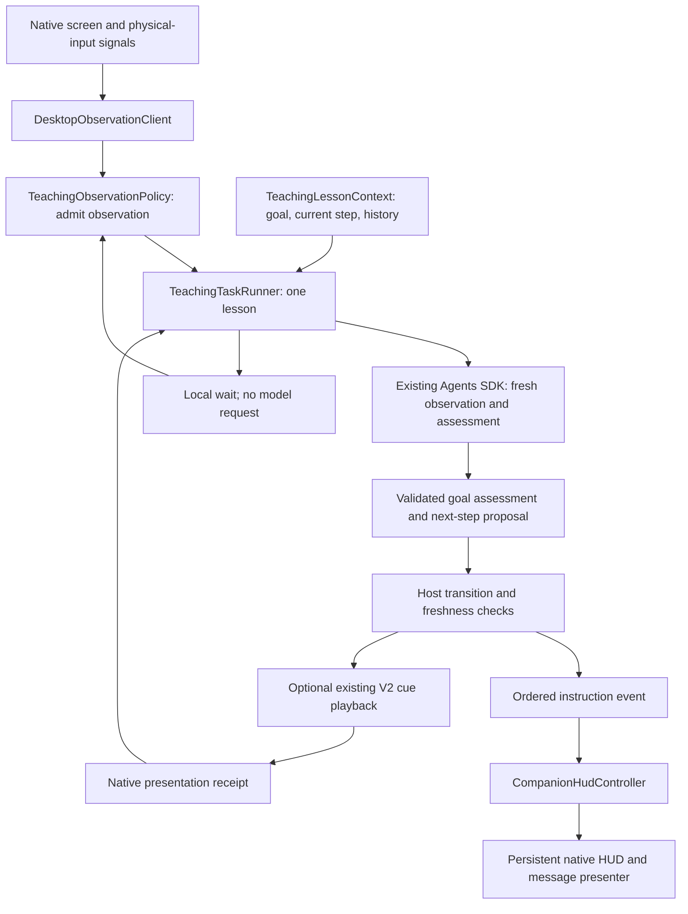

# Teaching companion messages and progress

Status: implemented October 3, 2026, with manual acceptance items listed below.
This design extends the implemented
[TeachingObservationDesign](TeachingObservationDesign.md), rather than replacing
the existing lesson runner, native observer or Agents SDK integration.

The next proposed refactor is specified in
[TeachingLoopEngineeringSpec.md](TeachingLoopEngineeringSpec.md): simplified
goal/checkpoint decisions, persistent action-result evidence and a paired native
presentation acknowledgement. This document continues to describe the delivered
companion; the refactor is not yet implemented.

## Decisions

1. Show one current teaching message immediately below the companion HUD. Publish
   it before its associated cue begins. Keep it visible while the student acts.
2. Generate instructional text in the selected desktop locale. Use the same locale
   for HUD labels, questions, waiting messages and completion messages.
3. Keep the original goal separate from the current step. Define observable
   completion criteria for both, before relying on either assessment.
4. Local events request an observation; they never establish semantic success.
   The existing agent assesses fresh evidence. There is no second observer model.
5. Advance an instruction only on assessed progress or an explicitly explained
   recovery. Do not replay an unchanged cue just because another observation ran.
6. Support a new instruction without a new pointer animation when the required
   control is already focused or the student must wait for a result.
7. Esc cancels. Clicks, typing, scrolling and dragging keep the lesson active.
8. After each reachable instruction, end the model segment and wait locally for
   the student. Group subsequent activity into a settled observation, then assess
   whether to continue waiting, advance, recover or finish.

The first delivery is a presenter for the current instruction, not a second chat
session. Existing typed and voice question answers remain the input path. An
editable chat box beneath the HUD is outside this proposal.

## Current code and gaps

| Current owner                  | Existing behavior                                                             | Proposed change                                                   |
| ------------------------------ | ----------------------------------------------------------------------------- | ----------------------------------------------------------------- |
| `TeachingReply.ts`             | Separate previous-step and goal assessments, with a free-text expected result | Explicit criteria and evidence-backed decisions                   |
| `TeachingLessonContext.ts`     | Immutable original request, previous instruction and bounded history          | Goal criteria, current step identity and accepted evidence        |
| `TeachingTaskRunner.ts`        | One SDK segment at a time, local waits and freshness checks                   | Admit step transitions and suppress repeated presentation         |
| `TeachingObservationPolicy.ts` | Input settling, revision wakes and noise backoff                              | Explain wake reasons and distinguish observation from progression |
| `StartAgentWorker.ts`          | Emits instruction text with progress                                          | Emit a validated, ordered presentation event before cue playback  |
| `CompanionHudController.ts`    | Reduces voice/task progress to HUD phases                                     | Retain and publish the current teaching message                   |
| `CompanionHud.ts`              | HUD snapshot has phase, locale and meter level                                | Bounded, identity-fenced message payload                          |
| `CompanionHudClient.ts`        | Coalesces snapshots through a persistent presentation worker                  | Preserve message identity through reconnects                      |
| Native driver patch            | Draws the compact HUD and cursor cues                                         | Draw a passive, wrapped message below the HUD                     |

Current instruction progress is emitted after the model segment returns. Merely
copying that text into the HUD would improve visibility but would still make the
instruction arrive after its cue. The proposed pre-playback event closes that gap.

The current host requires native demonstration evidence for most new guide replies.
That rule must distinguish a new spatial demonstration from a continuation such as
"Now type youtube.com and press Enter." A shown cue remains evidence of presentation,
not evidence that the student completed an action.

## Architecture

The worker owns meaning and progression. Electron main owns presentation reduction
and lifecycle fencing. Native code owns drawing, observation and physical input.
The renderer does not receive arbitrary desktop execution or native window APIs.
Execute mode retains its existing independent task harness.

Use the existing classes for their existing responsibilities. Add a focused,
framework-free `TeachingProgressPolicy` for validating proposed transitions and
duplicate presentation. It should be a pure decision function unless implementation
demonstrates a need for state; state belongs in `TeachingLessonContext`.

## Goal and step contracts

All names below are proposed contracts, not existing APIs. Shared wire contracts
belong in `src/contracts`; worker-only interpretation stays in the teaching feature.
Derive types and fixed status values from their owning schemas/constants.

### Lesson goal

Retain an immutable original request and a bounded set of goal criteria. Each
criterion has an identity and a description of an observable result. Examples:

- Open YouTube: the browser visibly shows the YouTube destination loaded.
- Connect two ERD entities: the requested relationship visibly connects the named
  entities, including requested direction/cardinality when observable.
- Show a control: the requested grounded cue actually displayed. Student action
  is not required when the request only asks for a demonstration.

The agent proposes criteria from the request and initial observation. The host
validates their shape and freezes the admitted goal for the lesson. Later steps
cannot silently shrink it. A consequential ambiguity requires a focused question;
an answer can explicitly clarify the goal through a recorded revision. Arbitrary
screen text cannot modify the goal or permissions.

### Current step

Keep these concepts separate:

| Value                 | Meaning                                                            |
| --------------------- | ------------------------------------------------------------------ |
| `stepId`              | Host-assigned identity; unchanged while waiting on the same result |
| `instruction`         | Bounded, localized message telling the student what to do now      |
| `expectedResult`      | Observable condition that completes this step                      |
| `presentation`        | Optional spatial cue, or continuation using existing focus         |
| `observationScope`    | Relevant window/region hints, grounded in current evidence         |
| `presentedAtRevision` | Host observation baseline associated with presentation             |
| `assessment`          | Reached, pending, deviated or uncertain, with supporting evidence  |

An instruction can contain a small sequence if all controls are currently reachable.
For a beginner, prefer one useful action when later controls will appear only after
that action. There is no fixed number of steps per goal.

Criteria describe outcomes, not an exhaustive catalog of gestures. A click tracker
can assist scheduling for any pointed target; it does not become an action-specific
completion detector. Identical instructions are not necessarily identical steps:
identity, target and expected result matter, so do not deduplicate by text alone.

### Evidence and decision

Each fresh observation gets a host-owned identity and capture/input/display baseline.
The model associates criterion assessments with evidence from that observation and
states uncertainty. Validate evidence references against host-owned observations;
the model cannot manufacture capture provenance. Where available, readable native
or accessibility state complements screenshot evidence. Accessibility enrichment
is optional platform work, not an assumed capability of today's observer metadata.

The host can validate provenance, freshness and consistency. The semantic judgment
remains fallible; a schema does not prove that a page or relationship is correct.

| Decision                      | Required behavior                                                   |
| ----------------------------- | ------------------------------------------------------------------- |
| Pending                       | Keep the current step and message; wait without replaying the cue   |
| Step reached, goal incomplete | Accept fresh evidence, then admit the next reachable step           |
| Deviated                      | Describe the observed mismatch and propose a grounded recovery step |
| Uncertain                     | Observe a useful missing detail or ask one necessary question       |
| Goal reached                  | Require evidence covering every goal criterion; finish and clean up |

An assessment of reached for the previous step never implies reached for the goal.
A completion proposal must be consistent with the entire original request and
current goal criteria, even if it comes directly from the initial observation.

## Companion message presentation

Approved visual reference: [TeachingCompanionDemo.html](TeachingCompanionDemo.html).
This is an interactive prototype with simulated observations, not the native runtime.

Match the existing native HUD: a 22-point-high dark pill, 88 points wide in English
or 98 in Vietnamese, with a thin blue outline, blue microphone/status icon and
9.5-point status text. Preserve its existing waveform, voice states and lifecycle;
do not introduce the demo's earlier green avatar or decorative waveform during waits.
Use a short localized waiting label when the student is acting.

Place a slim plain-text message immediately below it, with a 5-point gap and the
**same left edge as the HUD**. The approved initial style uses a 220-point-wide dark
bubble, subtle blue border, 9-point corner radius, 8-point vertical/10-point horizontal
padding and 11.5-point text with approximately 1.45 line height. Left-align and wrap
the text. Show only the instruction: no next-step heading, step counter or Escape/stop
hint inside the bubble. Escape cancellation remains functional through the existing
keyboard and workspace controls.

Clamp the HUD/message group within the primary display while preserving alignment.
Flip the message above the HUD if there is no room below. Keep it readable against
light and dark applications. Both remain passive: no window activation, keyboard
focus capture or intercepted clicks through their bounds.

Initial text limit: 600 characters with a bounded readable height. Prefer a short
sentence or two; the limit is a transport bound, not a target message length.
Dimensions are proposed tuning values, not hardware findings.
Generate concise instructions within that limit; reject oversized presentation
payloads rather than silently truncating the student's action. Keep larger history
in the main window. Render plain text, not HTML or executable links.

### Word reveal and completion fade

Reveal a new accepted instruction word by word, initially at 90ms per word as in
the approved demo. This is local presentation of a validated message, not a model
call per word or a requirement to stream model tokens to the compositor. Preserve
URLs and technical tokens as units. Reserve the final wrapped text dimensions before
revealing it so the bubble and HUD do not move as words appear. Expose the complete
instruction to accessibility without announcing each word separately.

Do not restart the reveal for meter updates, repeated pending assessments or a
replayed transport snapshot. A changed message replaces the old reveal; lesson,
message sequence and locale revision fence old animation callbacks. Reconnects
restore the current message rather than treating it as a new instruction.

Only after the **whole goal is verified**, show the localized completion message,
finish its word reveal, hold it for 2 seconds, then fade the message opacity to zero
over 2.8 seconds. Intermediate step success, partial typing and loading never start
this dismissal. The fade applies to the message only; retain the HUD's own lifecycle.
Release the screen watch and model/task resources immediately on completion rather
than retaining them for the visual fade. The presenter can retain only the bounded
completion snapshot until the fade ends, then release it.

A new lesson, new message, locale refresh, Esc, sign-out or disposal cancels old
reveal/fade callbacks. With reduced motion, display complete text immediately and
hide after the same reading hold without an animated fade. Locale replacement
restarts the completion reading hold only for the newly accepted localized text.

The presentation payload includes lesson ID, step ID when applicable, monotonically
increasing sequence, message kind, locale and text. The complete snapshot represents
the latest desired state. Reject late events from retired lessons or older sequences.
Coalesce transport without dropping a newer instruction when an audio-meter update
arrives. Identity and sequence also fence delayed hide callbacks and reconnects.

Messages remain visible through local waiting, including when the preview clears
after student input. Thinking changes the status label without erasing the current
instruction. Loading may replace the text with a meaningful waiting message for
the same step. Questions and resource pauses persist until resolved. Completion
uses the reading hold and fade above, then clears the message. Esc, sign-out, task replacement,
failure and window close clear lesson-owned presentation through explicit lifecycle
transitions. Idle time alone does not end an unfinished lesson.

Do not label a local student wait as perpetual thinking. Add a localized waiting
presentation state rather than mapping every waiting event to showing.

### Locale

Support the existing `en` and `vi` settings; do not infer the reply language from
the user's last sentence. Snapshot the selected locale on lesson admission and
include it in every model segment and presentation event. Static status labels
come from local translations; generated instructional text uses the same locale.
Technical tokens and application names, such as `youtube.com`, remain intact.

For a settings change during an active lesson, propagate a validated locale update
to the worker. Preserve the goal, step identity and observer baseline. Local labels
change immediately. Hide the old-language instruction while refreshing its wording
through one bounded text-only call to the existing model pipeline; show a localized
status meanwhile. This call can translate the accepted step only: it cannot invoke
desktop tools, advance a step or declare completion. Queue activity during the
refresh, then re-observe normally if needed. Fence late translations by locale
revision; rapid setting changes coalesce to the latest locale. A translation failure
shows a localized retry status rather than wrong-language instructions. This
explicit settings action can cost a model call; routine observation never translates.

## Publishing the message before the cue

Introduce a teaching-only orchestration tool, proposed name
`present_teaching_step`, exposed through Tro's agent adapter. Its validated input
contains a localized instruction, expected result and an optional currently grounded
V2 cue. The host assigns step identity and enforces transition policy. It publishes
the message through progress before delegating to existing native cue playback.

In teaching mode this wrapper is the single route for admitting new steps; hide
direct preview invocation from that agent to prevent bypass. It reuses current
capture renewal, epoch and receipt checks instead of reimplementing them. HUD host
tools remain private. Ordinary execute-mode Cua discovery is unchanged.

The tool returns admitted step identity and native receipt status to the agent.
The final structured reply assesses goal/step and yields; it cannot publish a second,
conflicting instruction. A failed cue is not marked presented, and technical failure
is surfaced separately. Existing focused-field typing and result waits can be
admitted without a new spatial cue, with current evidence and an explicit reason.
No arbitrary explanation-only tutorial is introduced.

The persistent presenter remains asynchronous; message-before-playback means host
event ordering, not proof of compositor timing. The native acceptance test must
confirm visible ordering. If the transport cannot preserve it, carry the pending
message in native cue admission and acknowledge presentation before starting the
animation. Do not silently claim delivery merely because an event was emitted.

## Observation and scheduling

### Two local waits

The teaching sequence is **show the next reachable instruction → wait locally →
detect relevant activity/change → settle → observe → assess → continue or finish**.
The completed SDK segment is not left open awaiting screen context. On a qualifying
wake, the host starts a new bounded segment with retained lesson context and a fresh
observation. Waiting uses no model tokens and does not continuously encode/upload
screenshots. The native observer still consumes bounded local resources.

| Wait          | Purpose                                                  | Exit condition                                                                                   |
| ------------- | -------------------------------------------------------- | ------------------------------------------------------------------------------------------------ |
| Student wait  | Give the student time to perform the current instruction | Eligible input, visual change, question answer, resource recovery or Esc                         |
| Settling wait | Avoid assessing the middle of an activity burst          | Initially 500ms of input quiet and no pressed mouse button, subject to existing admission limits |

Student waiting has no idle deadline that ends the lesson. Settling is not evidence
that the screen is globally stable: animations can continue while input is quiet.
Use current freshness checks and relevant-change admission instead of demanding that
all screen pixels stop changing. Keep the instruction visible and show waiting,
rather than thinking, while no model segment is active.

Coalesce consecutive keystrokes, clicks and scrolling into an activity burst.
Observe drag results after release, not while the button is held. A matched target
click can prioritize a wake but does not skip settling or prove success. After a
pending assessment, return to local waiting without advancing the step or replaying
its cue. After a reached step with an unfinished goal, publish the next reachable
instruction and repeat the same cycle. A one-action goal can finish immediately when
that same fresh observation satisfies both its step and goal criteria.

For the YouTube route: browser visibility advances to the address-bar instruction;
focus advances to typing; partial typing remains pending; Enter can produce a loading
wait; a later visual change wakes observation to verify the destination without
requiring another student action. Wrong-app evidence admits recovery. Do not replace
these result checks with a timer or a count of clicks.

### Native detection and admission

Retain the existing session-owned native stream, bounded tile hashing and metadata
transport. No continuous screenshots are encoded or sent to the model. Exclude the
cursor, HUD and new message graphics from observation so our own presentation cannot
trigger progress; do not blindly exclude the entire user application.

Record wake reasons such as settled input, relevant visual revision, geometry
change or question answer. A wake means possible change. A click near a target is
an optional high-value scheduling hint, never completion and never the only trigger.
Typing, hover-revealed UI, asynchronous navigation and drag results remain covered.

Keep the current 500ms input settling and pressed-button gate as initial defaults.
Coalesce new signals during an SDK segment. Capture after admission, assess once,
then wait locally. Changes racing capture remain pending; one SDK segment runs at
a time. Mouse motion alone does not wake the model, but revealed content can.

Relevant target/expected-result regions should preferentially trigger observation.
Geometry changes and genuine physical input still require reconsideration. Global
visual revisions remain a fallback when reliable regions are unavailable; existing
no-progress backoff bounds animation noise. Region hints must not suppress all
outside changes, because a new window, dialog or destination may appear elsewhere.
This refinement needs native contract work and measurement; it is not already
provided by the current global revision metadata.

Pending results keep their message without replay. A new cue requires a new step,
changed target, explicit recovery or student request to show it again, plus fresh
native admission. Do not automatically retry failed native submissions. Repeated
uncertain observations back off or ask a focused question; they do not generate an
endless instruction loop. Preserve existing model limits, stale-capture budgets,
resource pauses and cleanup. Delayed loading is driven by visual changes; a bounded
recheck is appropriate only when evidence suggests a pending transition whose
relevant changes cannot be detected, with a documented limit and no busy polling.

## Example transitions

| Fresh state            | Message in English / Vietnamese                                        | Step result                                 | Goal result     |
| ---------------------- | ---------------------------------------------------------------------- | ------------------------------------------- | --------------- |
| Browser icon visible   | Click Chrome. / Bấm vào Chrome.                                        | Wait for browser window                     | Incomplete      |
| Browser window opened  | Click the address bar. / Bấm vào thanh địa chỉ.                        | Previous step reached; wait for focus       | Incomplete      |
| Address field focused  | Type youtube.com, then press Enter. / Nhập youtube.com rồi nhấn Enter. | Previous step reached; wait for destination | Incomplete      |
| Partial URL typed      | Keep current typing instruction                                        | Pending; no repeated circle                 | Incomplete      |
| Navigation loading     | Wait for YouTube to load. / Chờ YouTube tải xong.                      | Pending; no new cue                         | Incomplete      |
| YouTube visibly loaded | YouTube is open. / YouTube đã mở rồi.                                  | Reached                                     | Reached; finish |
| Different app opened   | Ground a recovery in the actual screen                                 | Deviated; new recovery step                 | Incomplete      |

If the requested goal is only to focus the address field, the focused-field
observation can finish the lesson. If the request is to open YouTube, it cannot.
If the entire requested goal is one action, the same observation can satisfy both
step and goal criteria. There is no mandatory intermediate step or verification call
just to create a longer lesson.

For an ERD, release of a mouse button wakes observation. A correct visible
relationship satisfies the step criterion; a missed connection yields recovery.
Only all requested relationship criteria satisfy the goal. This uses the same
policy as navigation, with different semantic criteria.

## OpenClicky patterns to adopt

Research reference: OpenClicky commit
[`e9eb06a`](https://github.com/jasonkneen/openclicky/tree/e9eb06a29ff5cd82033d032238f51a936168b05a).

- Adopt its local activity admission and one observation per activity burst as
  scheduling principles. Retain Tro's visual observer for changes without input.
- Adopt its nonactivating response overlay and stale-hide fencing. Keep Tro's
  current instruction visible until its state changes instead of copying the
  normal response bubble's six-second hide behavior.
- Consider its target click tracker as a wake hint. Do not adopt proximity as proof
  that the requested action succeeded or as the only generic observer.
- Reuse the current response text; do not create another chat agent for the HUD.
- Keep explicit Tro lesson ownership and completion contracts rather than copying
  OpenClicky's large central manager or its generic next-useful-step tutor prompt.

The inspected tutor path points and speaks; the normal response pipeline supplies
the full floating text response. They are not uniformly wired together. These are
patterns to adapt, not evidence that OpenClicky solves Tro's whole teaching flow.
See its [tutor pipeline](https://github.com/jasonkneen/openclicky/blob/e9eb06a29ff5cd82033d032238f51a936168b05a/cursor-buddy/CompanionManager%2BAIResponsePipeline.swift),
[activity detector](https://github.com/jasonkneen/openclicky/blob/e9eb06a29ff5cd82033d032238f51a936168b05a/cursor-buddy/CompanionManager%2BOnboarding.swift)
and [response overlay](https://github.com/jasonkneen/openclicky/blob/e9eb06a29ff5cd82033d032238f51a936168b05a/cursor-buddy/CompanionResponseOverlay.swift).

## Implementation order and acceptance

1. Extend typed presentation contracts, progress ordering and native message
   drawing. Include locale propagation and lifecycle fencing end to end.
2. Add goal/step criteria, identities and pure transition rules to the existing
   context and runner. Update the teaching tool and structured reply together.
3. Add observation wake reasons and deduplicated presentation; refine relevant
   visual admission while retaining the global fallback and existing budgets.
4. Extend the executable teaching-flow contract through the real production
   boundaries. Then validate the native compositor and student workflow manually.

Required deterministic scenarios:

- English and Vietnamese instructions, localized statuses, and a locale change
  during an active lesson with late responses rejected.
- Instruction event preceding cue playback; same step identity through local waits.
- A one-action goal finishing versus the same action being an intermediate step.
- Address focus advancing to typing without another circle; partial typing retaining
  the step; loading retaining the lesson; YouTube evidence admitting completion.
- Wrong app and missed ERD drop producing recovery rather than success or cancel.
- Same observation and pending assessment not replaying the cue.
- Student input during cue/model/translation, stale captures, out-of-order events,
  reconnect, technical failure and Esc retaining their distinct meanings.
- Capture excludes message graphics; own presentation does not cause model wakes.
- Local waiting sends no model requests; observation admits at most one segment.
- Activity bursts produce one eligible settled observation; held drags and successive
  keystrokes do not trigger premature segments. Delayed page changes can resume
  observation without another input event, and idle waiting never cancels a lesson.
- The HUD and slim message share their left edge in both locales and at display
  edges. No next-step heading, step counter or Escape hint appears in the bubble.
- New messages reveal word by word without layout shifts or repeated accessibility
  announcements; ordinary snapshots do not replay the reveal.
- Whole-goal completion holds the fully revealed message for 2 seconds and fades
  it over 2.8 seconds. Intermediate progress does not dismiss guidance. Late fade
  callbacks cannot hide a new lesson or replacement message; reduced motion is honored.

Native acceptance must check focus preservation, click-through behavior, display
edge placement, text wrapping, waveform coexistence, correct teardown and actual
message-before-animation visibility. Live semantic evaluation must check real
YouTube navigation and ERD edits; mocks do not prove semantic reliability.

Measure CPU, memory, capture rate, unnecessary wakes, model calls, tokens and
input-to-next-instruction latency on the weakest supported Mac. Preserve current
resource bounds unless measured evidence justifies changing them. No new observer
model, polling model call, screenshot logging or cloud persistence is introduced.

Implementation verification follows repository requirements: finish all changes,
then run lint, formatting checks, typecheck, tests, build and integration checks;
also run the teaching contract and patched native build/tests for native changes.
Implementation now uses `TeachingStep.ts` for bounded messages, step proposals
and goal evidence; `TeachingProgressPolicy.ts` for transitions;
`TeachingLessonContext` for frozen criteria and step identities; and
`TeachingTaskRunner` for publication, local waits and bounded locale translation.
The native companion patch draws the message in the existing compositor and
tracks relevant-region revisions in the existing screen stream. There is no
second observer model or screenshot queue. `TeachingFlowApp.ts` exercises the
production renderer, preload, main controller, worker, SDK and presenter contracts.
Native boundary probes cover the real message/watch parsers, scoped revisions and
message-frame acknowledgment before V2 playback. The acknowledgment confirms
CALayer installation, not physical display scan-out.
Physical compositor timing, VoiceOver, real-model semantics and weak-machine
performance remain manual acceptance items; automated fixtures cannot establish
those guarantees.
