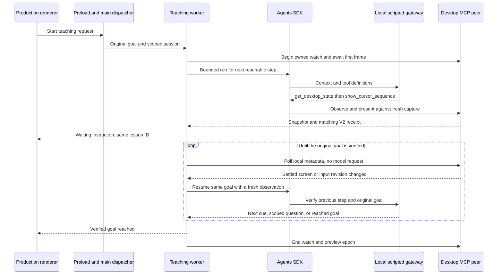

# Executable teaching flow contract

Tro must keep one teaching request active until the original goal is verified,
Esc or the visible cancel control stops it, or a concrete failure is reported.
A completed cursor animation is evidence of a demonstration, not goal completion.
Ordinary clicks, typing, a wrong app, dragging, and delayed page changes are
signals to observe again. They must not cancel the lesson.

## Run the contract

```sh
pnpm test:teaching
pnpm test:teaching:native
```

The first command builds an isolated Electron application from the checkout.
It mounts the production `ComputerUsePage` and `useComputerUse`, loads the
production sandboxed preload, dispatches through the same `executeAgentCommand`
used by main, and runs `AgentChatController`, `AgentWorkerClient`,
`StartAgentWorker`, the actual Agents SDK, and `LoggedCuaServer` over a real
stdio MCP connection. It does not stub `runComputerUseAgent` or `run()`.

Authentication, permission status, model responses, and the desktop MCP peer
are deterministic fixtures. This is a contract for orchestration and boundary
compatibility; it does not assess a real model's interpretation of a screen.
The fixture returns independent wire examples rather than deriving responses
from the teaching runner. Production Zod validators still validate those
responses. Fixture HTTP binds only to `127.0.0.1`; no provider credentials,
paid calls, external sign-in, browser profiles, or user input injection are used.

The second command additionally starts the production `EmbeddedDesktopDriver`
under the checkout's branded Tro host. It checks the actual native catalog,
V2 task admission, watch admission, first frame within ten seconds, capture
snapshot, connection ownership, idempotent teardown, and inaccessible ended
watches. These real calls cross native risk admission and the parser that
receives injected session metadata. It requires macOS, the current built
companion driver, and Tro's existing Accessibility and Screen Recording grants.
A missing driver, missing grant, or failed native check fails the command; it
cannot turn into a simulated pass.

Both commands use a unique temporary build and Electron user-data directory,
clean up their own workers and windows, and delete only that directory. Native
capture remains in memory and is never forwarded to the model fixture, logged,
or written to a screenshot file. The native check creates no real input and
changes no OS grants. Test composition omits the production HUD and voice
services. It checks the renderer's Esc path; the global Esc hook and native
physical-input detection require manual acceptance below.

## Flow and owners



`TeachingTaskRunner` owns the lesson lifecycle. `TeachingLessonContext` retains
the original request and bounded context. `TeachingObservationPolicy` admits
settled changes and applies resource limits. `DesktopObservationClient` validates
native ownership and metadata. Native Cua owns pixel comparison, physical-input
revisions, capture geometry, rendering, and transport session attribution.
The observer is infrastructure, not another model agent.

## Enforced scenarios

| Scenario                  | Executable requirement                                                                                                                                                          |
| ------------------------- | ------------------------------------------------------------------------------------------------------------------------------------------------------------------------------- |
| Initial request           | Observe first, present a cue with a matching capture and V2 receipt; root request stays pending                                                                                 |
| Idle and pointer movement | No additional SDK/model requests without revision changes; native pointer filtering remains a manual acceptance check                                                           |
| Wrong app                 | Same lesson resumes, observes and guides again; no cancellation or premature success                                                                                            |
| Drag in progress          | No new SDK run while native `buttons_down` is true                                                                                                                              |
| Delayed visual change     | A screen revision without an input revision can resume and verify the goal                                                                                                      |
| Question                  | Answer goes through production preload with the current session/lesson; stale lesson ID is rejected                                                                             |
| Completion                | Requires a fresh observation and a reached-goal reply; completed playback alone leaves the task waiting; a screen change during the completion reply forces another observation |
| Esc                       | Production renderer handler stops during waiting and an in-flight model request through preload/main/worker; watch and epoch release; later changes do not resume               |
| Invalid receipt           | A foreign epoch cannot acknowledge a demonstrated step; failure reaches the renderer                                                                                            |
| Watch error               | Fails before model dispatch; typed, redacted diagnostics identify the native boundary                                                                                           |
| Background animation      | Stable cue region is renewed locally and displayed once despite global screen revisions; local refresh tool is absent from model discovery                                      |
| Repeated stale cue        | Abort the stale SDK segment immediately; after three attempts pause the same lesson, release the watch, and wait for a scoped answer with zero further model calls              |
| Native following renewal  | Renew and read state during an active V2 epoch; native output validation accepts guidance metadata and retains the epoch                                                        |
| Teardown                  | Every admitted watch and preview epoch ends or releases on connection shutdown                                                                                                  |

The gateway asserts that each SDK segment contains the original goal and that
host watch tools are absent from the model catalog. Timeouts identify the stage
and safe counters. Native results, screenshots, transcripts, credentials, and
model request bodies must not be printed when an assertion fails.

## Manual acceptance before a native release

The executable commands deliberately print `NOT VERIFIED` for coverage they
cannot provide. Run this flow using the normal Tro application after both pass:

1. Ask “Làm sao mở YouTube?” from a desktop with no browser foreground.
2. Confirm Tro guides toward an available browser, including revealing the Dock
   when necessary. Opening a browser is a reachable step, not a request that the
   student already know how to do it.
3. Click the shown target with the real cursor. Confirm the lesson observes and
   continues without a canceled message or another root request.
4. Repeat once with a different app. Confirm Tro detects the deviation and
   guides toward the original goal.
5. In a browser editor, drag an object. Confirm no new cue targets the moving
   object during the drag; after release Tro observes the changed editor.
6. Confirm waiting and small pointer movements do not generate model calls.
   Confirm delayed loading or a hover-revealed target can prompt observation.
7. Finish opening YouTube. Confirm success reflects the visible page.
8. Start another lesson and press Esc during waiting and during model thinking.
   Confirm marks and watches release and later input does not resume that task.

This acceptance checks real model choices, physical hooks, global Esc,
coordinate accuracy, overlay rendering, and production HUD/voice wiring.
A simulated contract pass does not claim these passed.

## Change policy

Run `pnpm test:teaching` whenever worker, SDK, preload, IPC, teaching schemas,
observer scheduling, or model gateway wiring changes. Run
`pnpm test:teaching:native` and manual acceptance whenever native watch,
session metadata, risk classification, capture, or cursor rendering changes.
The intentional fault cases emit the production redacted error logs. A `PASS`
means the expected failure was asserted; any unexpected result prints `FAIL`
and exits with a nonzero status.

Portable CI can require the first command; a macOS desktop with granted
permissions must run the native command. No CI job is installed by this change.

## Tracing a missing pointer cue or provider socket failure

The API logs `model.gateway.attempt` for each provider attempt with its number,
phase, duration and whether response headers arrived. A failed attempt includes
an allowlisted network code, syscall, errno and cause depth when available. `EPIPE`
with `write` identifies a broken pipe during the request; it does not establish
whether OpenAI, a proxy, or another network component closed the connection.
Raw error messages, addresses, credentials and model bodies remain excluded.

The desktop logs a numbered `agent.teaching.segment.started`, followed by
`step.proposed`, `step.admitted` or `step.refused`, `message.published`, and
`cue.requested`/`cue.settled` or `cue.skipped` under the same `agent.teaching`
prefix. Proposal summaries include cue kinds/count, continuation reason and
previous-step assessment. Skips distinguish an already displayed cue from a
focused-control or loading continuation. Native settlement records the validated
status/refusal reason. `segment.reply` identifies disagreement between final text
and the admitted message; `waiting_locally` confirms the model segment ended.
SDK errors retain their HTTP status through bounded cause traversal.

A changed instruction cannot bypass an unreached step by claiming an existing
focused-control continuation. A loading continuation must retain the same expected
result. New spatial actions still require the agent to supply a grounded cue;
these structural checks do not independently interpret instructional prose.

## Readable development exchanges

Development (`APP_ENV=dev`) additionally emits `agent.debug.exchange` records with
`operation`, `input`, `output` and `error`. These content-bearing traces are for
local debugging requested by the developer; ordinary production diagnostics keep
the existing summaries. The API never logs model bodies.

Follow `task.admitted` for the actual request, then `teaching.segment.input` for
the resume trigger and lesson context. `model.response` pairs the model input
messages with its returned text/tool arguments. `teaching.step.proposed` shows the
instruction, expected result, coordinates and assessments. `native.tool` shows
the arguments actually dispatched to Cua and its refusal or receipt;
`native.host` includes lifecycle failures but omits routine observer polling.
`teaching.segment.output` records the final assessment and next action.
`teaching.failed` pairs the last instruction/trigger with the error.

Example (illustrative, not a replay of a captured request):

```json
{
  "msg": "agent.debug.exchange",
  "operation": "native.tool",
  "toolName": "show_cursor_sequence",
  "input": { "steps": [{ "kind": "circle", "center": { "x": 0.5, "y": 0.98 } }] },
  "output": { "isError": true, "structuredContent": { "code": "invalid_request" } },
  "error": { "reasonCode": "invalid_request" }
}
```

Images/audio, transport headers and credential fields are omitted. Recognizable
credential patterns in text are redacted. Depth, item count, string length and
node limits mark truncation rather than allowing unbounded dumps. Debug text can
still contain private student instructions and application content; inspect it
before sharing a trace. Redaction is not a guarantee against arbitrary secrets
embedded in free text. Production disables these records through its log level.

## Host interruption across SDK tool errors

A changed input/capture detected inside `present_teaching_step` is a host recovery
signal. The SDK can wrap that exception in a `ToolCallError` without retaining
its cause. Each model segment therefore retains its own typed interruption at
the tool boundary and restores that control flow when the SDK settles. It
re-observes under the existing bounded stale-run policy, retaining the same goal.
Unrelated SDK failures still fail normally, and Esc remains cancellation.

The `input_during_proposal` journey reproduces this through the real SDK: input
changes after the screenshot but before the proposal. It asserts no stale
playback, three bounded segments followed by a local pause, and same-goal
resumption after a scoped answer. The native build verifies the executable's
reported version before writing its manifest; the Rust patch and build contract
both report `0.30.4-tro.11`.

## Model tool-input correction boundary

The presenter keeps strict schema validation. A model rectangle extending beyond
normalized screen bounds is rejected before any message or cue is published. The SDK
error callback returns safe field paths and correction constraints to the same model
segment. It allows two correction attempts; the third invalid proposal stops with
`model_input_invalid` and public reason `invalid_request`. Host-owned state preserves
this diagnostic even if the SDK wraps it without a cause. Native execution errors
still propagate and are never converted into proposal correction feedback.

`TeachingProposalRecovery.test.ts` invokes the production SDK function tool with the
oversized-rectangle values from the reported failure, then corrected values. It also
covers malformed JSON exhaustion and propagation of native errors. These tests need
no live provider and do not establish that a real model always corrects its response.
Per-rejection logs include attempt count, field paths and exhaustion, not raw values.

## Pending drawing repair

A completed preview is transient, not a permanent indication that a drawing is still visible. When the model explicitly proposes the same pending instruction and expected result using a fresh capture, the host retains the step identity and replays the grounded cue. Completed duplicates on the same capture stay suppressed; interrupted previews remain retryable. This does not schedule previews while idle.

A refused step transition returns the retained instruction, expected result, frozen goal criteria, display status and a repair instruction. The model must repair its pending spatial proposal rather than merely repeat the old chat. Changing an unreached checkpoint still requires an explicit deviation assessment; whole-goal completion still requires fresh evidence for the original criteria.

## One presentation call owns message and drawing

`present_teaching_step` requires `kind: spatial` or `kind: text`. Spatial proposals require a nonempty instruction, a grounded cue and `continuationReason: null`. Text proposals require `cue: null` and an explicit `focused_control`, `keyboard` or `waiting_result` reason. Declared click, drag and scroll interactions cannot use text-only presentation. Canonical validation runs before publishing either output, including through the actual SDK tool adapter.

The host publishes the instruction in the observing phase, plays the required native drawing, validates a completed receipt for every requested cue step, then enters the waiting phase. The tool returns `admitted`, `messagePublished` and `drawingCompleted`; canceled, partial or invalid playback never confirms a spatial presentation. These are host publication and native playback acknowledgments, not proof that the student performed the action. Publishing the message precedes playback; this is a single logical contract, not a transaction that can roll back pixels already displayed.

Each SDK segment owns a `TeachingStepPresentation` receipt. A refused attempt clears success for that segment. An earlier segment's drawing or a final chat answer cannot authorize `guide / wait_for_student`. The host allows two corrective segments, each observing again, then reports `presentation_incomplete` if the model still yields without presentation. Questions and fresh whole-goal completion remain valid without another drawing. Input during playback still resumes the same lesson; Escape alone cancels it.

Executable coverage includes missing-cue validation through the SDK, partial/canceled receipts, text continuations, repair after a chat-only response, and refusal to reuse an old drawing after a later chat-only response.

## Capture comparison diagnostics

Native companion `0.30.4-tro.13` adds measurements without changing the exact-pixel comparison rule. For each requested cue, the local refresh returns its index/kind, encoded pixel bounds `[left, top, right, bottom]` (right/bottom exclusive), compared/changed pixel counts, changed fraction, maximum channel delta (0–255), and first changed coordinate in row order. Counts can overlap between cues; do not sum them as unique screen pixels. There are at most eight regions. Full regional counting runs only when a drawing is requested, not while waiting locally; pixels and screenshots remain local and are never included in diagnostics.

Read `cua.guidance.capture_refreshed` for the refusal reason, capture age, comparison duration and `comparisonDiagnostics`. Failed comparisons are warning-level events. `comparisonDiagnosticsAvailable: false` explicitly identifies old drivers or failures before pixel comparison. Geometry/capture-unavailable failures retain their existing reasons and may have no regional measurements.

The development `agent.debug.exchange` event with `operation: teaching.capture_comparison` pairs `input` (original capture ID, age, capture options, normalized cue steps) with `output` (validated match result, measurements and host admission state). `cua.guidance.comparison.failed` reports tool/schema failures with safe input, output metadata and rejected field paths. These logs distinguish a real target change from an unmeasured refusal; they do not claim why pixels changed or prove student action.

Rebuild the native companion after changing the patch. TypeScript fixtures without diagnostics remain accepted; native measurements and their log forwarding have regression coverage.

## October 3 loop migration

The current teaching implementation follows [TeachingLoopEngineeringSpec.md](TeachingLoopEngineeringSpec.md#implementation-record--october-3-2026).
Earlier descriptions of frozen string criteria, separate cues, full-animation receipts,
and stale-capture three-strike pauses describe the retired implementation. The new
contract tests correlated native `presented` receipts, explicit goal/criterion IDs,
typed action geometry, input-only local waiting, and same-SDK target repair. The native
probe exercises the input-only watch and paired message/cue receipt. Fixtures do not
prove real-model judgment or physical input-hook delivery.
