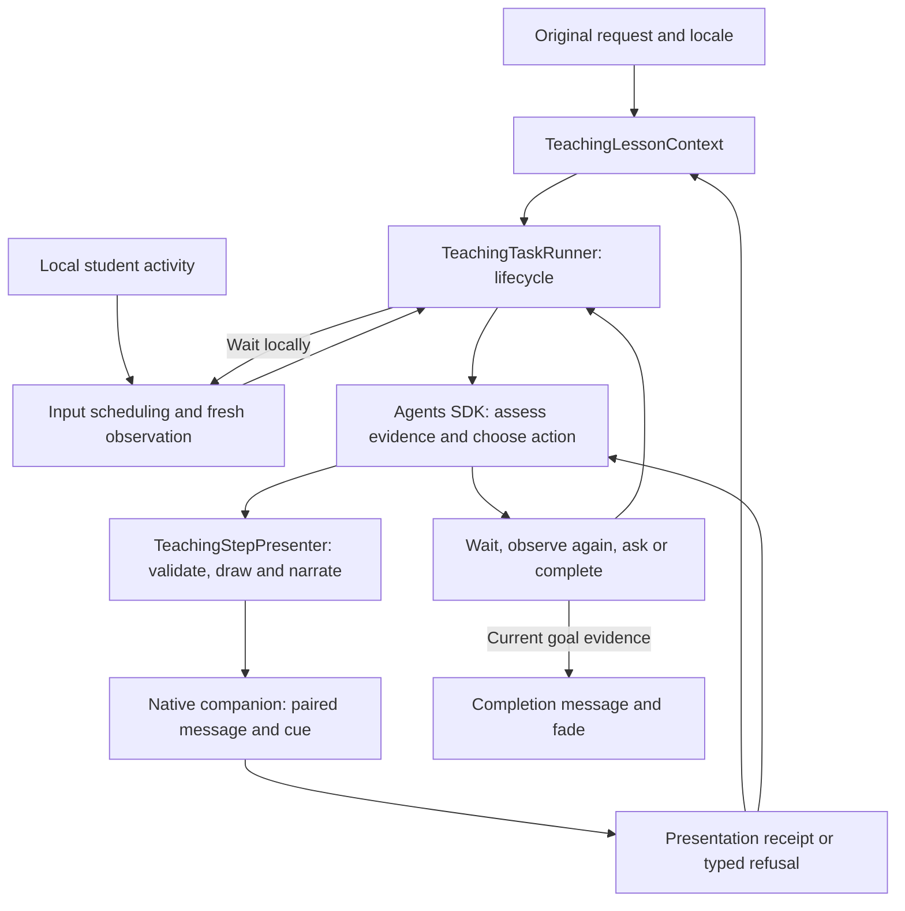

# Teaching loop engineering spec

Status: implementation added October 3, 2026. The verification record below
distinguishes deterministic checks, native checks and pending real-model evaluation. See [InputDrivenObservationPlan.md](InputDrivenObservationPlan.md)
and [TeachingFlowContract.md](TeachingFlowContract.md) for current implementation
and validation limits. Execute mode retains its existing harness and verifier.

## Decision and basis

Keep the Agents SDK, authenticated model gateway, Cua MCP transport and native
companion. Simplify teaching around one persistent loop:

**Observe → assess → present one reachable action → wait for student activity →
observe its result → continue toward the original request.**

OpenAI recommends keeping the environment alive, preserving tool calls and outputs
in the conversation, and returning current screenshots after actions. Conversation
and environment state are separate. Its current guide recommends code execution
and also offers structured computer actions. This is public integration guidance,
not documentation of Codex's private implementation.
[OpenAI computer-use guide](https://developers.openai.com/api/docs/guides/tools-computer-use#preserve-state-and-return-observations)

Tro adapts this loop to teaching: the student performs the action while Tro presents
it. Structured actions fit our existing permission boundary. Adopting the loop does
not require exposing arbitrary generated code or replacing the SDK. Goal revisions,
paired presentation and recovery rules below are Tro design choices.

## Previous failures and code evidence

The reported Scratch trace includes actual screen descriptions and recorded clicks.
Perception and input delivery were operating. However, the stored goal described
clicking a flag rather than completing the assignment. The model repeatedly treated
an unchanged tutorial picture as unsuccessful input. A later next-arrow proposal
was refused by native pixel validation, followed by a regression to the illustration.
These observations do not prove that every click reached the intended app control.

The mechanisms replaced by this refactor were:

- `TeachingLessonContext.admitCriteria` freezes the first criteria array by exact
  JSON equality. A mistaken initial interpretation cannot be corrected.
- `TeachingProgressPolicy` uses instruction/expected-result strings and cue
  fingerprints to admit transitions. Text equality cannot establish progress.
- `TeachingTaskRunner` admits a checkpoint and publishes its instruction before
  native drawing validation. It also owns presentation, model runs, input waits,
  locale translation and multiple recovery paths.
- `TeachingStepPresentation` accepts a full-animation completion receipt. This
  differs from acknowledging a visible cue before the student acts.
- `recordReply` retains history after the SDK segment returns. Interrupted segments
  can lose observations and failed proposals needed to understand recovery.
- Native `matches_cue_pixels` requires exact agreement within padded drawing
  bounds, including arrow paths. Differences do not prove a destination moved.
- `resumeAfterStaleCapture` invalidates interaction targets and eventually requires
  a student reply after drawing refusals, obscuring the actual technical problem.

## Product invariants

1. One original request owns the lesson until evidenced completion, Esc, or a
   reported technical failure. Waiting for an idle student uses no model calls.
2. Task completion, checkpoint completion and presentation completion are separate
   facts. Neither input nor a successful drawing establishes application success.
3. Every spatial instruction has a capture-grounded drawing for that action.
   A model's final chat cannot substitute for a presentation receipt.
4. Input establishes an attempt. An unchanged screen does not establish a missed
   click. Unexpected results require assessment of the actual interface.
5. A refused drawing is a presentation failure, not student failure, cancellation
   or permission to weaken the goal.
6. Ordinary input may interrupt animation and resume the lesson. Only Esc or the
   existing explicit cancel control records user cancellation.
7. Preserve the compact, left-aligned message below the HUD, word reveal, passive
   click-through behavior, current setting locale and slow completion fade. Add no
   stop/next button to the HUD.

## Architecture and ownership



Keep one model agent for teaching. Observer and presenter are ordinary code. Do
not merge execution permissions or its separate verification agent into teaching.

| Owner                                    | Responsibility after refactor                                                                            |
| ---------------------------------------- | -------------------------------------------------------------------------------------------------------- |
| `TeachingTaskRunner`                     | Start/stop a lesson, run one SDK invocation at a time, apply its disposition, share budgets and clean up |
| `TeachingLessonContext`                  | Original request, goal revisions, checkpoint identities, questions and bounded evidence/history          |
| `TeachingObservationPolicy`              | Input coalescing, consumed activity sequence, bounded loading rechecks and model admission               |
| `DesktopObservationClient`               | Owned native watch, readiness, lease renewal and capture baseline                                        |
| `StudentInteractionTracker`              | Structured attempts and approximate target matching; no semantic judgment                                |
| Proposed `TeachingStepPresenter`         | Prepare/commit paired presentation, derive cues, validate receipts and return repair feedback            |
| `LoggedCuaServer` / `CuaCompanionClient` | Native transport, tool restrictions, capture provenance and session/epoch fences                         |
| Native companion                         | Validate target geometry, compose message/cue, acknowledge drawing presentation and clear overlays       |
| Electron main / HUD                      | Existing validated progress routing, locale and presentation lifecycle; no planning                      |

The presenter is the only new stateful service planned. Extract it from the runner
and absorb `TeachingStepPresentation` into it. Use schemas and focused pure functions
for action validation, cue construction and evidence-packet building. Do not add
another coordinator class, observer model or generic event bus.

## Implementation blueprint

This is the planned code shape. The methods below are proposed responsibilities,
not exported APIs already present. Keep the current feature folders and startup
entry points; implementation is an extraction and replacement within the worker.

### What happens for one request

1. `TeachingTaskRunner.run` starts one owned input watch and guidance session and
   creates `TeachingLessonContext` from the request and locale.
2. The runner obtains an on-demand desktop capture through `LoggedCuaServer`, using
   the same Cua observation path and evidence recording as model tool calls. It
   builds a packet containing the image, coordinate mapping and activity represented
   by that capture. No second capture service is introduced.
3. The SDK receives this packet and bounded history. The agent defines the task
   goal, assesses the current checkpoint and calls `present_teaching_step` with
   one typed action and a localized instruction.
4. `TeachingStepPresenter.presentStep` derives the drawing, validates the target,
   invokes the paired native presentation and records its receipt or refusal as
   an operation in lesson context. A refusal returns to the same agent as tool
   feedback when the SDK can continue safely.
5. The agent yields a small decision. The runner validates its references and
   either waits locally, requests a bounded further observation, asks a focused
   question or accepts supported task completion.
6. Settled activity, a scoped answer, Continue or an admitted loading recheck
   supplies the next observation. The same request, goal and operation history
   remain available throughout the lesson.

The core loop should read approximately as follows. This is pseudocode; resource,
locale and receipt checks are named explicitly rather than hidden in a new harness.

```text
begin owned observation and companion session
try
  while lesson is active
    stop if Esc or session disposal was requested
    admit observation/model work under shared limits, or wait locally
    capture current desktop and the activity sequence it represents
    build context packet from goal, checkpoint, attempts and operation history
    run SDK with presenter and goal tools bound to this lesson
      record observations, presentation attempts and failures as they occur
    retain available complete SDK exchanges
    validate decision against current goal, capture and presentation references

    await activity -> require accepted presentation, then wait locally
    observe again -> require a loading/repair reason and remaining budget
    ask -> retain the question and wait for its matching answer
    complete -> require current original-goal coverage and evidence, then finish
    invalid decision -> return bounded repair feedback; never imply success
finally
  end owned watch/session and remove listeners/timers
```

Input arriving during inference is retained. Superseded coordinates cannot be
presented, but the runner does not discard all useful observations from that run.
The existing SDK boundary catches and records incomplete provider history without
fabricating tool results. Completion checks use the newest relevant evidence.

### Class and method changes

| Owner                       | Implementation responsibilities                                                                                                                                                                                                |
| --------------------------- | ------------------------------------------------------------------------------------------------------------------------------------------------------------------------------------------------------------------------------ |
| `TeachingTaskRunner`        | Retain `run`, `submitAnswer`, `recordStudentActivity` and `updateLocale`; replace the inline presentation closure with the injected presenter; reduce recovery to decision application and shared limits                       |
| `TeachingLessonContext`     | Add `defineGoal`, `reviseGoal`, `recordObservation`, `recordOperation`, `commitPresentedStep` and `buildObservationPacket`; keep the original request and scoped-answer methods; admit completion against the current revision |
| `TeachingStepPresenter`     | Implement `presentStep` as prepare → validate target → native paired presentation → receipt validation → context commit; return structured tool feedback for recoverable refusals                                              |
| `TeachingObservationPolicy` | Track consumed activity and admitted follow-ups; decide when a new packet is useful; expose scheduling decisions rather than screen-stability questions                                                                        |
| `StudentInteractionTracker` | Record structured attempts, refresh accepted target mapping and return bounded attempt data; do not decide success                                                                                                             |
| `LoggedCuaServer`           | Reuse capture recording and private native dispatch; decode target-validation and paired-presentation outputs; distinguish recoverable refusals from broken transport/session state                                            |

Keep pure `createTeachingCue` logic with the teaching presenter. It maps a click's
target bounds to a circle/pointer, a drag's endpoints to an animated route and a
scroll's viewport/direction to its cue. Use fixed bounded presentation timings and
the existing native cue vocabulary. The model selects the action and target; it
does not separately author cue geometry or omit a drawing for that spatial action.

Keep packet construction in lesson context or a focused local pure function. The
capture adapter owns external-data validation and the SDK adapter owns conversion
to `AgentInputItem`; the context must not become a native transport or provider
request builder. Inject existing ports rather than importing Electron or MCP I/O
into pure action/decision validation.

### What will actually be removed

- Delete `TeachingStepPresentation.ts` and its old tests once its receipt checks
  are incorporated into the presenter and replaced with frame-acknowledgement tests.
- Remove `TeachingLessonContext.admitCriteria`'s JSON freeze, `readStepRepair`'s
  exact-string copying protocol and cue fingerprints as semantic progression gates.
- Remove independently optional interaction/cue input from the migrated proposal
  and duplicated next-instruction/criteria fields from the final decision.
- Remove the runner's inline presentation implementation and its separate stale-run
  and missing-presentation retry loops. Retain one typed recovery path and budget.
- Remove `recordStaleRun`, `needsStableScreenAnswer` and stale-specific backoff once
  all callers use presenter recovery. Replace the misleading `waitForStableScreen`
  name/logic with input settling; retain readiness and held-button checks.
- Remove `CuaCompanionClient.waitForStudentAction`, its unused timer helper and
  test group after confirming there are still no production consumers.
- Remove unused teaching `setRegions` subscription plumbing without deleting the
  native visual-stream implementation used by other modes.
- Replace native whole-path exact-pixel equality and ordinary-refusal segment aborts
  with target validation and structured recovery feedback.
- Remove detailed prompt-sentence assertions and obsolete fixture branches described
  in the test-retirement section. Preserve regression coverage at its new owner.

If `TeachingProgressPolicy.ts` has no distinct responsibility after its string gates
are removed, delete it and its test file; place simple reference checks with the
owning context/presenter. If a meaningful pure admission rule remains, keep a small
policy module. Decide based on final responsibility, not preserving a class/file count.

### Why instruction and drawing stay together

There is one model action proposal and one host presenter. The same typed action
produces the cue and activity target; the native message and cue share identities.
The runner waits for the student only after the correlated pair is acknowledged.
An invalid pair returns a repair reason instead of silently becoming chat guidance.
This is the structural protection against the previous missing-drawing bug.

For example, the agent proposes “Click the address bar” with its observed bounds.
The presenter derives and displays the circle and instruction, then returns the
receipt. A student click causes a fresh observation. Confirmed field focus permits
“Type youtube.com and press Enter.” A typed URL completes neither navigation nor
the lesson; the next observation must establish YouTube is open.

This protects presentation completeness. Effective instruction still depends on
correct target selection and progress reasoning, measured by the live scenarios
in this spec rather than by successful receipt parsing alone.

## Goal and checkpoint implementation

Keep `originalRequest` immutable. Store an interpreted goal separately, with
host-assigned revision and criterion IDs. A checkpoint has its own ID, action and
expected observable result. Presentation IDs cannot substitute for goal evidence.

| Concept               | YouTube example                                     |
| --------------------- | --------------------------------------------------- |
| Original request      | “How do I open YouTube?”                            |
| Task criterion        | YouTube is visibly open in a browser                |
| Current checkpoint    | Open Chrome using the observed launcher             |
| Checkpoint result     | A Chrome window is visible                          |
| Presentation evidence | The launcher instruction and its cue were presented |

Replace automatic freezing with explicit goal admission and revision. Define the
goal before the first checkpoint. A revision references its preceding revision,
changed criteria and a short reason grounded in the request and evidence. It
invalidates old completion assessments. Revisions may correct interpretation but
must not silently change scope or reduce an assignment to a click. Material
ambiguity requires a focused question.

The host validates references, provenance and revision consistency. It cannot prove
semantic fidelity by comparing text. The model assesses coverage of the original
request; live evaluations must test this limitation. A schema does not guarantee
correct goal interpretation.

Distinguish action walkthroughs from interface tours at goal admission. A walkthrough
finishes on the application result. A tour can finish when the requested controls
have been explained with acknowledged cues. Do not infer the purpose from whether
an animation completed.

## One action drives instruction, drawing and observation

Keep the model-visible `present_teaching_step` tool. Replace independently optional
interaction and free-form drawing fields with one required typed action. The host
derives the activity matcher and default cue from it. This removes three separately
authored descriptions of the same step that can disagree.

| Action               | Required grounding                                                      | Presentation                                                   |
| -------------------- | ----------------------------------------------------------------------- | -------------------------------------------------------------- |
| Click                | Observed target bounds and label                                        | Circle the target and point to it                              |
| Drag                 | Observed source and destination bounds                                  | Mark both ends and animate the route                           |
| Scroll               | Observed viewport bounds and direction                                  | Mark the viewport and indicate direction                       |
| Type                 | Current observed focus, or target bounds when focus must be established | Show the field when needed; text only after focus is evidenced |
| Keyboard shortcut    | Relevant OS/app context and bounded shortcut description                | Text only when no spatial target is required                   |
| Highlight for a tour | Observed control or region                                              | Circle/outline with its explanation                            |
| Wait for a result    | Evidence of a pending operation and expected result                     | Retain the current instruction; no new spatial action          |

Combine only deterministic operations within an observed state, such as typing a
URL and pressing Enter in a confirmed address field. Opening a menu and selecting
an unseen item requires separate observations. A drag's endpoints are one action.

The proposal contains goal revision, current observation ID, previous-checkpoint
assessment with evidence references, localized instruction, action and expected
result. Target identity includes display, dimensions and coordinate mapping. Convert
current normalized coordinates once at the adapter boundary. Unsupported displays
remain an explicit limitation.

Instructions name the action and recognizable control in one short sentence, adding
a useful direction when needed: “Drag ‘move 10 steps’ from the left column into the
code workspace.” Distinguish actual controls from tutorial pictures using observed
role and location. Avoid vague “click here,” implementation terminology and blaming
the student. Do not use prose regexes as a substitute for semantic evaluations.

Reduce `TeachingReplySchema` to a disposition: await activity, observe again, ask,
or propose completion. Await activity references the accepted presentation ID.
Completion carries current criterion evidence and localized completion text. Final
output does not independently repeat the next instruction or re-declare criteria.

### Proposed contract boundaries

These are implementation targets, not existing exports or tool names:

| Contract / operation          | Owning boundary                  | Required content                                                                                                                      |
| ----------------------------- | -------------------------------- | ------------------------------------------------------------------------------------------------------------------------------------- |
| `define_teaching_goal`        | SDK tool bound to lesson context | Purpose, requested outcome and observable criteria; returns host revision/criterion IDs                                               |
| `revise_teaching_goal`        | SDK tool bound to lesson context | Prior revision ID, revised criteria and evidence-based reason; returns new IDs and invalidates old assessments                        |
| `TeachingObservationPacket`   | Worker-only context builder      | Capture ID/image, geometry, native input revision, separate activity sequence, current goal/checkpoint and relevant receipts/attempts |
| `PresentTeachingStep`         | Canonical shared schema          | Observation/goal references, localized instruction, typed action, expected result and previous-checkpoint evidence                    |
| `TeachingPresentationReceipt` | Native → worker contract         | Correlated IDs, message/drawing presentation flags, first-frame status and interruption/refusal reason                                |
| `TeachingDecision`            | SDK final-output schema          | One disposition with its relevant receipt, question, pending-result evidence or completion evidence                                   |

Define or correct a goal after observing enough context to understand the request.
The host requires accepted goal IDs before committing a step. Completion requires
coverage of the current criteria using fresh evidence and an assessment that those
criteria still cover the original request. A structured decision with no accepted
presentation cannot make the host wait for a spatial action.

Declare fixed decisions/statuses with owning `as const` objects and derive Zod
schemas/types from them. Keep packet construction local and free of duplicated
SDK/provider shapes. Public and native inputs remain strict runtime-validated data.

## Paired presentation protocol

Use staged delivery with correlated acknowledgements, not a claim of atomic delivery
across Electron IPC and native rendering:

1. **Prepare:** validate proposal, goal revision, capture ownership, bounds, focus
   where required and locale generation. Derive the cue and reserve a presentation
   ID. Keep the preceding accepted checkpoint unchanged.
2. **Preflight:** refresh target validation when needed. Refusal returns typed
   feedback and retains the accepted instruction. Do not commit a new “click this”
   bubble while its drawing is known to be unavailable.
3. **Present:** extend the existing native message-plus-sequence route. Compose the
   message and cue with the same lesson, checkpoint, presentation and locale IDs.
   Position the bubble away from the target where possible; keep it click-through.
4. **Acknowledge:** return a native receipt identifying the pair and whether the
   drawing appeared in a compositor frame. A queued command is insufficient. This
   establishes software presentation, not that the student noticed it.
5. **Commit:** record checkpoint and receipt together, publish matching accepted
   progress and register the activity target. Await activity requires this receipt
   or an explicitly permitted text-only action.

Keep activity recorded during preparation/playback. If the student acts after a
cue appeared but before the animation finishes, retain its acknowledgement and
assess the action. Do not repeat merely because playback did not finish. An
interruption before the first cue frame leaves presentation unconfirmed and needs
repair against the new observation. Esc takes precedence over late acknowledgements.

Receipts/refusals include owned stage, reason, whether message/cue presentation
occurred and relevant identities. Never manufacture a receipt or reuse a previous
run's receipt. An incompatible driver fails capability admission; spatial steps
have no silent chat-only fallback.

The contract guarantees that the host cannot report an accepted spatial instruction
without a matching drawing acknowledgement. It cannot guarantee that every selected
target is correct or that rendering never fails.

## Target validation without global stillness

Keep ownership, geometry, epoch, session, display and input fences. Replace exact
comparison of whole padded arrow/drag rectangles with action-target validation:
click destination, drag source/destination, or scroll viewport anchor. Decorative
paths are not target evidence.

Use a stable control identity when available; otherwise use bounded target-region
comparison. Exclude Tro overlays and hardware cursor from captures where supported.
Return capture-source/exclusion metadata. An inconsistent fallback is not proof that
the app changed; do not mask away a changed control underneath the cursor.

Implement and calibrate a tolerant matcher against hover styles, anti-aliasing,
cursor motion, overlay animation, moved controls and changed windows. Do not ship
a universal percentage threshold inferred from one trace. Geometric matches do not
prove action success. Ambiguous/moved targets require a fresh model observation.

Return ordinary target refusals as bounded tool feedback, preserving the attempt
and observation. Reserve aborts for Esc, invalid ownership, disposal and genuine
transport failures. Input during inference supersedes old coordinates and schedules
fresh observation; it does not erase previous evidence or failed tool results.

## Observation, conversation and recovery

Keep the existing input-only watch. No continuous screenshot-comparison stream,
per-key model call or second global hook is introduced. Start with existing 500 ms
quiet input, no held mouse button and 250 ms local metadata reads. Reuse watch
leases. Event delivery can replace polling later only with demonstrated benefit.

Return bounded structured activity attempts rather than only a prose summary:
sequence, kind, coordinates where available, checkpoint association and approximate
target match. Do not record typed contents. Keep outside-target and inference-time
input. A capture consumes only the sequence represented by that capture; newer
activity remains pending. Target validity is separate from attempt history.
Refreshing a checkpoint updates its target mapping without deleting attempts or
using stale coordinate spaces.

Native input revisions and main-process activity events are separate streams today.
Do not equate their counters. Correlate both to the capture and checkpoint with
explicit source/sequence fields. Buffer activity even before a checkpoint is
committed, then associate it with the proposed presentation or mark the association
uncertain. Delivery ordering across processes is not proof of exactly when a cue
became visible. If timing cannot be established, preserve the attempt and re-observe
rather than reporting that the student acted before seeing the cue.

Each continuation receives the original request, goal revision, accepted checkpoint,
latest actual screenshot, attempts, presentation receipts/refusals and bounded recent
conversation. Fresh code-workspace observations, not summaries alone, support
Scratch decisions. Permit targeted reads when evidence is insufficient. Do not force
a redundant desktop capture when adequate current evidence is already supplied.

Persist host operation records as they occur, including failures before a final
answer. Retain complete provider tool-call/output pairs where available. If an
aborted SDK run exposes only partial history, retain actual host evidence separately;
never fabricate a provider result. Evict whole old exchanges under existing byte
bounds while keeping request, goal, accepted checkpoint and its latest attempt/refusal
evidence. Return an explicit context limit if required evidence cannot fit. Keep
images in bounded task memory, not ordinary logs or new disk recordings.

| Condition                          | Next behavior                                                                         |
| ---------------------------------- | ------------------------------------------------------------------------------------- |
| Student acts                       | Settle input, observe the result and choose the next reachable action                 |
| Visible loading                    | At most two input-linked observations, then local wait for input or existing Continue |
| Wrong app/unexpected result        | Assess actual state and revise the route within the original request                  |
| Drawing refused                    | Retain attempt/reason; re-observe and repair within the presentation budget           |
| Repeated attempts without progress | Inspect, revise the route or explain uncertainty before repeating                     |
| Missing information/permission     | Ask one focused question explaining what unlocks progress                             |
| Native/model transport failure     | Report a typed technical outcome, never student cancellation                          |

After three recorded attempts at one checkpoint without supported progress, the
next proposal must address that evidence. Repeating an identical instruction needs
new evidence explaining why it helps. This initial policy needs evaluation; it is
not proof of success and must not auto-advance.

Keep existing model time/turn and rolling admission limits. Use one presentation
budget of two automatic repairs per failed presentation, replacing nested stale and
missing-presentation loops. Reset only on acknowledged presentation or genuinely
new activity changing the situation. After exhaustion, report the specific
presentation limitation and retain the goal in the existing resumable state. Do
not ask the student to make the whole screen “stable.” Idle waiting gets no new
wall-clock expiry; exhausted budgets cannot imply success. Locale updates retain
the goal and invalidate outdated text.

## Concrete simplification and removal map

Paths below are relative to `src/desktop/worker` unless prefixed otherwise.

| Current owner/mechanism                                   | Planned edit                                                                                                                           |
| --------------------------------------------------------- | -------------------------------------------------------------------------------------------------------------------------------------- |
| `teaching/TeachingTaskRunner.ts`                          | Extract presenter; keep one observe/run/disposition/wait loop and one recovery budget                                                  |
| `teaching/TeachingLessonContext.ts`                       | Replace JSON-frozen criteria with revisions/IDs; separate proposed/accepted checkpoints; retain operation evidence before final output |
| `teaching/TeachingProgressPolicy.ts`                      | Remove string equality and cue fingerprints as progress gates; keep pure provenance/disposition/receipt-reference validation           |
| `teaching/TeachingStepPresentation.ts`                    | Absorb into presenter; replace animation-completed-only acceptance with paired frame acknowledgement                                   |
| `teaching/TeachingReply.ts`                               | Remove duplicated next-instruction/criteria output; keep disposition and completion evidence                                           |
| `agent/RunComputerUseAgent.ts`                            | Return smaller disposition/history; preserve interrupted host operations through the adapter boundary                                  |
| `agent/CreateComputerUseAgent.ts`                         | Keep SDK, serialized tools and canonical validation recovery; update tool shape and conditional initial observation                    |
| `agent/ComputerUseInstructions.ts`                        | Replace accumulated repair rules with observe/assess/present/result loop, goal distinctions and representative examples                |
| `src/contracts/TeachingStep.ts`, `StudentActivity.ts`     | Own typed actions, goal revisions and receipt references; retire independent optional interaction/cue fields after migration           |
| `observation/StudentInteractionTracker.ts`                | Return structured attempts; refresh target mappings without resetting attempts                                                         |
| `observation/TeachingObservationPolicy.ts`                | Keep input/loading admission; remove screen-stability question and duplicate stale-run budget                                          |
| `observation/DesktopObservationClient.ts`                 | Keep input-only watch, renewal and baseline; remove unused teaching `setRegions` visual-stream subscription plumbing                   |
| `cua/LoggedCuaServer.ts`                                  | Return recoverable target refusals; remove abort-on-ordinary-mismatch; preserve transport/session/risk checks and diagnostics          |
| `driver-patches/CursorCompanion.patch`                    | Replace whole-path exact pixel equality; add target-validation metadata and paired frame acknowledgement                               |
| Main/preload/HUD and `src/contracts/CuaCompanionBuild.ts` | Carry validated identities/receipts and update driver capability together; preserve HUD appearance and public outcomes                 |

Do not delete execution `TaskHarness`, `TaskVerifier`, `CompletionGate`, SDK schema
recovery, native risk classifications or session-metadata parsing. Do not remove
retained native visual-stream support globally merely because teaching does not
schedule it. Check other callers before deleting fields/helpers. Preserve public
wire compatibility or version private contracts and the bundled driver together.

## Diagnostics and acceptance

Correlate important transitions by lesson/checkpoint, goal revision, observation,
activity sequence and presentation IDs. Include stage, duration, reason and bounded
input/output metadata. Retain development exchange logger opt-in/redaction. Record
model decisions and short evidence-based explanations, not hidden reasoning, image
bytes, credentials or typed student contents. Add no repetitive idle logs.

Unit and executable contracts must establish:

- Chrome launch is checkpoint progress, not completion of the YouTube goal.
- Goal correction retains the original request and invalidates old completion.
- Spatial actions cannot omit grounding or yield without correlated drawing ack.
- Instruction/cue share identity, target and locale; final prose cannot overwrite
  the accepted instruction with a different action.
- Refusal commits neither a checkpoint nor an unsupported spatial bubble.
- Input after a cue frame resumes assessment even when playback stops; input before
  that frame cannot claim presentation success.
- Failed/interrupted operations remain in subsequent context with valid SDK pairs.
- Pointer motion alone causes no model wake; inference-time input is not lost;
  typing/scrolling coalesce and dragging waits until release.
- Moved targets are rejected; decorative path changes alone are not the criterion.
  Capture fallback uncertainty is explicit.
- Repeated attempts prompt investigation without claiming success or missed input.
- Loading/presentation retries stop at shared budgets; Esc/disposal defeats late acks.
- Tours and application walkthroughs use their respective completion evidence.

Live model evaluations cover YouTube with hidden Dock/wrong app, Scratch real controls
versus tutorial pictures, flag clicks without visible effect, block dragging/snapping,
offscreen targets requiring scrolling and ERD drag/drop. Compare old/new loops using
the same model, requests and scenes. Measure correct targets, useful instructions,
unjustified repeats, false completion, refusals, latency, calls and image/token usage.
Report scenario counts and failures. Fixtures cannot establish visual judgment
quality. Paid model evaluations require normal explicit authorization.

## Test simplification and retirement

Apply test cleanup in the same changes as the runtime refactor. This section is
based on the current test files, not a recommendation from OpenAI to delete tests.
OpenAI's feedback loop informs the runtime design; ownership and risk determine
which Tro checks are useful. The intended result is fewer repeated fixtures and
assertions tied to obsolete implementation details, with clear protection for the
complete teaching behavior.

### Keep one primary owner for each invariant

| Layer                           | Owns                                                                                                                 | Avoid repeating here                                    |
| ------------------------------- | -------------------------------------------------------------------------------------------------------------------- | ------------------------------------------------------- |
| Contract tests                  | Invalid actions, identity/reference shapes, spatial grounding requirements and wire compatibility                    | Entire lesson journeys and prompt text                  |
| Teaching/observation unit tests | Goal/checkpoint distinction, paired presentation, attempt retention, scheduling and bounded recovery                 | SDK/network/native implementation internals             |
| SDK/MCP adapter tests           | Tool schema compatibility, risk/session boundaries, receipt decoding, malformed outputs and provider history pairing | Every business route through a mocked model             |
| Full desktop contract           | Representative renderer → preload → main → worker → SDK → MCP wiring                                                 | All combinations already covered at their owning layer  |
| Native tests/probe              | Target matcher, compositor frame acknowledgement, watch/capture admission and epoch cleanup                          | Model planning or duplicated TypeScript state machines  |
| Live model evaluations          | Correct targets, useful instructions, progress interpretation and task completion                                    | Claims that scripted model output measures intelligence |

A repeated requirement at two layers is justified when one proves the rule and the
other proves real wiring enforces it. For example, a presenter unit test rejects a
missing drawing, while one full-flow case proves a chat-only model reply cannot
bypass that presenter. Do not run every malformed-input variant through Electron.

### File-by-file changes

Paths below are relative to `test/desktop/worker` unless prefixed otherwise.

| Current tests                                                                                           | Planned treatment                                                                                                                                                                                                                                                                                                                     |
| ------------------------------------------------------------------------------------------------------- | ------------------------------------------------------------------------------------------------------------------------------------------------------------------------------------------------------------------------------------------------------------------------------------------------------------------------------------- |
| `teaching/TeachingProgressPolicy.test.ts`                                                               | Retire tests tied to exact instruction/result equality, cue fingerprints and copied repair fields. This file mostly exercises `TeachingLessonContext` today: move goal/evidence cases there and receipt/presentation cases to the presenter. Keep a policy test file only if a distinct pure admission policy remains.                |
| `teaching/TeachingStepPresentation.test.ts`                                                             | Replace with `teaching/TeachingStepPresenter.test.ts` alongside the extracted owner. Remove full-animation-only acceptance. Cover prepared/refused/presented states, matching identities, text-only permission and student interruption before/after a confirmed frame.                                                               |
| `teaching/TeachingLessonContext.test.ts`                                                                | Keep original request, scoped answers, bounded whole exchanges and locale interruption. Add revised-goal invalidation and failed-operation retention here. Replace JSON-string containment as the main evidence assertion with structured packet checks.                                                                              |
| `observation/TeachingObservationPolicy.test.ts`                                                         | Merge overlapping quiet-input/passive-animation cases into a table. Remove the separate three-stale-runs/stability-answer test with its obsolete budget. Keep input consumption, held drag, loading follow-up limits and call-rate admission.                                                                                         |
| `observation/StudentInteractionTracker.test.ts`                                                         | Keep click/drag association and no typed contents. Replace prose-fragment assertions with structured attempts. Cover refreshed mapping retaining earlier attempts and uncertain cross-process ordering.                                                                                                                               |
| `agent/ComputerUseTaskRunner.test.ts`                                                                   | Move the goal-driven teaching group to `teaching/TeachingTaskRunner.test.ts` to mirror the actual owner. Keep entry-point/transport composition checks in `agent`. Consolidate runner scenarios around dispositions and observable results instead of mocking every private branch.                                                   |
| Stale-loop case in `agent/ComputerUseTaskRunner.test.ts`                                                | Replace the test titled “pauses a repeated stale-cue loop after three attempts, discards stale history, and resumes only on an answer.” Its discarded-history requirement conflicts with the new design. Verify refusal evidence survives and only the shared repair budget is used.                                                  |
| `cua/CuaCompanionClient.test.ts`                                                                        | Remove the `student input between teaching steps` group together with `waitForStudentAction` and its unused polling helper after verifying all callers. Current repository search finds only test callers. Keep lease ordering, teardown, epoch negotiation and renewal-loss behavior. Input scheduling belongs in observation tests. |
| `cua/CuaTeachingTransport.test.ts`                                                                      | Retain tool exposure, private-tool denial, session spoofing, malformed output and capture ownership. Replace animation-completed-only assumptions with the new native acknowledgement. Keep the capture-result variants as a compact table; remove lesson-recovery assertions now owned by the presenter/runner.                      |
| `observation/TeachingCapture.test.ts`, `DesktopObservationClient.test.ts`                               | Keep provenance, safe capture options, foreign-watch rejection, renewal and cleanup. Remove obsolete visual-region subscription tests only when no consumer remains; these files are not deletion targets merely because they are small.                                                                                              |
| `agent/CreateComputerUseAgent.test.ts`                                                                  | Remove assertions matching detailed teaching prompt sentences, old final-output fields and unconditional first-tool selection. Keep locale selection, mode/tool isolation, supported schema/output wiring and serialized tool calls. Test prompt effectiveness through evaluations.                                                   |
| `teaching/TeachingProposalRecovery.test.ts`                                                             | Keep actual SDK invalid-input recovery, bounded correction and transport-error separation. Update cases to typed actions; do not duplicate all invalid-field combinations already owned by contract tests.                                                                                                                            |
| `teaching/TeachingFailure.test.ts`, `TeachingStepDiagnostics.test.ts`, `agent/AgentExchangeLog.test.ts` | Keep distinct boundary/error/redaction regressions. Parameterize similar variants where helpful; do not delete privacy checks to reduce the file count.                                                                                                                                                                               |
| `test/contracts/TeachingStep.test.ts`, `CursorCompanion.test.ts`                                        | Replace retired proposal/playback shapes after migration. Keep public compatibility and invalid/cross-task receipt cases. Generate neither the input nor expected wire result from the same production serializer under test.                                                                                                         |
| `teaching/flow/TeachingFlowFixture.ts`, `TeachingFlowApp.ts`, `TeachingMcpFixture.ts`                   | Replace accumulating scenario switches with small typed scenario data and existing fixture helpers. Keep independently authored wire examples and real SDK/MCP dispatch. No new general-purpose testing framework.                                                                                                                    |

The unused `waitForStudentAction` helper is an additional code-removal candidate
for the runtime map above. Remove its production method, private timer helper and
tests together after a final caller search. Tests must not become the reason to
retain an unused alternate observer.

### Reduce full-flow scenarios deliberately

Use four representative journey families, each with explicit observable assertions:

1. **Progress:** launch/browser/address/navigation checkpoints, paired cues, local
   waiting, one locale update and completion only on current goal evidence.
2. **Presentation recovery:** missing or refused drawing, retained failed operation,
   repaired pair and protection against a prior receipt authorizing a new instruction.
3. **Student interruption:** activity during presentation/inference and Esc racing
   a late response; the request survives ordinary activity and stops on Esc.
4. **Boundary failure:** representative watch/transport or malformed receipt failure,
   typed public outcome and resource cleanup through the complete desktop stack.

Map the existing `CHAT_ONLY` and `CHAT_ONLY_AFTER_STEP` cases to variants in the
presentation family. Map `STALE_PREVIEW`, `INPUT_DURING_PROPOSAL` and
`BACKGROUND_ANIMATION` to the new recovery/activity behavior, deleting the fixture
rule that an ordinary target refusal must abandon the SDK segment. Keep freshness
and cancellation protection from `STALE_COMPLETION` and `MODEL_PENDING`. Consolidate
`BAD_RECEIPT`, `WATCH_FAILURE` and `REFRESH_FAILURE` only where they exercise the same
top-down routing; keep their distinct parsing/native-error cases at adapter level.
Retain scoped-question validation at its context owner and a representative routed
answer in a desktop journey.

These are scenario families, not a hard cap that permits dropping a distinct failure
path. Keep an extra journey when it catches wiring a lower-layer test cannot see.
Do not require every internal call order, poll count or English instruction string
to stay unchanged. Assert ordering where it is the contract: no spatial commit
before drawing acknowledgement, no work after Esc/disposal, and valid provider
tool-call/output pairs.

### Deletion criteria and migration discipline

For each removed test, record its invariant and one of: removed production behavior,
replacement test at its owner, or genuine duplicate with no additional boundary
coverage. Use this mapping in review notes instead of adding another permanent
inventory document. No arbitrary test-count or line-count reduction target applies.

Preserve the historical failure protections: injected Cua session metadata, required
risk classifications, malformed/replayed receipts, missing drawings, input during
inference, bounded retries, transport diagnostics and cancellation cleanup. Execution,
authentication, permissions and voice tests remain outside this teaching cleanup.

Finish code, replacement tests, fixture migration and documentation before final
validation. Delete obsolete tests in that same change; do not leave both architectures
running in parallel test suites or delete guards ahead of the runtime replacement.
The implementation record below lists the removals and replacement coverage.

## Implementation sequence

1. Add goal/action/disposition/receipt contracts and fixtures while preserving public
   outcomes. No product UI redesign is required.
2. Extract presenter and derive grounded cues; implement paired native acknowledgement
   and update built-driver capability/parsing together. Prove pairing before removing
   old fields.
3. Calibrate target validation and replace path equality, retaining geometry/ownership
   fences and diagnostics.
4. Refactor goal/context, structured activity and SDK continuation to retain failures
   and distinguish checkpoints from task completion.
5. Reduce runner, transition policy and prompt; remove replaced string gates,
   duplicated instructions and stale-retry loops. Update older specs to describe
   delivered behavior only when implementation is complete.
6. After complete implementation, run `pnpm lint`, `pnpm format:check`,
   `pnpm typecheck`, `pnpm test`, `pnpm build`, `pnpm test:integration`,
   `pnpm test:worker`, `pnpm test:teaching`, `pnpm build:cua` and
   `pnpm test:teaching:native`. Report native/live limitations explicitly and run
   authorized model evaluations before claiming improved guidance quality.

The sequence above is now implemented. The record below describes the delivered
behavior and remaining manual acceptance work.

## Implementation record — October 3, 2026

The implemented classes are `TeachingTaskRunner` (lifecycle/local waits),
`TeachingLessonContext` (original request, goal revisions, latest image, bounded exchanges),
`TeachingPresenter` (paired native acknowledgement and checkpoint commit),
`TeachingPresentationBudget` (two shared repairs) and `StudentInteractionTracker`
(bounded structured attempts). `TeachingActionPresentation` is a pure conversion
from one action to both drawing geometry and input targets. Execute mode is unchanged.

The model has three local tools: `define_teaching_goal`, `revise_teaching_goal` and
`present_teaching_step`, plus permitted Cua observation tools. Each SDK segment starts
with a host-captured screenshot. Its final decision contains a disposition and references,
not a second instruction. Checkpoints are identified by IDs; wording can be corrected
without an exact-string transition rule. Goal revisions require the current prior revision,
a fresh capture reference and a stated reason, and generate new criterion IDs.

The new native `0.30.4-tro.14` capability is `paired_presentation`. A host presentation
passes `presentation_id`, `text_only` and the existing localized `teaching_message`.
The `presented` receipt correlates epoch, sequence, presentation, lesson and step and
reports `message_presented`, `drawing_presented`, `text_only` and `interrupted`.
The native compositor acknowledges the bubble and the first visible cue frame.
Physical input after that frame may interrupt playback without invalidating the
acknowledgement. Esc, transport/session loss and input before visibility do not create
success. Legacy V1/V2 completed/canceled/failed decoding remains supported; a legacy
receipt cannot authorize the new teaching presenter. Explicit keyboard, focused typing
and loading steps receive a native text-only acknowledgement too.

The input-only watch runs while a lesson is active, with 250 ms local polls and
500 ms physical-input quietness. It does not capture a continuous image stream.
Pointer motion and passive animation do not schedule SDK calls. Input during inference
supersedes that observation and resumes after quietness. A visibly loading result gets
two input-linked delayed checks; a requested tour can continue to its next highlight.
Scoped questions and resource/model-access pauses retain the request and goal.

Native spatial renewal compares the actual host-derived control bounds/endpoints,
not the full decorative drag path. The initial fixture-calibrated policy tolerates
channel deltas up to 8 and at most 0.5% significant changed pixels within a target.
Fixtures cover low-amplitude raster noise, unrelated animation, endpoint removal and
geometry mismatch. These thresholds are conservative starting values, not a proven
universal identity detector; small meaningful changes can still be missed. Input,
session, capture ownership and display geometry fences remain mandatory. Capture
provenance reports whether the agent overlay was excluded; the model receives this
uncertainty. Ordinary comparison refusal is model-visible feedback and preserves the
same SDK conversation. Technical transport/schema failures remain terminal diagnostics.

Retired production code: `TeachingProgressPolicy`, `TeachingStepPresentation`, the
runner's stale-capture abort/retry/pause loop, the duplicate companion input-wait helper,
and freeform optional cue/interaction/observation-region model fields. The native visual
watch remains available to other callers but teaching uses only the input watch.

Retired tests: exact-string progress transitions, full-animation-only presenter tests,
duplicate companion input-wait cases, obsolete forced-first-tool/prompt-string checks
and stale-three-strike pause expectations. The former large teaching section in
`ComputerUseTaskRunner.test.ts` moved to focused contract/presenter/context/input tests
and the executable teaching journey; execution and security checks remain.

No paid real-model evaluation is run by this implementation. Scripted model responses
verify wiring and lifecycle, not visual understanding. Manual acceptance still needs
hidden-Dock YouTube, Scratch live blocks versus tutorial illustrations, scrolling,
ERD drops and physical click/drag/Esc checks on the student's machine.

### Final verification

Verified on October 3, 2026:

- `pnpm typecheck`, `pnpm lint` and `pnpm format:check` passed.
- `pnpm test`: 74 files, 468 tests passed.
- `pnpm build`, `pnpm test:worker` and `pnpm test:integration` passed; integration
  used disposable local PostgreSQL (4 files, 7 tests).
- `pnpm build:cua` built and installed `0.30.4-tro.14`, including native contract,
  compositor acknowledgement, visible-stroke and scoped bubble rollback tests.
- `pnpm test:teaching:native` passed the real macOS MCP/capture/paired-receipt
  boundary and the scripted Electron teaching journey. The journey covers missing
  drawings, same-context target repair, input during inference, locale changes,
  goal evidence, transport failures and cancellation cleanup.

Restart the development desktop so its new worker and native driver are loaded.
The native probe confirms compositor acknowledgement, not a human inspection of
physical pixels or a paid live-model evaluation. Those manual checks remain listed
above.
