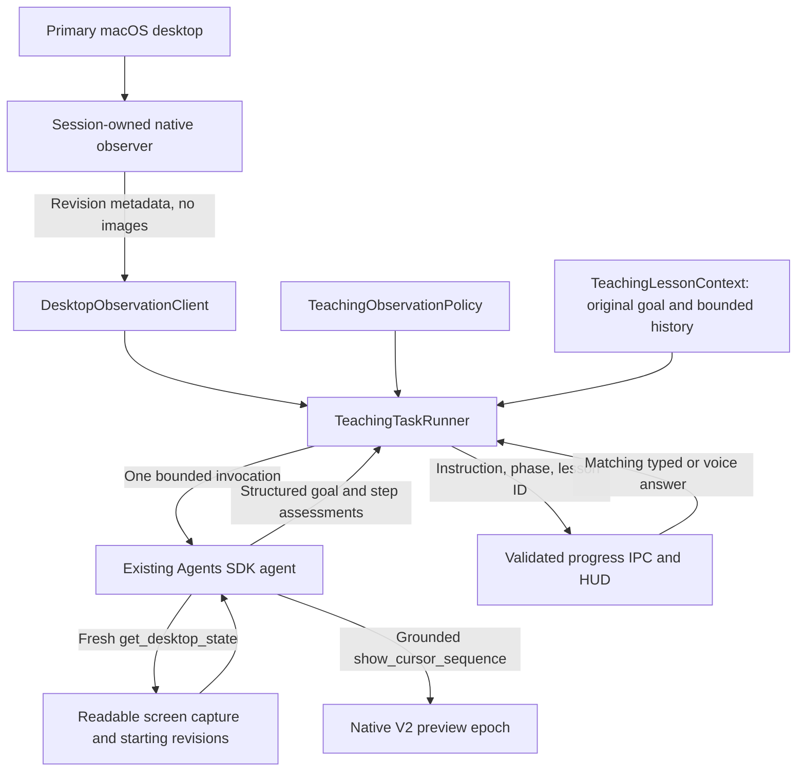
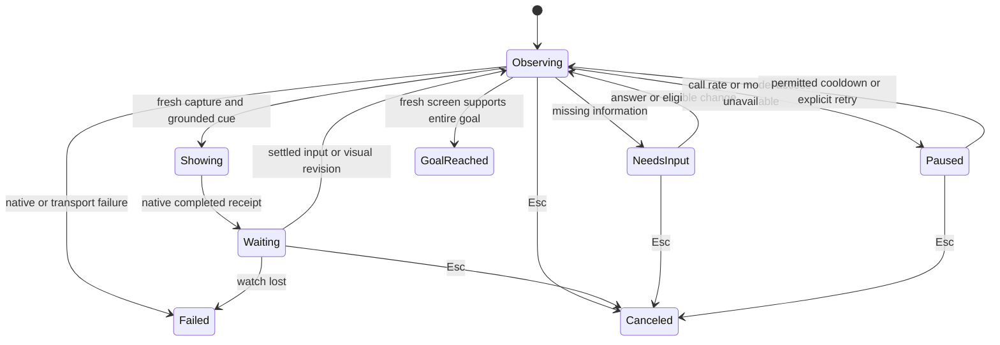

# Teaching observation architecture

Implemented October 2, 2026 for Show me on the primary macOS display. Runtime
classes, contracts and native observation live in this checkout. The native
adapter is shipped through `driver-patches/CursorCompanion.patch`, pinned to Cua
Driver 0.30.4 with local build version `0.30.4-tro.14`.

The October 3 extension in [TeachingCompanionPlan](TeachingCompanionPlan.md) adds
messages beneath the HUD, frozen whole-goal evidence, cue deduplication, locale
changes and relevant-region observation priorities.

The proposed [input-driven observation plan](InputDrivenObservationPlan.md) replaces
passive visual wakeups with settled student activity. The initial input-only implementation is now active; see its implementation
status for scope. The visual-stream behavior below describes the retained legacy mode.

## Product behavior

One request creates one lesson. Tro observes the screen, demonstrates the next
reachable step, and waits locally. Student input or changed screen content resumes
the same goal through another bounded Agents SDK run. Opening the wrong app or
missing an ERD drop target causes another observation and an adapted route.

There is no fixed suggestion count or idle deadline for the lesson. A correct
intermediate action is progress; the original goal must be visibly reached to
finish. Esc, including the workspace Esc control, cancels. Ordinary clicks,
typing, scrolling, dragging and hover effects keep the lesson active. Technical
failures are reported separately. Questions and model-access pauses retain the
lesson until an answer, eligible screen change, resource recovery or Esc.

For YouTube, Tro guides through revealing a hidden Dock, opening a browser,
finding its address bar and navigating to YouTube. It observes each newly
reachable state. The preview pointer cannot cause OS hover; Tro asks the student
to move their real pointer to a demonstrated screen edge, then observes the Dock.
Invisible icons and old coordinates are never a valid substitute for observation.

## Architecture and ownership



The observer is native code, not another AI agent or a test-harness agent. The
worker owns lesson orchestration. Renderer and preload receive only validated
progress and narrow answer methods. Execute retains its independent task harness,
verification and authorization rules.

| Owner                                          | Responsibility                                                                                    |
| ---------------------------------------------- | ------------------------------------------------------------------------------------------------- |
| `src/contracts/DesktopObservation.ts`          | Strict watch snapshot and lesson phase vocabulary                                                 |
| Native driver patch                            | Capture stream, pixel comparison, physical-input counters, session ownership and leases           |
| `DesktopObservationClient.ts`                  | Typed host-only watch transport, renewal and capture baseline                                     |
| `TeachingObservationPolicy.ts`                 | Pure admission, quiet-input checks and visual-noise backoff; injected clock                       |
| `TeachingLessonContext.ts`                     | Immutable original goal, previous step, expected result, question, answer and bounded SDK history |
| `TeachingTaskRunner.ts`                        | Lesson lifecycle, one SDK run at a time, result admission and cleanup                             |
| `TeachingReply.ts`                             | Required bounded step/goal assessment fields                                                      |
| `LoggedCuaServer.ts`                           | Private-tool filtering, pre-preview observation admission, capture renewal and native receipts    |
| `AgentChatController.ts`                       | Signed-in access checks, lesson answer routing, Esc and expiring credential renewal               |
| `AgentWorkerClient.ts` / `StartAgentWorker.ts` | Separate typed turn, answer and credential requests on the existing worker                        |
| `UseComputerUse.ts` / voice controller         | Keep an unfinished instruction visible and accept a question answer                               |

Classes correspond to stateful responsibilities; pure scheduling is isolated
from transport and model interpretation. No shared service, second worker,
framework-dependent domain layer or generic event bus is introduced.

## Lesson lifecycle



A local await has no open SDK request and consumes no model tokens. The SDK is
called again after a wake. Context is not injected into a running model request.
Each invocation uses a new native guidance epoch. A student click can end that
preview epoch with `user_takeover`; the lesson remains active and observes again.
Failed submitted presentations are not replayed.

The model replies with `guide` or `needs_input`, plus `nextStep`, `expectedResult`,
`previousStepAssessment`, `observationSummary` and `goalAssessment`. The host checks
freshness and native evidence. `goal_reached` requires a fresh admitted capture,
`guide`, `nextStep: complete` and `goalAssessment: reached`. A native preview
receipt proves display of a cue, never completion of the student's original task.
The existing agent performs semantic assessment; that assessment remains fallible.

Text and voice answers carry the current lesson/session ID. The worker accepts
one answer to its pending question and consumes it in the next resume input.
While a question awaits an answer, input alone does not discard it; an answer
or a visual revision resumes observation. This prevents the voice shortcut
from consuming the question before speech is transcribed. Other task requests
remain blocked during a lesson. The root turn remains pending
until completion, Esc or failure; it has no ten-minute parent timeout. Individual
SDK operations and transport commands retain deadlines. Main renews expiring
model credentials privately; credentials never enter renderer or model context.
An unavailable model pauses for an explicit answer instead of retrying repeatedly.

## Generic local detection

The native watch runs only during an active lesson, independently of preview
epochs. Three host-only operations use the existing private MCP connection:
`begin_desktop_watch`, `read_desktop_watch`, and `end_desktop_watch`. They are
filtered from model tools in both modes. Native authorization classifies begin
as local screen observation (R2), metadata reads as R0, and end as reversible
lifecycle control (R1). The standard argument parser removes trusted MCP transport
metadata after owner resolution while rejecting unknown public options. UUID ownership is tied to the native
session. Wrong-owner reads fail; end is idempotent for the matching owner.
Session/runtime retirement and a 60-second lease release the watch. Host renewal
runs every 15 seconds with at most one renewal pending.

ScreenCaptureKit captures at most 768 pixels wide, excludes cursor graphics and
the native overlay process, and keeps its frame queue at three. Complete raw BGRA
frames are compared locally using quantized RGB hashes in 32-pixel tiles. Alpha
and row padding do not affect hashes. Identical frames and single-tile differences
are suppressed; ignored differences accumulate against the accepted baseline.
No image encoding, Base64, disk writing or model call occurs for routine detection.

The native adapter reads the numeric `SCStreamFrameInfoStatus` attachment using
CoreMedia/CoreFoundation and converts it to a recognized frame status. The pinned
ScreenCaptureKit Rust dependency's Swift bridge instead casts the NSNumber
attachment directly to `SCFrameStatus`, which fails for valid numeric attachments.
That made every frame appear to have missing status and left the watch unready.
The local adapter validates dictionary and numeric types, handles absent/invalid
values, and continues to accept only complete frames. It does not modify the
dependency cache or upgrade unrelated capture APIs. Output-handler registration
is checked before the stream starts.

The metadata snapshot contains watch ID, screen/input revisions, changed fraction,
readiness, input quiet time, button state and primary-display dimensions. It
contains no pixels, pointer coordinates, typed text or screen labels. Mouse
movement alone does not increment input revision. A hover that reveals the Dock
or a menu changes screen content. Click/key/scroll events update physical input
revision, so a small checkbox or connector edit still forces a readable capture.
Buttons held during a drag prevent a premature observation.

Revisions indicate possible change; they do not identify an app or prove success.
The same mechanism covers browser navigation and edits inside an unchanged window.
An agent screenshot records watch revisions from the **start** of capture.
Changes racing capture or model reasoning remain pending conservatively. The host
retains this baseline until the next model observation, not until the final reply.
Primary-display size changes reset hashes, resize the observation stream and
require a new capture. Display switching and secondary-display guidance require
separate platform work.

Before every preview, the host checks input, readiness, button state and display
geometry, then calls the private `refresh_cursor_guidance_capture` tool. Native
code retrieves the session-bound original capture, takes one current capture with
the same image cap, and compares decoded RGB pixels only within each proposed
cue's bounding rectangle plus 32 screen points of surrounding context. Circles
include their interior; paths include their complete source/destination rectangle.
The comparison runs locally on the native blocking pool and returns a fresh capture
ID, a boolean and an owned reason. No image enters the model or ordinary logs.
Foreign, expired or retired captures cannot be renewed. Geometry changes and any
changed pixel in a cue region refuse the cue; animation elsewhere does not.
This is conservative geometric evidence, not semantic verification. Animation
inside a target, including a caret, can still require another observation.

The host rechecks input and geometry after comparison. Native capture-age,
geometry, physical-input and receipt fences remain enforced at playback. A
successfully displayed guide survives unrelated global revisions; its wait begins
from the latest metadata so previous animation cannot immediately repeat the
model run. Input/display changes still discard the segment. Completion and
replies without a newly displayed cue retain the stricter global freshness check.
The asynchronous observer cannot guarantee zero latency or detect every one-tile
visual edit; fresh local cue comparison checks even changes the observer misses.

## Resource bounds and costs

| Resource                                                 | Current bound                                                                     |
| -------------------------------------------------------- | --------------------------------------------------------------------------------- |
| Native frame rate after activity                         | Up to 2 fps                                                                       |
| Native quiet rate after 3 seconds without physical input | One frame every 2 seconds                                                         |
| Native retained state                                    | Tile hashes and revisions; bounded platform queue                                 |
| Host metadata polling                                    | Every 250ms while waiting, without images                                         |
| Input settling                                           | 500ms and no pressed mouse button                                                 |
| Concurrent SDK runs                                      | One                                                                               |
| SDK invocation                                           | 45 seconds, at most 8 turns                                                       |
| SDK admission                                            | At most 12 invocations per rolling minute; then a 60-second resource pause        |
| Unproductive visual wakes                                | Increasing cooldown in 5-second increments, capped at 60 seconds                  |
| Context history                                          | Last 2 complete SDK exchanges, at most 8 MB; last 8 bounded observation summaries |
| Lesson idle lifetime                                     | Until original goal, Esc, or technical teardown                                   |

Real input can request observation without waiting for visual-noise cooldown, but
still obeys SDK admission limits. Animation and clock changes may wake the agent;
no-progress backoff bounds their model-call rate. Routine metadata polls use zero
model tokens. Fresh SDK invocations consume screenshot, prompt and output tokens.
There is no extra observer-model or independent semantic-verifier charge.

A resource pause ends visual capture, retains the unfinished goal and starts a
new watch baseline on resume. Early answers cannot bypass its cooldown. Final
cleanup removes renewal/poll timers, preview epochs and watch state on completion,
Esc, failure or teardown. An app restart loses in-memory lesson context; durable
resumption is outside this implementation.

These defaults are tuning values, not measured performance guarantees. Hardware
acceptance still needs CPU, memory, energy, capture time, missed-change rate,
unnecessary calls, total tokens and detection latency measured on the weakest
supported Mac. Compare static desktop, hidden Dock, animation and ERD editing.
Low-rate polling still consumes local resources. Windows/Linux adapters, dirty
rectangle optimization, semantic region tracking and snapshot fallback remain future work.

## Verification

Deterministic tests cover an unfinished lesson beyond eight steps and ten minutes,
wrong/changed screen evidence, hover and delayed loading, original-goal completion,
question answers, unavailable model pauses, native failure, stale preview admission,
private watch tools, bounded context, quiet input and rate/no-progress limits.
Main/worker/renderer tests cover retained answers and credential renewal without
a second root task. Native tests cover tile coalescing and ignored padding/alpha
alongside existing guidance epoch, input takeover and receipt tests.

Final repository validation uses lint, formatting, TypeScript, unit tests, build
and integration checks. Native changes require the pinned patched build and native
tests. Real paid model evaluation and weakest-hardware measurements remain separate
acceptance work; unit tests do not prove YouTube or ERD semantic reliability.

The October 2 startup regression was reproduced on Tro's live embedded endpoint:
watch operations failed before SDK admission because native risk classification
was missing. Strict parsing also rejected ingress-added session fields. Both paths
now have native regression coverage. Host lifecycle calls and failed metadata reads
emit bounded diagnostics, including tool name, timing and allowlisted reason codes;
successful routine metadata polls remain quiet. Screenshots, session/watch IDs,
argument values and arbitrary native error text stay out of these logs.

Watch admission does not prove first-frame readiness. A watch that remains
unready for 10 seconds now produces an error-level `agent.teaching.failed` record
with `stage: start_observation`, `errorCode: observation_ready_timeout`, an owned
message/stack, elapsed time, poll count and the last validated metadata snapshot
without its watch ID. Native refusal, invalid metadata, owner mismatch and missing
capture baselines retain distinct local error codes instead of being diagnosed
only as `transport_failed` or `session_lost`. The public result vocabulary is
unchanged. Routine polls stay quiet, and Esc does not log a teaching error. These
diagnostics identify the failed boundary; first-frame timeouts alone do not
establish a platform capture cause.

Build `0.30.4-tro.8` corrects that status conversion. A native regression constructs
numeric CoreFoundation attachments and checks all recognized statuses, unknown
and overflowing numbers, missing keys, wrong value/container types, and null
attachments. A live isolated embedded daemon using the rebuilt executable reached
`ready: true` and revision 1 in 254ms through real MCP calls, then ended the watch
and rejected a subsequent read. No screenshot or model request was sent. This
verifies native first-frame delivery and teardown; the full YouTube/ERD model flow
still requires separate live acceptance. Mock metadata alone does not exercise
ScreenCaptureKit frame delivery.

## Stale-capture loop recovery

The live October 2 log showed bounded socket retries recovering with HTTP 200,
followed by repeated `changedDuringRun` and refused cursor cues. The provider
retry did not restart the lesson. The host had treated input quietness as screen
quietness and immediately repeated stale segments, bypassing visual backoff.

Stale preview admission now logs `cua.guidance.refused` with the owned code
`fresh_observation_required` and aborts only the disposable SDK segment. A new
segment waits locally for unchanged screen/input revisions, with 1s then 2s
cooldowns. Three consecutive stale segments pause the same lesson for a scoped
student answer, end its watch, and make zero further model calls while paused.
Stale segment history is discarded, so invalid captures do not accumulate in
later prompts. Successful current observations reset this separate retry budget.
Each local settling wait is bounded at 10 seconds; ongoing animation still
reaches the three-attempt pause rather than spending tokens indefinitely.

`agent.teaching.observed` includes safe baseline/current metadata so input,
screen, readiness and geometry changes can be distinguished without screenshots.
`agent.teaching.stale_capture` reports attempt count and whether an answer is
required. These metadata do not identify what visual element changed; animation,
Tro's own UI, visible log output and actual student activity must be distinguished
with a live acceptance test. This recovery bounds the failure without claiming
that every animated desktop can be targeted safely.

A failed native following renewal is latched as `companion_renewal_failed`,
interrupts an active SDK segment, and returns a technical failure without dispatching
another segment. It cannot silently clear its timer and continue the lesson.
Esc still produces cancellation; transient screen changes produce observation or
pause, preserving the original goal. The HTTP gateway's existing single socket
retry remains unchanged.

## Following renewal output contract

A live teaching failure occurred at the first 15-second following renewal. The
host input was `set_cursor_companion_mode({ mode: "follow", label: "Tro" })`.
Before a preview epoch starts, its output contains only `status`, `following`
and `active`. During an epoch, the native snapshot also includes:

```json
{
  "status": "following",
  "following": true,
  "active": false,
  "guidance": {
    "task_epoch": "<current epoch>",
    "reason": null,
    "input_revision": 4
  }
}
```

The TypeScript state schema already accepted `guidance`, but the Rust
`CursorCompanionOutput` denied unknown fields and did not declare it. Native
post-dispatch validation therefore replaced the successful acknowledgement with
`typed_output_mismatch`, `execution_state: unknown`. Its reconstructed unknown
`guidance` message is exactly 194 characters, matching the attached failure log.
This is a result-contract failure after the operation may have executed; it
must not be interpreted as a broken network connection or retried blindly.

Build `0.30.4-tro.9` declares optional typed progression metadata in the native
output. Rust tests cover legacy outputs, live and interrupted guidance, and
malformed counters. The native teaching probe renews following and reads state
inside an active epoch, asserting that ownership is retained. It exercises the
same output validator that rejected the live acknowledgement.

Host request/response logs share `hostCallId`. Mode requests expose only the
validated `requestedMode`; successful state summaries expose `following`,
`active`, `guidancePresent` and the numeric `inputRevision`. Error diagnostics
retain recognized machine codes and `executionState`; the known guidance
mismatch gets an owned `contractError` explanation. No raw native message,
screen content or ownership ID is printed. `companion_renewal_failed` retains
these safe native details through the model abort and final teaching error.
The API's later `client_disconnected` is a consequence of that local abort.

Validation of the October 2 renewal revision confirmed native following renewal and state
reads with `guidancePresent: true` inside an active epoch. The full native probe
then stalled at `begin_desktop_watch`; a process sample located its blocking
thread in `desktop_observation_tools::begin_stream` → `SCStream::start_capture`
→ synchronous completion wait. ScreenCaptureKit also reported an interrupted
application connection. The full native flow did not pass; the cause of that
capture-start stall is not established by the renewal failure log. Stage logs
and per-call cancellation signals identify the stalled boundary, but native
blocking work and teardown can outlive a client's cancellation deadline.

## October 3 cue-admission regression

The supplied log had three model-generated cues refused before any native
`show_cursor_sequence` dispatch. Each attempt spent about five seconds on model
requests. Whole-screen revision equality rejected the preview before capture
renewal, and renewal itself required byte-identical full screenshots. The log
proves this boundary failure, but does not identify which pixels changed.

Build `0.30.4-tro.10` replaces those desktop-wide preview checks with the local
cue comparison above. `cua.guidance.capture_refreshed` and `cua.guidance.refused`
include `validationReason` (`target_changed`, `geometry_changed`,
`capture_unavailable`, `unobserved_capture`, or `input_or_geometry_changed`).
`agent.teaching.preview_input_changed` includes validated baseline/current
metadata without watch IDs. Native refresh errors and malformed results produce
`capture_refresh_failed` with safe boundary diagnostics, rather than consuming
three stale-coordinate retries. Existing bounded recovery remains for actual
changing targets. Scripted end-to-end coverage now exercises background revision
changes during cue selection and during the final guide reply, alongside target
changes, stale completion, input and Esc. Hardware timing and live model routing
remain acceptance checks, not claims established by these fixtures.

The October 3 validation passed repository checks, 455 unit tests, 7 integration
tests, the scripted teaching contract and 40 selected native Rust tests. The real
macOS MCP probe passed capture comparison risk/input/output contracts, an
image-free response, foreign-session refusal, following renewal, observer first
frame and teardown. The first center-screen probe returned `target_changed`;
the final probe on the rebuilt driver returned `target_unchanged` and renewed its
capture, with an observer first frame in about 450ms. Both live comparison paths
passed their contracts. Native pixel tests also verify unrelated animation and
full-path changes. No paid model or physical click/drag/Esc was injected by the
probe. Visible guidance and real-model routing remain the student's manual test.
