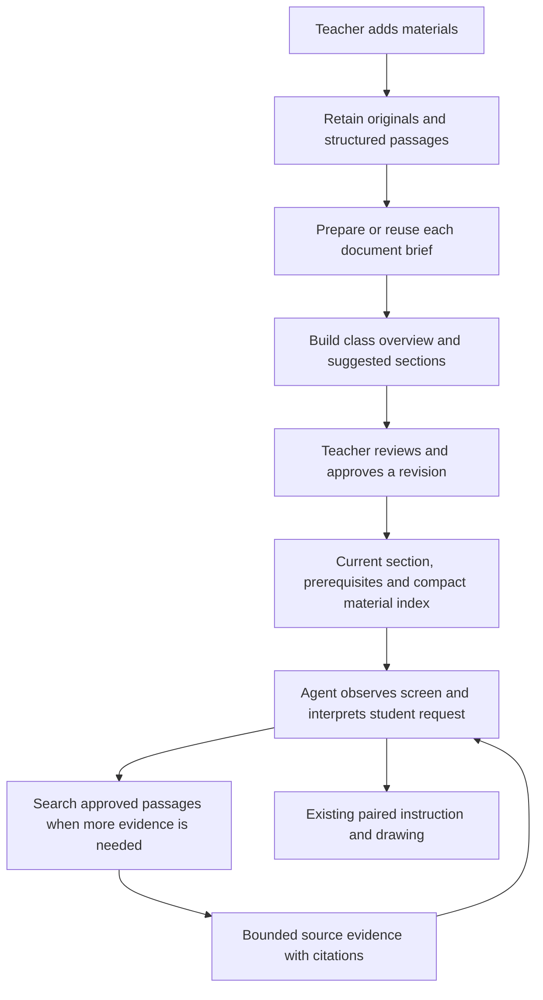

> Historical research/audit reference. Current runtime ownership and behavior live in
> [Architecture](../docs/Architecture.md). Proposals and findings below are not a current system specification.

# Compact classroom context: research and recommendation

Research date: October 4, 2026. This is a design recommendation, not an implemented change.

The [engineering plan](../docs/Architecture.md#classroom-and-materials) maps this recommendation
to contracts, preparation stages, source retrieval, compatibility and rollout.

Tro should keep originals and detailed source records, generate a compact brief for
each document, and select relevant evidence for each student request. A shorter
summary alone is insufficient: students need exact examples, setup details and
prerequisites that may not survive compression.

Confidence is high that these are established approaches. Confidence in the best
budgets and retrieval strategy for Tro remains provisional until we evaluate real
English/Vietnamese lessons and student questions.

## What the research supports

### Summarize for orientation; retrieve for specific answers

LlamaIndex's document-summary index stores both a document summary and the original
nodes. It selects documents using summaries, then returns their source nodes. This
demonstrates document routing, rather than answering exclusively from compressed
text. Its example can retrieve an entire selected document; Tro would still need
a second selection step to keep large documents bounded.
[LlamaIndex documentation](https://developers.llamaindex.ai/python/examples/index_structs/doc_summary/docsummary/)

Anthropic's contextual-retrieval experiments found limited gains from appending
generic document summaries and low performance from summary-based indexing. Its
alternative adds short, passage-specific context to original chunks, then combines
semantic and keyword retrieval. It reported retrieval-failure reductions of 49%
without reranking and 67% with reranking, evaluated at the top 20 chunks. These are
vendor results on its datasets, not a predicted improvement for Tro.
[Contextual Retrieval](https://www.anthropic.com/engineering/contextual-retrieval)

**Recommendation:** use document briefs to navigate the material, while retaining
direct passage search as a fallback. A brief must not become a gate that makes
omitted facts unreachable.

### Use hierarchy when the question needs an overview

OpenAI's long-document summarization example breaks material into pieces and
controls summary detail through chunk size/count. Its optional recursive mode
includes earlier summaries when processing subsequent chunks. The recipe is
archived; its conceptual approach is useful, but its old model/API code should not
be copied as current implementation guidance.
[OpenAI summarization cookbook](https://developers.openai.com/cookbook/examples/summarizing_long_documents)

RAPTOR builds a hierarchy of original passages and generated summaries, retrieving
at multiple levels of detail. Its experiments support the usefulness of combining
broad understanding with detailed evidence. They do not establish that every small
class needs recursive clustering.
[RAPTOR paper](https://arxiv.org/html/2401.18059v1)

Microsoft GraphRAG distinguishes local questions, supported by relevant entities
and raw passages, from global questions, answered using community reports and a
map/reduce procedure. Its documentation calls global search resource intensive.
[GraphRAG query overview](https://microsoft.github.io/graphrag/query/overview/)

**Recommendation:** start with class overview → document brief → source passages.
Use all document briefs when the teacher asks for an overview. Use selected source
passages when a student asks about a particular activity. Defer graph extraction
and recursive clustering until cross-document questions demonstrate a need.

### More context and less context both have failure modes

Lost in the Middle found that relevant-information position and context length
affected results on the models it tested. This is evidence to test ordering and
distractors, not proof that all current models fail at the same length.
[Lost in the Middle](https://aclanthology.org/2024.tacl-1.9/)

A separate comparison found adequately resourced long-context models could
outperform retrieval, while retrieval had a cost advantage. Its hybrid method used
broader context when retrieved evidence was insufficient. This counters a blanket
claim that retrieval always improves accuracy.
[RAG versus long context](https://arxiv.org/html/2407.16833v1)

Anthropic recommends a mixture of useful initial context and tools that load more
information as needed. It also identifies a latency tradeoff: exploration can be
slower than supplying relevant information upfront.
[Effective context engineering](https://www.anthropic.com/engineering/effective-context-engineering-for-ai-agents)

**Recommendation:** preload the current activity and known setup dependencies.
Retrieve additional evidence as needed. If passages are insufficient, expand to a
section or document within the configured budget. Do not force the agent to answer
from an incomplete summary or treat its own confidence as evidence of completeness.

### Preserve structure before generating prose

Microsoft's document-layout guidance uses headings and coherent paragraphs for
chunking, retaining parent/child relationships. This is a useful alternative to
splitting at arbitrary character boundaries.
[Structure-aware chunking](https://learn.microsoft.com/en-us/azure/search/search-how-to-semantic-chunking)

OpenAI documents that vision-capable PDF inputs include text and page images.
Non-PDF document inputs do not include embedded images/charts. Its PDF RAG example
demonstrates text extraction alongside visual analysis. These mechanisms explain
why a text-only conversion can miss information in teaching diagrams.
[File inputs](https://developers.openai.com/api/docs/guides/file-inputs),
[PDF RAG cookbook](https://developers.openai.com/cookbook/examples/parse_pdf_docs_for_rag)

**Recommendation:** retain slide/page IDs, headings, exact code, tables and visual
references. Store generated visual descriptions separately from original content.
Keep examples connected to their explanation and expected output. For dense visual
slides, use visual processing or explicitly record an extraction limitation; a
short brief does not demonstrate that every visual was understood.

### Compression is a separate optimization

LLMLingua-2 selects tokens to retain using a learned classifier. This differs from
generating a readable document summary. The paper reports useful compression and
speed improvements on its benchmarks, while also showing that performance varies
with compression strength. Its results do not guarantee that Python syntax,
negations or classroom prerequisites survive a particular configuration.
[LLMLingua-2 paper](https://arxiv.org/html/2403.12968v2)

**Recommendation:** first remove duplicate representations and irrelevant pages.
Preserve executable examples verbatim. Consider a dedicated token compressor only
if measured residual context cost justifies the additional model and validation.

### Count tokens and evaluate factual support

OpenAI exposes input-token counting, including processed PDF inputs. Its retrieval
guide supports ranking, filtering and balancing semantic/keyword results. Prompt
caching reuses processed prompt prefixes; it does not shorten the logical content
the model receives or determine which material is relevant.
[Token counting](https://developers.openai.com/api/docs/guides/token-counting),
[Retrieval](https://developers.openai.com/api/docs/guides/retrieval),
[Prompt caching](https://developers.openai.com/api/docs/guides/prompt-caching)

QAFactEval studies factual consistency through question answering and entailment
signals. This supports checking summaries against their sources rather than using
fluency or shortness as a quality measure. It is not a complete classroom-tutor
evaluation.
[QAFactEval](https://aclanthology.org/2022.naacl-main.187/)

**Recommendation:** measure whether the agent can recover required facts and give a
useful next instruction, alongside tokens, latency and cost. Evaluate prerequisites
separately from general topic coverage.

## What Tro does today

The following observations come from this checkout, not external research:

- `OpenAiMaterialPreparation.ts` sends all extracted pages plus original PDFs in one
  synthesis request. It requires detailed notes for every page and permits 24,000
  output tokens. Providing PDFs enables visual interpretation but also repeats
  text already supplied in extracted pages; actual processed input must be measured.
- `MaterialDraftSchema` holds one collection summary, ordered sections and page
  notes. It does not currently hold individual document briefs.
- `MaterialLessonContext.ts` orders the current section's pages first, then fills
  remaining capacity with other pages. Its 24,000-character check covers extracted
  text, prepared notes and teacher notes only. It is neither a token budget nor a
  limit on the complete prompt, which also contains indexes, instructions, history,
  tool definitions and screenshots.
- A whole relevant page can be skipped if it does not fit. Selection otherwise
  follows section membership and source order, rather than the student's question.
- `TeachingLessonContext.buildInput` serializes classroom context for each segment.
  The retained exchanges can also contain retrieved page content.
- `read_class_material_note` already retrieves an authorized page by ID. Its reply
  contains the whole page, including extracted and prepared text.
- Source extraction is reused on retry, but the current adapter synthesizes the
  complete collection again. There is no separate cached document brief.

These observations identify opportunities. They do not establish the cause of any
previous preparation failure or quantify current model attention/latency problems.

## Proposed information model

Use JSON schemas as the canonical representation and render Markdown for review.
Markdown is useful for reading; changing the format alone does not reduce context.
The following fields are proposed, not new public contracts.

| Record              | Contents                                                                 | Use                                |
| ------------------- | ------------------------------------------------------------------------ | ---------------------------------- |
| Original            | File bytes and digest                                                    | Download and source verification   |
| Source passage      | Document/page IDs, heading, exact content, code and visual references    | Detailed evidence                  |
| Document brief      | Purpose, concepts, setup, practice, examples index and source references | Orientation and routing            |
| Class overview      | Material relationships and suggested section order                       | Teacher review and initial context |
| Teacher corrections | Reviewed changes, selected environment and current class instructions    | Authoritative class choices        |
| Student state       | Active section, working resource and observed progress                   | Personalized assistance            |

A brief should answer: What does this document teach? Which tools or files does it
explicitly require? What can students practice? Where are the examples? What is
unclear? Every substantive generated claim should link to source passages. Mark
inferences and suggestions separately; an absent prerequisite is not automatically
a teacher requirement.

An illustrative Python brief might say that a document introduces `print()`,
arithmetic and `input()`, points to an exact input example, and records that the
execution environment needs teacher confirmation. The brief should reference the
example, not paraphrase its code and then discard the original. This example is a
proposed representation, not a new extraction of the uploaded PDF.

Do not require every source page to become a student activity. Keep acknowledgments,
glossaries and supporting explanations discoverable without turning each into a
mandatory lesson section.

## Proposed preparation and runtime flow

This is one teacher action and one preparation job, potentially containing multiple
bounded provider requests. One API request is not the optimization target: measure
total tokens, useful output, retry cost and time to review. Small documents may be
grouped when they fit; large documents need bounded chunks before a document brief
is assembled. Avoid silently dropping overflow content.

Reuse derived records when the file digest, parser version, preparation prompt/model
version and locale match. Rebuild affected briefs when material changes and update
the collection overview when document relationships or teacher choices change.
Keep authorization and approved revision boundaries in the existing application
service. Processing caches must not grant access across classes.

At runtime, initially select the active section and its setup dependencies. Use the
material index for orientation. A proposed search tool should search original
passages as well as brief keywords within the authorized revision, return bounded
results, and support expanding to a nearby passage or section. Preserve the current
read-by-ID tool while introducing selection.

For this pilot, start with section mappings and structured/keyword passage lookup
inside the existing backend. Evaluate semantic retrieval if English/Vietnamese
paraphrases or cross-document questions defeat that baseline. OpenAI's hosted
retrieval is an option, not a requirement; it would add provider storage, lifecycle
and permission-mapping work. Do not introduce a new vector service merely because
there are ten documents.

Teacher corrections should take precedence in assistance while originals remain
available for provenance. Document examples describe teaching material; they do
not locate a button in the student's live application. Preserve fresh screen
observation and the existing paired instruction/drawing presenter.

## Illustrative budget for ten documents

The following is a starting experiment, not an established optimum or implemented
limit. Measure tokens with the selected model; do not estimate Vietnamese tokens
using a fixed English characters-per-token ratio.

| Material-context component                          | Example token allocation |
| --------------------------------------------------- | -----------------------: |
| Class overview                                      |                      250 |
| Ten compact document index entries, roughly 60 each |                      600 |
| Active section and required setup                   |                      750 |
| Two relevant document briefs, roughly 250 each      |                      500 |
| Two source evidence passages, roughly 700 each      |                    1,400 |
| Teacher choices and student progress                |                      500 |
| Total                                               |                    4,000 |

Other briefs remain stored and discoverable. Document count increases the compact
index, not the amount of full source content preloaded. Replace or deduplicate
retrieved evidence across continued segments instead of accumulating every result.
For larger collections, retrieve the index too.

This allocation excludes tools, agent instructions, conversation history,
screenshots and output/reasoning reserves. Monitor the whole request separately.
Expand evidence when necessary rather than cutting a required prerequisite or code
example to hit the nominal target. Prompt caching is a complementary cost
optimization; document-summary caching avoids repeated generation altogether.

## What to simplify, preserve and defer

| Current behavior                                                                  | Proposed change                                                                       |
| --------------------------------------------------------------------------------- | ------------------------------------------------------------------------------------- |
| Long generated note required for every page                                       | Retain source pages; generate document briefs and selective visual/interpretive notes |
| One full-collection synthesis                                                     | Bounded synthesis with reusable document results and a collection overview            |
| Pages ordered then packed to 24,000 characters                                    | Token-budgeted, question/section-aware evidence selection                             |
| Raw text and paraphrase always supplied together                                  | Choose the necessary representation; fetch originals for exact details                |
| Source reference index contains mostly IDs/locations                              | Add concise topic/purpose hints so the agent knows where to look                      |
| Every clarification shown at the same level                                       | Separate essential setup decisions from optional review notes                         |
| Existing authorization, immutable revisions, originals and source IDs             | Preserve                                                                              |
| Fresh screenshots and paired instruction/drawing                                  | Preserve                                                                              |
| Dedicated compressor, recursive clustering, knowledge graph or new vector service | Defer pending measured need                                                           |

## Evaluation before replacing the existing flow

Compare four candidates using the same model, teacher material and student tasks:
current page-note packing; summary-only context; briefs plus selected sources; and
a bounded full-document baseline. Testing summary-only is useful even though it is
not the recommended final design: it exposes which details compression loses.

Include one-document and ten-document collections, English and Vietnamese, mixed
PDF/Python/Scratch materials, diagrams, exact code, conflicting versions and teacher
corrections. Place key prerequisites early, middle and late in the source set.

Required cases include: a student who has not configured the editor; an example
whose explanation is on another slide; a requested detail absent from the brief;
a diagram that text extraction misses; and a Scratch script with no start event
when the intended action is green-flag playback. Also test a direct stack-click
workflow so the agent does not invent a start-event requirement for every script.

Measure factual support, prerequisite recall, exact-example preservation,
successful source retrieval, useful next-step guidance, instruction/drawing
consistency, teacher correction effort, preparation input/output tokens, runtime
tokens, retrieval calls and elapsed time. Set release thresholds against the
baseline; unsupported mandatory prerequisites and silently missing sources are
failures even if the summary reads well.

Use deterministic checks for source IDs, access boundaries, revision ownership and
code preservation. Use reviewed task fixtures and human assessment for teaching
quality. Model-based factuality judgments can assist, but must not be the sole
release gate. No classroom benchmark was run for this research.

## Sources and method

Twenty search queries were attempted using web search and Exa. One Exa query hit
the free MCP rate limit; research continued with web search. The recommendations
above draw on sixteen primary sources: provider/framework documentation and original
research papers. Key sources were read beyond search snippets, including contextual
retrieval, agent context engineering, hierarchical retrieval and compression methods.
The Tro checkout was inspected separately. No private classroom materials were
submitted to a research tool, and no live model preparation call was made.

The sixteen sources are linked beside their findings above. Current documentation
was checked on the research date. Foundational papers and archived examples remain
useful for methods; their reported benchmarks do not validate today's Tro model or
classroom experience. The budget, cache design, UI simplifications and proposed
implementation sequence are our engineering recommendations, not claims that a
provider endorses those exact choices.
